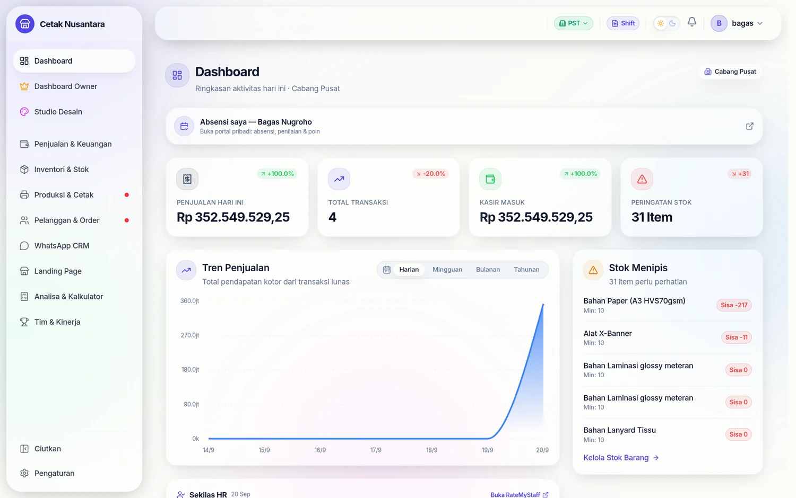

# 🗓️ Absensi & Portal HR

PosPro tidak mengurus absensi sendiri. Absensi, penilaian, dan poin karyawan
ditangani aplikasi terpisah (**RateMyStaff**), dan PosPro hanya **menjadi
jendelanya** — supaya karyawan tidak perlu mengingat dua alamat.

## Dua kartu

### 1. Kartu "Sekilas HR" — untuk Owner & Manajer

Muncul di dashboard utama, berisi angka hari ini: hadir, izin, telat. Sifatnya
sekadar ringkasan; untuk rinciannya tetap membuka aplikasi HR.

Aturan yang dipegang kartu ini:

- Hanya **Owner dan Manajer** yang boleh melihat (dibatasi di sisi backend,
  bukan hanya disembunyikan di tampilan).
- Batas waktu 5 detik. Kalau HR lambat atau mati, kartunya **disembunyikan** —
  dashboard tidak boleh ikut tertahan.
- Hasilnya di-cache 60 detik (15 detik bila gagal), dan permintaan yang
  menumpuk digabung jadi satu.

### 2. Kartu "Absensi saya" — untuk semua staf

Berisi tautan ke **portal pribadi** orang itu di aplikasi HR: absensinya,
penilaiannya, poinnya. Muncul di empat tempat:

| Halaman | Identitas dibuktikan dengan |
|---|---|
| Dashboard `/` | token login |
| `/so-designer/dashboard` | PIN pribadi desainer |
| `/produksi` | PIN pribadi operator |
| `/cetak` | PIN pribadi operator |

Di tiga halaman ber-PIN itu tidak ada login email, jadi PIN dikirim ke
`POST /hr/pin/my-portal`; backend yang memverifikasi PIN lalu menukarnya dengan
tautan portal. Tautannya tidak bisa ditebak dari browser.

## Pemetaan orang

Aplikasi HR menyimpan `posproUserId` pada data karyawannya. Itu satu-satunya
penghubung. Akibatnya:

- Karyawan yang belum dipetakan **tidak melihat kartu apa pun** — kartunya
  disembunyikan, bukan menampilkan error.
- Staf yang hanya punya PIN tanpa akun login juga belum kelihatan, sampai
  PIN-nya ditautkan ke akun login di [Akun & PIN Karyawan](karyawan-akun-pin.md).

> **Catatan dokumentasi:** kartu HR hanya muncul bila `HR_API_KEY` sudah diisi
> dan aplikasi HR-nya bisa dihubungi. Di lingkungan demo yang dipakai membuat
> tangkapan layar dokumentasi ini, integrasi tersebut memang dimatikan — jadi
> halaman ini sengaja tidak menyertakan tangkapan layar kartunya, ketimbang
> memasang gambar yang tidak sesuai keadaan sebenarnya.

## Konfigurasi

| Variabel | Untuk |
|---|---|
| `HR_API_KEY` | kunci yang dikirim PosPro ke HR di setiap permintaan |
| `STAFF_KPI_API_KEY` | kunci arah sebaliknya: HR menarik angka KPI dari PosPro |

Kunci tidak pernah sampai ke browser — semua panggilan terjadi dari backend ke
backend. Kalau kunci belum diisi, seluruh fitur ini diam dengan sendirinya.

## Endpoint terkait

| Metode | Jalur | Penjaga |
|---|---|---|
| GET | `/hr/summary` | login + peran Owner/Manajer |
| GET | `/hr/my-portal` | login (siapa pun) |
| POST | `/hr/pin/my-portal` | PIN pribadi (tanpa login) |
| GET | `/integrations/staff-kpi`, `/integrations/staff-daily` | kunci API dari aplikasi HR |
