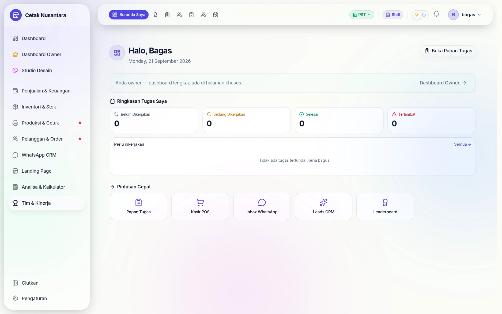
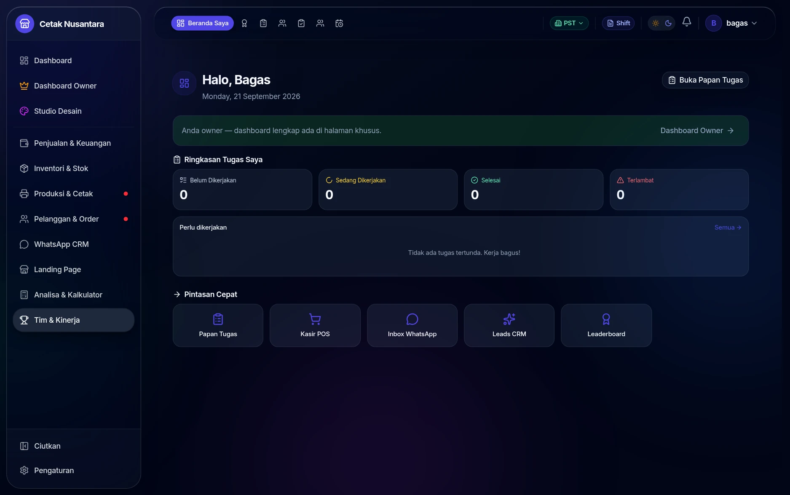
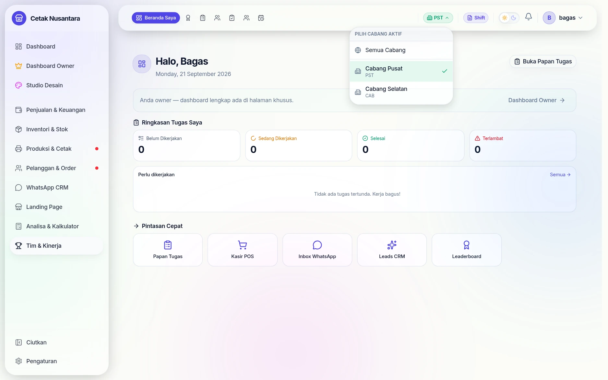
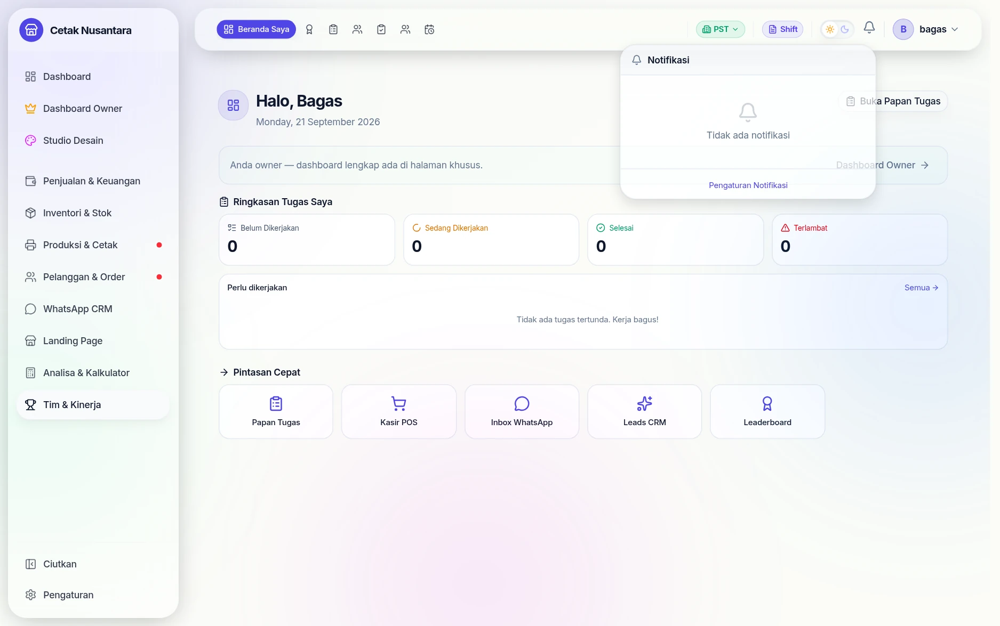
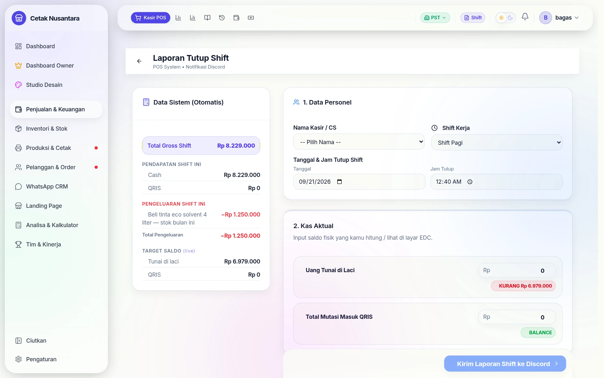
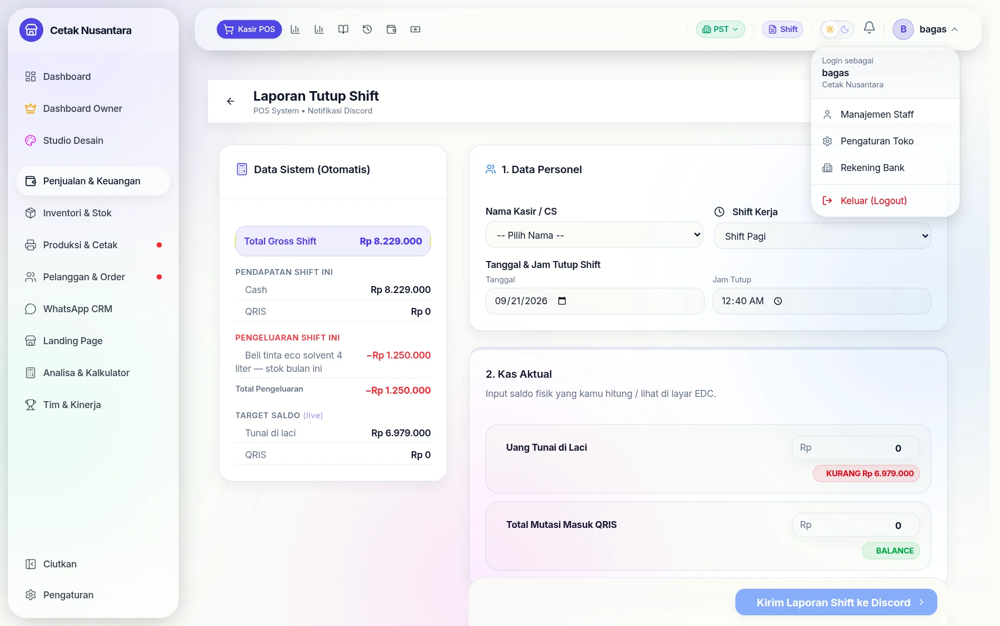
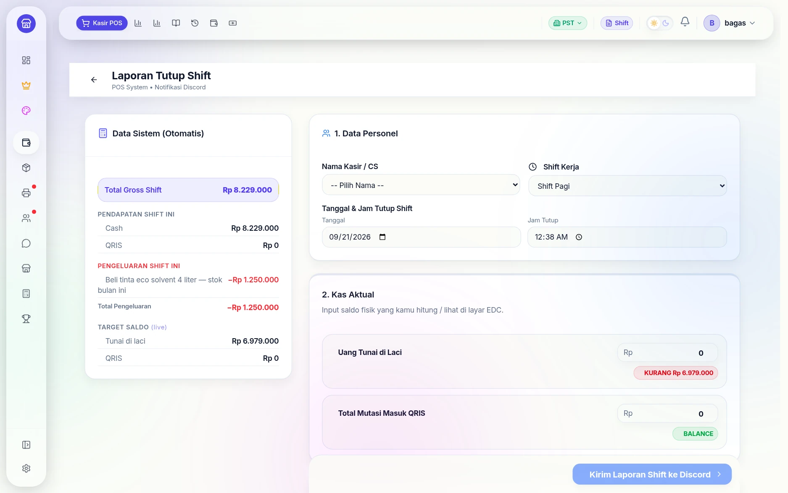
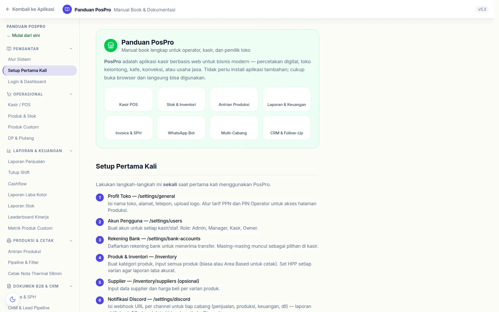

# 🖥️ Antarmuka & Fitur Kecil

Fitur yang tidak punya halaman sendiri tapi dipakai setiap hari: mode gelap,
pemilih cabang, lonceng notifikasi, sampai tombol ciutkan sidebar. Semuanya
berada di bingkai yang sama — **sidebar kiri** dan **bilah atas** — dan ikut ke
mana pun halaman berpindah.

## Bingkai yang selalu ada

| Bagian | Isinya |
|---|---|
| **Sidebar kiri** | menu besar per kelompok (Dashboard, Penjualan & Keuangan, Inventori, Produksi & Cetak, …) |
| **Bilah atas** | pintasan halaman sejenis, pemilih cabang, chip Shift, saklar tema, lonceng, menu profil |
| **Titik merah** di menu | ada yang perlu dikerjakan di kelompok itu, mis. pekerjaan cetak yang menunggu |

Beranda sendiri menampilkan **Ringkasan Tugas Saya** (belum dikerjakan, sedang
dikerjakan, selesai, terlambat) dan **Pintasan Cepat** — jalur satu klik ke
Papan Tugas, Kasir POS, Inbox WhatsApp, Leads CRM, dan Leaderboard.

## Mode gelap

Saklar matahari/bulan di bilah atas mengganti seluruh tampilan menjadi gelap.
Bukan sekadar gaya: papan produksi dan halaman kasir sering dipakai malam hari
di ruang ber-cahaya redup, dan layar terang penuh melelahkan mata.

Pilihannya tersimpan di peramban masing-masing, jadi satu komputer kasir bisa
gelap sementara komputer kantor tetap terang tanpa saling mengganggu.

## Pemilih cabang

Tombol berkode cabang (mis. **PST**) mengganti "kacamata" seluruh aplikasi:
angka dashboard, daftar nota, stok, dan papan kerja ikut menyesuaikan cabang
yang dipilih. Pilihan **Semua Cabang** dipakai pemilik untuk melihat gabungan.

Pilihan ini juga tersimpan per peramban — komputer di cabang selatan tidak
perlu memilih ulang tiap kali dibuka.

## Lonceng notifikasi

Lonceng mengumpulkan kejadian yang perlu diketahui: transaksi baru, stok
menipis, sinkronisasi offline selesai, dan pengingat tutup shift. Jenis mana
yang muncul diatur di [Notifikasi](notifications.md) — tautannya ada langsung
di dasar popover ini.

## Chip Shift

Chip **Shift** adalah jalan pintas ke [Laporan Tutup Shift](tutup-shift.md)
dari halaman mana pun. Di dalamnya, kolom *Data Sistem (Otomatis)* sudah terisi
sendiri — termasuk pengeluaran yang dicatat di
[Cashflow](cashflow.md) pada shift itu — dan kasir tinggal mengisi uang fisik
yang dihitung.

## Menu profil

Menu di pojok kanan menyebut **siapa yang sedang login dan di toko mana** —
pengingat sederhana yang mencegah salah orang mencatat transaksi di komputer
bersama. Dari sini juga jalan pintas ke Manajemen Staff, Pengaturan Toko,
Rekening Bank, dan tombol **Keluar**.

## Ciutkan sidebar

Tombol **Ciutkan** di dasar sidebar mengubah menu menjadi deretan ikon. Berguna
di layar kasir yang sempit atau saat mengerjakan tabel lebar seperti laporan
stok — area isi jadi lebih lega tanpa kehilangan navigasi.

## Panduan di dalam aplikasi

Halaman **`/help`** memuat manual book bawaan aplikasi: alur sistem, setup
pertama, dan penjelasan tiap fitur — tersedia langsung di dalam aplikasi,
tanpa perlu membuka dokumentasi ini.

## Pesan saat penyimpanan gagal

Sejak 22 September 2026 setiap simpan, hapus, atau proses yang **ditolak
server** memunculkan pesan alasannya (mis. "Pilih cabang di topbar", "Transaksi
sudah lunas"). Dulu banyak tombol hanya berhenti berputar tanpa keterangan
sehingga tidak jelas apakah data tersimpan.

## Hal kecil lain yang sering ditanya

| Yang terlihat | Artinya |
|---|---|
| Titik merah pada menu | ada pekerjaan menunggu di kelompok menu itu |
| Angka pada ikon bilah atas | jumlah item yang perlu ditangani (mis. pesan belum dibaca) |
| Chip **PST / CAB** di baris data | cabang asal data tersebut |
| Tabel yang berubah jadi kartu | tampilan menyesuaikan lebar layar; di ponsel tiap baris menjadi satu kartu |
