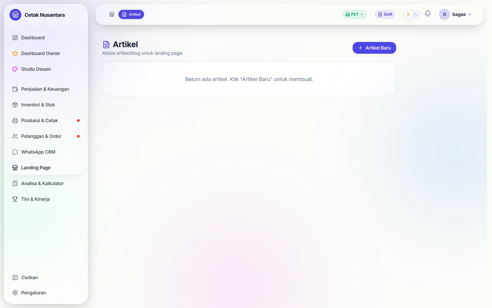
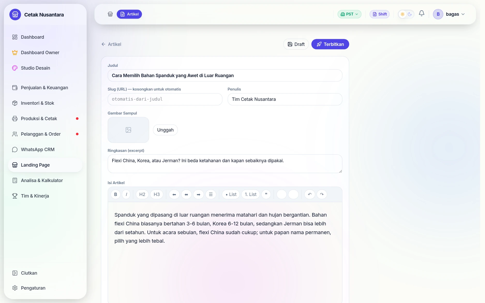
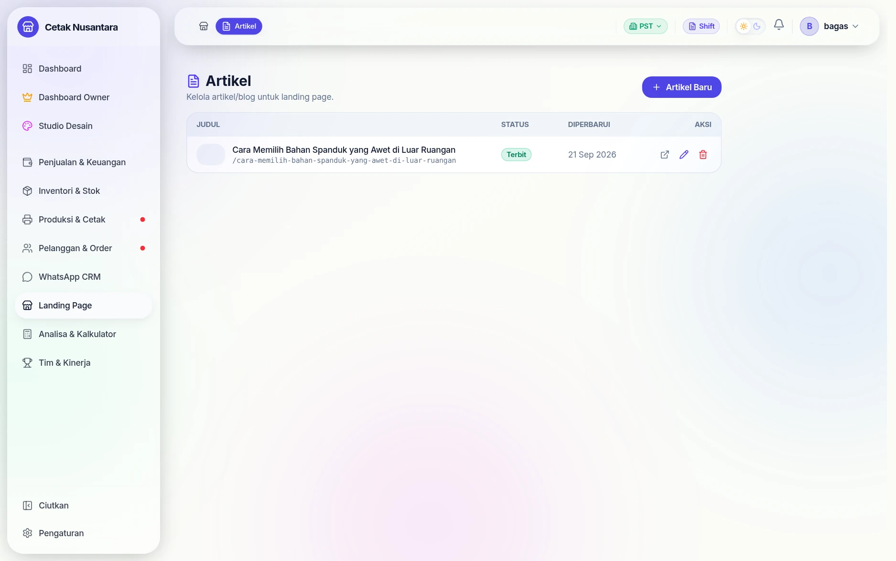
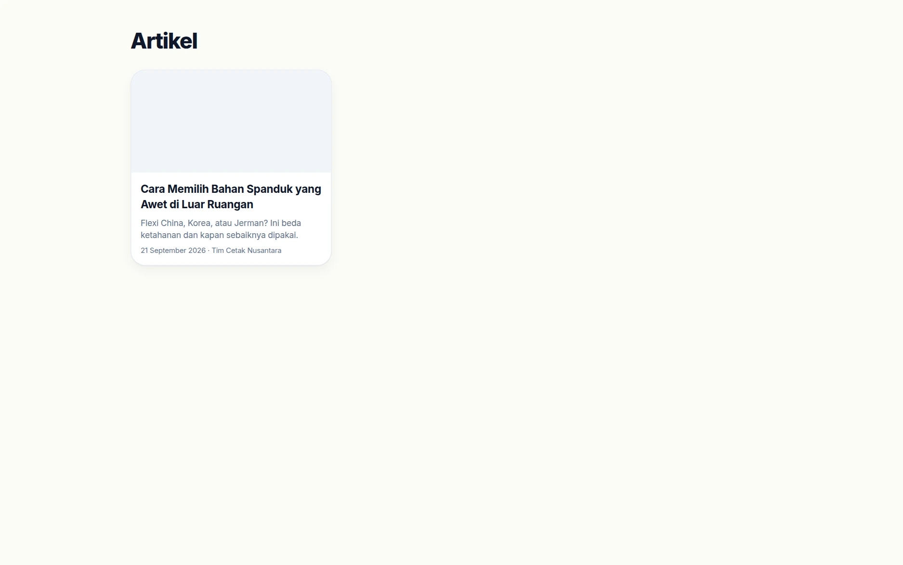
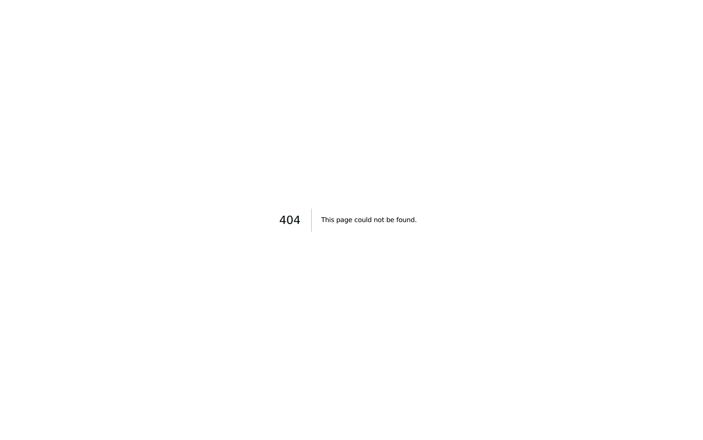

# Artikel / Blog

Buat artikel dengan editor **rich text** (seperti Word), tampilkan di landing page & halaman blog publik.

## Langkah demi langkah

Contoh nyata: menulis satu artikel dan menayangkannya ke halaman publik.

### 1. Daftar artikel

Menu **Artikel** berisi semua tulisan beserta statusnya. Selama masih kosong,
blok *Daftar Artikel* di landing juga tidak menampilkan apa-apa.

### 2. Menulis dengan editor rich text

Judul, **slug** (otomatis dibuat dari judul kalau dikosongkan), gambar sampul,
ringkasan, penulis, lalu isi artikel dengan editor seperti Word — tebal,
miring, H2/H3, daftar, kutipan, tautan, dan sisip gambar.

Bagian SEO di bawahnya opsional: bila dikosongkan, judul & ringkasan artikel
yang dipakai.

### 3. Draft dulu atau langsung terbit

Dua tombol berbeda maksud: **Draft** menyimpan tanpa menayangkan, **Terbitkan**
membuatnya langsung tampil ke publik. Statusnya terlihat jelas di daftar,
lengkap dengan slug yang akan jadi alamatnya.

### 4. Tampilan publiknya

Halaman **`/artikel`** memuat daftar tulisan yang berstatus Terbit — inilah
yang juga muncul sebagai blok di landing page.

### 5. Halaman detail & SEO

Alamatnya mengikuti slug: **`/artikel/cara-memilih-bahan-spanduk-yang-awet-di-
luar-ruangan`**. Judul, deskripsi, dan gambar sampulnya otomatis dipakai
sebagai meta SEO dan og-image, jadi tautan yang dibagikan ke WhatsApp atau
Facebook sudah tampil rapi tanpa diatur lagi.

## Kelola artikel (admin)
- Menu **Artikel** di sidebar → `/articles`.
- **Artikel Baru** → isi: Judul, Slug (otomatis dari judul kalau dikosongkan), Gambar Sampul, Ringkasan, Penulis, **Isi Artikel** (editor: bold/italic, H2/H3, list, quote, link, sisip gambar), dan SEO (judul & deskripsi).
- Tombol **Draft** (simpan tanpa tayang) atau **Terbitkan** (tampil ke publik).

## Tampilan publik
- **Halaman blog**: `/artikel` (daftar) dan `/artikel/[slug]` (detail) — otomatis SEO (title/description/og-image dari artikel).
- **Blok di landing**: tambahkan blok **"Daftar Artikel"** di Landing Builder untuk menampilkan kartu artikel terbaru (atur jumlah, kolom, tautan "Lihat semua").
- Hanya artikel berstatus **Terbit** yang tampil ke publik.

### Perbaikan 22 September 2026

Halaman artikel publik `/artikel/<slug>` sempat selalu **404** sejak pembaruan Next.js 16
(parameter halaman kini berupa Promise). Sudah diperbaiki; tautan dari daftar artikel di landing
kembali terbuka.

## Domain
Halaman `/artikel` juga otomatis tersedia di domain custom landing (lihat [Landing Page](landing.md)).

## Aktivasi (developer)
- Backend: `npx prisma generate` lalu restart (tabel `articles`).
- Frontend: dependency Tiptap (`@tiptap/*`) sudah di `package.json`.
