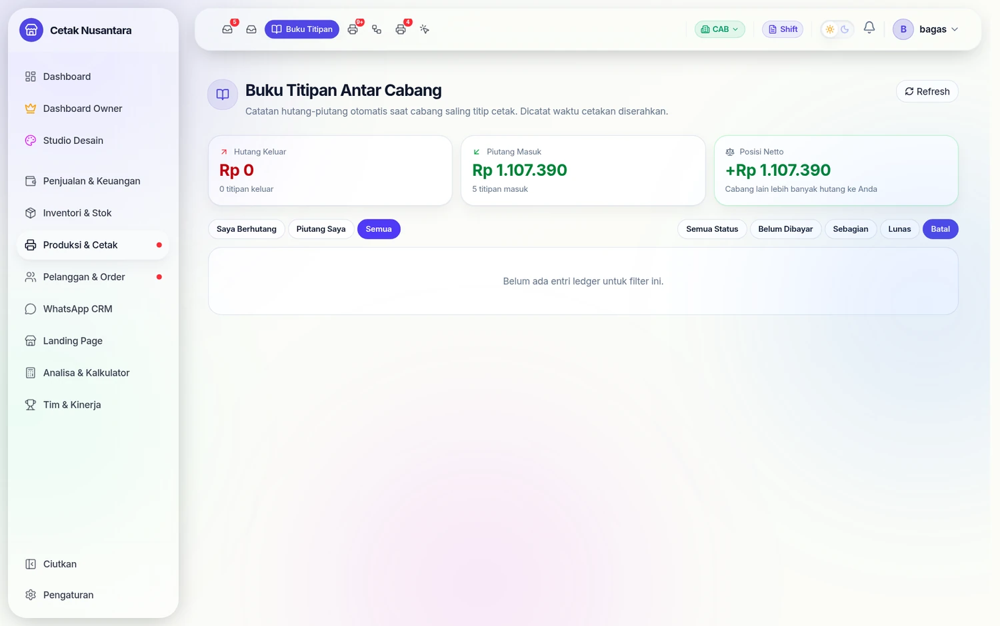

# 📒 Buku Titipan Antar Cabang (Inter-Branch Ledger)



> Sistem otomatis pembukuan hutang-piutang antar cabang yang muncul karena **titip cetak**. Kasir cabang A jualan & terima uang, tapi cetakan dikerjakan di cabang B → cabang A "berhutang" ke cabang B sebesar HPP bahan + fee layanan.

---

## 🎯 Kenapa Buku Titipan Dibutuhkan?

Kalau sistem multi-cabang Anda punya **modal pisah & evaluasi performa per cabang** (bukan satu kantong owner), titip cetak menimbulkan masalah keuangan:

| Pihak | Yang Terjadi | Masalah |
|---|---|---|
| **Cabang A (pemesan)** | Terima Rp 200rb cash dari customer | Revenue masuk semua, tapi tidak ada beban bahan |
| **Cabang B (pelaksana)** | Keluarkan kertas/tinta + tenaga + listrik mesin | Stok berkurang, tapi tidak dapat pemasukan apapun |

Tanpa Buku Titipan, B kelihatan rugi padahal kerja, dan A kelihatan untung padahal harusnya bayar B. Manajer B tidak ada motivasi mengerjakan titipan, dan owner susah evaluasi performa nyata tiap cabang.

**Buku Titipan** menyelesaikan ini dengan **otomatis mencatat hutang A ke B** saat cetakan diserahkan. Lalu A membayar B (lewat tunai/transfer atau kirim balik bahan) untuk lunasi.

---

## 🔄 Alur Lengkap

```
1. Kasir Cabang A (Bantul) → POS → "Titip Cetak" toggle ON → pilih cabang B (Pusat)
2. Customer bayar Rp 200rb cash → masuk cashflow A (revenue ke A)
3. Order otomatis muncul di Titipan Masuk cabang B (popup notif kuning)
4. Operator B klik "Terima & Kerjakan" → handover status: BARU → DIPROSES
5. Job muncul di /produksi atau /print-queue cabang B
6. Stok bahan berkurang dari BranchStock(Pusat) — bukan Bantul
7. Operator selesai → klik "Tandai Siap Diambil"
8. Notif hijau "Cetakan Sudah Jadi" muncul di cabang A (Titipan Keluar)
9. Cetakan diambil → klik "Konfirmasi Sudah Diambil" (di A) atau "Diserahkan" (di B)
10. ⚡ AUTO: Sistem hitung hutang dan masukkan ke Buku Titipan
   • costAmount = Σ (HPP bahan × qty)
   • serviceFee = costAmount × titipanFeePercent (default 20%)
   • totalAmount = costAmount + serviceFee
   • status: PENDING
11. A buka /branch-ledger → "Saya Berhutang Rp 96.000 ke Pusat"
12. B buka /branch-ledger → "Piutang dari Bantul: Rp 96.000"
13. A klik Bayar Tunai atau Kirim Bahan → settle → status: SETTLED
```

---

## 📐 Formula Perhitungan Hutang

```
costAmount  = Σ (hppAtTime × qty)  per item dalam transaksi
serviceFee  = costAmount × (titipanFeePercent ÷ 100)
totalAmount = costAmount + serviceFee
```

**Contoh**: Banner 1×1m, HPP bahan kain Rp 80.000, fee 20%

| Komponen | Nilai |
|---|---|
| `costAmount` | Rp 80.000 (HPP bahan × 1 m²) |
| `serviceFee` | Rp 16.000 (20% × Rp 80.000) |
| `totalAmount` | **Rp 96.000** ← yang harus dibayar A ke B |

> `titipanFeePercent` di-set per cabang (cabang pelaksana). Settings → Konfigurasi Cabang → pilih cabang → field "Fee Titipan Masuk (%)". Default 20%, set 0 kalau tidak mau pungut fee.

---

## 🎨 Halaman `/branch-ledger`

### Summary Cards (Mode Per Cabang)

3 kartu di atas halaman:

| Kartu | Isi |
|---|---|
| **🔴 Hutang Keluar** | Total titipan cabang aktif yang belum dibayar (saya berhutang) |
| **🟢 Piutang Masuk** | Total titipan cabang lain yang belum dibayar ke saya (piutang) |
| **⚖️ Posisi Netto** | `Piutang − Hutang`. Hijau = surplus, merah = defisit |

### Mode Owner "Semua Cabang"

Tampilkan tabel matrix per pasangan cabang:

| Pemesan | Pelaksana | Jumlah Titipan | Outstanding | Total |
|---|---|---|---|---|
| Bantul | Pusat | 5 | Rp 480.000 | Rp 1.200.000 |
| Sewon | Pusat | 3 | Rp 200.000 | Rp 600.000 |

### Tab Filter

- **Saya Berhutang** — titipan keluar yang belum settled
- **Piutang Saya** — titipan masuk yang belum settled
- **Semua** — gabungan

Plus filter status: `PENDING / PARTIAL / SETTLED / CANCELLED / Semua`.

### Detail Entry (Expand)

Klik tombol "Detail" → expand panel berisi:
- Breakdown HPP, fee, total, sudah dibayar, sisa
- **Daftar item** titipan: produk, qty, HPP per unit, subtotal
- **Riwayat pembayaran** (LedgerSettlement): tanggal, tipe (Tunai/Stok), nominal

---

## 💸 Settlement: Bayar Tunai

Klik tombol **"Bayar Tunai"** (biru) di entry PENDING/PARTIAL → modal:

| Field | Keterangan |
|---|---|
| **Nominal Bayar** | Default = sisa hutang. Bisa partial (bayar separuh) |
| **Dari Rekening (cabang A)** | Dropdown rekening cabang pemesan. Kosong = "Tunai/Cash" |
| **Ke Rekening (cabang B)** | Dropdown rekening cabang pelaksana. Kosong = "Tunai/Cash" |
| **Catatan** | Opsional, mis. "transfer 24 April" |

Klik **Simpan Pembayaran** → atomic transaction:
1. Cashflow `EXPENSE` di cabang A, kategori `INTER_BRANCH_SETTLEMENT`, amount = nominal
2. Cashflow `INCOME` di cabang B, kategori sama, amount = nominal
3. `LedgerSettlement` dengan referensi 2 cashflow ID di atas
4. Update ledger: `settledAmount += nominal`, status → `PARTIAL` atau `SETTLED`

> Kategori `INTER_BRANCH_SETTLEMENT` **otomatis di-exclude** dari laporan konsolidasi Owner mode "Semua Cabang" supaya tidak double-count revenue.

---

## 📦 Settlement: Bayar dengan Kirim Bahan

Cocok kalau A punya stok bahan yang B butuhkan (kertas, tinta, banner mentah). Lebih praktis daripada transfer uang berkali-kali.

Klik tombol **"Bayar Kirim Bahan"** (hijau) → modal:

1. **Search bahan** — cari produk yang ada di stok cabang A (HPP > 0)
2. **Pilih varian** dari list (radio) — tampilkan stok tersedia & HPP per unit
3. **Input jumlah** (max = stok)
4. Sistem **preview nilai pembayaran** otomatis: `HPP × qty` (live)
5. Catatan opsional

Klik **Kirim Bahan & Lunasi** → atomic transaction:
1. `BranchStock(A, variant)` decrement
2. `BranchStock(B, variant)` increment
3. `StockMovement OUT` di A (`reason: "Bayar titipan cetak ledger #X ke cabang B"`)
4. `StockMovement IN` di B (`reason: "Terima bahan dari cabang A ledger #X"`)
5. `LedgerSettlement` type=`STOCK` dengan referensi 2 movement
6. Update ledger: `settledAmount += value`, status

**Validasi**:
- Stok A harus cukup
- Nilai (`HPP × qty`) harus ≤ outstanding hutang (kalau lebih, kurangi qty)
- Variant HPP > 0 (kalau 0, ditolak)

> Beda dengan transfer stok biasa: kirim bahan untuk pelunasan tidak tanya tanggal, tidak butuh approval — langsung tercatat sebagai pelunasan ledger.

---

## 🏷️ Status Lifecycle

```
PENDING (baru terbuat, belum dibayar)
   ↓
PARTIAL (dibayar sebagian)
   ↓
SETTLED (lunas — settledAmount ≥ totalAmount)

CANCELLED — manual cancel (tidak otomatis dari sistem; reserved untuk future)
```

Indicator badge di list:
- 🔴 **PENDING** — Belum Dibayar
- 🟡 **PARTIAL** — Sebagian
- 🟢 **SETTLED** — Lunas
- ⚫ **CANCELLED** — Batal

---

## 🔔 Sidebar Badge

Di sidebar, entry **"Buku Titipan"** punya badge dot kalau ada titipan outgoing/incoming yang belum settled. Polling setiap 60 detik. Hilang otomatis kalau semua sudah lunas.

---

## ⚙️ Konfigurasi Fee Per Cabang

`titipanFeePercent` adalah field di `BranchSettings` yang berlaku untuk cabang **pelaksana** (yang menerima titipan).

**Cara set**:
1. Login Owner / SuperAdmin
2. **Settings → Konfigurasi Cabang** (`/settings/branch-config`)
3. Pilih cabang yang akan jadi pelaksana
4. Card "Titipan Antar Cabang" → field **"Fee Titipan Masuk (%)"**
5. Isi angka (contoh: 15 untuk 15%, 0 untuk gratis fee)
6. **Simpan**

Fee ini berlaku untuk titipan baru ke depan. Titipan lama dengan fee yang sudah tercatat di ledger tidak ter-update.

**Strategi penentuan fee**:
- Default 20% dari HPP bahan (≈ 10–13% dari harga jual). Wajar buat A sisa profit, B dapat margin tenaga + listrik + mesin.
- Marjin produk biasanya 40–60%, jadi 20% fee masih sisakan ~40% profit untuk pemesan.
- Bisa beda per cabang (Pusat 25%, Cabang 15%, dll).

---

## 📊 Auto-Trigger: Kapan Ledger Otomatis Dibuat?

Sistem auto-create ledger di 2 momen:

1. **Saat checkout transaksi titipan** — supaya kedua cabang langsung punya visibility, walaupun cetakan belum diserahkan.
2. **Saat handover status berubah ke `DISERAHKAN`** — via `markHandover` (operator B klik Diserahkan) atau `confirmPickup` (kasir A klik Konfirmasi Sudah Diambil).

**Idempotent** — kalau ledger untuk transaksi tertentu sudah ada, helper skip. Aman dipanggil berkali-kali.

---

## 🔐 Permissions & Authorization

| Aksi | Siapa Boleh |
|---|---|
| Lihat ledger (list, summary, detail) | Owner (semua), Staff (cabang dia terlibat — sebagai from atau to) |
| Settle dengan tunai | Sama dengan di atas |
| Settle dengan kirim bahan | Sama dengan di atas |

Backend cek via `BranchContext`. Staff cabang Bantul **tidak bisa** lihat/settle ledger antara Pusat ↔ Sewon (karena tidak terlibat).

---

## 🧪 Testing End-to-End

1. **Setup**: Set `titipanFeePercent=20` di BranchSettings Pusat (lewat Konfigurasi Cabang).
2. **Order**: Login kasir Bantul → POS → tambah banner → klik toggle "Titip Cetak" → pilih Pusat → checkout cash Rp 200rb.
3. **Cek auto-ledger di checkout**: buka `/branch-ledger` → "Hutang ke Pusat: Rp 96.000" muncul (status PENDING).
4. **Operator Pusat**: notif kuning popup → klik Terima → kerjakan job di `/produksi` → klik Selesai → klik Diserahkan.
5. **Cek di Bantul**: `/branch-ledger` tetap PENDING (handover hanya update status job, bukan ledger). Settle manual.
6. **Bayar Tunai**: klik "Bayar Tunai" → pilih bank Bantul (sumber) + bank Pusat (tujuan) + nominal Rp 96rb → Simpan.
7. **Verifikasi cashflow**:
   - Cashflow Bantul: ada `EXPENSE` Rp 96rb kategori `INTER_BRANCH_SETTLEMENT`
   - Cashflow Pusat: ada `INCOME` Rp 96rb kategori sama
8. **Status ledger**: berubah jadi `SETTLED`, tombol settle hilang.
9. **Test Settle Stok**: bikin titipan baru → bayar dengan kirim 3 rim kertas (HPP 40rb × 3 = Rp 120rb) → cek BranchStock Bantul −3, Pusat +3, ledger settledAmount +120rb.
10. **Konsolidasi Owner**: switch ke "Semua Cabang" → buka `/cashflow` → cashflow `INTER_BRANCH_SETTLEMENT` di-exclude (tidak double-count antara EXPENSE Bantul & INCOME Pusat).

---

## ⚠️ Troubleshooting

### Ledger tidak muncul setelah handover
- Cek transaksi memang titipan: `productionBranchId != branchId` di DB
- Cek log backend ada `[createLedgerEntry]` saat handover/checkout
- Idempotent: ledger tidak diduplikasi, jadi mungkin sudah ada (cek tab "Sudah Lunas")

### Hutang nilai 0 / costAmount 0
- HPP varian belum diisi. Buka inventori → edit produk → set HPP per varian
- Atau `hppAtTime` di TransactionItem 0 (transaksi lama sebelum HPP diset)

### Settle tunai tolak "Rekening bukan milik cabang"
- Cek `BankAccount.branchId` sudah benar. Setiap rekening harus tag ke 1 cabang
- Owner bisa edit di `/settings/bank-accounts`

### Cashflow konsolidasi masih double-count
- Pastikan kategori cashflow saat settle = `INTER_BRANCH_SETTLEMENT` (otomatis dari sistem)
- Filter exclude hanya jalan saat Owner mode "Semua Cabang" (`branchId=null`)
- Kalau filter per cabang, kategori ini tetap muncul (karena dari sudut pandang cabang itu memang cashflow riil)

### Bayar Kirim Bahan: list bahan kosong
- Cabang pemesan tidak punya stok dengan HPP > 0. Pakai "Bayar Tunai"
- Atau set HPP varian dulu di inventori

---

## 📚 Schema Database Singkat

```prisma
model InterBranchLedger {
  id            Int       @id @default(autoincrement())
  transactionId Int       @unique
  fromBranchId  Int       // pemesan (yang berhutang)
  toBranchId    Int       // pelaksana (yang piutang)
  costAmount    Decimal   // HPP bahan total
  serviceFee    Decimal   // fee = costAmount × titipanFeePercent/100
  totalAmount   Decimal   // costAmount + serviceFee
  settledAmount Decimal   @default(0)
  status        String    @default("PENDING")  // PENDING | PARTIAL | SETTLED | CANCELLED
  notes         String?
  // relasi: transaction, fromBranch, toBranch, settlements[]
}

model LedgerSettlement {
  id                 Int     @id
  ledgerId           Int
  settlementType     String  // "CASH" | "STOCK"
  amount             Decimal
  cashflowPayerId    Int?    // FK ke Cashflow EXPENSE di fromBranch
  cashflowPayeeId    Int?    // FK ke Cashflow INCOME di toBranch
  stockMovementOutId Int?    // FK ke StockMovement OUT (kalau STOCK)
  stockMovementInId  Int?    // FK ke StockMovement IN (kalau STOCK)
  notes              String?
  createdAt          DateTime
}
```

---

## 🔗 Halaman Terkait

- [🏢 Mode Cabang](mode-cabang.md) — fondasi multi-cabang
- [🔁 Titip Cetak](titip-cetak.md) — flow checkout titipan
- [💸 Cashflow Bisnis](cashflow.md) — kategori `INTER_BRANCH_SETTLEMENT`
- [📊 Laporan Stok](laporan-stok.md) — riwayat StockMovement dari kirim bahan

---

*Terakhir diperbarui: 26 April 2026 | Buku Titipan v1.0 (PR A + B + C: read-only + cash settlement + stock settlement)*
