# 💰 Cashflow Bisnis

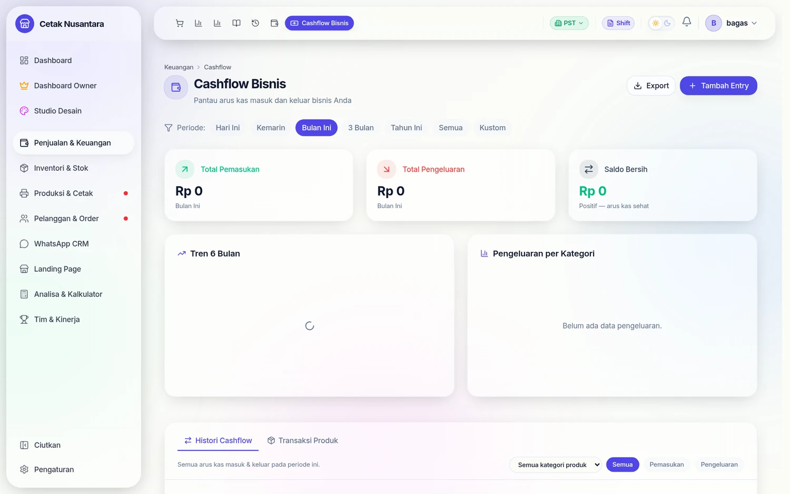

> **Cashflow Bisnis** adalah halaman pusat arus kas toko — tempat Anda melihat, mencatat, dan menganalisis semua uang yang masuk dan keluar dari bisnis, baik yang otomatis tercatat dari transaksi kasir maupun yang diinput manual oleh admin.

---

## Langkah demi langkah

Contoh nyata: mencatat satu pembelian tinta Rp 1.250.000 dan melihat
akibatnya sampai ke saldo kas.

### 1. Membaca ringkasan periode

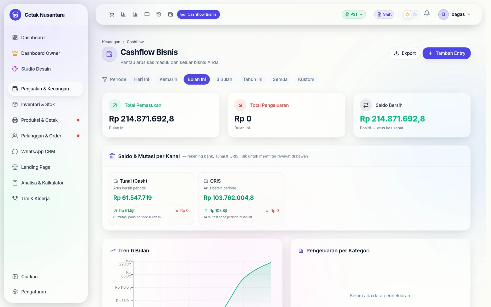

Tiga kartu di atas selalu menjawab satu pertanyaan: *"periode ini uang masuk
berapa, keluar berapa, sisanya berapa."* Label kecil di bawah angka menyebut
periode yang sedang dipilih, jadi angka tidak pernah tampil tanpa konteks.

### 2. Saldo per kanal — bukan cuma total

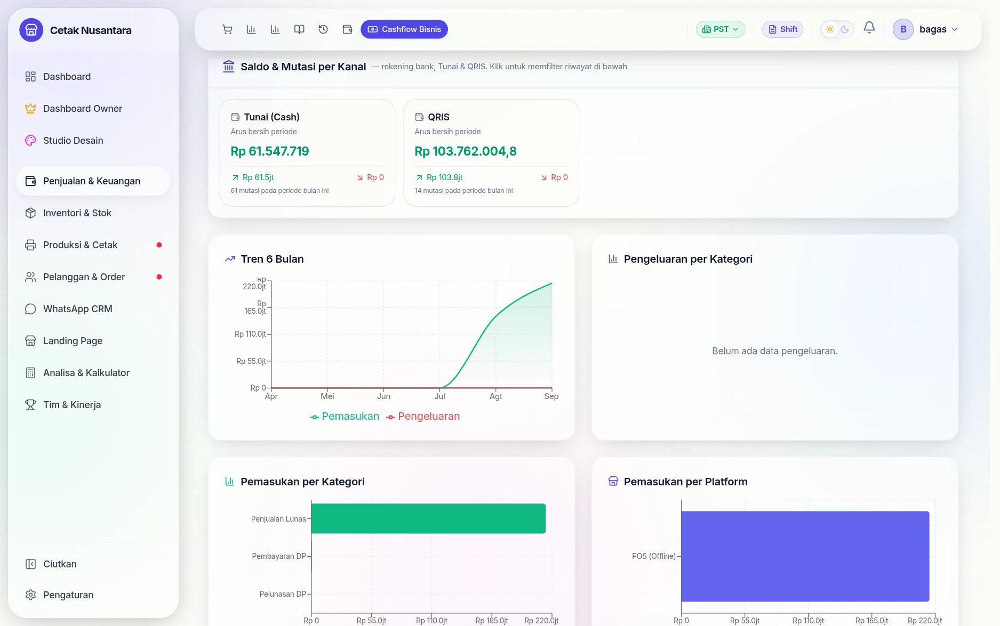

Uang tidak berada di satu tempat. Bagian ini memisahkan **Tunai**, **QRIS**,
dan tiap rekening bank, lengkap dengan jumlah mutasi pada periode itu — supaya
saat menghitung uang fisik di laci, angka pembandingnya jelas yang mana.
Mengklik kanal akan menyaring riwayat di bawahnya.

### 3. Mencatat pengeluaran manual

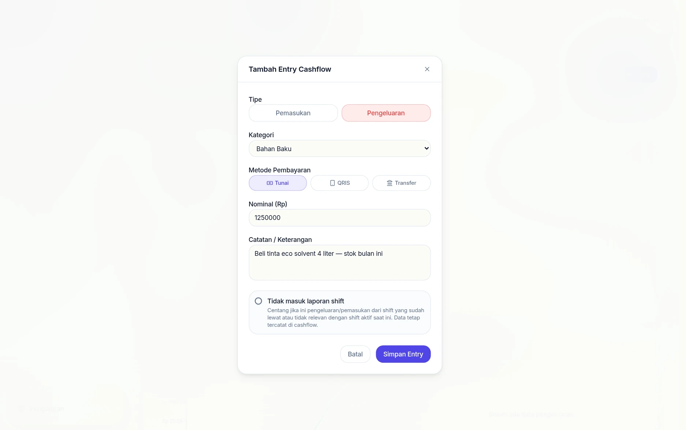

**Tambah Entry** meminta empat hal: tipe (Pemasukan/Pengeluaran), kategori,
metode pembayaran, dan nominal. Daftar kategorinya berganti mengikuti tipe —
pengeluaran menawarkan *Bahan Baku, Gaji Karyawan, Sewa, Listrik & Air,
Transportasi, Marketing, Pemeliharaan, Pajak* — jadi kategori pemasukan tidak
mungkin nyasar ke pengeluaran.

Catatan sebaiknya diisi spesifik ("tinta eco solvent 4 liter"), karena inilah
satu-satunya keterangan yang muncul saat rekap bulanan dibaca ulang.

### 4. Saldo langsung menyesuaikan


Begitu disimpan: Total Pengeluaran **Rp 0 → Rp 1.250.000**, saldo bersih
**Rp 214.871.692,8 → Rp 213.621.692,8**, dan kartu kanal Tunai ikut mencatat
arus keluar Rp 1,3 jt. Tidak ada langkah "hitung ulang" — semuanya satu
sumber angka.

### 5. Entri manual & otomatis berjajar di satu riwayat

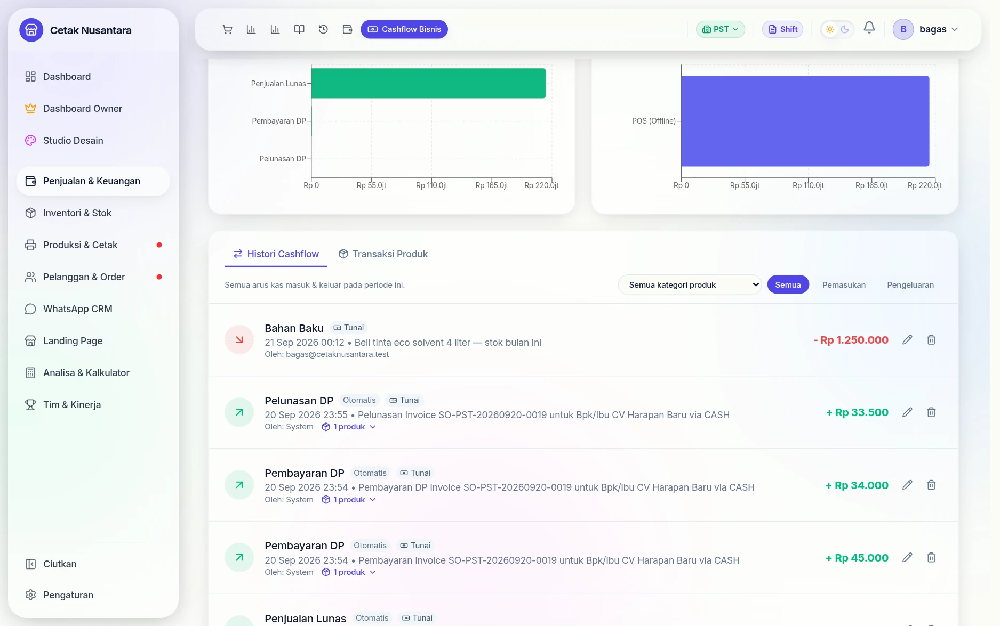

Perhatikan bedanya pada tiap baris:

| Tanda | Artinya |
|---|---|
| chip **Otomatis** + *Oleh: System* | dibuat sendiri oleh sistem dari nota/pelunasan |
| tanpa chip + *Oleh: (email pengguna)* | diketik manual, dan tercatat siapa yang mengetik |

Entri otomatis inilah yang membuat [DP & Piutang](dp-piutang.md) tidak perlu
dicatat dua kali — uang dari nota sudah masuk sendiri, lengkap dengan nomor
invoicenya.

### 6. Membaca tren, bukan cuma hari ini

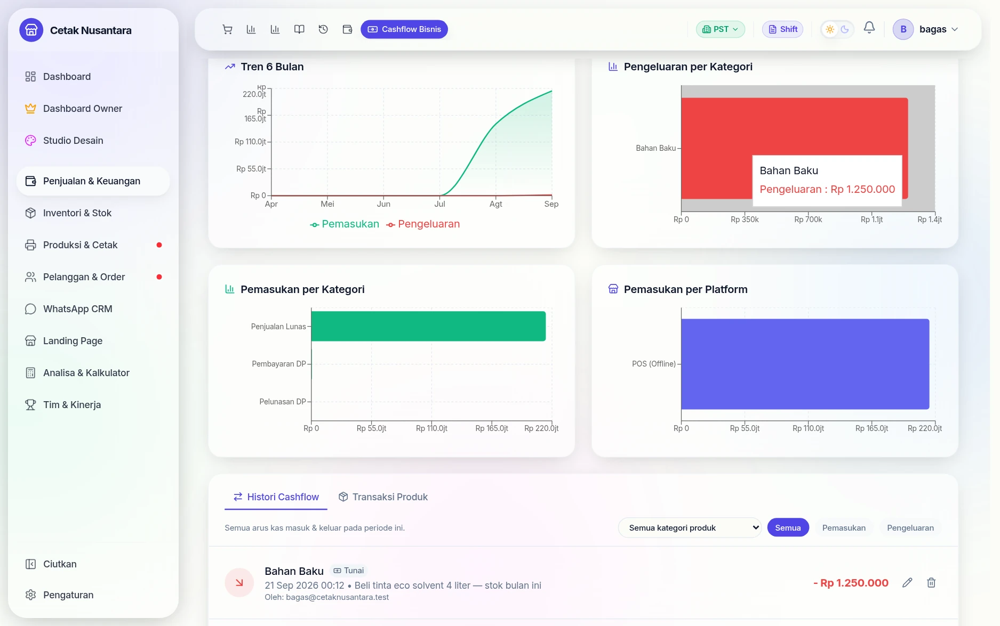

Grafik **Tren 6 Bulan** menyandingkan pemasukan dan pengeluaran agar terlihat
apakah jaraknya melebar atau menyempit. Di sebelahnya, **Pengeluaran per
Kategori** menjawab "uangnya habis ke mana" — pada contoh ini seluruh batang
merah adalah Bahan Baku, karena baru satu entri yang dicatat.

### 7. Mengganti periode

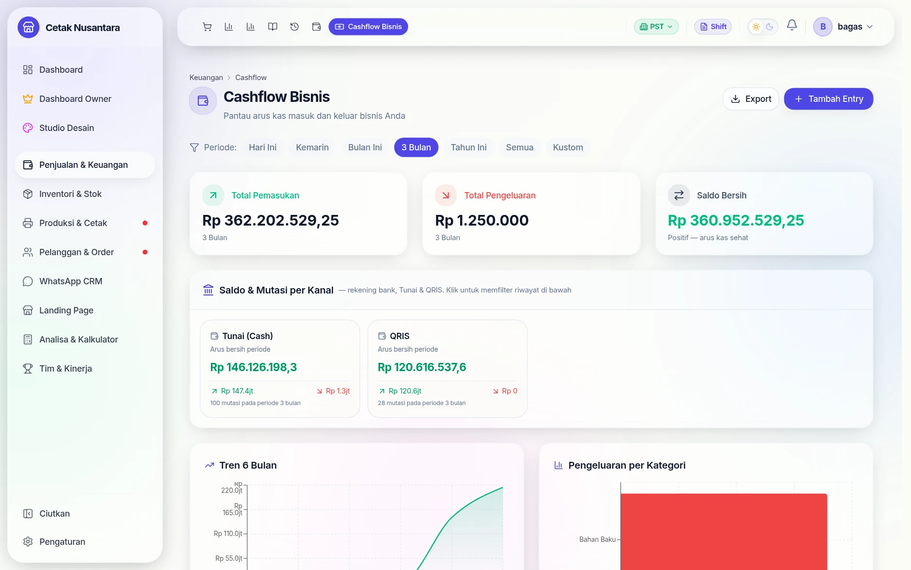

Tujuh pilihan periode — *Hari Ini, Kemarin, Bulan Ini, 3 Bulan, Tahun Ini,
Semua, Kustom* — mengganti seluruh isi halaman sekaligus, termasuk grafik dan
riwayatnya. Contohnya periode 3 bulan memperlihatkan pemasukan
Rp 362.202.529,25, jauh berbeda dari angka bulan berjalan.

Tombol **Export** di kanan atas mengunduh seluruh entri periode itu untuk
diolah di spreadsheet.

## Mengubah entri kas: lewat persetujuan

Entri kas yang sudah tersimpan tidak bisa diubah sembarangan. Kasir hanya bisa
**mengajukan**; pemilik atau manajer yang memutuskan.

### 1. Yang dilihat kasir

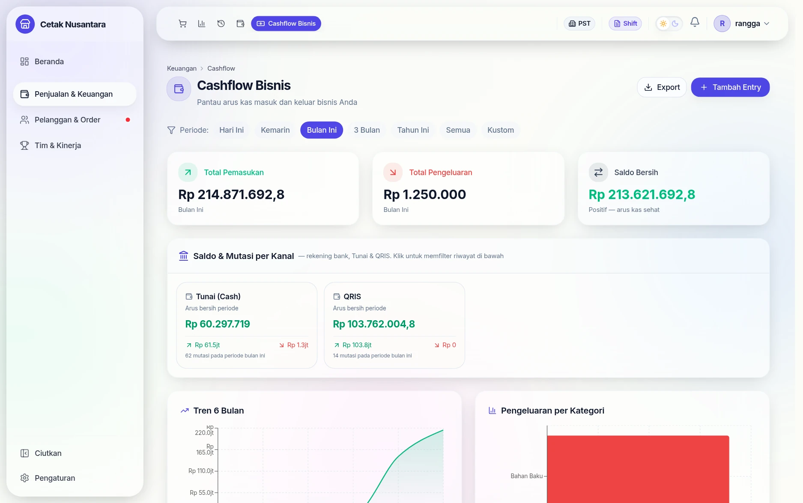

Di baris entri, kasir tidak mendapat tombol *Edit* dan *Hapus* melainkan
**Ajukan perubahan** dan **Ajukan hapus**.

### 2. Mengisi usulan & alasannya

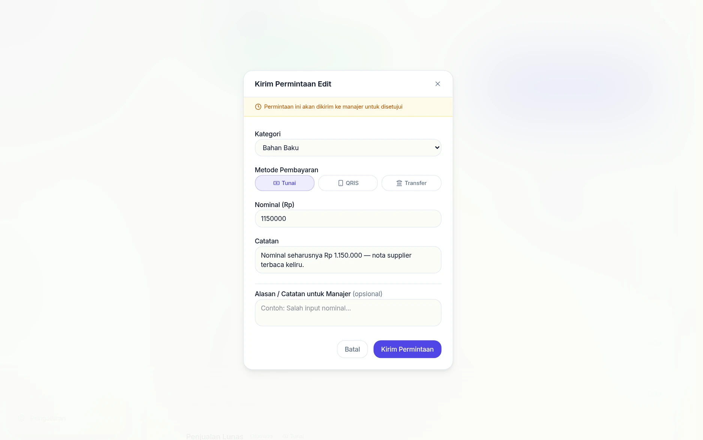

Dialog *Kirim Permintaan Edit* memuat nilai yang ingin diubah (nominal,
kategori, metode bayar) beserta **alasan**. Contohnya: nominal
Rp 1.250.000 → Rp 1.150.000 karena nota supplier terbaca keliru.

### 3. Kasir bisa memantau statusnya

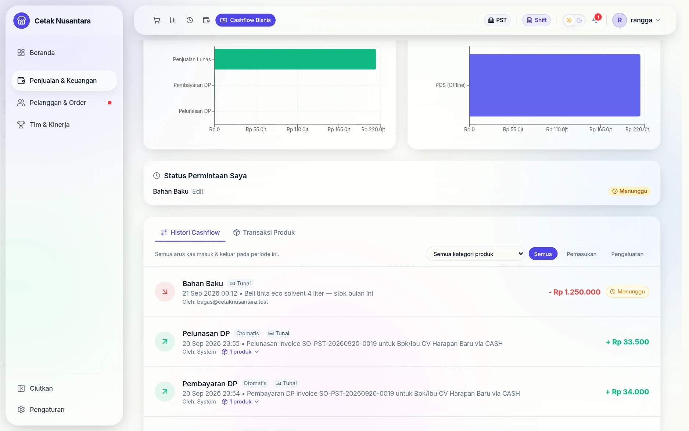

Setelah terkirim, muncul kotak **Status Permintaan Saya** — kasir tahu
permintaannya masih *Menunggu*, tanpa perlu menanyakan ke atasan.

### 4. Pemilik melihat antrean persetujuan

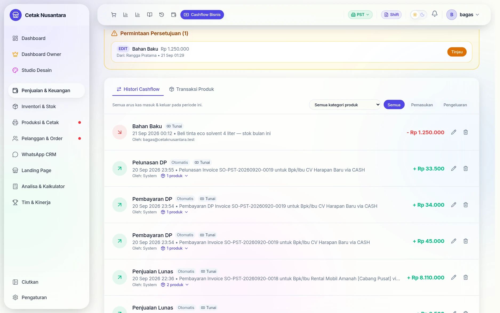

Di sisi pemilik muncul kotak **Permintaan Persetujuan (1)** yang menyebut jenis
permintaan, entri yang disentuh, nominalnya, dan siapa pengajunya.

### 5. Perbandingan sebelum–sesudah

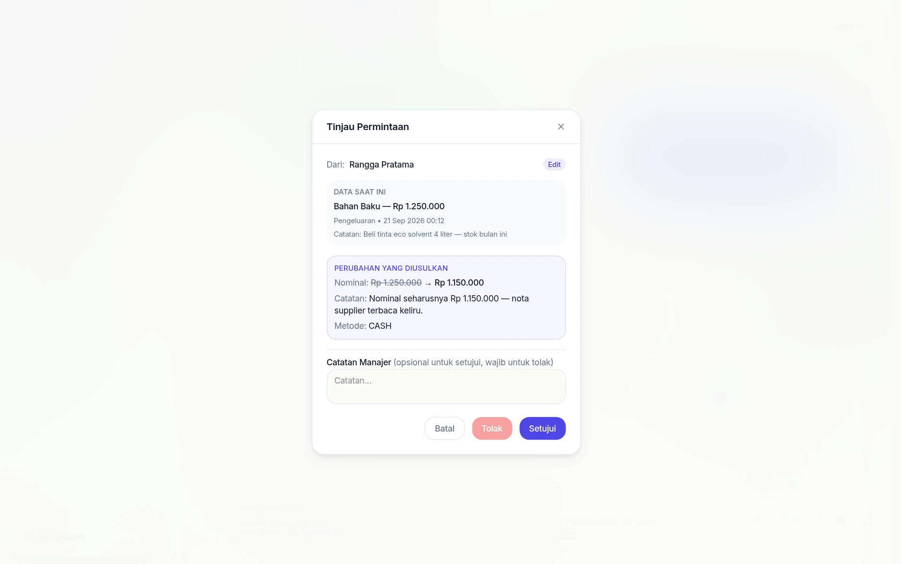

Tombol *Tinjau* membuka perbandingan berdampingan: **Data Saat Ini** (kategori,
nominal, tanggal, catatan) dan **Perubahan yang Diusulkan** — jadi keputusan
diambil sambil melihat angka lama dan barunya sekaligus, bukan dari ingatan.

### 6. Setelah disetujui

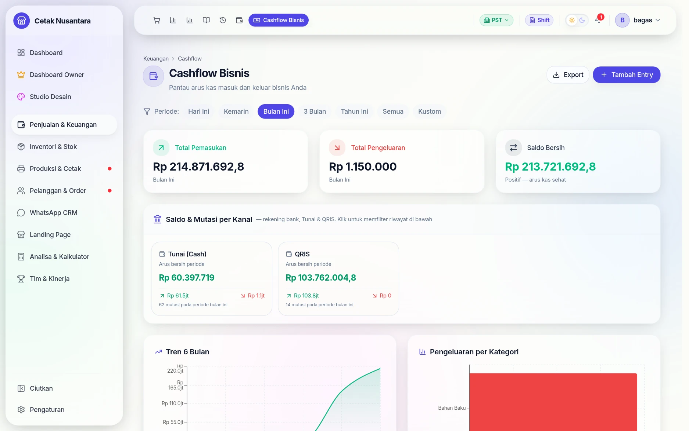

Sekali *Setujui*, entrinya berubah dan ringkasan ikut menyesuaikan: Total
Pengeluaran **Rp 1.250.000 → Rp 1.150.000**. Permintaannya sendiri tersimpan
sebagai riwayat berstatus disetujui, lengkap dengan siapa pengaju dan siapa
penyetujunya.

## Apa Itu Cashflow dan Kenapa Penting?

**Cashflow** (arus kas) adalah gambaran nyata kesehatan keuangan bisnis Anda dari hari ke hari.

Bisnis bisa punya omset tinggi, tapi tetap "kering" uang jika pengeluaran tidak terkontrol. Dengan memantau cashflow secara rutin, Anda bisa:
- Tahu kapan bisnis sedang surplus atau defisit
- Identifikasi pos pengeluaran terbesar
- Rencanakan kapan waktu yang aman untuk investasi atau ekspansi
- Siapkan data untuk laporan keuangan bulanan

---

## Cara Mengakses

Di sidebar kiri, klik menu **💰 Cashflow Bisnis**.

---

## Tampilan Halaman

Halaman Cashflow terdiri dari 4 bagian utama:

```
┌─────────────────────────────────────────────────────────┐
│  [Bulan Ini] [3 Bulan] [Tahun Ini] [Semua]  [+ Tambah] │
├──────────────┬──────────────┬──────────────────────────-┤
│ Total Masuk  │ Total Keluar │     Saldo Bersih           │
├──────────────┴──────────────┴───────────────────────────┤
│  Chart Tren 6 Bulan (Pemasukan vs Pengeluaran)          │
├─────────────────────────┬───────────────────────────────┤
│  Breakdown Pengeluaran  │  Breakdown Pemasukan          │
│  per Kategori           │  per Kategori                 │
├─────────────────────────┴───────────────────────────────┤
│  Daftar Entri Cashflow (tabel)                          │
└─────────────────────────────────────────────────────────┘
```

---

## Filter Periode

Di bagian paling atas, pilih rentang waktu yang ingin Anda lihat:

| Tombol | Data yang Ditampilkan |
|---|---|
| **Bulan Ini** | Dari tanggal 1 bulan berjalan sampai hari ini |
| **3 Bulan** | Tiga bulan terakhir |
| **Tahun Ini** | Dari 1 Januari tahun ini sampai hari ini |
| **Semua** | Seluruh riwayat tanpa batasan waktu |

Semua kartu ringkasan dan chart akan otomatis menyesuaikan periode yang dipilih.

---

## Kartu Ringkasan

Setelah memilih periode, tiga kartu besar muncul di bagian atas:

| Kartu | Penjelasan |
|---|---|
| **Total Pemasukan** (hijau) | Semua uang yang masuk pada periode tersebut |
| **Total Pengeluaran** (merah) | Semua uang yang keluar pada periode tersebut |
| **Saldo Bersih** | Pemasukan dikurangi Pengeluaran — **merah jika minus** |

> **Contoh baca:** Jika Total Pemasukan = Rp 15.000.000 dan Total Pengeluaran = Rp 11.500.000, maka Saldo Bersih = Rp 3.500.000 (bisnis surplus bulan ini).

---

## Chart Tren 6 Bulan

**Area Chart** yang menampilkan perbandingan bulan per bulan antara pemasukan (biru) dan pengeluaran (merah/oranye) selama 6 bulan terakhir.

**Cara membacanya:**
- Jika garis biru **selalu di atas** garis merah → bisnis konsisten surplus
- Jika garis merah **melebihi** biru di bulan tertentu → bulan itu bisnis defisit, perlu investigasi
- Tren garis biru **naik dari bulan ke bulan** → pertumbuhan bisnis positif

---

## Chart Breakdown Kategori

Dua **Bar Chart horizontal** berdampingan yang menunjukkan distribusi per kategori:

- **Kiri — Pengeluaran per Kategori**: pos mana yang paling banyak menguras kas (misalnya Gaji Karyawan, Sewa, Bahan Baku)
- **Kanan — Pemasukan per Kategori**: sumber pendapatan terbesar (misalnya Penjualan Produk, Jasa Percetakan)

**Kegunaan nyata:** Jika Anda lihat "Utilitas" tiba-tiba jadi kategori pengeluaran terbesar, itu sinyal tagihan listrik melonjak dan perlu diperiksa.

---

## Daftar Entri Cashflow

Tabel di bagian bawah menampilkan semua entri cashflow satu per satu.

### Filter Tabel

Di atas tabel ada 3 tombol filter:
- **Semua** — tampilkan semua entri
- **Pemasukan** — filter hanya uang masuk
- **Pengeluaran** — filter hanya uang keluar

### Kolom Tabel

| Kolom | Penjelasan |
|---|---|
| Tanggal & Jam | Kapan entri ini terjadi |
| Kategori | Jenis transaksi (contoh: Gaji, Sewa, Penjualan Produk) |
| Keterangan | Deskripsi detail entri |
| Nominal | Jumlah uang — hijau untuk masuk, merah untuk keluar |
| Sumber | Badge **Otomatis** atau tombol edit/hapus untuk manual |

---

## Entri Otomatis vs. Manual

### Entri Otomatis (dari Kasir POS)

Setiap kali ada transaksi lunas atau pelunasan DP di kasir, sistem **otomatis membuat entri cashflow** tanpa perlu input manual. Entri ini ditandai dengan badge abu-abu **"Otomatis"**.

- Tidak bisa diedit atau dihapus (karena terhubung langsung ke data transaksi)
- Jika ada koreksi, buat entri penyesuaian manual terpisah

### Entri Manual (diinput Admin)

Untuk pengeluaran dan pemasukan yang tidak melalui kasir POS — misalnya bayar gaji, bayar sewa, atau terima setoran modal. Entri ini bisa diedit dan dihapus kapan saja.

---

## Cara Menambah Entri Manual

1. Klik tombol **+ Tambah** di pojok kanan atas
2. Isi form yang muncul:

| Field | Isi dengan |
|---|---|
| **Tipe** | Pilih: Pemasukan atau Pengeluaran |
| **Kategori** | Pilih dari daftar (lihat kategori di bawah) |
| **Nominal** | Jumlah uang dalam Rupiah (contoh: `500000`) |
| **Keterangan** | Deskripsi singkat (contoh: "Bayar tagihan listrik Februari") |
| **Tanggal** | Default hari ini, bisa diubah ke tanggal lain |

3. Klik **Simpan**

---

## Daftar Kategori

### Kategori Pengeluaran
| Kategori | Contoh Penggunaan |
|---|---|
| Gaji Karyawan | Bayar gaji kasir/karyawan bulanan |
| Sewa Tempat | Bayar sewa toko, ruko, atau kios |
| Utilitas | Tagihan listrik, air, internet, telepon |
| Pembelian Bahan Baku | Beli tinta, kertas, kain, atau bahan produksi |
| Biaya Operasional | Beli ATK, bayar jasa kebersihan |
| Pemeliharaan & Perbaikan | Servis printer, renovasi kecil |
| Pemasaran & Iklan | Biaya iklan online, cetak brosur, spanduk promosi |
| Pajak & Perizinan | Bayar pajak usaha, perpanjang SIUP |
| Lain-lain | Pengeluaran yang tidak masuk kategori di atas |

### Kategori Pemasukan
| Kategori | Contoh Penggunaan |
|---|---|
| Penjualan Produk | Pemasukan dari transaksi kasir (otomatis) |
| Jasa Percetakan | Pendapatan dari jasa cetak banner, undangan, dll |
| Pendapatan Lain-lain | Pemasukan non-operasional |
| Investasi / Modal Masuk | Setoran modal dari pemilik atau investor |

---

## Cara Edit atau Hapus Entri Manual

Di baris entri yang ingin diubah (hanya entri manual, bukan otomatis):
- Klik ikon **✏️ pensil** untuk mengedit nominal, kategori, atau keterangan
- Klik ikon **🗑️ tempat sampah** untuk menghapus (akan muncul konfirmasi)

---

## Export ke Excel

Klik tombol **📥 Export Excel** di pojok kanan atas untuk mengunduh semua data yang saat ini ditampilkan (sesuai filter periode aktif) ke file `.xlsx`.

File berisi kolom: Tanggal, Tipe, Kategori, Keterangan, Nominal. Siap dibuka di Microsoft Excel, Google Sheets, atau LibreOffice Calc.

**Kapan berguna:**
- Laporan bulanan ke akuntan atau pemilik
- Rekap untuk keperluan pajak tahunan
- Arsip keuangan jangka panjang

---

## Tips & Best Practice

**Rutin input pengeluaran manual** — Jangan tunggu akhir bulan. Langsung catat setiap ada pengeluaran agar data akurat.

**Gunakan kategori secara konsisten** — Kalau bulan ini "bayar listrik" dikategorikan "Utilitas", bulan depan juga harus sama. Supaya chart breakdown-nya akurat.

**Cek tren setiap akhir bulan** — Lihat chart 6 bulan: apakah pemasukan tumbuh? Apakah pengeluaran bisa dipangkas?

**Export sebelum tutup buku** — Ekspor data Excel sebelum akhir bulan untuk arsip dan cross-check dengan catatan akuntan.

---

## Pertanyaan Umum

**Q: Kenapa ada entri cashflow yang tidak bisa saya hapus?**
> Entri bertanda "Otomatis" dibuat oleh sistem dari transaksi kasir. Untuk menjaga integritas data, entri ini tidak bisa dihapus secara langsung.

**Q: Apakah cashflow terhubung dengan laporan tutup shift?**
> Ya — setiap transaksi yang diselesaikan di kasir (Bayar Lunas atau Pelunasan) otomatis masuk sebagai pemasukan di Cashflow, sehingga angka-angkanya sinkron.

**Q: Bisa tidak melihat cashflow per kategori saja?**
> Gunakan filter "Pemasukan" atau "Pengeluaran" di tabel, lalu scroll untuk melihat semua entri per kategori. Chart Breakdown Kategori juga memberikan gambaran visual distribusinya.

---

*Dokumentasi PosPro — Cashflow Bisnis | Terakhir diperbarui: April 2026*

**© 2026 Muhammad Faisal. All rights reserved.**
