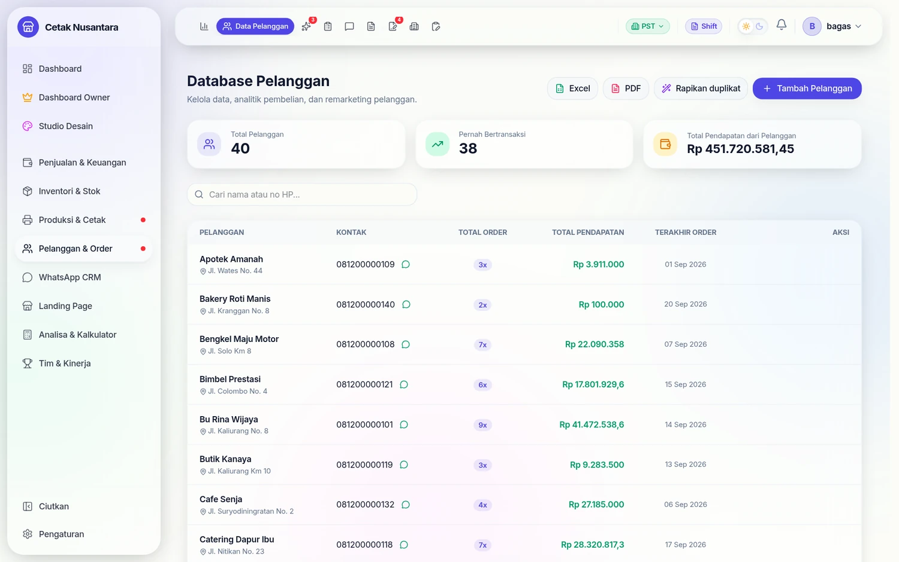
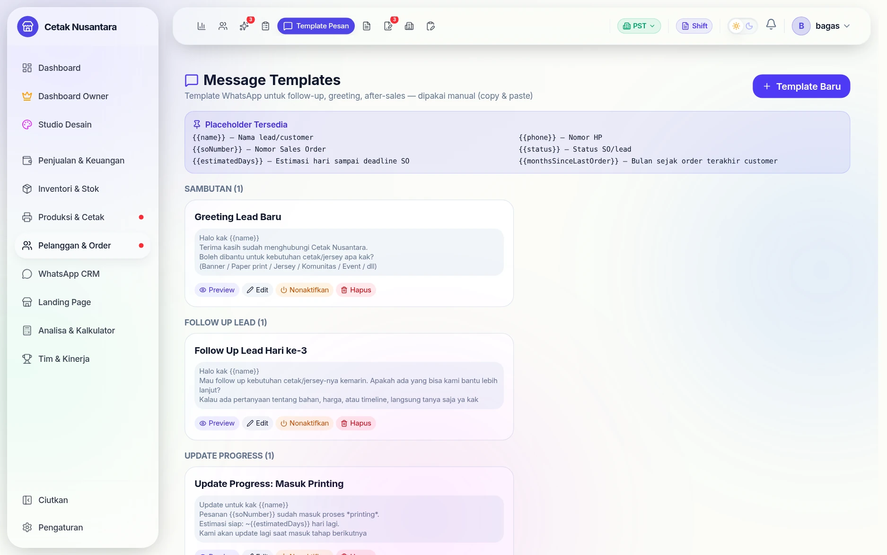
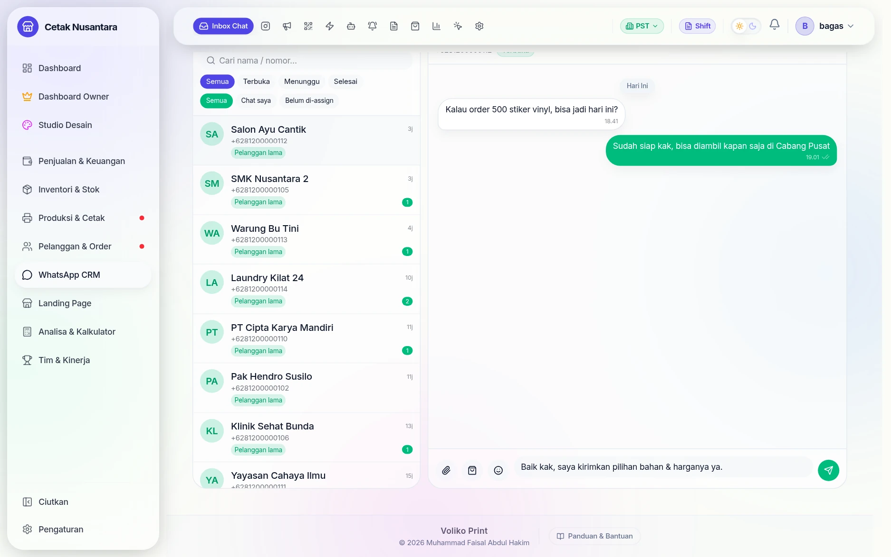
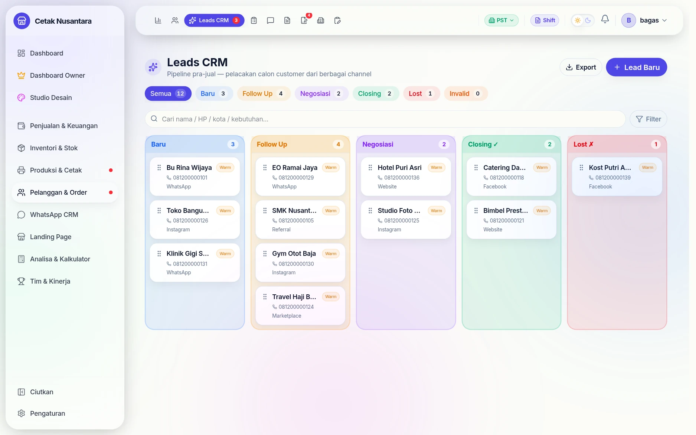
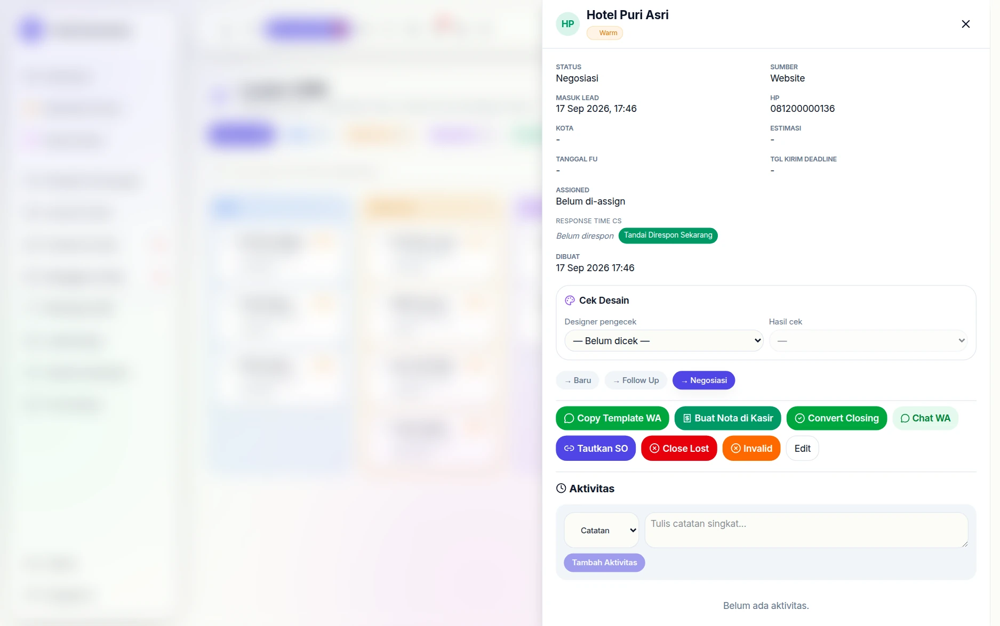
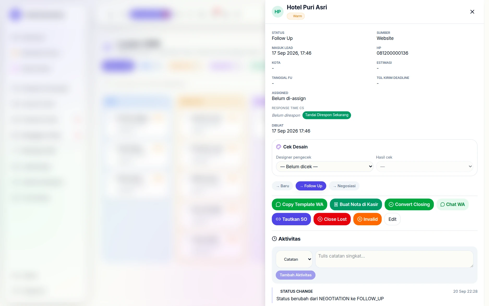
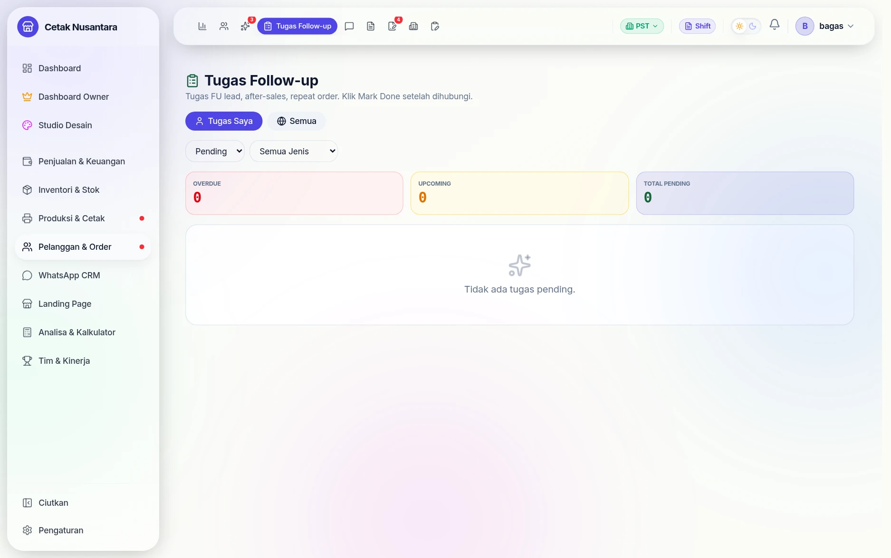
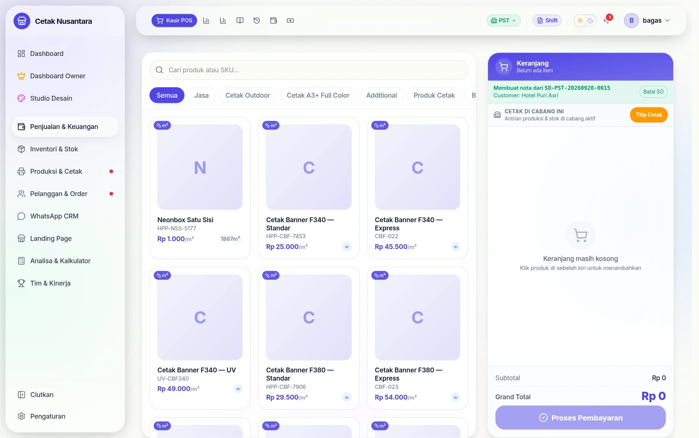
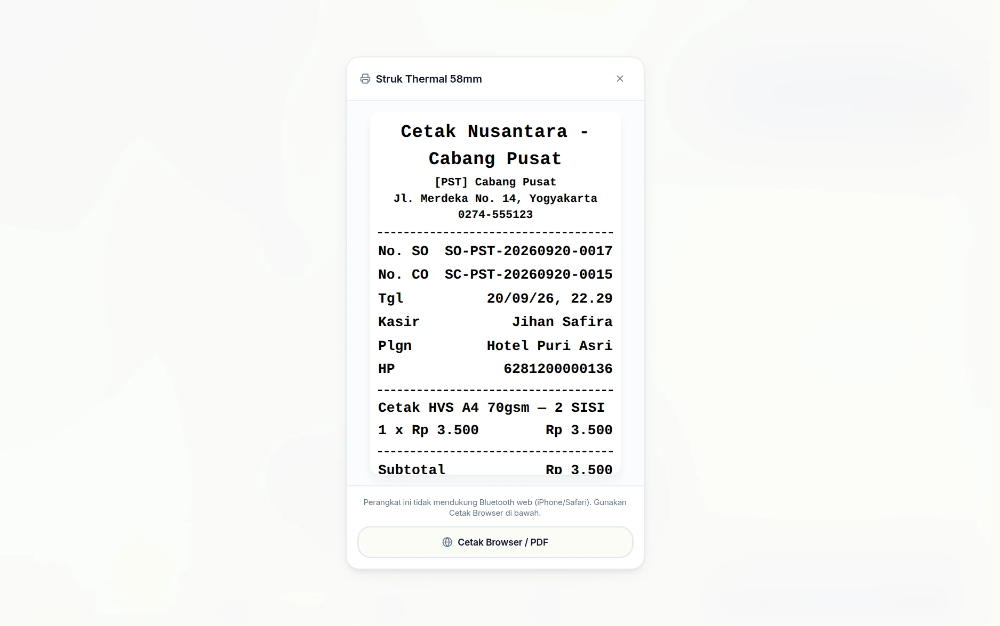

# 🎯 CRM — Lead Pipeline, Follow-Up & Customer Relationship

> **TL;DR**: Modul CRM PosPro membantu Anda **tidak kehilangan calon customer**, **tidak lupa follow-up**, dan **tidak melupakan customer lama**. Dari chat WA pertama sampai repeat order tahun depan — semua ter-tracking otomatis.


Database pelanggan yang terbentuk dari lead yang menjadi order:



---

## Apa itu CRM di PosPro?

**CRM (Customer Relationship Management)** adalah sistem untuk mengelola hubungan dengan calon customer & customer existing, mulai dari **lead masuk** sampai **after-sales**, sehingga tidak ada peluang penjualan yang lewat begitu saja.

PosPro memiliki **4 halaman utama** untuk CRM:

| Halaman | Fungsi |
|---|---|
| `/crm` | **Dashboard KPI** — metrik performa CRM (response time, closing rate, dll) |
| `/crm/leads` | **Pipeline Lead** — input lead baru, kanban drag-drop status, convert ke customer |
| `/crm/follow-ups` | **Daily Worklist** — tugas hubungi customer hari ini (paling sering dibuka) |
| `/crm/templates` | **Setup Template WA** — pesan siap copy-paste untuk berbagai skenario |

---

## 🔄 Alur Lengkap CRM

```
LEAD MASUK (NEW)
  ↓
FOLLOW UP (chat berkala, gali kebutuhan)
  ↓
NEGOSIASI (kasih penawaran, deal harga)
  ↓
CLOSED_WON → Convert → [Customer] + [SPK/SO] + [Invoice]
  ↓
PRODUKSI (handover ke designer/operator)
  ↓
PICKUP (customer ambil pesanan)
  ↓
AFTER_SALES (auto 3 hari → minta testimoni)
  ↓
REPEAT_ORDER (auto weekly cek customer dormant)
```

---

## Dua halaman pendukung

### Database pelanggan


**`/customers`** bukan sekadar buku alamat: tiap baris memuat **total order**,
**total pendapatan**, dan **tanggal order terakhir** — bahan untuk remarketing
("siapa yang sudah 3 bulan tidak pesan lagi"). Tombol *Rapikan duplikat*
menggabungkan data pelanggan yang tercatat dua kali, dan datanya bisa diekspor
Excel/PDF.

Sejak 22 September 2026 *Rapikan duplikat* dan hapus pelanggan khusus setingkat
manajer. *Rapikan duplikat* kini ikut memindahkan kontak WA/sosial dan rating CS
ke data yang dipertahankan, dan pelanggan yang masih tertaut lead, SO, kontak,
rating, atau follow-up tidak bisa dihapus — gabungkan saja lewat *Rapikan
duplikat*.

**Total Pendapatan** pelanggan (kolom tabel, kartu atas, dan analitik per
pelanggan) sejak 22 September 2026 = total nota **lunas** + uang yang sudah
diterima dari nota DP. Dulu yang dijumlahkan hanya DP awal, sehingga nota yang
lunas sekali bayar terhitung Rp 0. Di analitik, pendapatan per produk memakai
total baris (bukan harga satuan), dan riwayat belanja menampilkan nilai nota —
nota belum lunas diberi keterangan *dibayar Rp …*.

Rincian pelanggan, daftar pelanggan, dan ekspor kini menghitung **semua nota**
pelanggan apa pun format nomornya di nota ("+62 812-3456-789", "0812…",
"62812…") sejak 22 September 2026. Dulu hanya nota bernomor persis "62812…"
yang terhitung, padahal ±separuh nota menyimpan format lain. Mengubah data
pelanggan hanya menerima kolom formulir, dan nomor HP yang tidak valid ditolak
(dulu nomor lama terhapus diam-diam).

### Template pesan siap pakai



**`/crm/templates`** menyimpan teks yang sering dipakai — sambutan lead baru,
follow-up hari ke-3, update progres, sampai after-sales — dengan
**placeholder** yang diisi otomatis:

`{{name}}`, `{{phone}}`, `{{soNumber}}`, `{{status}}`, `{{estimatedDays}}`,
`{{monthsSinceLastOrder}}`

Tombol **Seed 5 Default** mengisi lima template awal untuk yang baru mulai;
tiap template bisa dipratinjau, diedit, dinonaktifkan, atau dihapus.

## Langkah demi langkah

Contoh nyata: chat masuk dari pelanggan, ditindaklanjuti, sampai jadi nota.

### 1. Chat masuk di inbox WhatsApp



Percakapan masuk berkumpul di satu inbox — bukan di HP pribadi CS. Riwayatnya
tersimpan, jadi CS berikutnya tahu apa yang sudah dibicarakan. Balasan diketik
langsung di sini, dan `/` memanggil [pesan cepat](whatsapp-cloud.md).

### 2. Pipeline lead



Setiap calon pelanggan berdiri sebagai **lead** dengan tahapannya. Angka di tiap
tab memperlihatkan berapa yang tertahan di situ — kalau "Follow Up" menumpuk,
artinya ada yang tidak ditindaklanjuti.

### 3. Buka lead untuk melihat riwayatnya



Detail lead memuat kebutuhannya, sumbernya (WhatsApp, Instagram, iklan), dan
riwayat percakapannya, lengkap dengan tombol aksi di satu tempat.

### 4. Pindahkan tahapannya



Tombol **→ Follow Up** / **→ Negosiasi** memindahkan tahap tanpa membuka form.
Tombol **Tandai Direspon Sekarang** mencatat kapan lead itu dijawab — angka
inilah yang muncul sebagai kecepatan respons di [Leaderboard](leaderboard.md).

### 5. Tugas follow-up



Lead yang perlu dihubungi lagi muncul sebagai tugas, jadi tidak bergantung pada
ingatan CS.

### 6. Jadikan nota di kasir



Tombol **Buat Nota di Kasir** membuka halaman kasir dengan data pelanggan dari
lead sudah terbawa — tidak perlu mengetik ulang nama dan nomor HP.

### 7. Nota jadi, lead otomatis ditutup



Begitu notanya tersimpan, **lead otomatis berubah menjadi *Closing*** tanpa
perlu diubah manual. Jadi angka di pipeline selalu mencerminkan keadaan
sebenarnya, bukan sisa pekerjaan administrasi.

---

## 1. Halaman `/crm/leads` — Pipeline Lead

### Apa itu Lead?
**Lead** = calon customer yang sudah kontak tapi belum closing. Berbeda dengan customer (yang sudah pernah bayar).

### Status Lead
- 🆕 **NEW** — Baru chat, belum di-FU
- ⏰ **FOLLOW_UP** — Sudah dihubungi, menunggu respons
- 💬 **NEGOTIATION** — Sedang nego harga / desain
- ✅ **CLOSED_WON** — Deal! Sudah di-convert ke customer + SPK/Invoice
- ❌ **CLOSED_LOST** — Tidak jadi (alasan dicatat)

Kalau nota yang menutup lead **dihapus**, sejak 22 September 2026 lead itu kembali
ke **NEGOTIATION** dan tautan notanya dilepas. Dulu lead tetap CLOSED_WON menunjuk
nota yang sudah tiada, dan estimasi nilainya masih terhitung di KPI/bonus CS.

### Tampilan: Card View vs Kanban View
- **Card view** — grid kartu standar, cocok untuk scrolling daftar lengkap
- **Kanban view** — 5 kolom status, **drag-drop** antar kolom untuk update status (paling cepat & intuitif)

### Fitur di Form Lead
- **Multi-image upload** — sampai 5 gambar, tampil sebagai slider/carousel di kanban card
- **Phone dedup** — saat ketik HP, sistem auto-cek customer existing → kasih banner "pakai data ini" untuk hindari duplikat
- **Product picker** — pilih item dari katalog atau custom (free-text + harga manual), auto-calc subtotal AREA_BASED (untuk banner/cetak ukuran)
- **CS assignment** — pilih user dari daftar `/settings/users` yang pegang lead ini
- **Image cover di kartu** — gambar pertama jadi cover kanban card

### Convert Lead → Closing
Klik tombol **"Convert"** di detail lead → 3 checkbox:
- 👤 **Buat Customer Baru** — record di `Customer` master
- 📋 **Buat SPK (Sales Order) Draft** — untuk production-bound order (banner, jersey, dll yang butuh desain)
- 🧾 **Buat Invoice / Quotation Draft** — INV-... atau SPH-... untuk tagihan

**Otomatis terjadi saat convert**:
- Items dari lead masuk ke SO + Invoice (yang dari katalog → SO, semua → Invoice)
- Gambar lead di-copy ke SO Proof Gambar (desainer langsung lihat referensi)
- Lead status berubah ke CLOSED_WON, link ke customer + SO + invoice ter-record
- SO dari convert tanpa nama desainer kini dibiarkan **kosong**, bukan "TBD" (sejak 22 September 2026 — dulu "TBD" ikut terhitung sebagai desainer di KPI)

#### Aturan tambahan sejak 22 September 2026

- Lead yang sudah tertaut nota **tidak bisa di-convert lagi**, jadi tidak ada
  nota ganda dari satu lead.
- Saat lead ditutup (Won, Lost, atau Invalid), follow-up yang masih terbuka
  otomatis **dilewati** dan pengingat WA-nya berhenti.
- **Hapus lead** hanya untuk Owner/Manajer/Admin (tombolnya tidak tampil untuk
  staf lain). Lead yang sudah Won/ter-convert tidak bisa dihapus.
- Order dari halaman publik memakai **harga katalog**, bukan harga yang dikirim
  formulir. Order dianggap sama hanya bila nama, No. HP, dan nilainya sama.

### Alur B: Tautkan Lead ke SO Desainer (Jun 2026)

Kasus umum: customer chat CS (jadi lead), lalu desainer **sudah keburu bikin SO** dari portal desainer. Kalau CS convert lead seperti biasa, hasilnya **nota dobel** (1 dari convert, 1 dari SO saat di-checkout di POS).

Solusinya tombol **🔗 Tautkan SO** di detail lead:

1. Buka detail lead → klik **Tautkan SO** → cari nama / HP customer.
2. Pilih SO aktif (Draft/Terkirim) yang cocok → lead tertaut, status naik ke **Negosiasi** (kalau masih Baru/FU). **Tidak ada nota/customer baru yang dibuat.**
3. Saat kasir membuat nota dari SO itu di POS, lead otomatis **CLOSED_WON** menunjuk nota yang sama — CS & desainer dua-duanya dapat kredit, tanpa nota dobel.

Pengaman tambahan:
- Modal **Convert** otomatis menampilkan **peringatan** kalau customer (nama/HP sama) punya SO aktif — saran pakai Tautkan SO, bukan convert.
- Sejak 22 September 2026, lead yang tertaut SO desainer yang **masih aktif** (belum jadi nota/batal) tidak lagi menampilkan tombol Convert — diganti keterangan *"Sudah ada SO desainer — buka dari kasir"*. Kalau convert tetap terpanggil, server memakai SO itu: tidak membuat SO/nota baru, tautannya tidak ditimpa, dan lead baru closing saat nota dibuat di kasir.
- Tautan bisa dilepas / diganti kapan saja selama lead belum closing.
- Kotak "Tertaut ke Sales Order" di detail lead punya tombol **🧾 Buat Nota di POS** — buka POS dengan cart ter-prefill dari SO (`/pos?fromSO=<id>`), checkout → lead otomatis closing.

**Arah sebaliknya (designer-first)**: desainer juga bisa **memulai** alur ini dari portalnya. Saat menyimpan SO ada tombol **Lead Order (CS)** — SO tersimpan + lead otomatis dibuat & tertaut (CS dapat notif Discord #penjualan), tanpa CS perlu input lead manual. Lihat [Sales Order › Tiga tombol simpan](sales-orders.md).

---

## 2. Halaman `/crm/follow-ups` — Daily Worklist CS ⭐

> **Halaman paling sering dibuka CS dalam keseharian.** Anggap aja seperti "Inbox tugas" — semua reminder "wajib chat customer hari ini" terkumpul di sini.

### 3 Section Visual Otomatis
- 🔥 **Overdue** (merah) — tugas yang sudah lewat tanggal due. **Prioritas utama**.
- 📅 **Akan Datang** (amber) — tugas hari ini & beberapa hari ke depan
- ✓ **Selesai/Skip** — history (switch filter ke DONE/SKIPPED)

### 4 Jenis Tugas Otomatis

| Tipe | Trigger | Due Date |
|---|---|---|
| 🎯 **LEAD_FU** | CS set `followUpDate` saat input/edit lead | Sesuai tanggal yang di-set |
| 📦 **AFTER_SALES** | Operator klik pickup job di `/produksi` | Auto +3 hari, jam 9 pagi |
| 🔄 **REPEAT_ORDER** | Cron Senin 08.00 WIB → customer yang order terakhirnya 90–97 hari lalu. **Nonaktif** sampai Owner menyalakannya (lihat *Catatan Teknis* di bawah) | Auto +1 hari |
| 💰 **PAYMENT_REMINDER** | (Placeholder Phase 2) | — |

### 2 Tab View
- **👤 Tugas Saya** (default) — hanya task assigned ke user yang login
- **🌐 Semua** — view owner/supervisor, lihat semua task lintas user/cabang

Angka badge menu Follow-up hanya menghitung tugas milik akun yang login (sejak 22 September 2026 — dulu semua tugas ikut terhitung).

### 3 Tombol Aksi per Task
- **✓ Selesai** → modal isi catatan singkat → task DONE + activity log
- **💬 WA** → pilih template → preview rendered (placeholder `{{name}}` auto-isi) → Copy + buka WA langsung
- **⏭ Skip** → task ke status SKIPPED (mis. customer ghosting)

### Kenapa Halaman Ini Penting?
| Tanpa halaman ini | Dengan halaman ini |
|---|---|
| Lead hilang karena lupa FU | Reminder pasti muncul di tanggal due |
| Tidak ada testimoni karena lupa minta | Auto-task 3 hari pasca pickup |
| Repeat order rendah | Cron auto-tag customer dormant |
| Tidak tahu siapa CS yang rajin | KPI dashboard track per-user |

---

## 3. Halaman `/crm/templates` — Template WA

Kumpulan pesan siap-pakai dengan placeholder yang auto-isi data customer.

### Placeholder Tersedia
- `{{name}}` — Nama lead/customer
- `{{phone}}` — Nomor HP
- `{{soNumber}}` — Nomor Sales Order
- `{{status}}` — Status SO/lead
- `{{estimatedDays}}` — Hari sampai deadline SO
- `{{monthsSinceLastOrder}}` — Bulan sejak order terakhir customer

### Kategori Default (Seed 5)
1. **Greeting Lead Baru** — sambutan untuk lead yang baru chat
2. **Follow Up Lead Hari ke-3** — nudge lead yang belum respons
3. **Update Progress: Masuk Printing** — info ke customer pesanan masuk produksi
4. **After Sales (Cek Penerimaan)** — minta testimoni / foto pakai
5. **Repeat Order Nudge** — tawarkan repeat order ke customer lama

Klik tombol **"Seed 5 Default"** saat pertama kali pakai untuk dapat template starter. Bisa di-edit / dihapus / nonaktifkan sesuai kebutuhan.

---

## 4. Halaman `/crm` — Dashboard KPI

Metrik performa CRM untuk owner monitoring:

| Metrik | Cara Hitung |
|---|---|
| **Response Time Avg** | Rata-rata berapa jam sampai lead di-respons CS |
| **Closing Rate** | % lead yang berhasil di-convert ke customer |
| **FU Compliance** | % follow-up done sebelum due date + 1 hari |
| **Repeat Order Rate** | % customer yang order ≥2 kali |
| **Leads by Source** | Pie + bar chart: WA / IG / FB / Marketplace / Referral / dll |
| **Leaderboard CS** | Ranking per user: leads handled, deals closed, pcs/omzet lead, **+ kontribusi POS walk-in** (Pcs WO / Trx WO / Omzet WO), avg response |

Filter periode: hari ini / 7 hari / bulan ini / custom range.

**Skor Leaderboard CS = Lead + POS walk-in.** Selain metrik dari lead (closing,
pcs/omzet hasil convert), leaderboard juga menghitung transaksi POS langsung yang
ditangani CS:

- **Pcs WO** — jumlah barang dari transaksi POS walk-in (non-lead).
- **Trx WO** — jumlah transaksi POS walk-in.
- **Omzet WO** — total nilai (grandTotal) transaksi POS walk-in.

Atribusi walk-in dicocokkan lewat kolom **Kasir/Staff** di POS (`cashierName`) yang
sama dengan nama user CS. Transaksi yang berasal dari konversi lead **tidak** dihitung
lagi sebagai walk-in (anti dobel). Sisa piutang transaksi PENDING/DP walk-in ikut
masuk ke kolom **Nilai Akan Datang**. CS yang hanya punya penjualan POS (tanpa lead)
tetap muncul di leaderboard.

### Leaderboard Designer: Omzet & Konversi SO (Jun 2026)

Leaderboard designer kini menghitung **uang**, bukan cuma jumlah job:

| Kolom | Arti |
|---|---|
| **Omzet** | Total nilai nota dari SO milik designer yang **jadi nota** (invoiced) di periode |
| **Pcs** | Total pcs item dari nota-nota tersebut |
| **SO Dibuat** | Jumlah SO yang dibuat designer di periode |
| **Jadi Nota** | Berapa SO yang berhasil di-checkout jadi nota |
| **Konv. SO** | Rasio SO Dibuat → Jadi Nota (%) |

Sumber omzet: `SalesOrder.invoicedAt` di periode + `transaction.grandTotal` (1 SO = 1 nota, dedup natural). Urutan default leaderboard sekarang **Omzet** (badge 💰 Raja Omzet); bisa diganti sort ke Assignment/ACC/Selesai seperti sebelumnya.

---

## 📅 Contoh Alur 1 Hari Kerja CS

### 08:30 — CS sampai kantor, buka `/crm/follow-ups`

Tab **"Tugas Saya"** menampilkan:

```
🔥 OVERDUE (2)
┌────────────────────────────────────────┐
│ 🎯 LEAD_FU · kemarin                   │
│ PT Bina Sekolah · Lead                 │
│ 📞 081234567890                        │
│ "Tunggu konfirmasi tim sebelum closing"│
│ [✓ Selesai] [💬 WA] [⏭ Skip]           │
├────────────────────────────────────────┤
│ 📦 AFTER_SALES · 2hr lalu              │
│ Pak Andi (Komunitas Futsal) · Customer │
│ 📞 081876543210                        │
│ "Auto-scheduled setelah pickup..."     │
│ [✓ Selesai] [💬 WA] [⏭ Skip]           │
└────────────────────────────────────────┘

📅 AKAN DATANG (4)
┌────────────────────────────────────────┐
│ 🎯 LEAD_FU · hari ini, 14:00           │
│ SD Cendekia · Lead                     │
│ ...                                    │
│ [✓ Selesai] [💬 WA] [⏭ Skip]           │
└────────────────────────────────────────┘
... 3 lagi
```

### 08:35 — Kerjakan Overdue dulu (PT Bina Sekolah)
1. Klik **💬 WA** di task PT Bina
2. Modal terbuka → pilih template **"Follow Up Lead Hari ke-3"**
3. Preview text muncul:
   > *"Halo kak PT Bina Sekolah 🙏 Mau follow up kebutuhan jersey futsal-nya kemarin..."*
4. Klik **Copy** → text tersalin → klik **Buka WA** → tab baru ke `wa.me/628...` dengan text auto-paste
5. Chat dengan Pak Anto (kontak PT Bina) → dia bilang setuju, mau closing besok
6. Kembali ke `/crm/follow-ups` → klik **✓ Selesai** di task PT Bina → isi notes: *"Customer setuju, deal closing besok 10:00"*

### 08:55 — Task Andi Futsal (After-Sales)
1. Klik **💬 WA** → pilih template **"After Sales (Cek Penerimaan)"**
2. Preview: *"Halo kak Andi 🙌 Jersey-nya sudah diterima ya? Bagus ngga hasilnya? Boleh kami minta foto saat dipakai?"*
3. Copy → kirim via WA
4. Pak Andi balas dengan **foto tim main futsal pakai jersey buatan toko Anda** + *"Mantap kak, bahan adem, sablon awet"*
5. CS Anda screenshot → simpan di folder konten IG, akan di-post sore
6. Mark **✓ Selesai** dengan notes: *"Customer puas, dapat foto tim + testimoni positif. Pajang di IG 24/5"*

### 10:00 — Closing PT Bina (dari follow-up tadi pagi)
1. Pak Anto chat: *"OK kak lanjut order 30pcs"*
2. CS buka `/crm/leads` → klik card PT Bina → klik **"Convert (Closing)"**
3. Centang: ✅ Buat Customer Baru + ✅ Buat SPK + ✅ Buat Invoice → designer: Andi → submit
4. Alert: *"✓ Customer #15 + SPK #28 (1 item dari katalog) + INV-20260524-001"*
5. Auto-copy gambar referensi PT Bina → SO Proof → designer Andi langsung lihat
6. Pak Anto dikabari nomor SO + akan dikirim invoice oleh kasir

### 13:30 — Kerjakan tugas siang (SD Cendekia)
1. Refresh `/crm/follow-ups` → SD Cendekia masih di Akan Datang
2. Hubungi via WA → mereka belum putuskan
3. Drag SD Cendekia di Kanban `/crm/leads` dari FOLLOW_UP ke NEGOTIATION
4. Set followUpDate baru: 3 hari lagi → otomatis task baru muncul tanggal itu

### 15:00 — Refresh check
Task baru muncul (mungkin dari operator yang baru pickup pesanan lain). Kerjakan.

### 16:30 — Final check sebelum pulang
- Pastikan section Overdue kosong (semua sudah di-handle atau di-skip)
- Buka `/crm` dashboard → cek angka hari ini: 3 closing, 5 FU done, response time avg 1.2 jam
- Catatan untuk besok: cek lead Toko Baju Andi yang janji konfirmasi besok pagi

---

## 🤖 Otomasi Behind The Scenes

| Trigger | Yang Otomatis Terjadi |
|---|---|
| Input lead dengan `followUpDate` | Auto-create FollowUp task LEAD_FU di tanggal itu |
| Edit lead, ubah `followUpDate` | Update task existing (tidak duplikat) |
| Hapus `followUpDate` | Task pending di-mark SKIPPED |
| Operator klik pickup job | Auto-create FollowUp AFTER_SALES due +3 hari |
| Cron Senin 08.00 WIB (hanya bila `CRM_REPEAT_ORDER_AUTO=on`) | Auto-create FollowUp REPEAT_ORDER untuk customer yang order terakhirnya 90–97 hari lalu |
| Convert lead | Create Customer + SPK + Invoice dengan items + images auto-copied |
| Click "✓ Selesai" task | Activity log tercatat di lead/customer timeline |

---

## 🔗 Integrasi dengan Modul Lain

| Modul | Hubungan dengan CRM |
|---|---|
| **Customer** (`/customers`) | Detail customer extended dengan CRM panel: timeline aktivitas, dropdown CS assigned, tombol Buat FU + Copy Template |
| **Sales Order** (`/sales-orders`) | SO bisa dibuat dari Convert Lead (items + proof gambar auto-copied) |
| **Invoice** (`/invoices`) | Invoice draft bisa dibuat dari Convert Lead (items auto-copied dengan description) |
| **POS** (`/pos`) | Tombol "Buat Nota" di SO list bawa item ke POS cart untuk checkout |
| **Production** (`/produksi`) | Pickup job auto-trigger after-sales FU |
| **Settings → Users** (`/settings/users`) | Sumber daftar CS untuk assignment di lead/customer |
| **WhatsApp** | Template di-copy manual ke WA (tidak pakai bot API — lebih aman & fleksibel) |
| **Backup** | Grup "CRM" di-include di backup v3.3+ |

---

### Perbaikan hitungan KPI (22 September 2026)

- **Juara mingguan** yang diumumkan tiap Senin memakai rentang **Senin–Minggu
  minggu lalu** dan labelnya menyebut tanggalnya. Dulu memakai "minggu ini" yang
  baru berjalan beberapa jam.
- Output desain dari SO yang belum jadi nota hanya dihitung bila SO itu memang
  **belum punya nota** dan No. HP-nya sama, sehingga satu pesanan tidak
  terhitung dua kali.

## 📊 KPI yang Bisa Di-Evaluasi

Owner/manager bisa pakai KPI dashboard untuk evaluasi bulanan:

1. **Lead Quality** — sumber mana yang paling produktif? (Leads by Source chart)
2. **CS Performance** — siapa paling cepat respons, paling tinggi closing rate? (Leaderboard)
3. **Operational Excellence** — FU compliance rate (kepatuhan jadwal follow-up)
4. **Customer Loyalty** — repeat order rate (% customer balik lagi)

Gunakan untuk:
- Bonus CS bulanan (closing rate tertinggi)
- Decision marketing (channel mana harus ditambah budget)
- Coaching CS (yang FU compliance rendah perlu reminder)
- Strategi product (customer dormant kategori apa yang sering perlu repeat)

---

## ⚙️ Catatan Teknis

- **Multi-tenant**: lead & follow-up isolated per cabang. Owner di mode "Semua Cabang" lihat agregat lintas cabang.
- **WhatsApp manual**: tidak pakai bot API untuk send. CS copy template + paste sendiri ke WA. Lebih aman (tidak rate-limited), tidak rusak kalau WA Web disconnect, dan customer dapat chat dari nomor pribadi CS (lebih personal).
- **Phone dedup heuristic**: cek match last-8-digit (handle format +62/0/spasi/dash beda).
- **Image storage**: gambar lead disimpan di `/public/uploads/lead_xxx.jpg`, di-include di backup v3.3+.
- **Cron REPEAT_ORDER**: Senin 08.00 WIB, **nonaktif bawaan** — baru jalan bila env backend `CRM_REPEAT_ORDER_AUTO=on`. Customer dikenali lewat No. HP nota (nota tidak menyimpan id customer) dan dijadwalkan paling banyak sekali per jeda order; tugas diberikan ke CS pemegang customer. Tugas ini ikut dihitung di KPI kepatuhan follow-up CS, jadi menyalakannya adalah keputusan Owner. Sampai 22 September 2026 jadwal ini selalu gagal diam-diam dan belum pernah membuat tugas.
- **Pencatat**: sejak 22 September 2026 lead, aktivitas, follow-up, serta tanda selesai/skip menyimpan akun yang melakukannya (dulu kosong).

---

## 🆘 Troubleshooting

### "Saya set tanggal FU di lead tapi tidak muncul di /crm/follow-ups"
- Sebelumnya: gap UX (tanggal FU di lead tidak auto-create task)
- Sudah diperbaiki di v3.3 — set tanggal FU otomatis bikin task LEAD_FU
- Untuk lead lama yang sudah ada sebelum fix: jalankan backfill script `backend/prisma/scripts/backfill-lead-followups.ts`

### "Tombol WA error / tidak buka WA"
- Pastikan customer punya nomor HP terisi di lead/customer
- Format `wa.me/628...` auto-konversi dari format Indonesia (08xxx)
- Browser pop-up blocker bisa block — allow popups dari domain Anda

### "Task tidak muncul untuk saya tapi muncul untuk CS lain"
- Cek dropdown "Tugas Saya" vs "Semua" di atas
- Cek apakah `assignedToId` di task sesuai user.id Anda
- Owner default lihat "Semua", staff lihat "Tugas Saya"

### "After-sales tidak auto-trigger setelah pickup"
- Diperbaiki 22 September 2026: sebelumnya tugas after-sales tidak pernah terbuat karena kodenya membaca kolom customer yang tidak ada di nota.
- Customer kini dicari berurutan: customer di SO asal nota → lead yang closing ke nota itu → No. HP nota yang cocok dengan data customer. Kalau tidak ketemu, pickup tetap jalan tanpa tugas.
- Tugas diberikan ke CS pemegang customer (`assignedCsId`); kalau kosong, tugas tanpa penanggung jawab — cari di tab **Semua**.
- Dedup window 7 hari — kalau pickup sebelumnya untuk customer sama < 7 hari lalu, skip (intentional)

---

> 📚 **Lanjut baca**: [Alur Bisnis](alur-bisnis.md) untuk melihat bagaimana CRM terhubung dengan modul lain · [Sales Order](sales-orders.md) untuk flow setelah convert · [Backup & Restore](backup.md) v3.3 untuk backup data CRM
