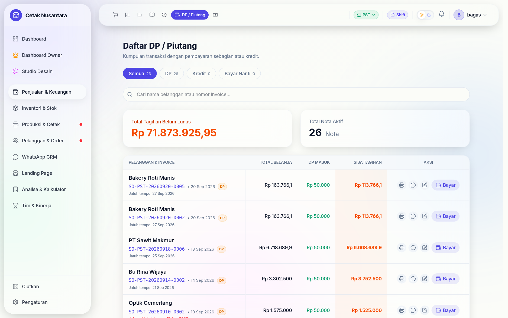

# 💳 DP & Piutang

Halaman **`/transactions/dp`** mengumpulkan semua nota yang **belum lunas** —
baik yang dibayar sebagian (DP) maupun invoice perusahaan yang belum dibayar
sama sekali. Ini daftar tagihan yang harus ditagih, bukan sekadar laporan.

## Bagaimana nota bisa masuk ke sini

| Status nota | Asalnya |
|---|---|
| `PARTIAL` | kasir mengisi **DP** saat membuat nota di [Kasir POS](kasir-pos.md) |
| `PENDING` | nota dibuat dengan **"simpan saja"** — invoice tanpa pembayaran |
| `PAID` | sudah lunas, keluar dari daftar ini |

Jatuh tempo (`dueDate`) yang diisi saat pembuatan nota dipakai untuk menyortir
mana yang paling mendesak.

## Menagih dan melunasi

- **Tambah DP** (`POST /transactions/:id/add-dp`) — pelanggan menambah
  pembayaran tapi belum lunas; sisa piutang berkurang.
- **Lunasi** (`POST /transactions/:id/pay-off`) — sisanya dibayar; status
  menjadi `PAID` dan uangnya masuk ke [Cashflow](cashflow.md) pada tanggal
  pelunasan, bukan tanggal nota.
- **Perbaiki metode bayar** (`PATCH /transactions/:id/payment-method`) — untuk
  kasus salah pilih tunai/transfer, tanpa perlu membatalkan nota.

Karena pelunasan dicatat pada tanggal terjadinya, **uang masuk hari ini dari
nota bulan lalu tetap muncul di shift hari ini** — dan itu memang yang
diinginkan saat menghitung uang fisik di akhir shift.

## Kaitan dengan angka lain

Piutang ikut diperhitungkan sebagai "Cuan" di [Leaderboard](leaderboard.md)
(omzet + piutang), supaya CS yang menutup order besar berjangka tidak terlihat
kalah dari CS yang melayani banyak order kecil tunai.
