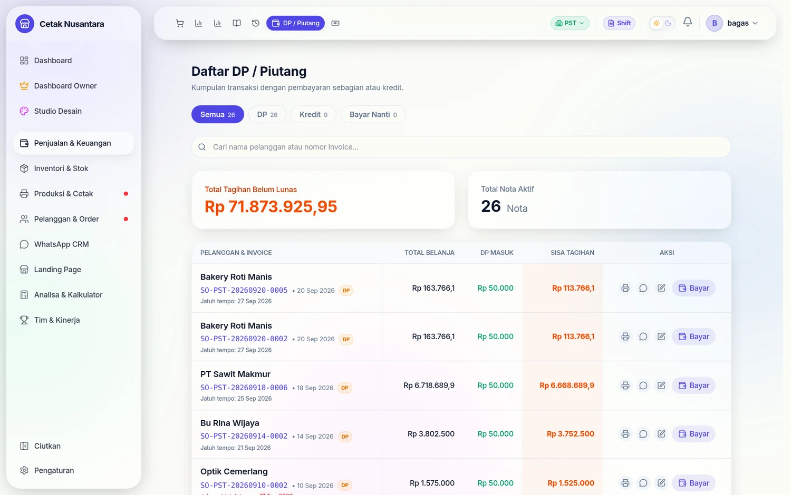
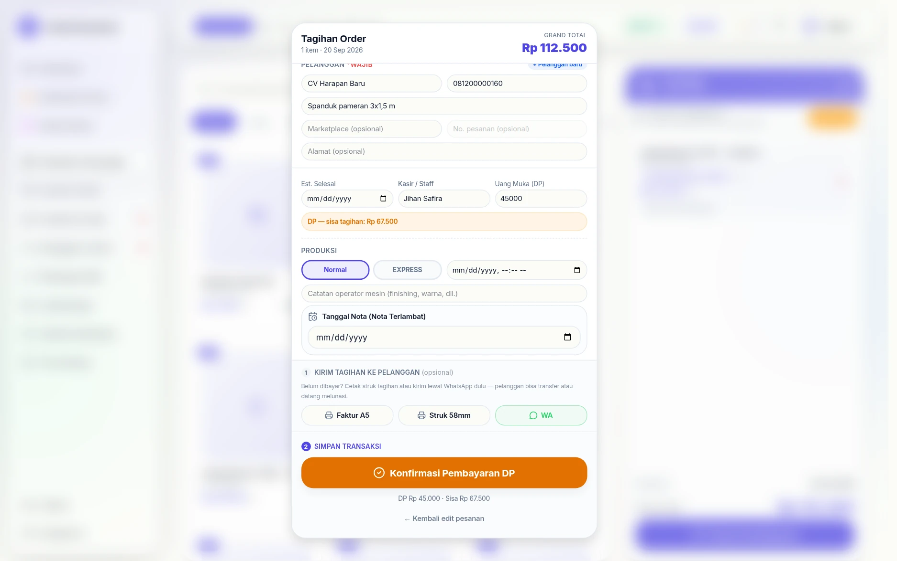
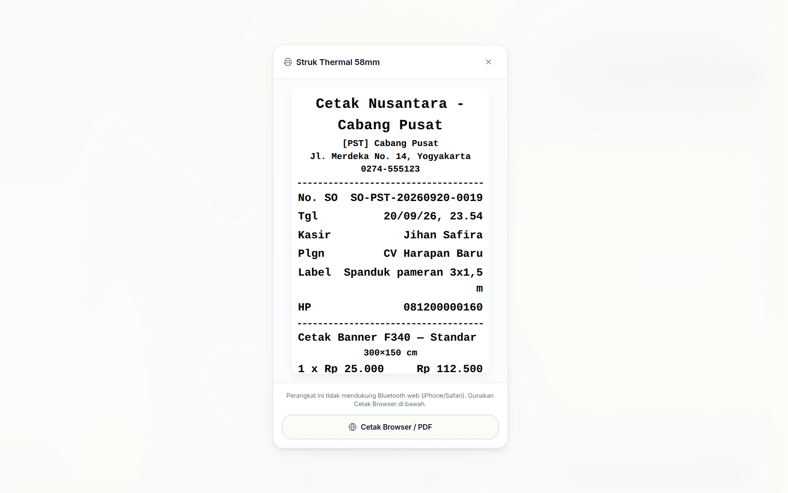
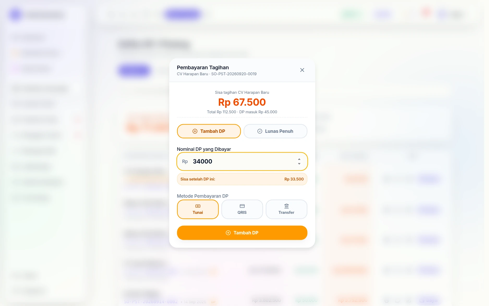
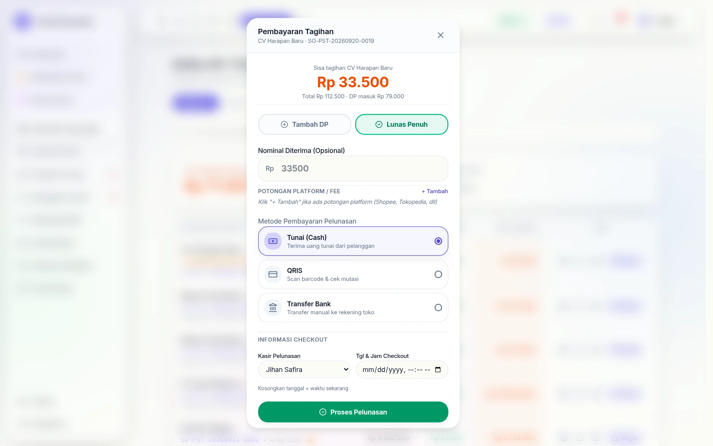
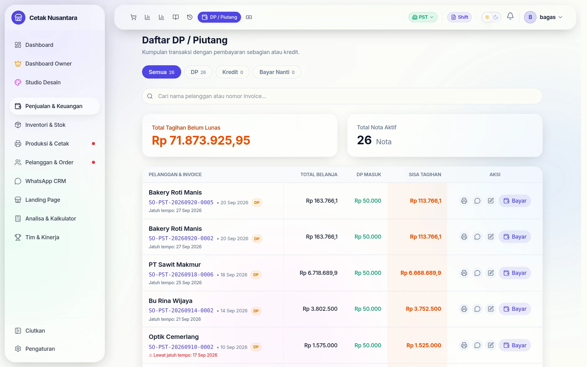
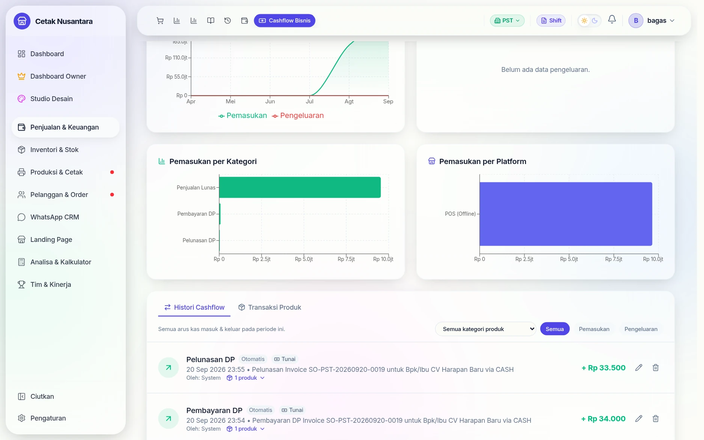

# 💳 DP & Piutang

Halaman **`/transactions/dp`** mengumpulkan semua nota yang **belum lunas** —
baik yang dibayar sebagian (DP) maupun invoice perusahaan yang belum dibayar
sama sekali. Ini daftar tagihan yang harus ditagih, bukan sekadar laporan.

## Bagaimana nota bisa masuk ke sini

| Status nota | Asalnya |
|---|---|
| `PARTIAL` | kasir mengisi **DP** saat membuat nota di [Kasir POS](kasir-pos.md) |
| `PENDING` | nota dibuat dengan **"simpan saja"** — invoice tanpa pembayaran |
| `PAID` | sudah lunas, keluar dari daftar ini |

Jatuh tempo (`dueDate`) yang diisi saat pembuatan nota dipakai untuk menyortir
mana yang paling mendesak.

## Langkah demi langkah

Contoh nyata satu nota dari DP sampai lunas: spanduk 3×1,5 m seharga
**Rp 112.500**, dibayar tiga kali.

### 1. Kasir menerima DP, bukan pelunasan

Di [Kasir POS](kasir-pos.md), kolom **Uang Muka (DP)** diisi sebagian saja.
Begitu nilainya di bawah total, tampilannya langsung berubah: muncul kotak
kuning *"DP — sisa tagihan: Rp 67.500"* dan tombol simpan berganti menjadi
**Konfirmasi Pembayaran DP** berwarna oranye.

Ini pagar yang penting — kasir tidak bisa "tidak sengaja" menyimpan nota DP
sebagai lunas, karena tombolnya sendiri yang berubah.

### 2. Struk tagihan langsung tersedia

Setelah disimpan, struknya langsung muncul untuk dicetak atau dikirim lewat
WhatsApp. Nomor SO di struk inilah rujukan saat pelanggan datang melunasi.

### 3. Nota pindah sendiri ke daftar piutang

Tidak ada langkah "memindahkan" apa pun — nota `PARTIAL` otomatis muncul di
**`/transactions/dp`**. Barisnya menampilkan total belanja, DP masuk, dan sisa
tagihan sekaligus, lengkap dengan label pekerjaannya.

Tab di atas memisahkan jenis utang — **Semua**, **DP** (sudah bayar
sebagian), **Kredit**, dan **Bayar Nanti** (invoice tanpa pembayaran sama
sekali).
Baris yang melewati jatuh tempo diberi peringatan merah.

### 4. Pelanggan menambah cicilan

Tombol **Bayar** membuka dialog yang menyebut sisa tagihan lebih dulu, baru
menawarkan dua pilihan: **Tambah DP** atau **Lunas Penuh**. Saat nominal
diketik, aplikasi menghitung di depan mata — *"Sisa setelah DP ini: Rp
33.500"* — sehingga kasir tahu akibatnya sebelum menekan tombol.

> Kalau nominal yang diketik ternyata ≥ sisa tagihan, aplikasi memberi tahu
> bahwa transaksi akan otomatis **LUNAS**. Tidak perlu membatalkan lalu
> mengulang dengan mode lain.

### 5. Sisa tagihan berkurang, bukan tertimpa

DP masuk menjadi **Rp 79.000** (45.000 + 34.000) dan sisanya **Rp 33.500**.
Angka besar di kartu atas ikut turun tepat sebesar cicilan yang masuk — dari
Rp 71.941.425,95 menjadi Rp 71.907.425,95.

### 6. Pelunasan dicatat atas nama kasir & tanggalnya sendiri

Mode **Lunas Penuh** meminta tiga hal yang sering terlupa di pembukuan manual:

| Kolom | Kenapa ada |
|---|---|
| **Metode pembayaran pelunasan** | boleh berbeda dari DP-nya — DP tunai, pelunasan transfer |
| **Potongan Platform / Fee** | untuk order marketplace, fee dipotong dari uang yang benar-benar diterima |
| **Kasir Pelunasan & Tgl/Jam** | yang menerima uang hari ini, bukan kasir yang dulu membuat nota |

Tanggal boleh dikosongkan; artinya "sekarang".

Setelah lunas, detail nota dan struknya menampilkan **DP** dan **Pelunasan** —
bukan "Sisa". (Sebelum 22 September 2026 nota lunas masih menampilkan "Sisa Rp …"
karena kolom DP hanya menyimpan uang muka sebelum pelunasan.)

### 7. Nota keluar dari daftar tagihan

Setelah pelunasan, notanya hilang dari daftar dan jumlah nota aktif turun dari
27 ke **26**. Total tagihan ikut turun persis sebesar sisa yang dibayar:
Rp 71.907.425,95 → **Rp 71.873.925,95**.

### 8. Uangnya muncul di cashflow pada hari pembayarannya

Satu nota tadi meninggalkan **tiga baris** di [Cashflow](cashflow.md), masing-
masing pada tanggal uangnya benar-benar diterima:

| Kategori | Nominal | Kapan |
|---|---|---|
| Pembayaran DP | Rp 45.000 | saat nota dibuat |
| Pembayaran DP | Rp 34.000 | saat cicilan kedua |
| Pelunasan DP | Rp 33.500 | saat dilunasi |

Jumlahnya pas Rp 112.500. Semua bertanda **Otomatis** — dibuat sistem, bukan
diketik ulang oleh siapa pun, dan tiap barisnya menyebut nomor invoice asalnya.
Inilah alasan uang masuk hari ini dari nota bulan lalu tetap terhitung di
shift hari ini.

## Menagih dan melunasi

- **Tambah DP** (`POST /transactions/:id/add-dp`) — pelanggan menambah
  pembayaran tapi belum lunas; sisa piutang berkurang.
- **Lunasi** (`POST /transactions/:id/pay-off`) — sisanya dibayar; status
  menjadi `PAID` dan uangnya masuk ke [Cashflow](cashflow.md) pada tanggal
  pelunasan, bukan tanggal nota.
- **Perbaiki metode bayar** (`PATCH /transactions/:id/payment-method`) — untuk
  kasus salah pilih tunai/transfer, tanpa perlu membatalkan nota.

Karena pelunasan dicatat pada tanggal terjadinya, **uang masuk hari ini dari
nota bulan lalu tetap muncul di shift hari ini** — dan itu memang yang
diinginkan saat menghitung uang fisik di akhir shift.

## Kaitan dengan angka lain

Piutang ikut diperhitungkan sebagai "Cuan" di [Leaderboard](leaderboard.md)
(omzet + piutang), supaya CS yang menutup order besar berjangka tidak terlihat
kalah dari CS yang melayani banyak order kecil tunai.
