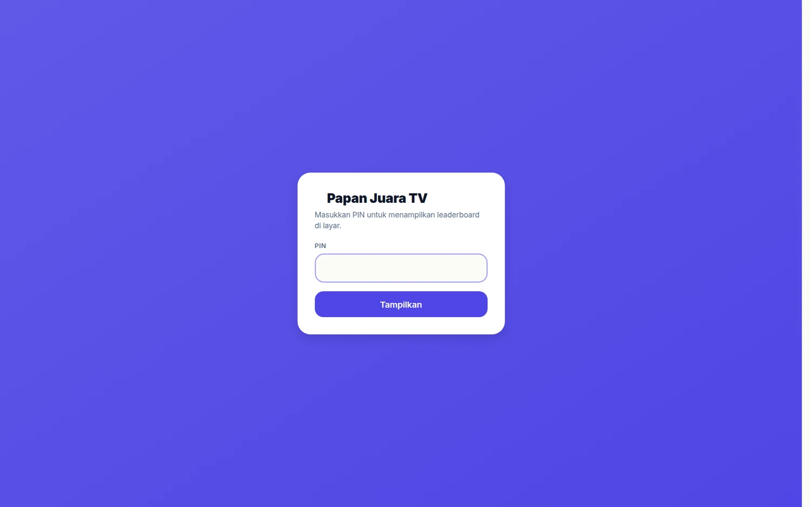
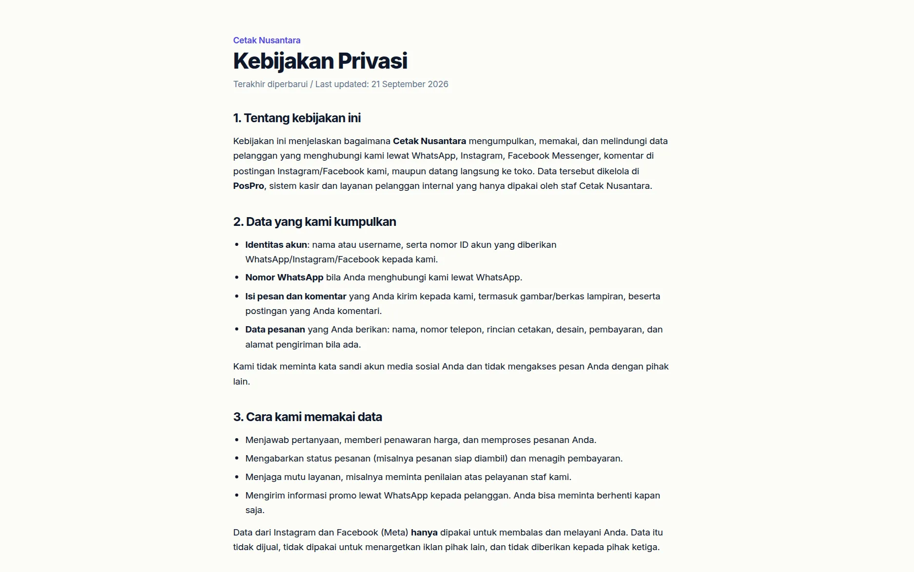
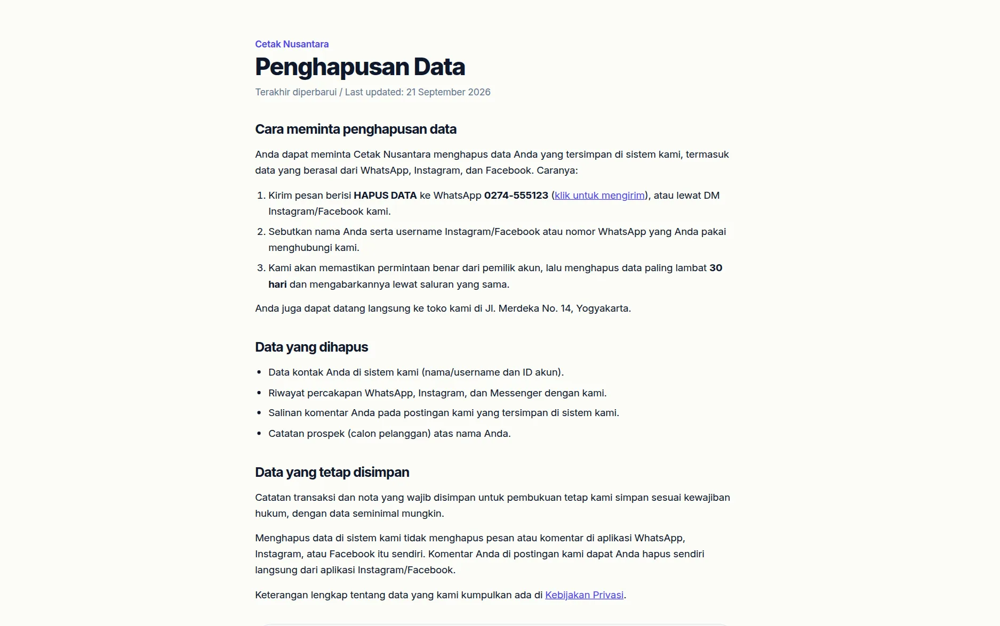
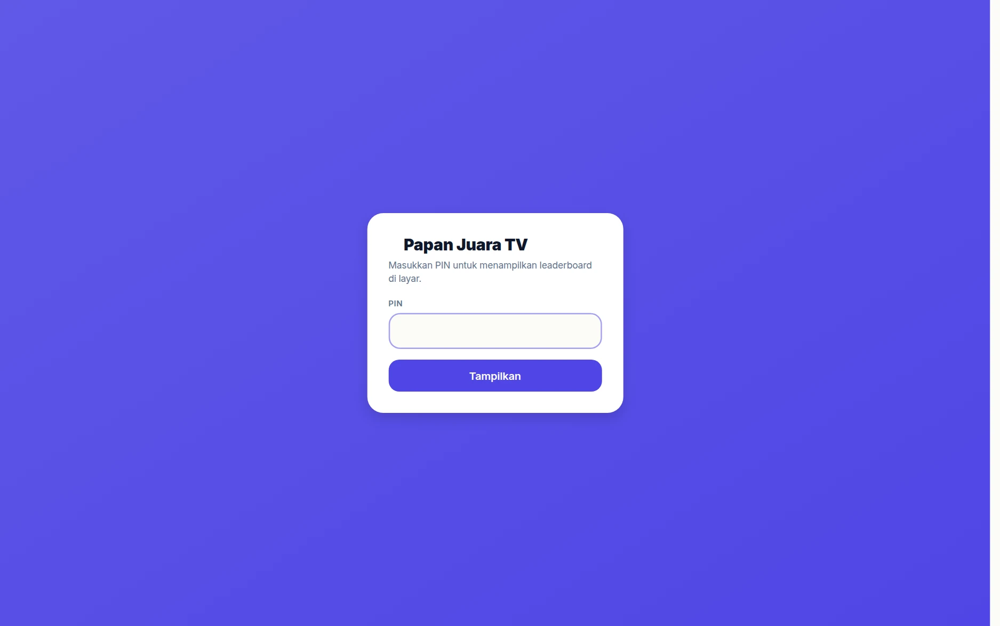
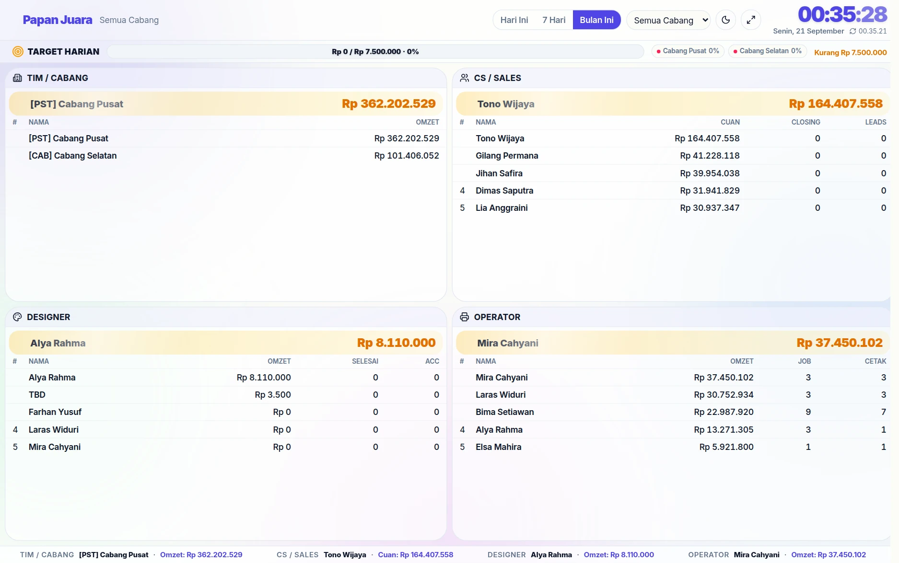

# 🌐 Halaman Publik

Tidak semua halaman PosPro butuh login. Sebagian memang dibuat untuk dibuka
pelanggan atau ditempel sebagai QR — daftarnya di sini supaya jelas apa yang
terlihat dari luar.

| Halaman | Untuk siapa | Cara mengamankannya |
|---|---|---|
| `/landing`, `/landing-page` | calon pelanggan | publik memang; isinya diatur di [Landing Page Builder](landing.md) |
| `/artikel`, `/artikel/[slug]` | calon pelanggan & mesin pencari | publik; isi dari [Artikel/Blog](artikel.md) |
| `/p/[id]` | pelanggan yang dikirimi tautan produk | hanya menampilkan satu produk & harganya |
| `/nilai/[token]` | pelanggan yang diundang menilai | token acak sekali pakai — lihat [Rating CS](rating-cs.md) |
| `/nilai/cabang/[branchId]` | siapa pun (QR di meja kasir) | hanya menerima penilaian |
| `/opname/[token]` | petugas opname di lapangan | token acak; hanya untuk sesi opname itu |
| `/tv/leaderboard` | ditampilkan di TV toko | tanpa login supaya TV tidak perlu sesi; jangan diarahkan ke internet publik |
| `/kebijakan-privasi` | pelanggan & peninjau Meta | publik; isi (nama, alamat, telepon toko) diambil dari Profil Toko — syarat menerbitkan aplikasi Meta |
| `/hapus-data` | pelanggan yang ingin datanya dihapus | publik; tombol WhatsApp berisi "HAPUS DATA" |
| `api…/social/data-deletion` | Meta (callback penghapusan data) | hanya menerima `signed_request` bertanda tangan App Secret; `GET ?kode=` menampilkan status |
| `/login` | semua | halaman masuk |
| `/help` | staf | panduan singkat di dalam aplikasi |

## Kebijakan privasi & penghapusan data

Dua halaman ini wajib ada sebelum aplikasi Meta (Instagram/Messenger) bisa
diterbitkan — URL-nya diisi di **Pengaturan aplikasi → Dasar** (lihat
[Menghubungkan Meta](hubungkan-meta.md#langkah-2-pengaturan-aplikasi-dasar)).
Keduanya tanpa login dan tanpa menu aplikasi, dalam bahasa Indonesia plus ringkasan
bahasa Inggris untuk peninjau Meta.

- Nama toko, alamat, dan nomor telepon/WhatsApp diambil dari **Profil Toko**
  (`GET /settings/public`), jadi tiap bisnis yang memakai PosPro otomatis tampil
  dengan identitasnya sendiri.
- Isinya adalah janji resmi toko — mis. data dihapus **paling lambat 30 hari** dan
  toko mengirim promo lewat WhatsApp. Sesuaikan teksnya di
  `frontend/src/app/kebijakan-privasi/page.tsx` dan `frontend/src/app/hapus-data/page.tsx`
  kalau kebijakan bisnis Anda berbeda.
- Permintaan dari Meta masuk ke `POST /social/data-deletion`: tanda tangan
  diperiksa, permintaan dicatat di `backend/storage/meta-data-deletion.jsonl`,
  dikabarkan ke Discord, lalu Meta menerima kode konfirmasi. ID yang dikirim Meta
  berlingkup aplikasi (tidak sama dengan ID kontak DM/komentar), jadi
  penghapusannya diproses staf.

## Papan TV di toko

**`/tv/leaderboard`** dipasang di layar TV toko. Sebelum tampil, halaman ini
meminta PIN cabang — jadi papan yang memuat angka omzet tidak bisa dibuka
sembarang orang yang menebak alamatnya.

Setelah PIN benar, tampil papan empat kuadran: **Tim/Cabang**, **CS/Sales**,
**Designer**, dan **Operator**, dengan bar **Target Harian** di atas dan jam
besar di kanan. Pilihan periode (Hari Ini / 7 Hari / Bulan Ini) dan pemilih
cabang membuat satu layar bisa dipakai untuk pantauan harian maupun bulanan.

Angkanya sama dengan [Leaderboard](leaderboard.md) di dashboard — bedanya
halaman ini dirancang untuk dibaca dari jauh dan menyegarkan dirinya sendiri.

## Halaman kerja ber-PIN

Bukan publik, tapi juga bukan login biasa:

| Halaman | Dibuka dengan |
|---|---|
| `/so-designer` → `/so-designer/dashboard` | nama + PIN pribadi desainer |
| `/produksi` | nama + PIN pribadi operator |
| `/cetak` | PIN cabang, lalu PIN pribadi saat memilih nama operator |

Alasannya praktis: di ruang produksi, satu perangkat dipakai bergantian
sepanjang hari, dan mengetik email + sandi setiap kali tidak akan dilakukan.
Rinciannya di [Model Akses & Keamanan](keamanan-akses.md).

## Yang sebaiknya tidak dibuka ke internet

`/tv/leaderboard` menampilkan omzet dan nama karyawan. Halaman ini tanpa login
karena TV tidak bisa mengetik sandi — jadi sebaiknya hanya dapat diakses dari
jaringan toko, bukan dari mana saja.
