# 🔌 Menghubungkan WhatsApp, Instagram & Facebook (Meta)

Panduan ini untuk **pemilik atau admin teknis** yang memasang PosPro untuk
bisnisnya dan ingin DM + komentar Instagram, Messenger + komentar Facebook, dan
WhatsApp Cloud API masuk ke PosPro. Ditulis umum — ganti `domain-anda.com` dengan
domain Anda sendiri.

Semua sambungan memakai **satu aplikasi Meta** (dibuat di
[developers.facebook.com](https://developers.facebook.com/apps/)) yang berisi
beberapa *kasus penggunaan*. Tangkapan layar di halaman ini diambil dari
pemasangan sungguhan; nomor ID disamarkan.

> Setelah tersambung, cara memakai inbox-nya ada di
> [📥 Inbox Sosial](inbox-sosial.md) dan [💬 WhatsApp CRM](whatsapp-cloud.md).

## Daftar periksa

| # | Langkah | Untuk | Di mana |
|---|---|---|---|
| 0 | Prasyarat: portofolio bisnis Meta, IG Profesional, Halaman FB, domain HTTPS | semua | Meta Business Suite |
| 1 | Buat aplikasi Meta + tambah kasus penggunaan | semua | App Dashboard |
| 2 | Isi **Pengaturan aplikasi → Dasar** (domain, kebijakan privasi, penghapusan data, ikon, kategori) | syarat terbit | App Dashboard |
| 3 | Simpan rahasia aplikasi di server | semua | terminal server |
| 4 | Instagram: token, webhook, channel di PosPro | DM & komentar IG | App Dashboard + PosPro |
| 5 | Facebook: izin, langganan Halaman, token System User, channel di PosPro | Messenger & komentar FB | App Dashboard + Business Settings + PosPro |
| 6 | **Terbitkan aplikasi** | agar data **pelanggan** terlihat | App Dashboard |
| 7 | (Opsional) Tinjauan aplikasi | webhook komentar IG seketika, jendela balas 7 hari | App Dashboard |

WhatsApp Cloud API punya langkahnya sendiri di [WhatsApp CRM](whatsapp-cloud.md);
langkah 1–3 dan 6 di halaman ini berlaku juga untuknya.

## Langkah 0: Prasyarat

- **Portofolio bisnis Meta** (Business Manager) yang memiliki Halaman Facebook dan
  aplikasi Meta Anda.
- **Akun Instagram Profesional** (Bisnis/Kreator), bukan akun pribadi.
- **Halaman Facebook** bisnis.
- Dua alamat **HTTPS publik**: backend (mis. `https://api.domain-anda.com`) dan
  frontend kasir (mis. `https://kasir.domain-anda.com`). Webhook Meta **wajib**
  mengarah ke backend.
- Akses terminal server untuk menyimpan rahasia (langkah 3).

## Langkah 1: Buat aplikasi Meta & kasus penggunaan

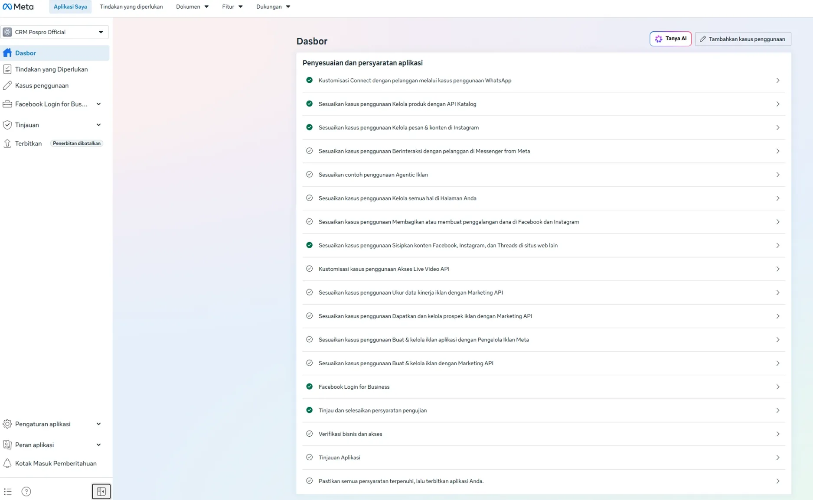

Di [developers.facebook.com/apps](https://developers.facebook.com/apps/) buat
aplikasi bertipe **Bisnis**, hubungkan ke portofolio bisnis Anda, lalu tambahkan
kasus penggunaan yang dibutuhkan:

| Kasus penggunaan | Untuk |
|---|---|
| **Terhubung dengan pelanggan melalui WhatsApp** | WhatsApp Cloud API |
| **Kelola pesan & konten di Instagram** (Instagram API) | DM & komentar Instagram |
| **Berinteraksi dengan pelanggan di Messenger from Meta** | DM Messenger |
| **Kelola segala sesuatu di Halaman Anda** (Kelola Halaman) | komentar Facebook |

Perhatikan menu **Terbitkan** di kiri: selama statusnya belum terbit
(*"Penerbitan dibatalkan"* / *Belum diterbitkan*), Meta **hanya** memberi data dari
akun yang punya peran di aplikasi — komentar dan DM pelanggan tidak akan muncul.
Itu diselesaikan di [langkah 6](#langkah-6-terbitkan-aplikasi).

## Langkah 2: Pengaturan aplikasi (Dasar)

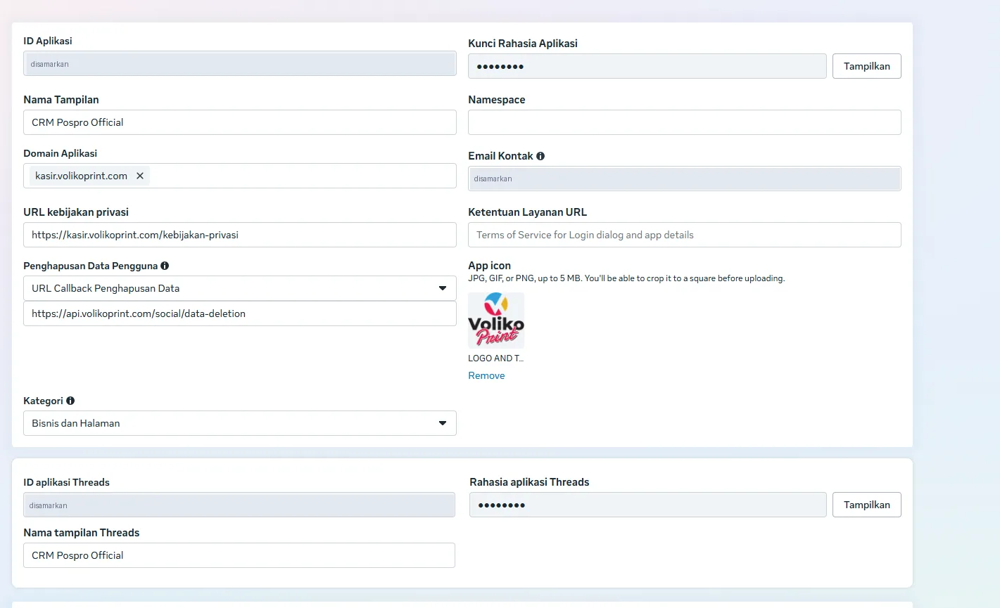

| Isian | Nilai | Catatan |
|---|---|---|
| **Domain Aplikasi** | `kasir.domain-anda.com` | domain saja — **tanpa** `https://` dan garis miring |
| **URL kebijakan privasi** | `https://kasir.domain-anda.com/kebijakan-privasi` | halaman bawaan PosPro, lihat [Halaman Publik](halaman-publik.md) |
| **Penghapusan Data Pengguna** | pilih **URL Callback Penghapusan Data**, isi `https://api.domain-anda.com/social/data-deletion` | Meta menolak opsi *URL petunjuk*; callback ini dijawab backend PosPro |
| **Ikon Aplikasi** | gambar 1024×1024 (logo toko) | wajib untuk terbit |
| **Kategori** | *Bisnis dan Halaman* | |
| **Ketentuan Layanan URL** | kosongkan (atau halaman ketentuan Anda sendiri) | jangan isi `facebook.com` |

Isi halaman kebijakan privasi dan penghapusan data diambil otomatis dari
**Pengaturan → Profil Toko** (nama, alamat, telepon). Pastikan profil toko sudah
benar sebelum mengisi formulir Meta. Baca juga isinya — di sana tertulis janji
resmi toko (mis. menghapus data ≤ 30 hari).

## Langkah 3: Rahasia aplikasi di server

Backend membaca rahasia dari berkas `backend/.env`. Ada **dua rahasia berbeda**:

| Variabel | Diambil dari | Dipakai untuk |
|---|---|---|
| `WA_APP_SECRET` | **Pengaturan aplikasi → Dasar → Kunci Rahasia Aplikasi** | tanda tangan webhook WhatsApp & Facebook, callback penghapusan data |
| `IG_APP_SECRET` | **Instagram API → Penyiapan API dengan login Instagram → Rahasia aplikasi Instagram** | tanda tangan webhook **Instagram** |
| `WA_VERIFY_TOKEN` (atau `META_VERIFY_TOKEN`) | kata acak buatan Anda | diisi juga di kolom *Verify token* saat memasang webhook |

> ⚠️ Rahasia Instagram **berbeda** dari Kunci Rahasia Aplikasi. Kalau hanya
> `WA_APP_SECRET` yang terisi, semua webhook Instagram ditolak (log:
> `Webhook social masuk: object=instagram … sig=false`).

Simpan tanpa menampilkan isinya di layar (jangan menempelnya di chat):

```bash
read -rsp "Instagram App Secret: " S && echo && if [ ${#S} -eq 32 ]; then sed -i '/^IG_APP_SECRET=/d' backend/.env && printf 'IG_APP_SECRET=%s\n' "$S" >> backend/.env && echo "tersimpan (${#S} karakter)"; else echo "BELUM tersimpan: ${#S} karakter"; fi; unset S
```

Jalankan dari folder PosPro, lalu **restart backend** supaya terbaca.

## Langkah 4: Instagram

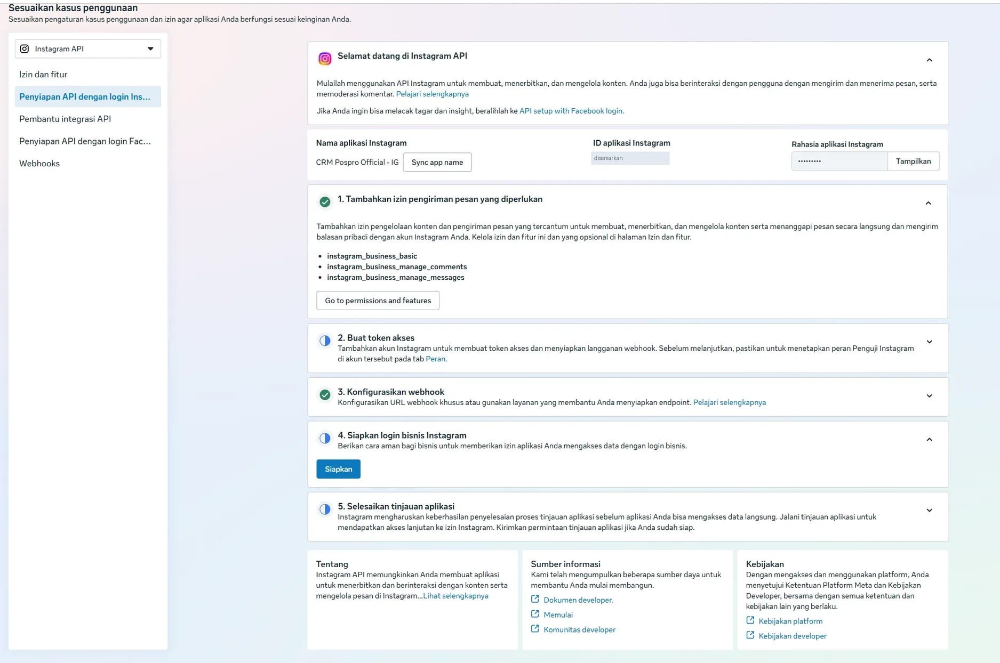

Di **Kasus penggunaan → Instagram API → Sesuaikan → Penyiapan API dengan login
Instagram**:

1. **Izin**: `instagram_business_basic`, `instagram_business_manage_messages`,
   `instagram_business_manage_comments`.
2. **Buat token akses**: tambahkan akun Instagram bisnis Anda, klik **Buat token**,
   setujui semua izin. Token berawalan `IGAA…`. Catat juga **IG User ID** (angka 17
   digit di bawah nama akun).
3. **Konfigurasikan webhook**: URL `https://api.domain-anda.com/social/webhook`,
   verify token = `WA_VERIFY_TOKEN`, langganankan field **`messages`** dan
   **`comments`**.
4. **Rahasia aplikasi Instagram** → simpan sebagai `IG_APP_SECRET` (langkah 3).

Di aplikasi Instagram (login sebagai akun bisnis): **Pengaturan → Pesan dan balasan
cerita → Kontrol pesan → Alat yang terhubung → Izinkan akses ke pesan = ON**. Tanpa
ini Meta tidak memberi DM sama sekali.

Lalu di PosPro **Inbox Sosial → ⚙**:

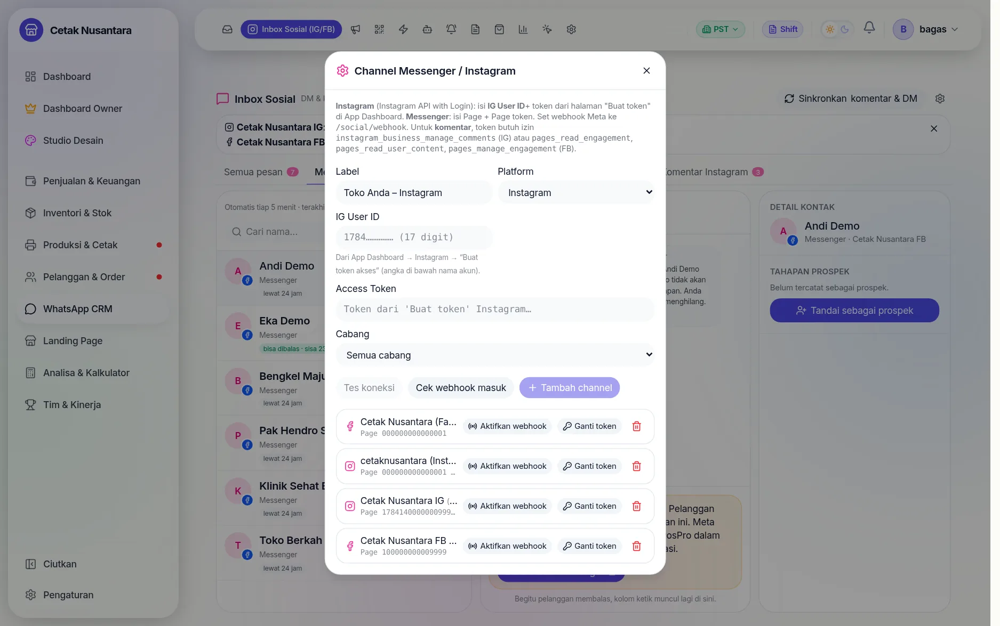

1. **Platform: Instagram**, isi Label, **IG User ID**, dan **Access Token** (`IGAA…`).
2. **Cabang**: *Semua cabang* atau cabang tertentu (menentukan CS mana yang melihat).
3. **Tes koneksi** → harus muncul *"✓ Koneksi OK — akun: …"* → **Tambah channel**.
4. Di baris channel baru: **Aktifkan webhook** (mendaftarkan akun ke webhook
   aplikasi — `comments` & `messages`).
5. Tutup jendela → **Sinkronkan** untuk menarik komentar & DM yang sudah ada.

## Langkah 5: Facebook (Messenger & komentar)

### 5a. Izin

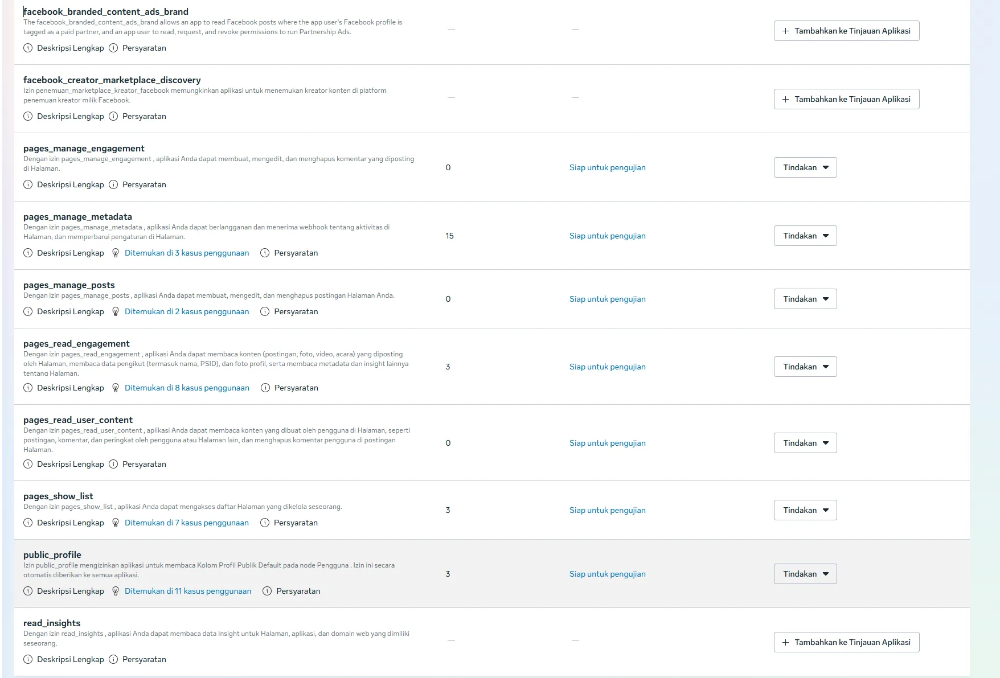

| Kasus penggunaan | Izin yang dibutuhkan |
|---|---|
| Kelola Halaman | `pages_show_list`, `pages_read_engagement`, `pages_read_user_content`, `pages_manage_engagement`, `pages_manage_metadata` |
| Messenger from Meta | `pages_messaging` |

Semuanya harus berstatus **Siap untuk pengujian**; yang bertanda **—** diaktifkan
dengan **Tambahkan ke Tinjauan Aplikasi**.

### 5b. Webhook Halaman

Menu **Webhooks** → pilih objek **Page** (bukan *Catalog*/*Instagram*/*WhatsApp*) →
URL `https://api.domain-anda.com/social/webhook` + verify token → **Verifikasi dan
simpan** → langganankan field **`feed`** (komentar) dan **`messages`** (DM).

Lalu di kasus penggunaan **Messenger from Meta → Pengaturan API Messenger → Buat
token akses**, klik **Tambahkan Langganan** di baris Halaman Anda:

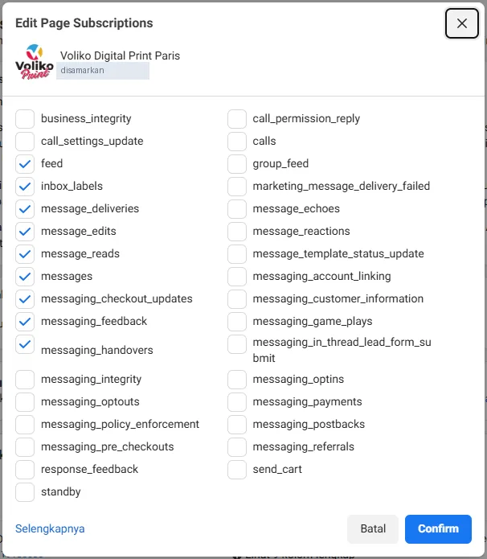

Cukup **`feed`** dan **`messages`**; field lain (dibaca, terkirim, reaksi, …) tidak
dipakai PosPro dan hanya menambah kiriman.

### 5c. Token Halaman lewat System User

> ⚠️ **Jangan** memakai tombol **Buat** di kolom *Token* pada halaman Messenger
> itu. Token dari sana hanya berizin Messenger — DM jalan, tapi komentar ditolak
> (`requires the 'pages_read_engagement' permission`) dan tombol *Aktifkan webhook*
> gagal (`pages_manage_metadata`).

Yang benar: token **System User** dari Business Settings — izinnya bisa dipilih
lengkap dan **tidak kedaluwarsa**.

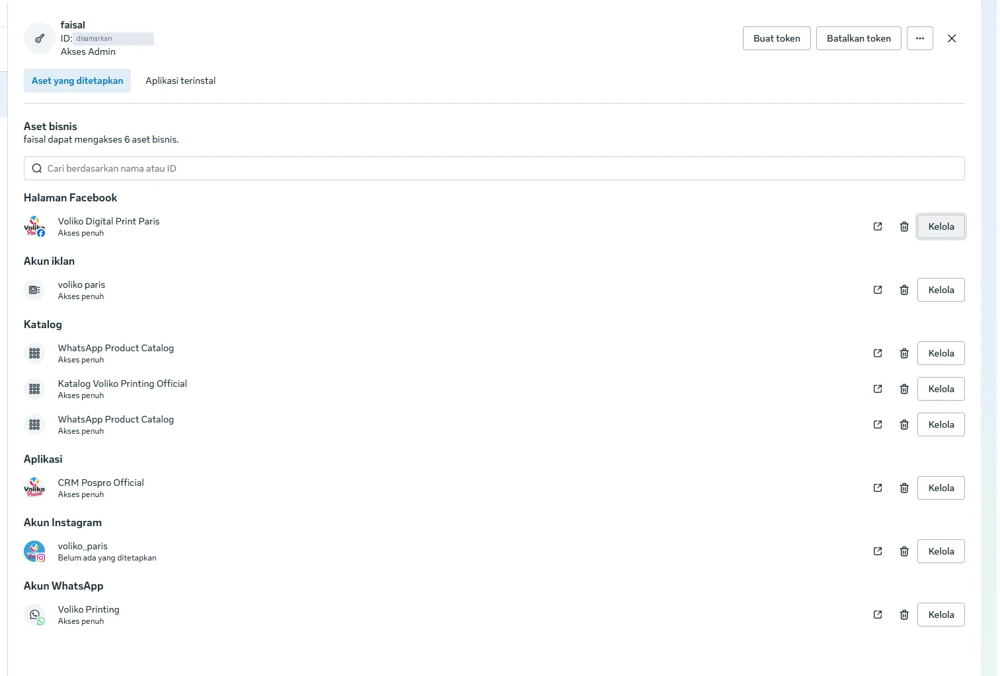

1. [business.facebook.com/settings](https://business.facebook.com/settings) →
   **Pengguna → Pengguna sistem** → pilih system user (atau **Tambahkan**, peran
   Admin).
2. **⋯ → Tetapkan aset → Halaman Facebook** → pilih Halaman → **Kontrol penuh**.
   Pastikan aplikasi Anda juga ada di daftar aset.
3. **Buat token** → aplikasi Anda → kedaluwarsa **Tidak pernah** → centang
   `pages_show_list`, `pages_messaging`, `pages_manage_metadata`,
   `pages_read_engagement`, `pages_read_user_content`, `pages_manage_engagement` →
   salin tokennya.

> ⚠️ Jangan tekan **Batalkan token** di halaman system user — itu mencabut **semua**
> token milik system user tersebut, termasuk token WhatsApp kalau memakai system
> user yang sama.

Kalau Halaman tidak muncul di *Tetapkan aset*, Halaman itu belum ada di portofolio
bisnis ini. Tambahkan lewat **Akun → Halaman → + Tambahkan**:

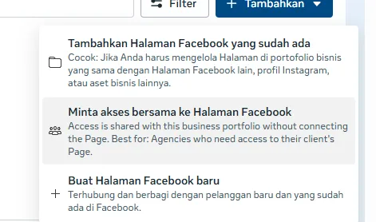

- **Tambahkan Halaman yang sudah ada** — kalau Halaman belum dimiliki portofolio lain.
- **Minta akses bersama** — kalau Halaman **milik portofolio bisnis lain**. Kepemilikan
  tetap di sana; Anda hanya mendapat akses.

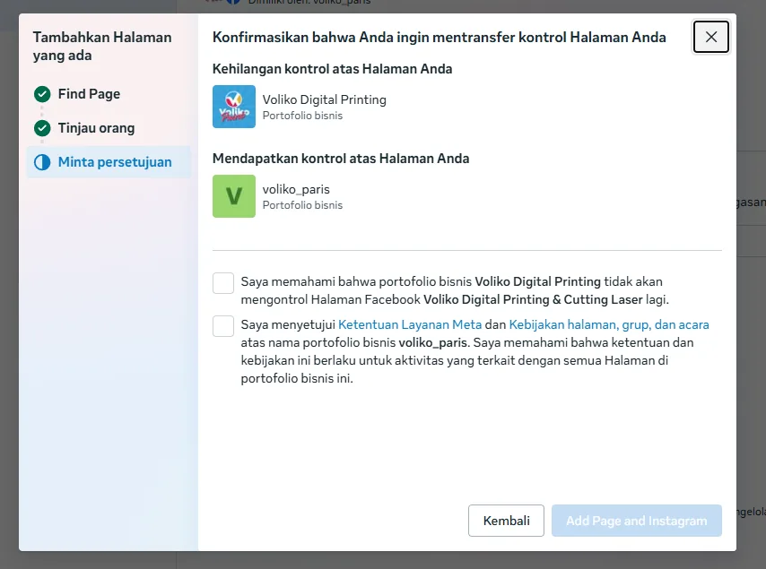

Kalau muncul layar **"Konfirmasikan bahwa Anda ingin mentransfer kontrol Halaman"**,
itu **memindahkan kepemilikan** (beserta akun Instagram yang terhubung) dari
portofolio lama. Iklan, pixel, dan akses orang di portofolio lama bisa terganggu.
Untuk PosPro cukup **akses bersama** — batalkan kecuali Anda memang sengaja
memindahkan kepemilikan.

### 5d. Channel di PosPro

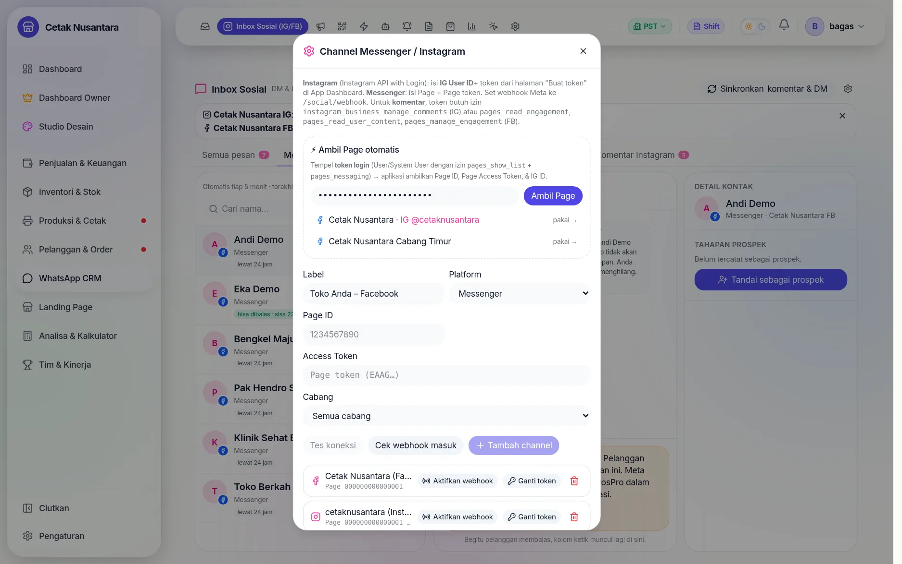

1. **Inbox Sosial → ⚙ → Platform: Messenger**.
2. Tempel token System User di kotak **⚡ Ambil Page otomatis** → **Ambil Page** →
   klik **pakai →** di Halaman Anda (Page ID & token Halaman terisi otomatis).
3. Label, cabang → **Tes koneksi** → **Tambah channel** → **Aktifkan webhook** →
   **Sinkronkan**.

Setiap Halaman = satu channel. Token System User yang sama bisa dipakai lagi untuk
Halaman lain setelah Halaman itu ditetapkan ke system user.

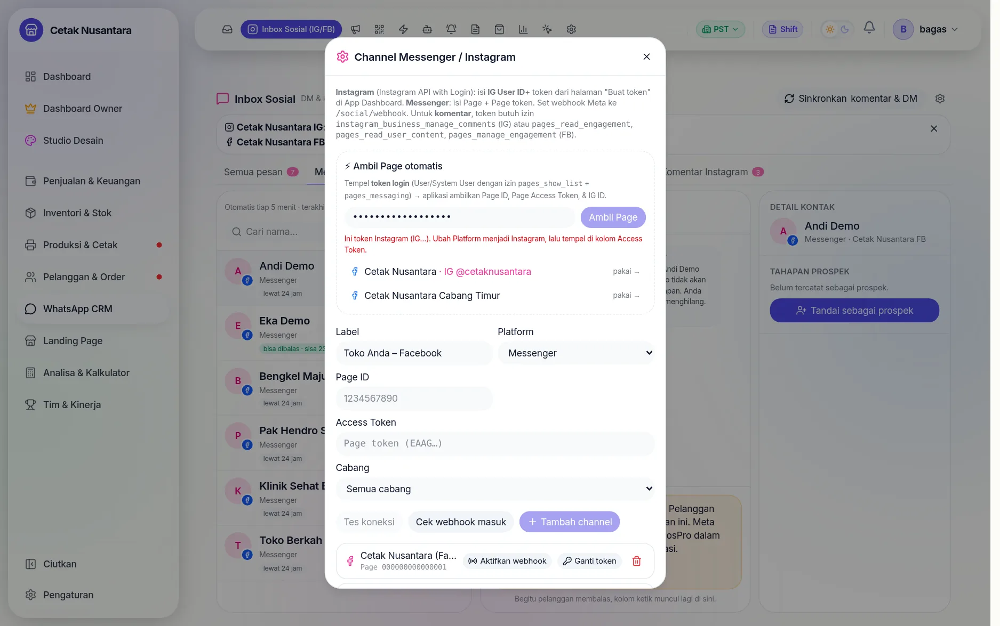

PosPro memperingatkan kalau token salah tempat: token `IG…` di kotak Facebook, atau
token `EAA…` untuk channel Instagram.

### Mengganti token

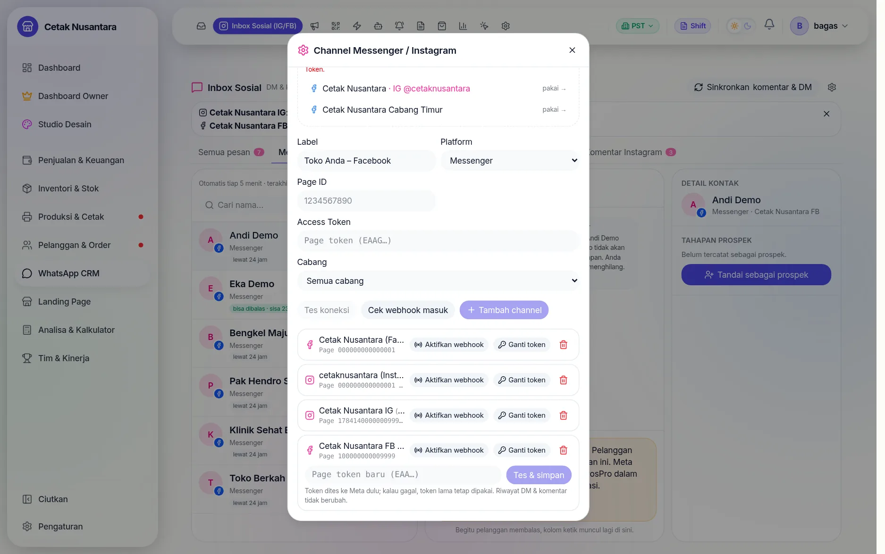

Token Instagram berlaku ±60 hari. Saat kedaluwarsa, klik **Ganti token** di baris
channel — token baru **dites ke Meta dulu**; kalau gagal, token lama tetap dipakai.
**Jangan menghapus channel** untuk mengganti token: menghapus channel ikut
menghapus seluruh riwayat DM dan komentarnya.

## Langkah 6: Terbitkan aplikasi

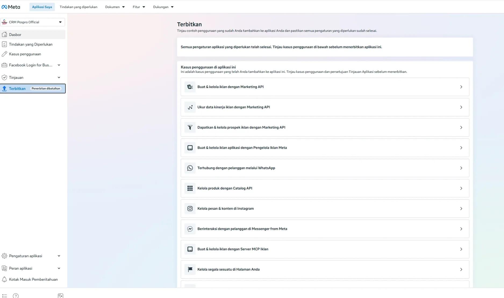

Menu **Terbitkan** menampilkan syarat yang tersisa. Setelah langkah 2 lengkap
tertulis *"Semua pengaturan aplikasi yang diperlukan telah selesai"* → gulir ke
bawah → **Terbitkan**.

Ini langkah yang paling sering terlewat: **sebelum terbit, komentar dan DM dari
pelanggan tidak terlihat sama sekali** (API mengembalikan 0 walau di Instagram ada
puluhan komentar), karena Meta hanya membuka data akun yang punya peran di
aplikasi. Menerbitkan tidak mengganggu WhatsApp yang sudah berjalan di aplikasi
yang sama.

Sesudah terbit, cek di PosPro: **Sinkronkan** → komentar & percakapan mulai masuk.

## Langkah 7 (opsional): Tinjauan aplikasi

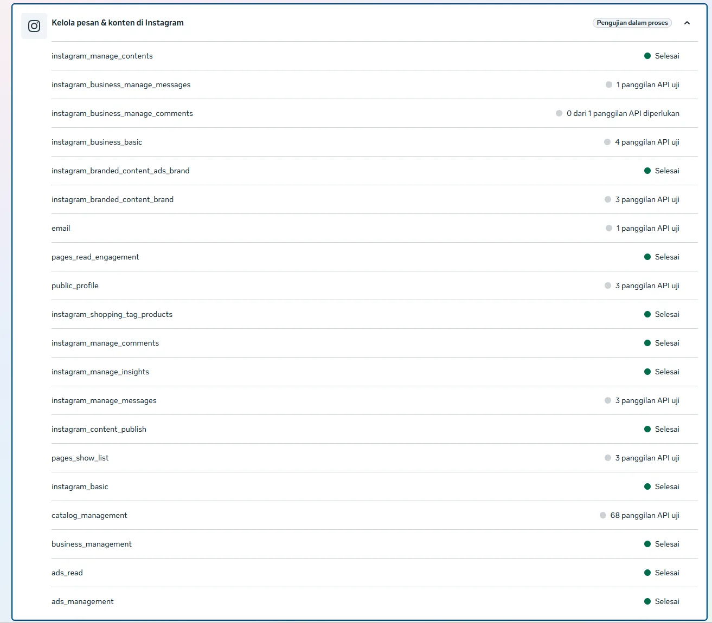

Dengan akses dasar (*Standard Access*) + aplikasi terbit, PosPro sudah bisa membaca
dan membalas DM & komentar akun bisnis Anda sendiri. Tinjauan aplikasi
(*Advanced Access*) diperlukan untuk:

| Kebutuhan | Kenapa |
|---|---|
| Webhook **komentar Instagram** seketika | Meta mensyaratkan Advanced Access untuk field `comments`; tanpanya komentar tetap masuk lewat sinkron 5 menit |
| Membalas DM sampai **7 hari** (fitur *Human Agent*) | tanpa fitur ini batasnya 24 jam |
| Melayani akun milik **bisnis lain** | lihat bagian penyedia layanan di bawah |

Syarat pengajuan: setiap izin minimal **1 panggilan API sukses** (layar di atas —
sinkron otomatis PosPro memenuhinya; Meta memperbarui angkanya dengan jeda sampai
±24 jam), video rekaman layar pemakaian, dan penjelasan penggunaan tiap izin.

Contoh penjelasan (bahasa Inggris, sesuaikan nama bisnis):

> **instagram_business_manage_comments** — PosPro is the internal point-of-sale
> and CRM system of *[business name]*. Our customer-service staff use PosPro's
> Social Inbox to read and answer comments on our own Instagram professional
> account: list new comments, reply publicly, hide spam, and send one private
> reply to a commenter asking for a quote. We only access comments on our own
> account's media and use them solely to answer customers.

> **instagram_business_manage_messages** — Our staff answer direct messages sent
> to our Instagram account from PosPro's Social Inbox, next to WhatsApp and
> Messenger. We receive messages via webhooks, show the conversation, and reply
> within the messaging window. Messages are used only to answer customer questions
> about orders and prices.

Urutan adegan video: login PosPro → Inbox Sosial → ⚙ perlihatkan akun terhubung
& *Tes koneksi* → akun penguji berkomentar → komentar muncul → balas publik (tampil
di Instagram) → sembunyikan → balas via DM (diterima akun penguji) → DM dari
penguji muncul di tab Instagram & dibalas. Rekam juga proses *Buat token* di awal.

## Pemecahan masalah

| Gejala | Penyebab | Solusi |
|---|---|---|
| Log `Webhook social masuk: object=instagram … sig=false` | `IG_APP_SECRET` kosong/salah | [langkah 3](#langkah-3-rahasia-aplikasi-di-server), restart backend |
| Komentar/DM **0** padahal di Instagram ada | aplikasi **belum diterbitkan** | [langkah 6](#langkah-6-terbitkan-aplikasi) |
| DM Instagram 0 percakapan | *Izinkan akses ke pesan* OFF di aplikasi Instagram | nyalakan (langkah 4) |
| Komentar dari akun pribadi tetap tak terbaca sebelum terbit | akun itu belum jadi **Penguji Instagram** | Peran aplikasi → Penguji Instagram, terima undangan di instagram.com/accounts/manage_access |
| `Invalid OAuth access token - Cannot parse access token` | token Instagram ditempel di kotak Facebook (*Ambil Page*), atau token berisi spasi | pilih Platform **Instagram**, tempel di kolom *Access Token* |
| `Tried accessing nonexisting field (accounts)` | token **Halaman** ditempel di *Ambil Page otomatis* | pakai token **System User** (5c) |
| `requires the 'pages_read_engagement' permission` | token dari tombol **Buat** di menu Messenger | token System User (5c) → **Ganti token** |
| `To subscribe to the feed field … pages_manage_metadata` | sama seperti di atas | sama |
| `Pesan ini dikirim di luar jendela yang diizinkan` | lewat 24 jam dari pesan terakhir pelanggan | balas dari aplikasi; lihat [jendela 24 jam](inbox-sosial.md#jendela-balas-24-jam) |
| `Data deletion instructions URL should represent a valid URL` | opsi *URL petunjuk* ditolak | pilih **URL Callback** + `…/social/data-deletion`, domain aplikasi tanpa `https://` |
| Halaman tidak ada di *Tetapkan aset* | Halaman milik portofolio lain | **Minta akses bersama** (5c) |
| Obrolan *"Facebook membuat obrolan ini…"* | fitur Facebook untuk membalas komentar secara pribadi | normal — tampil sebagai catatan sistem |
| Template WhatsApp ikon jam / *Gagal terkirim (kode 131042)* | masalah metode pembayaran akun WhatsApp Business | bereskan pembayaran di WhatsApp Manager — lihat [WhatsApp CRM](whatsapp-cloud.md#pesan-gagal-terkirim-dan-alasannya) |

Alat bantu di PosPro: **Inbox Sosial → ⚙ → Cek webhook masuk** menampilkan
kiriman webhook terakhir (objek, field, lolos tanda tangan atau tidak). Di log
backend setiap kiriman tercatat sebagai
`Webhook social masuk: object=… entries=… fields=… sig=… (IG_APP_SECRET|WA_APP_SECRET)`.

## Untuk pengelola server

| Hal | Nilai |
|---|---|
| Webhook Meta (IG, FB) | `POST/GET https://api.domain-anda.com/social/webhook` |
| Callback penghapusan data | `POST https://api.domain-anda.com/social/data-deletion` (status: `GET …?kode=`) — permintaan dicatat di `backend/storage/meta-data-deletion.jsonl` dan dikabarkan ke Discord |
| Halaman publik | `/kebijakan-privasi`, `/hapus-data` di domain kasir |
| Sinkron otomatis | cron `social-comments-auto-sync`, tiap 5 menit (detik :30). Matikan dengan `SOCIAL_AUTO_SYNC=false` |
| Variabel | `WA_APP_SECRET`, `IG_APP_SECRET`, `WA_VERIFY_TOKEN`/`META_VERIFY_TOKEN`, `WA_GRAPH_VERSION`, `PUBLIC_BASE_URL` — lihat [Env & Pekerjaan Terjadwal](referensi-env-cron.md) |
| Tabel | `social_channels` (token per channel), `social_posts`, `social_comments`, `social_contacts`, `social_conversations`, `social_messages` |

Token disimpan per channel di basis data, jadi **satu instalasi PosPro bisa punya
banyak akun Instagram dan Halaman** (mis. per cabang) — masing-masing satu channel.

## Jika PosPro dijadikan layanan untuk banyak bisnis

Saat ini setiap instalasi PosPro memakai **aplikasi Meta milik bisnis itu sendiri**
(seperti panduan di atas). Kalau PosPro kelak ditawarkan sebagai layanan — satu
penyedia mendaftarkan WhatsApp API, DM, dan komentar untuk banyak bisnis seperti
penyedia inbox *omnichannel* — modelnya berubah:

| Aspek | Sekarang (1 bisnis) | Sebagai penyedia layanan |
|---|---|---|
| Aplikasi Meta | milik tiap bisnis | **satu** milik penyedia |
| Verifikasi | verifikasi bisnis biasa | **Verifikasi akses** sebagai *Tech Provider* + verifikasi bisnis penyedia |
| Tingkat akses | Standard Access cukup | **Advanced Access** untuk semua izin (lolos tinjauan) |
| Menghubungkan akun | admin menempel token manual | pelanggan menekan **"Hubungkan"**: *Embedded Signup* untuk WhatsApp, *Business Login* untuk Instagram/Facebook |
| Token & rahasia | di `.env` + tabel channel | per bisnis (tenant), terenkripsi |
| Biaya WhatsApp | ditagih ke akun bisnis sendiri | pengaturan penagihan per bisnis |

Yang **sudah** mendukung arah ini: token per channel, perutean webhook berdasarkan
ID akun/Halaman, pembatasan per cabang, callback penghapusan data, dan halaman
kebijakan yang mengambil identitas dari profil toko. Yang **belum** dibuat: alur
"Hubungkan akun" (OAuth/Embedded Signup), pemisahan data antar bisnis, penyimpanan
rahasia per bisnis, dan pengajuan Tech Provider. Rencanakan itu sebagai proyek
tersendiri sebelum membuka pendaftaran untuk bisnis lain.
