# 📥 Inbox Sosial — DM & Komentar Instagram / Facebook

Banyak pertanyaan pelanggan tidak datang lewat WhatsApp, tapi lewat **DM Instagram,
Messenger, dan komentar di postingan**. Kalau admin harus membuka aplikasi
Instagram dan Facebook satu per satu, pertanyaan itu mudah terlewat.

Halaman **`/crm/social`** mengumpulkan semuanya di satu tempat, mirip kotak masuk
Meta Business Suite, tapi terhubung langsung ke CRM PosPro:

- balas DM dan komentar tanpa membuka aplikasi Meta,
- balas komentar **secara publik** atau **lewat DM**,
- sembunyikan komentar spam,
- jadikan penanya sebagai **prospek** di CRM dengan satu klik.

> Belum menghubungkan akun? Ikuti dulu
> [🔌 Menghubungkan WhatsApp, Instagram & Facebook](hubungkan-meta.md).

## Siapa yang bisa memakai

| Peran | Bisa |
|---|---|
| Owner, Super Admin, Admin | semua channel, pengaturan channel, sinkron |
| CS, Marketing | channel milik cabangnya **dan** channel "Semua cabang"; membalas, menyembunyikan, membuat prospek, sinkron |
| Peran lain (Kasir, Operator, …) | tidak bisa membuka halaman ini |

Pembatasan cabang diatur per channel: channel bercabang hanya terlihat oleh CS
cabang itu, channel **Semua cabang** terlihat oleh semua CS.

## Tampilan

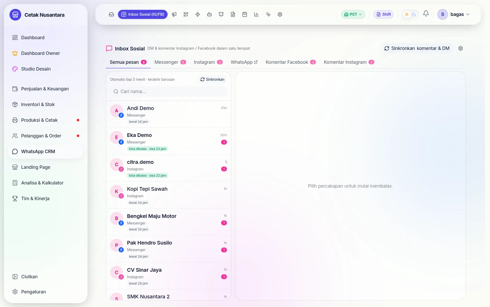

| Tab | Isi |
|---|---|
| **Semua pesan** | DM Messenger + Instagram jadi satu |
| **Messenger** | DM Halaman Facebook |
| **Instagram** | DM Instagram |
| **WhatsApp ↗** | pindah ke [inbox WhatsApp](whatsapp-cloud.md) |
| **Komentar Facebook** | komentar di postingan Halaman |
| **Komentar Instagram** | komentar di postingan Instagram |

Angka merah muda di tiap tab = percakapan atau utas komentar yang **belum dibaca**.
Tombol **Sinkronkan komentar & DM** di kanan atas menarik data terbaru dari Meta,
dan ikon ⚙ membuka [pengaturan channel](hubungkan-meta.md#langkah-4-instagram).

## Komentar

### 1. Daftar komentar

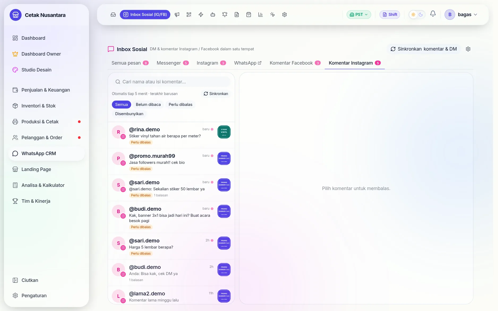

Satu baris = satu **utas** (komentar teratas beserta balasannya). Yang terlihat:

- **Titik merah muda** di kanan nama → belum dibaca.
- **Perlu dibalas** (kuning) → komentar terakhir di utas itu datang dari pelanggan.
- **Prospek** (hijau) → penulisnya sudah dicatat di CRM.
- **Disembunyikan** → komentar disembunyikan dari publik.
- Gambar kecil di kanan = postingan yang dikomentari.

Saring dengan **Semua · Belum dibaca · Perlu dibalas · Disembunyikan**, atau cari
nama/isi komentar. Keterangan **"Otomatis tiap 5 menit · terakhir …"** menunjukkan
kapan data terakhir ditarik dari Meta.

### 2. Membuka utas

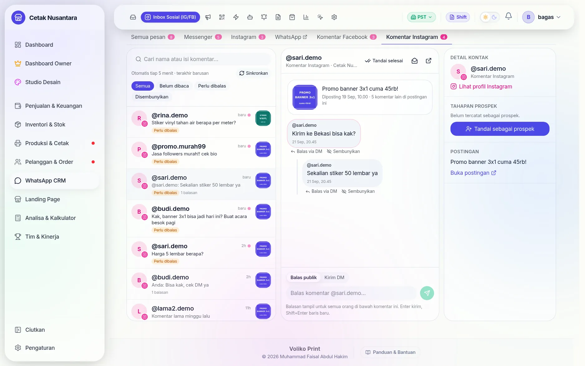

- **Kartu postingan** di atas: gambar, keterangan, tanggal, dan berapa komentar lain
  di postingan yang sama.
- **Komentar pelanggan** berbingkai merah muda (komentar teratas) dan balasannya
  menjorok ke dalam.
- Di bawah tiap komentar pelanggan: **Balas via DM** dan **Sembunyikan**.
- **Panel kanan**: nama & tautan **Lihat profil Instagram**, **Tahapan prospek**,
  dan **Buka postingan** (membuka postingan asli di Instagram/Facebook).
- Tombol di kepala utas: **Tandai selesai** (tidak perlu dibalas, mis. komentar
  berisi emoji saja), ✉ **tandai belum dibaca**, ↗ **buka postingan**.

Membuka utas otomatis menandainya **sudah dibaca**.

### 3. Balas publik atau lewat DM

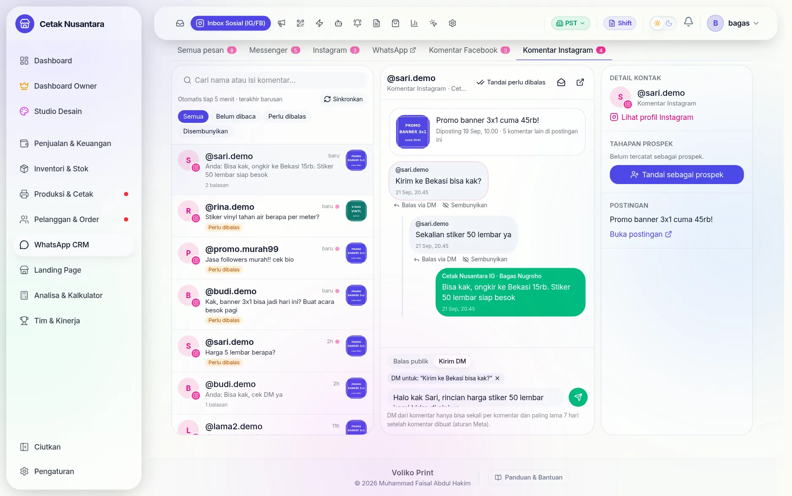

| Mode | Muncul di | Cocok untuk |
|---|---|---|
| **Balas publik** | di bawah komentar, terlihat semua orang | jawaban singkat yang berguna juga untuk orang lain ("Bisa kak, ongkir 15rb") |
| **Kirim DM** | kotak masuk pribadi pelanggan | harga detail, nomor rekening, data pribadi |

Klik **Balas via DM** di bawah komentar tertentu untuk mengarahkan DM ke komentar
itu (muncul chip **"DM untuk: …"**). Tanpa memilih, DM diarahkan ke komentar
pelanggan terbaru di utas.

> **Aturan Meta untuk DM dari komentar:** hanya **sekali per komentar** dan
> paling lama **7 hari** setelah komentar dibuat. Komentar yang sudah di-DM diberi
> tanda **"sudah dibalas via DM"**.

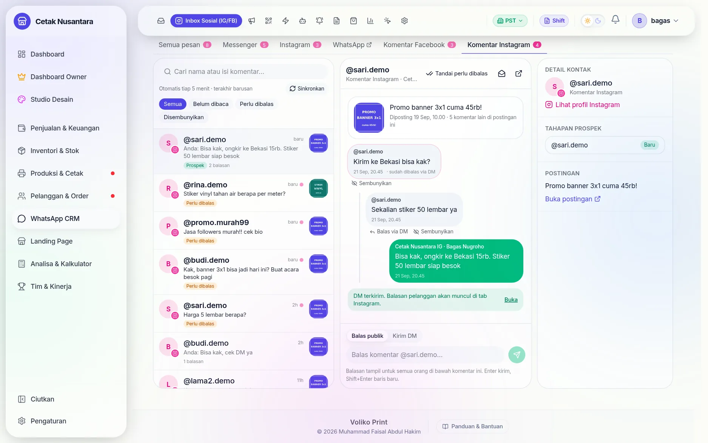

Setelah DM terkirim, percakapannya **ikut tercatat di tab Instagram/Messenger**,
jadi saat pelanggan membalas DM itu, obrolannya menyambung di sana. Tautan
**Buka** di kabar hijau langsung memindahkan ke tab tersebut.

### 4. Jadikan prospek

Klik **Tandai sebagai prospek** di panel kanan. PosPro membuat lead di
[CRM](crm.md) dengan:

- nama = username Instagram (`@nama`) atau nama Facebook,
- sumber = **Instagram** / **Facebook**, keterangan "Komentar Instagram",
- kebutuhan = isi komentarnya + tautan postingan,
- ditangani oleh = akun yang mengklik.

Panel lalu menampilkan nama prospek dan tahapnya (Baru, Follow Up, Negosiasi, …);
klik untuk membuka detail prospek. Tombol yang sama ada di panel DM.

### 5. Sembunyikan komentar spam

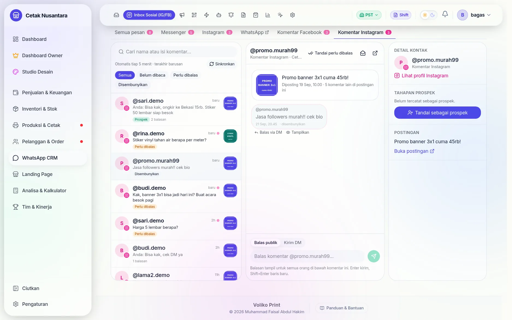

**Sembunyikan** menyembunyikan komentar dari publik di Instagram/Facebook
(penulisnya sendiri tidak diberi tahu dan masih bisa melihatnya). Komentar tidak
dihapus; klik **Tampilkan** untuk mengembalikan. Komentar yang disembunyikan keluar
dari daftar **Perlu dibalas**.

### 6. Komentar Facebook

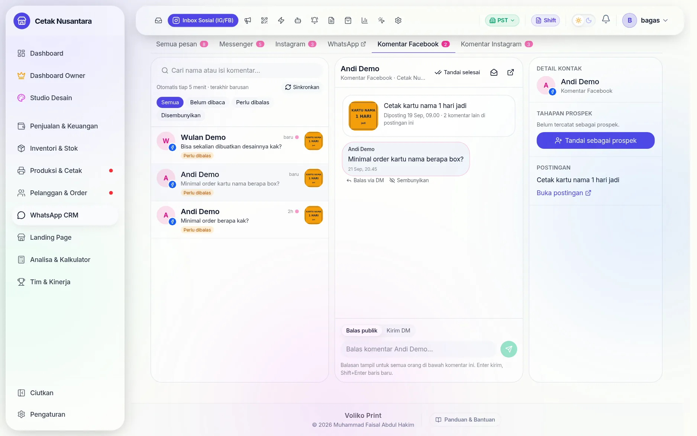

Cara kerjanya sama persis dengan Instagram. Bedanya hanya tidak ada tautan profil
(Facebook tidak memberi username pengomentar).

## DM (Messenger & Instagram)

### Jendela balas 24 jam

Meta hanya mengizinkan bisnis membalas DM lewat aplikasi pihak ketiga (termasuk
PosPro) **dalam 24 jam sejak pesan terakhir pelanggan**. Setelah itu balasan
ditolak Meta — tapi dari aplikasi Instagram/Facebook sendiri tetap bisa.

PosPro menandai setiap percakapan:

- **bisa dibalas · sisa X jam** (hijau) → balas dari PosPro,
- **lewat 24 jam** (abu-abu) → balas dari aplikasi.

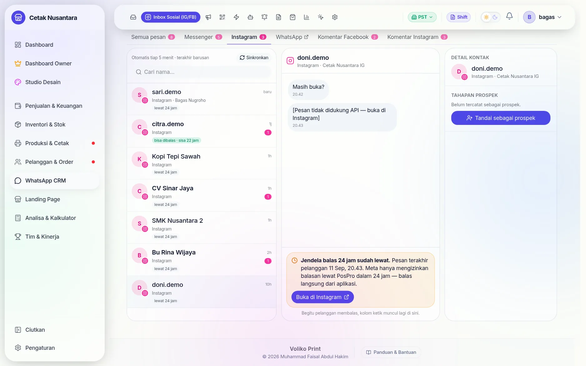

Pada percakapan yang lewat, kolom ketik diganti keterangan kapan pesan terakhir
pelanggan dan tombol **Buka di Instagram** (langsung membuka obrolan itu) atau
**Buka Inbox Messenger**. Begitu pelanggan membalas, kolom ketik muncul lagi.

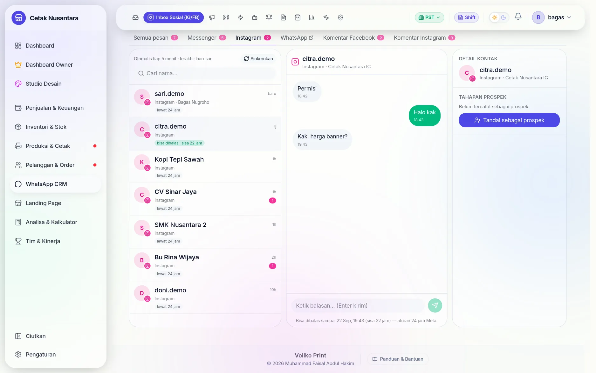

> Tips: balas DM **secepatnya**. DM yang dibalas di hari yang sama hampir selalu
> masih di dalam jendela 24 jam.

### Catatan sistem Facebook

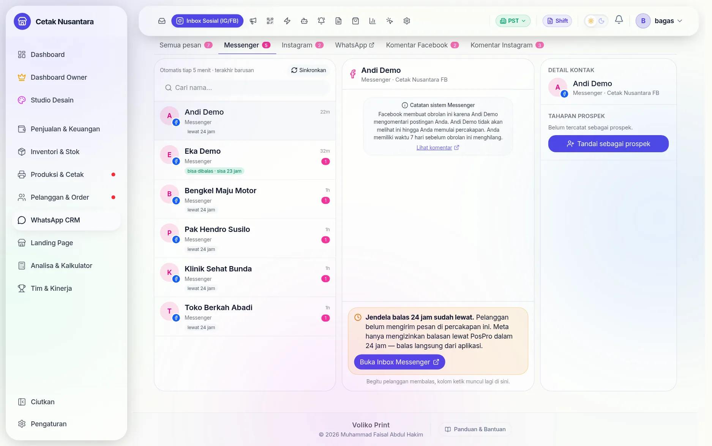

Setiap ada komentar di postingan Halaman, Facebook otomatis membuat obrolan
Messenger berisi *"Facebook membuat obrolan ini karena X mengomentari postingan
Anda…"*. Pelanggan **tidak melihatnya** sampai Halaman mengirim pesan, dan obrolan
itu hilang sendiri setelah 7 hari. PosPro menampilkannya sebagai **catatan sistem**
(bukan chat pelanggan) dan **tidak menghitungnya** sebagai belum dibaca — balas
komentarnya dari tab **Komentar Facebook**.

## Sinkron otomatis & tombol Sinkronkan

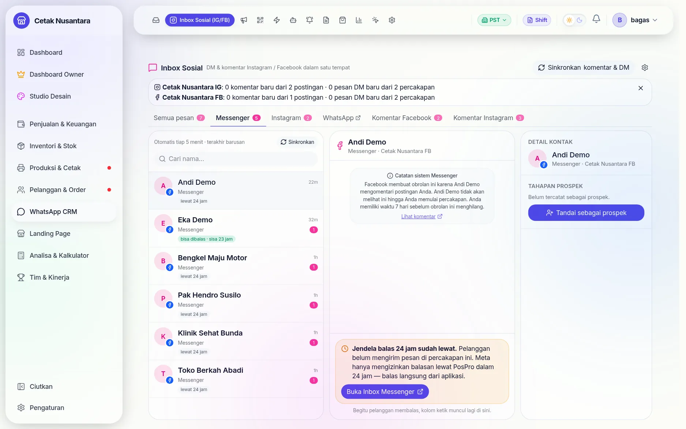

Data masuk lewat dua jalan:

| Jalan | Kapan | Catatan |
|---|---|---|
| **Webhook** | seketika saat ada DM/komentar | butuh aplikasi Meta yang sudah **diterbitkan** |
| **Sinkron** | otomatis **tiap 5 menit** + tombol **Sinkronkan** | menarik 15 postingan & 25 percakapan terbaru; cadangan kalau webhook terlambat, dan cara menarik riwayat lama |

Hasil sinkron menampilkan per channel: berapa komentar dan pesan DM baru. Kalau
ada yang salah (mis. izin token kurang), pesannya tampil **merah** di atas daftar
lengkap dengan izin yang perlu ditambahkan.

Aturan penandaan hasil sinkron:

- komentar/DM **≤ 3 hari** yang belum dibalas → **belum dibaca** (muncul di angka tab),
- yang lebih lama → cukup masuk **Perlu dibalas**, supaya penarikan pertama tidak
  membanjiri angka,
- utas yang terakhir dibalas tim (dari PosPro **atau** langsung dari aplikasi
  Instagram/Facebook) dianggap sudah ditangani.

## Di ponsel

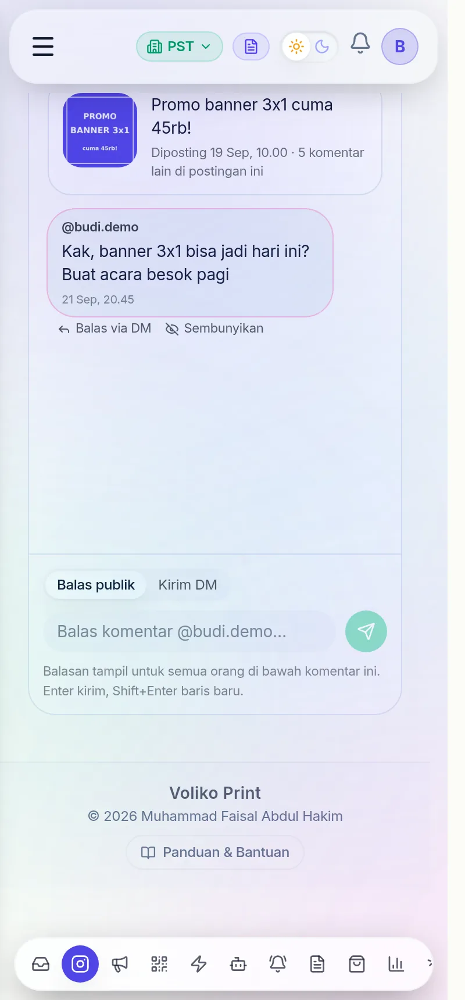

Di layar kecil daftar dan isi tampil bergantian; tombol ← kembali ke daftar.
Panel kanan (detail kontak) hanya muncul di layar lebar.

## Contoh penggunaan

### Contoh 1 — Pelanggan bertanya harga di komentar

> **@sari.demo** di postingan promo banner: *"Kirim ke Bekasi bisa kak?"* lalu
> *"Sekalian stiker 50 lembar ya"*.

1. Tab **Komentar Instagram** → utas **@sari.demo** (berlabel *Perlu dibalas*).
2. **Balas publik** singkat: *"Bisa kak, ongkir ke Bekasi 15rb. Stiker 50 lembar siap besok 🙏"*
   — pengikut lain yang punya pertanyaan sama ikut terjawab.
3. Klik **Balas via DM** di komentar kedua, kirim rincian harga dan nomor rekening
   secara pribadi.
4. Klik **Tandai sebagai prospek** → Sari masuk CRM dengan sumber Instagram.
5. Saat Sari membalas DM, lanjutkan dari tab **Instagram** (label *bisa dibalas*).

### Contoh 2 — Komentar spam atau promosi pihak lain

> **@promo.murah99**: *"Jasa followers murah!! cek bio"*

Buka utasnya → **Sembunyikan**. Komentar hilang dari publik dan dari daftar
*Perlu dibalas*.

### Contoh 3 — Komentar yang tidak perlu dijawab

> *"🔥🔥"* atau *"Mantap kak"*

Buka utas → **Tandai selesai**. Label *Perlu dibalas* hilang; kalau orang itu
berkomentar lagi, utasnya kembali muncul.

### Contoh 4 — DM masuk malam hari

> DM masuk pukul 22.00: *"Bisa cetak UV flatbed?"*

Pagi harinya tab **Instagram** menampilkan **bisa dibalas · sisa 13 jam** → balas
langsung dari PosPro. Kalau baru dibuka lusa, labelnya **lewat 24 jam** → tekan
**Buka di Instagram** dan balas dari aplikasi.

### Contoh 5 — Pembagian kerja antar cabang

Channel Instagram pusat diatur **Semua cabang**, Halaman Facebook cabang timur
diatur **Cabang Timur**. CS cabang timur melihat keduanya; CS cabang lain hanya
melihat Instagram pusat.

## Aturan Meta yang perlu diingat

| Aturan | Akibatnya di PosPro |
|---|---|
| DM hanya bisa dibalas lewat API dalam **24 jam** sejak pesan terakhir pelanggan | label *lewat 24 jam* + tombol buka aplikasi |
| DM dari komentar: **sekali per komentar**, maks **7 hari** | tanda *sudah dibalas via DM*; mode Kirim DM mati kalau semua sudah di-DM |
| Aplikasi Meta yang **belum diterbitkan** hanya melihat data akun ber-peran | komentar & DM pelanggan tidak muncul (0) — lihat [pemecahan masalah](hubungkan-meta.md#pemecahan-masalah) |
| Webhook komentar Instagram butuh **Advanced Access** (lolos tinjauan) | sebelum disetujui, komentar tetap masuk lewat sinkron 5 menit |
| Pesan jenis tertentu (reels, story, stiker) tidak dibuka API | tampil sebagai *[Pesan tidak didukung API — buka di Instagram]* |

## Pertanyaan umum

**Kenapa ada komentar dari "Pengguna"?** Meta tidak memberi nama penulisnya
(biasanya akun yang membatasi privasi). Isinya tetap bisa dibalas.

**Gambar postingan kosong?** Tautan gambar dari Instagram kedaluwarsa setelah
beberapa hari; PosPro menyegarkannya saat sinkron (paling lambat 12 jam sekali).
Klik **Buka postingan** untuk melihat aslinya.

**Balasan saya dari aplikasi Instagram terlihat di PosPro?** Ya. Balasan dari akun
bisnis dikenali sebagai balasan tim, dan utasnya dianggap sudah ditangani.

**Balasan muncul "gagal kirim" padahal sampai ke pelanggan?** Diperbaiki 22
September 2026. Nomor pesan Instagram kadang lebih dari 128 karakter sehingga
dulu gagal disimpan; sekarang muat. Kalau balasan sudah terkirim tapi gagal
disimpan, PosPro tetap menampilkannya sebagai terkirim — jangan kirim ulang, supaya
pelanggan tidak menerima pesan dobel.

**Komentar/DM tidak muncul sama sekali?** Lihat
[Pemecahan masalah](hubungkan-meta.md#pemecahan-masalah) di halaman penghubungan.

## Untuk pengembang

| Hal | Letak |
|---|---|
| Halaman | `frontend/src/app/crm/social/page.tsx` |
| API klien | `frontend/src/lib/api/social.ts` |
| DM | `backend/src/meta-messaging/social-inbox.service.ts` (webhook `messaging`, sinkron DM) |
| Komentar | `backend/src/meta-messaging/social-comments.service.ts` (webhook `comments`/`feed`, sinkron, balas, sembunyikan, prospek) |
| Graph API | `backend/src/meta-messaging/meta-api.service.ts` |
| Tabel | `social_channels`, `social_contacts`, `social_conversations`, `social_messages`, `social_posts`, `social_comments` — lihat [Basis Data](referensi-basis-data.md) |
| Endpoint | `/social/*` — lihat [Endpoint API](referensi-endpoint.md) |
