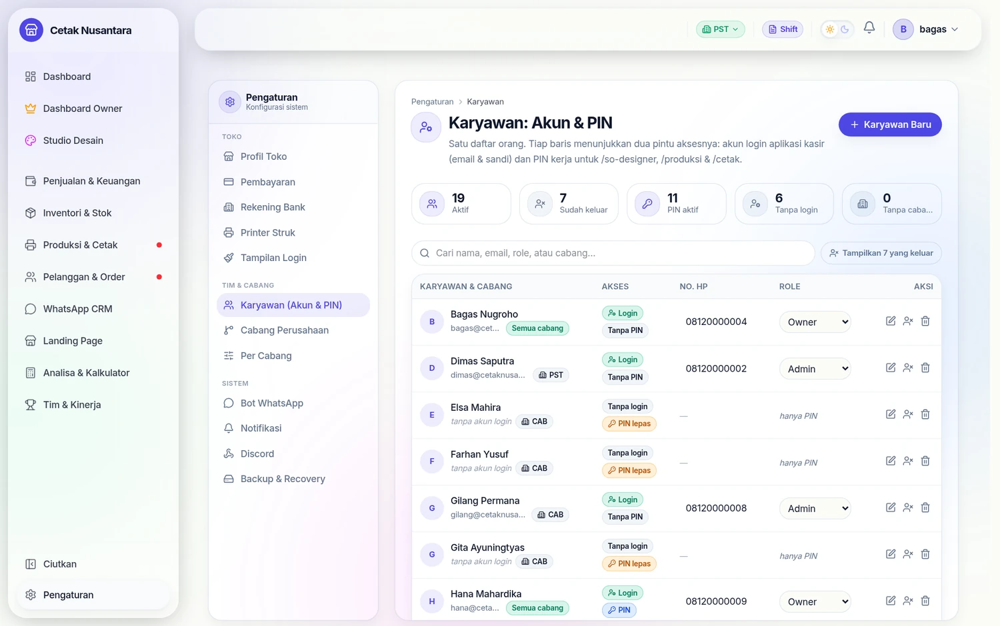
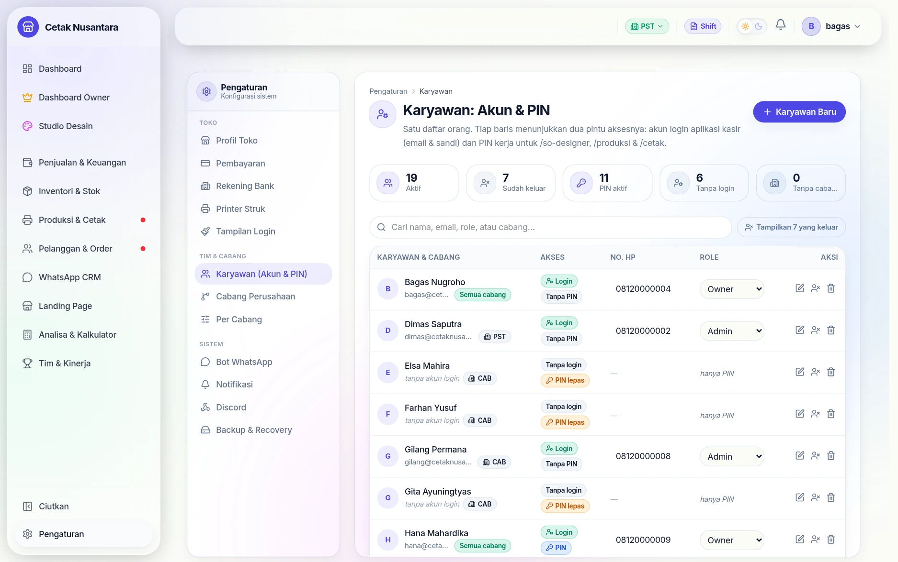
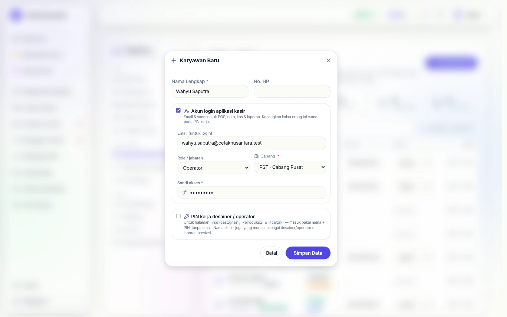
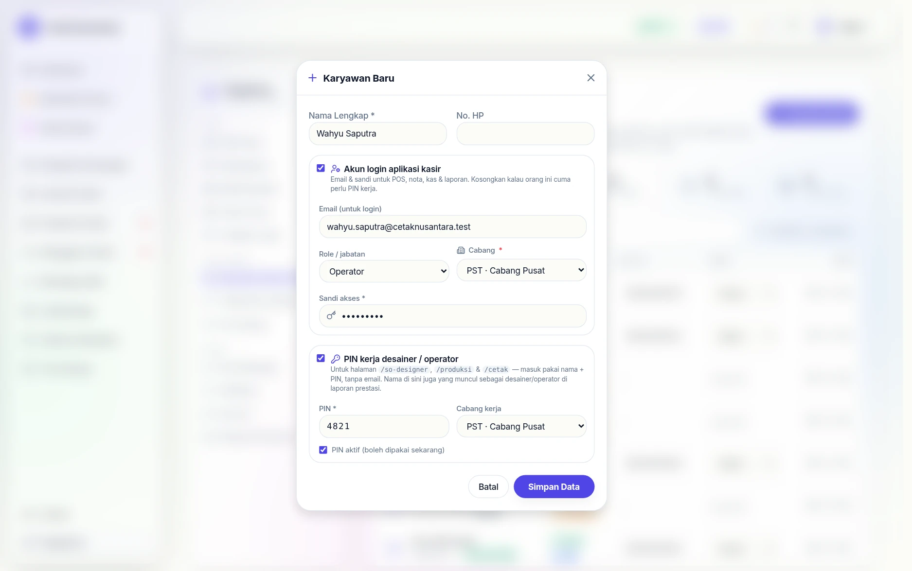
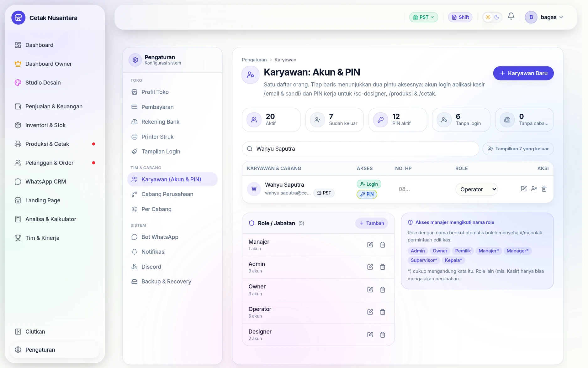
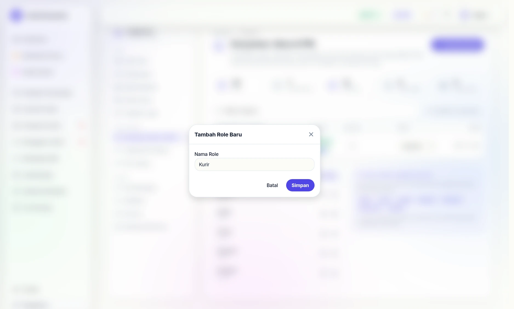
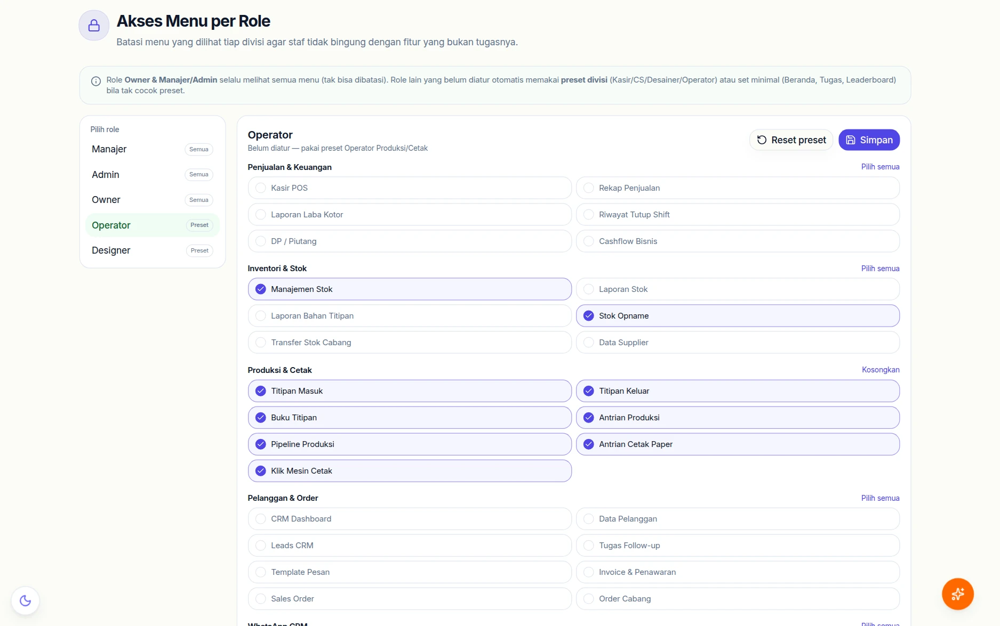
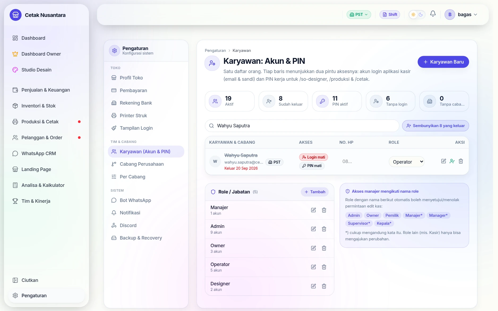

# 👥 Akun & PIN Karyawan

Halaman **`/settings/users`** (menu *Karyawan (Akun & PIN)*) mengelola satu
daftar orang. Dulu ini dua halaman terpisah dan membingungkan; sekarang satu
baris = satu orang, dengan dua "pintu" yang bisa dimiliki sendiri-sendiri atau
bersamaan.

## Dua pintu masuk, satu orang

| Pintu | Untuk apa | Tabel |
|---|---|---|
| **Akun login** (email + sandi) | aplikasi kantor: kasir, laporan, pengaturan | `users` |
| **PIN kerja** (4–6 angka) | papan kerja: `/so-designer`, `/produksi`, `/cetak` | `designers` |

Keduanya dihubungkan oleh `designers.user_id`. Hubungan itu yang membuat tugas
piket, pengingat, teguran, dan [kartu absensi](absensi-hr.md) milik orang itu
bisa muncul di papan kerja yang tidak pakai login.

> Staf yang **hanya punya PIN** tetap bisa bekerja, tapi tidak akan menerima
> pop-up piket maupun kartu absensi sampai PIN-nya ditautkan ke akun login.
> Di daftar, orang seperti ini ditandai chip **"Tanpa login"**.

## Langkah demi langkah

Contoh nyata: memasukkan satu operator baru yang butuh **dua pintu sekaligus**
— bisa login aplikasi kasir dan bisa pegang mesin lewat PIN — lalu menutup
kedua pintu itu saat dia keluar.

### 1. Buka daftar orang

Lima kartu di atas daftar adalah rapor akses toko, bukan hiasan:

| Kartu | Artinya kalau angkanya naik |
|---|---|
| **Aktif** | orang yang masih punya pintu terbuka (login dan/atau PIN) |
| **Sudah keluar** | sudah ditandai keluar — login & PIN-nya tertutup |
| **PIN aktif** | PIN yang masih bisa dipakai di papan kerja |
| **Tanpa login** | cuma punya PIN; tidak dapat pop-up piket & kartu absensi |
| **Tanpa cabang** | staf non-owner tanpa cabang — **tidak bisa login sama sekali** |

Kartu *Tanpa cabang* dan *Tanpa login* yang tidak nol itu daftar pekerjaan
rumah: keduanya menandai orang yang aksesnya setengah jalan.

### 2. Isi pintu pertama: akun login

Tombol **Karyawan Baru** membuka satu form untuk kedua pintu. Bagian *Akun
login aplikasi kasir* dibuka dengan mencentangnya — kosongkan kalau orang ini
cuma perlu PIN kerja.

Cabang wajib diisi (kecuali Owner). Ini pagar yang sering terlupa: staf tanpa
cabang tersimpan dengan rapi tapi tidak akan pernah berhasil login.

### 3. Isi pintu kedua: PIN kerja

Centang **PIN kerja desainer / operator** lalu isi 4–10 angka. Nama yang
dipakai di sini sama dengan nama akun login — itulah yang menyatukan riwayat
prestasi orang tersebut, karena PIN dan akun tertaut lewat `designers.user_id`.

> Sengaja tidak ada tombol "lihat PIN" di daftar. PIN hanya bisa **diganti**,
> tidak dibaca ulang.

### 4. Simpan — satu orang, dua pintu

Sekali simpan, dua catatan terbentuk sekaligus: baris di `users` dan baris di
`designers` yang sudah tertaut. Di contoh ini kartu ringkasan naik dari **19 →
20 aktif** dan **11 → 12 PIN aktif**, dan barisnya menampilkan dua chip hijau:
**Login** dan **PIN**.

Kolom Role di baris itu bisa diganti langsung tanpa membuka form — tersimpan
otomatis begitu kursor pindah.

### 5. Tambah role bila jabatannya baru

Role bukan daftar tetap. Kartu **Role / Jabatan** di bawah daftar orang bisa
ditambah sendiri, misalnya *Kurir* atau *Admin Gudang*. Perlu diingat: role
yang namanya mengandung kata *Manajer*, *Supervisor*, atau *Kepala* otomatis
ikut boleh menyetujui permintaan edit kas — penamaan di sini berdampak ke
kewenangan.

### 6. Batasi menu yang dilihat role itu

Di **`/owner/akses-menu`**, pilih role di kiri lalu centang menu yang boleh
dilihat. Role *Operator* pada contoh masih memakai **preset** bawaan: menu
produksi & cetak menyala, sementara laba kotor, cashflow, dan CRM padam.

Owner dan Manajer/Admin selalu melihat semua menu — keduanya sengaja tidak bisa
dibatasi supaya sistem tidak pernah terkunci dari pemiliknya sendiri.

### 7. Saat karyawan keluar, tutup dua pintunya sekaligus

Tombol *tandai keluar* di baris orang itu **tidak menghapus** apa pun. Yang
terjadi: `users.resigned_at` terisi dan PIN kerjanya ikut dimatikan
(`designers.is_active` jadi 0) dalam satu langkah — persis seperti terlihat di
gambar: nama dicoret, tanggal keluar merah, chip berubah jadi **Login mati**
dan **PIN mati**.

Barisnya lalu disembunyikan dari daftar aktif; tombol **Tampilkan N yang
keluar** memunculkannya kembali. Riwayat nota, pekerjaan, dan leaderboard-nya
tetap utuh — inilah alasan menandai keluar selalu lebih baik daripada
menghapus.

## Peran (role)

Lima peran, disimpan di `roles`:

| Peran | Biasanya untuk |
|---|---|
| `Owner` | pemilik — akses penuh, termasuk HPP & analisa keuangan |
| `Manajer` | laporan, pengaturan, persetujuan edit nota |
| `Admin` | kasir & CS |
| `Designer` | desainer |
| `Operator` | operator produksi/cetak |

**Peran tidak membatasi papan kerja.** `/produksi` dan `/cetak` dijaga PIN, dan
daftar operatornya adalah semua PIN aktif — karena di percetakan satu orang
biasanya menguasai semua mesin. Yang diatur peran adalah **menu aplikasi
kantor**.

## Akses menu per peran

Kolom `roles.menu_access` menyimpan daftar menu yang boleh dilihat peran itu
(JSON berisi href). Owner mengaturnya di **`/owner/akses-menu`** dengan
mencentang menu; kosong = pakai preset divisi bawaan. Ini cara membatasi,
misalnya, agar kasir tidak melihat HPP dan laba.

## Karyawan keluar (resign)

Menghapus akun karyawan yang keluar **bukan** pilihan yang baik: riwayat
kerjanya melekat di nota, pekerjaan produksi, dan leaderboard. Karena itu ada
penandaan keluar:

- `resigned_at` + `resign_note` di tabel `users`.
- Menonaktifkan akun **sekaligus mematikan PIN kerja** orang itu, supaya tidak
  ada pintu yang tertinggal terbuka.
- Riwayatnya tetap utuh; namanya tetap tampil di data lama.

Pagar yang berlaku saat menghapus/menonaktifkan:

1. Tidak bisa menonaktifkan **diri sendiri**.
2. Tidak bisa menonaktifkan **Owner aktif terakhir** — supaya sistem tidak
   pernah kehilangan pemilik.
3. Sebelum penghapusan permanen, ditampilkan **ringkasan riwayat** orang itu
   (berapa nota, berapa pekerjaan, berapa tugas) agar keputusannya sadar.

## Endpoint terkait

| Metode | Jalur | Untuk |
|---|---|---|
| GET | `/users` | daftar orang |
| POST | `/users` | membuat akun login |
| PATCH | `/users/:id` | mengubah data/peran |
| PATCH | `/users/:id/status` | menandai keluar / mengaktifkan kembali |
| DELETE | `/users/:id` | hapus permanen (berpagar) |
| GET/POST/PATCH | `/designers` | PIN kerja |
| POST | `/designers/verify-pin` | verifikasi PIN (dipakai papan kerja) |
