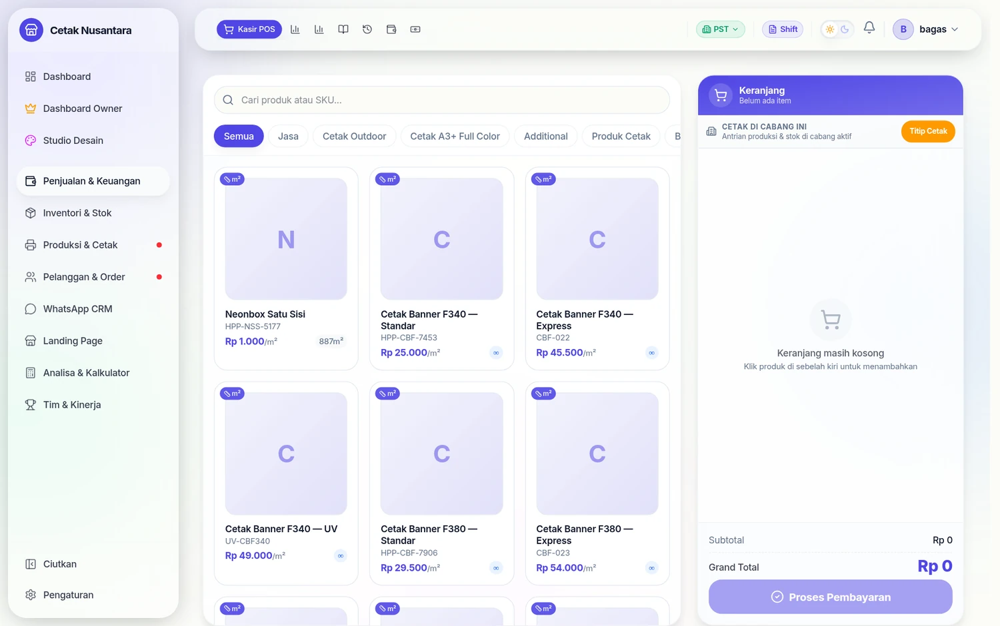

# 🛒 Kasir POS

Halaman **`/pos`** adalah inti aplikasi: tempat nota dibuat. Satu tombol
"Proses Pembayaran" di sini memicu enam hal sekaligus di belakang layar, dan
itulah yang membedakan PosPro dari kasir biasa.

## Siapa yang memakai

Admin/kasir, Manajer, dan Owner. Owner **wajib memilih cabang** lebih dulu
(lencana cabang di kanan atas) karena akunnya tidak terikat satu cabang —
nota tanpa cabang akan menyulitkan atribusi di leaderboard.

## Tiga cara produk dihitung

Kolom `pricing_mode` pada produk menentukan cara kasir memasukkan pesanan:

| Mode | Cara hitung | Contoh |
|---|---|---|
| `UNIT` | jumlah × harga satuan | Kartu nama, stiker, jasa desain |
| `AREA_BASED` | (lebar × tinggi) dalam m² × harga per m² | Banner, spanduk, stiker polyfoam |
| `COMPOSITE` | paket: beberapa komponen dengan pilihan | Paket brosur 1 rim, paket tentcard |

Untuk `AREA_BASED`, kasir mengisi **lebar & tinggi dalam cm**; aplikasi yang
mengubahnya ke m². Untuk `COMPOSITE`, kasir memilih opsi (bahan, ukuran,
finishing) lalu sistem merangkai harga dari komponennya — termasuk
**menurunkan tarif klik mesin dari komponen**, bukan dari produk paketnya
(lihat [Mesin Cetak & Antrian Paper](mesin-cetak.md)).

## Yang bisa diatur per baris pesanan

- **Harga khusus** (`customPrice`) — menimpa harga daftar untuk baris itu saja.
- **Catatan** — ikut tercetak di nota dan terbaca operator produksi.
- **Sub ke printing luar** (`isSubOrder`) — pekerjaan dikerjakan vendor luar:
  harga jual tetap tercatat, harga beli vendor (`subPrice`, `subVendor`)
  dicatat terpisah, dan **stok tidak dipotong** karena bukan bahan sendiri.

## Yang bisa diatur per nota

| Kolom | Gunanya |
|---|---|
| Metode bayar | `CASH`, `QRIS`, `BANK_TRANSFER` (pilih rekening bila transfer) |
| Diskon & biaya kirim | mengurangi/menambah total |
| DP (`downPayment`) | nota jadi `PARTIAL`, sisanya piutang — lihat [DP & Piutang](dp-piutang.md) |
| Jatuh tempo | tanggal janji pelunasan/pengambilan |
| Simpan saja (`saveOnly`) | nota berstatus `PENDING` tanpa pembayaran — untuk invoice perusahaan |
| Prioritas `EXPRESS` + tenggat | menaikkan pekerjaan ke atas di papan produksi |
| Catatan produksi | instruksi untuk operator, bukan untuk pelanggan |
| Titip cetak ke cabang lain | lihat [Titip Cetak Antar Cabang](titip-cetak.md) |
| Nama kasir & nama pengerja | dasar perhitungan [Leaderboard](leaderboard.md) |
| Tanggal transaksi | boleh dibackdate — dipakai saat input nota kemarin |

## Apa yang terjadi setelah "Proses Pembayaran"

Satu permintaan `POST /transactions` menulis ke banyak tempat dalam **satu
transaksi database** — kalau ada satu yang gagal, semuanya dibatalkan:

1. **`transactions` + `transaction_items`** — notanya sendiri.
2. **`customers`** — pelanggan baru dibuat, yang sudah ada dipakai ulang.
3. **`production_jobs`** — untuk tiap item yang produknya bertanda
   `requires_production`. Ini yang memunculkan pekerjaan di
   [Antrian Produksi](produksi.md).
4. **`print_jobs` + `click_logs`** — untuk tiap item yang punya tarif klik.
   Ini yang memunculkan pekerjaan di [Antrian Cetak Paper](mesin-cetak.md).
5. **`stock_movements`** — bahan dipotong untuk produk yang melacak stok.
6. **`cashflows`** — uang masuk tercatat, jadi dasar
   [Cashflow Bisnis](cashflow.md) dan [Tutup Shift](tutup-shift.md).

> **Kalau pekerjaan tidak muncul di papan produksi atau cetak**, hampir selalu
> sebabnya satu dari dua: produknya belum ditandai `requires_production`, atau
> varian/produknya belum punya tarif klik. Lihat
> [Katalog Produk & Harga](katalog-produk.md).

## Batas & aturan yang berlaku

- Stok tidak cukup → nota ditolak dengan pesan yang menyebut nama bahannya.
  Produk yang tidak melacak stok tidak pernah diblokir.
- Marketplace: nota order marketplace boleh **tanpa nomor HP**, dan biaya
  platformnya dicatat per kategori (`marketplaceFeeItems`).
- Mengubah nota yang sudah jadi butuh **permintaan edit** yang disetujui
  Manajer — riwayatnya ada di `/transactions/edit-requests`.

## Endpoint terkait

| Metode | Jalur | Untuk |
|---|---|---|
| POST | `/transactions` | membuat nota |
| GET | `/transactions` | daftar & pencarian nota |
| GET | `/transactions/:id` | detail nota |
| POST | `/transactions/:id/add-dp` | menambah pembayaran DP |
| POST | `/transactions/:id/pay-off` | melunasi |
| PATCH | `/transactions/:id/payment-method` | memperbaiki metode bayar |
| GET | `/transactions/dashboard/metrics` | angka di dashboard |

Daftar lengkap parameter dan penjaga aksesnya ada di
[Referensi Endpoint](referensi-endpoint.md).
