# 🛒 Kasir POS

Halaman **`/pos`** adalah inti aplikasi: tempat nota dibuat. Satu tombol
"Proses Pembayaran" di sini memicu enam hal sekaligus di belakang layar, dan
itulah yang membedakan PosPro dari kasir biasa.

## Siapa yang memakai

Admin/kasir, Manajer, dan Owner. Owner **wajib memilih cabang** lebih dulu
(lencana cabang di kanan atas) karena akunnya tidak terikat satu cabang —
nota tanpa cabang akan menyulitkan atribusi di leaderboard.

## Tiga cara produk dihitung

Kolom `pricing_mode` pada produk menentukan cara kasir memasukkan pesanan:

| Mode | Cara hitung | Contoh |
|---|---|---|
| `UNIT` | jumlah × harga satuan | Kartu nama, stiker, jasa desain |
| `AREA_BASED` | (lebar × tinggi) dalam m² × harga per m² | Banner, spanduk, stiker polyfoam |
| `COMPOSITE` | paket: beberapa komponen dengan pilihan | Paket brosur 1 rim, paket tentcard |

Untuk `AREA_BASED`, kasir mengisi **lebar & tinggi dalam cm**; aplikasi yang
mengubahnya ke m². Untuk `COMPOSITE`, kasir memilih opsi (bahan, ukuran,
finishing) lalu sistem merangkai harga dari komponennya — termasuk
**menurunkan tarif klik mesin dari komponen**, bukan dari produk paketnya
(lihat [Mesin Cetak & Antrian Paper](mesin-cetak.md)).

## Yang bisa diatur per baris pesanan

- **Harga khusus** (`customPrice`) — menimpa harga daftar untuk baris itu saja.
- **Catatan** — ikut tercetak di nota dan terbaca operator produksi.
- **Sub ke printing luar** (`isSubOrder`) — pekerjaan dikerjakan vendor luar:
  harga jual tetap tercatat, harga beli vendor (`subPrice`, `subVendor`)
  dicatat terpisah, dan **stok tidak dipotong** karena bukan bahan sendiri.

## Yang bisa diatur per nota

| Kolom | Gunanya |
|---|---|
| Metode bayar | `CASH`, `QRIS`, `BANK_TRANSFER` (pilih rekening bila transfer) |
| Diskon & biaya kirim | mengurangi/menambah total |
| DP (`downPayment`) | nota jadi `PARTIAL`, sisanya piutang — lihat [DP & Piutang](dp-piutang.md) |
| Jatuh tempo | tanggal janji pelunasan/pengambilan |
| Simpan saja (`saveOnly`) | nota berstatus `PENDING` tanpa pembayaran — untuk invoice perusahaan |
| Prioritas `EXPRESS` + tenggat | menaikkan pekerjaan ke atas di papan produksi |
| Catatan produksi | instruksi untuk operator, bukan untuk pelanggan |
| Titip cetak ke cabang lain | lihat [Titip Cetak Antar Cabang](titip-cetak.md) |
| Nama kasir & nama pengerja | dasar perhitungan [Leaderboard](leaderboard.md) |
| Tanggal transaksi | boleh dibackdate — dipakai saat input nota kemarin |

## Langkah demi langkah

Contoh nyata: satu nota berisi banner 3×1 meter dan satu paket X-Banner, untuk
pelanggan CV Sinar Jaya.

### 1. Pilih produk dari katalog

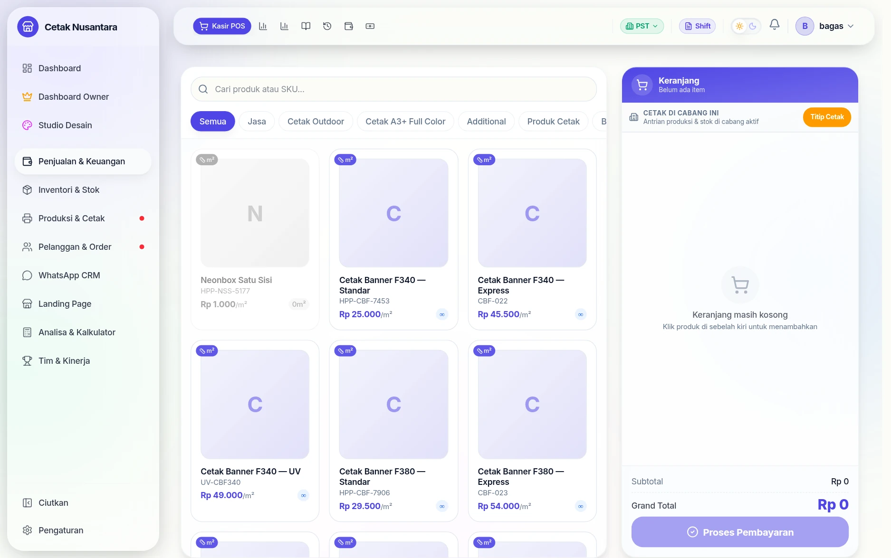

Produk dicari lewat kotak pencarian atau disaring per kategori. Lencana **m²**
menandai produk yang harganya dihitung per meter persegi.

### 2. Untuk produk per meter, masukkan ukurannya

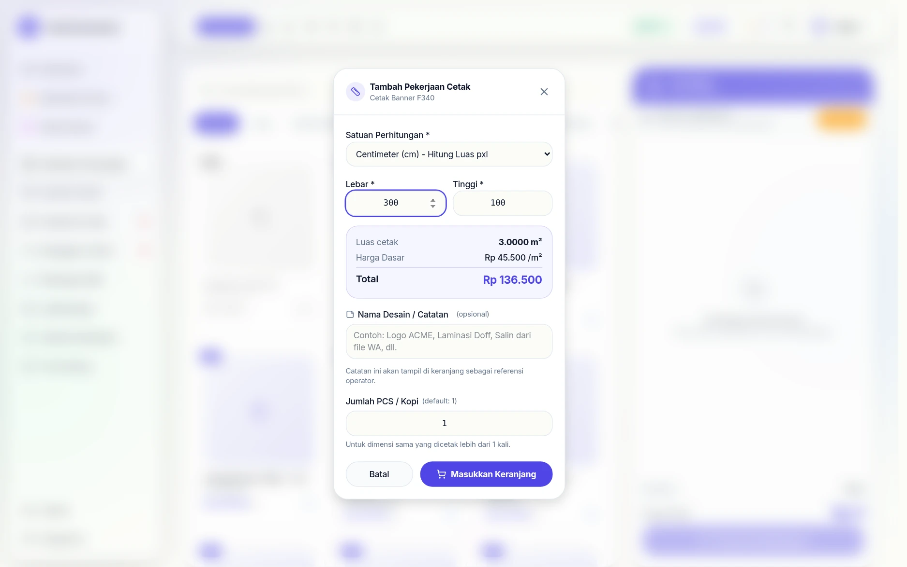

Kasir mengisi **lebar dan tinggi dalam cm**; aplikasi menghitung luasnya
(3,00 m²) dan langsung mengalikannya dengan harga per m². Tidak ada hitungan
manual, jadi tidak ada salah kali.

### 3. Keranjang terisi

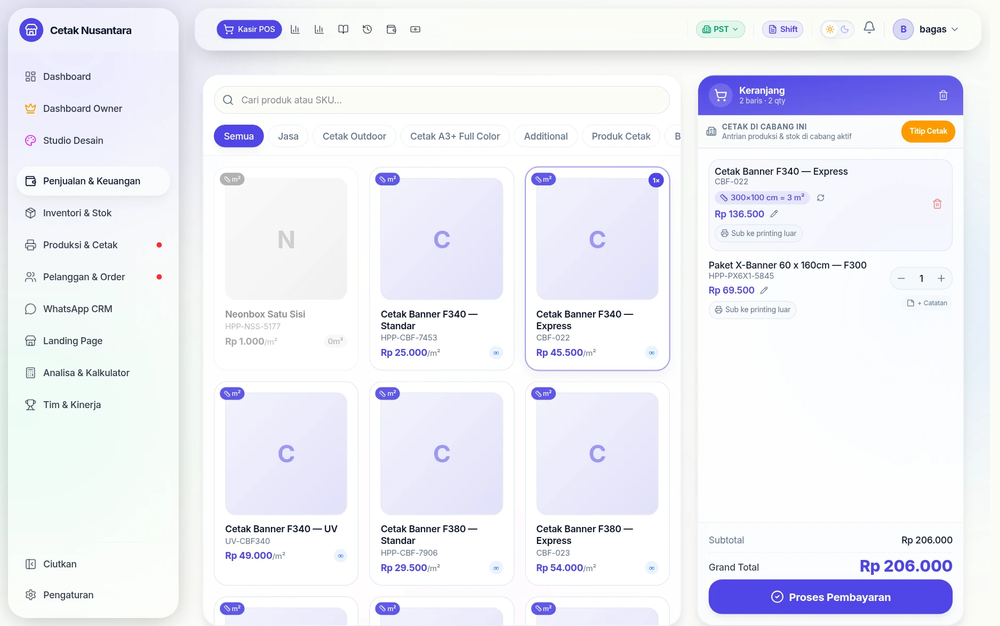

Jumlah bisa diubah, harga bisa ditimpa per baris, dan tiap baris bisa diberi
catatan yang nanti terbaca operator produksi.

### 4. Isi tagihan & data pelanggan

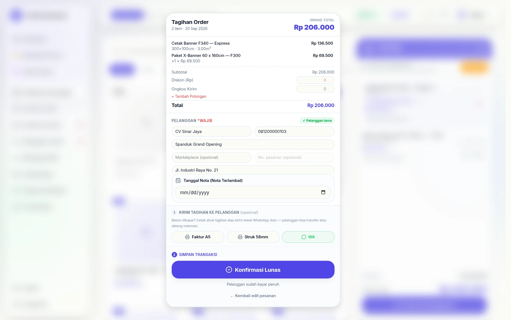

Nama pelanggan, nomor HP, dan **Kasir / Staff** wajib diisi — kalau salah satu
kosong, aplikasi menolak melanjutkan. Kolom **label pekerjaan** ("Spanduk Grand
Opening") membantu mengenali order di papan produksi nanti, dan bukan bagian
dari nama pelanggan.

### 5. Konfirmasi sebelum tersimpan

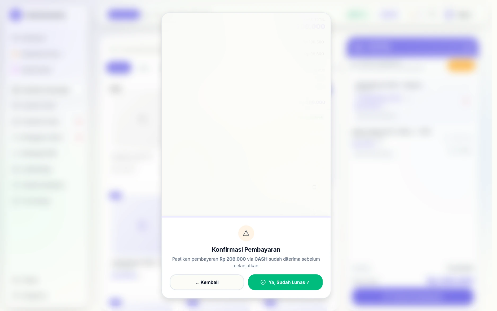

Satu langkah sengaja disisipkan di sini: kasir menegaskan uangnya benar-benar
sudah diterima. Ini yang mencegah nota "lunas" padahal pembayarannya belum
masuk.

### 6. Nota siap dicetak

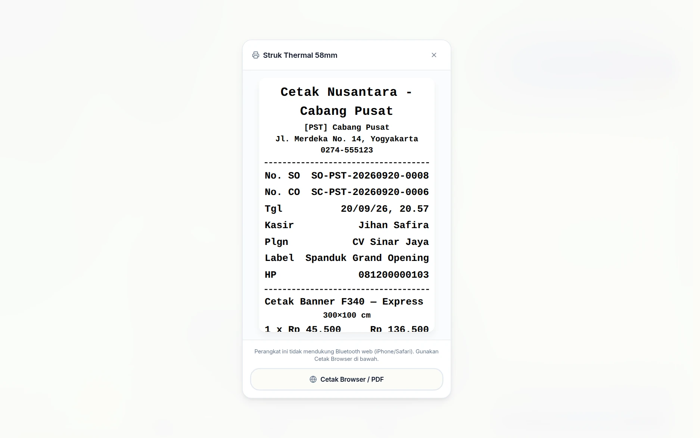

Struk memuat nomor SO, nama kasir, pelanggan, label pekerjaan, dan ukuran
cetaknya. Bisa dicetak ke printer thermal, dijadikan PDF, atau dikirim lewat
WhatsApp. Sejak 22 September 2026 baris item per m² di struk menulis *luas ×
harga per m²*, nota belum lunas menampilkan sisa tagihan, dan item custom/paket
tampil dengan namanya — rinciannya di [Cetak Nota Thermal 58mm](nota-thermal-58mm.md#isi-struk-sejak-22-september-2026).

### 7. Pekerjaannya muncul sendiri di papan produksi

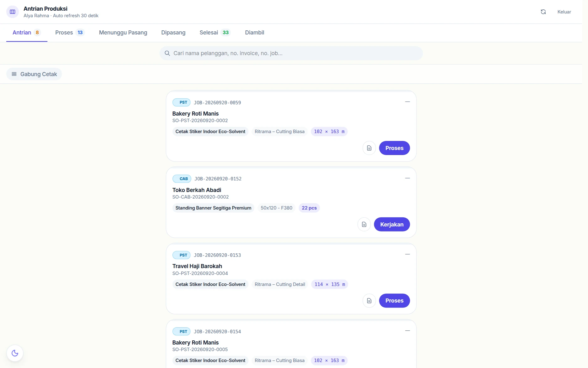

Tidak ada yang perlu dibuat ulang: karena produk paket X-Banner bertanda
*requires_production*, pekerjaannya langsung berdiri di
[Antrian Produksi](produksi.md) atas nama pelanggan yang sama. Produk kertas
yang punya tarif klik masuk ke [Antrian Cetak](mesin-cetak.md) dengan cara yang
sama.

## Apa yang terjadi setelah "Proses Pembayaran"

Satu permintaan `POST /transactions` menulis ke banyak tempat dalam **satu
transaksi database** — kalau ada satu yang gagal, semuanya dibatalkan:

1. **`transactions` + `transaction_items`** — notanya sendiri.
2. **`customers`** — pelanggan baru dibuat, yang sudah ada dipakai ulang.
3. **`production_jobs`** — untuk tiap item yang produknya bertanda
   `requires_production`. Ini yang memunculkan pekerjaan di
   [Antrian Produksi](produksi.md).
4. **`print_jobs` + `click_logs`** — untuk tiap item yang punya tarif klik.
   Ini yang memunculkan pekerjaan di [Antrian Cetak Paper](mesin-cetak.md).
5. **`stock_movements`** — bahan dipotong untuk produk yang melacak stok.
6. **`cashflows`** — uang masuk tercatat, jadi dasar
   [Cashflow Bisnis](cashflow.md) dan [Tutup Shift](tutup-shift.md).

> **Kalau pekerjaan tidak muncul di papan produksi atau cetak**, hampir selalu
> sebabnya satu dari dua: produknya belum ditandai `requires_production`, atau
> varian/produknya belum punya tarif klik. Lihat
> [Katalog Produk & Harga](katalog-produk.md).

## Mengubah nota yang sudah jadi: permintaan edit

Nota yang sudah tersimpan tidak bisa diam-diam diubah kasir. Yang tersedia
adalah **permintaan edit** — diajukan kasir, ditinjau manajer, dan seluruhnya
meninggalkan jejak.

### 1. Kasir melihat tombol yang berbeda

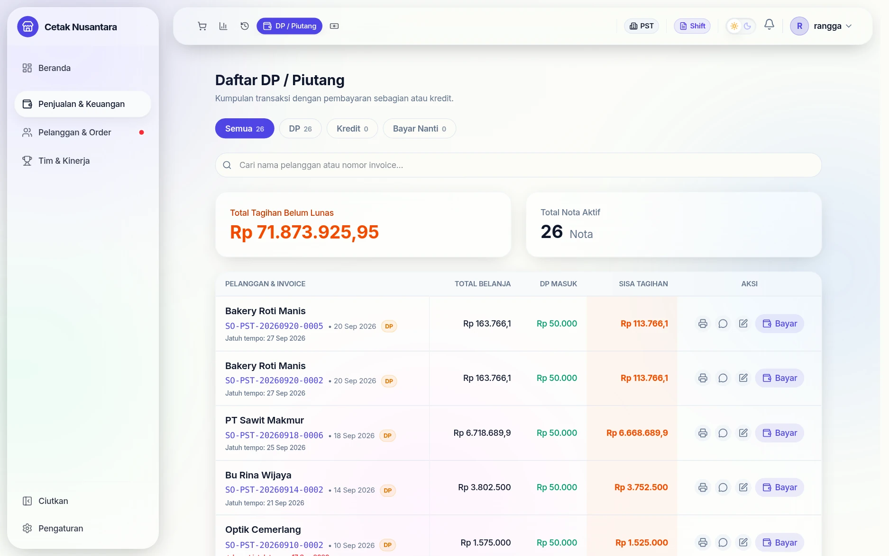

Tombol pada baris nota menyesuaikan peran: manajer melihat **Edit**, kasir
melihat **Ajukan Perubahan**. Peran yang otomatis dianggap penyetuju —
*Owner, Admin, Manajer, Supervisor, Kepala* — tidak akan melihat jalur
pengajuan ini karena mereka memang boleh mengubah langsung.

### 2. Menyusun usulan perubahan

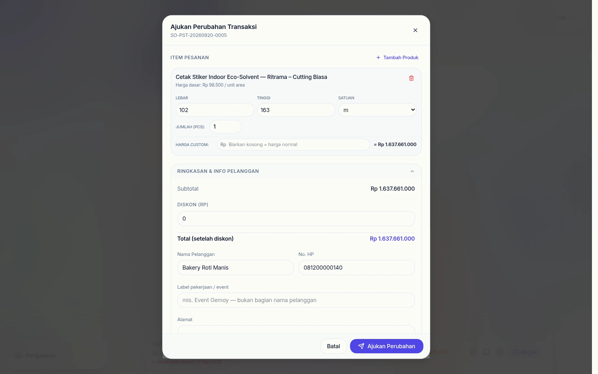

Dialognya menampilkan nota apa adanya: item pesanan, ukuran, harga dasar per
unit, dan tombol untuk menambah produk. Kasir mengubah angkanya seperti sedang
mengedit — bedanya hasilnya belum tersimpan ke nota.

### 3. Alasan wajib diisi

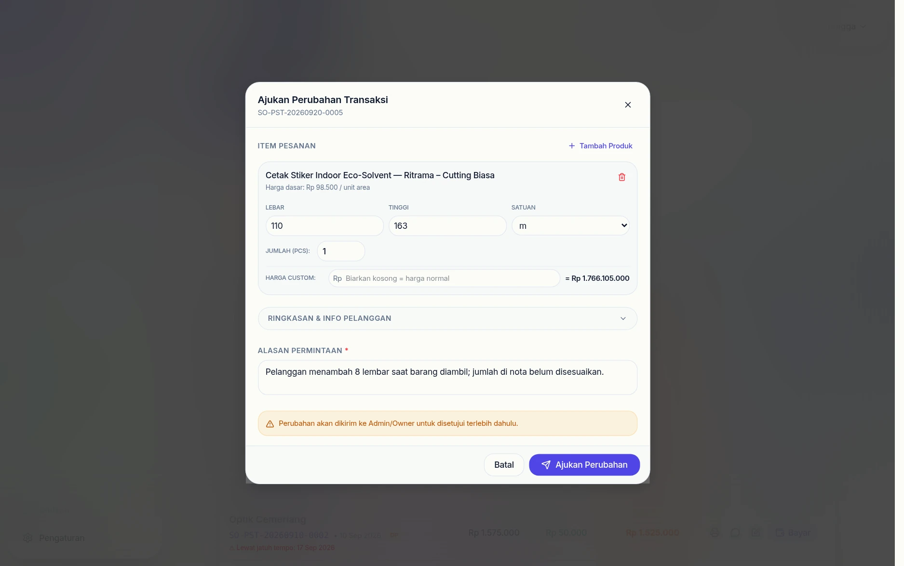

Tanpa alasan, pengajuan ditolak aplikasi dengan pesan *"Harap isi alasan
permintaan edit"*. Kolomnya ada di bagian **Ringkasan & Info Pelanggan** yang
bisa dilipat. Aturan ini yang membuat riwayat perubahan bisa dibaca ulang
berbulan-bulan kemudian tanpa menebak-nebak.

### 4. Pengajuan terkirim

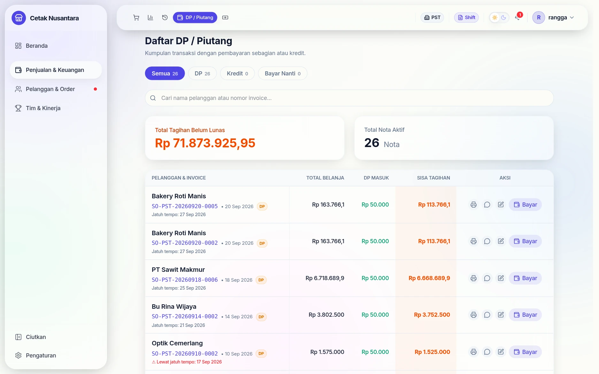

Nota **belum berubah**. Yang tercatat baru satu baris permintaan berstatus
*Menunggu*, dan lonceng manajer mendapat penanda.

### 5. Manajer meninjau

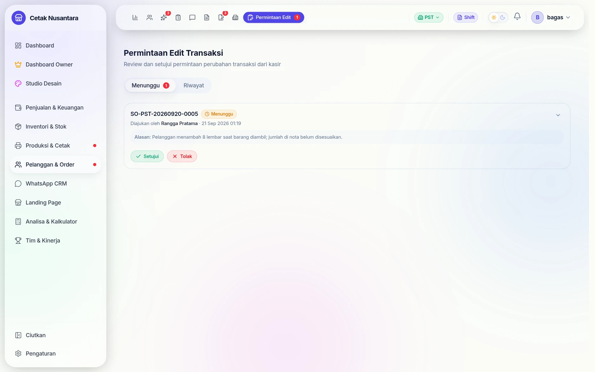

**`/transactions/edit-requests`** memuat dua tab: **Menunggu** (dengan angka
jumlahnya) dan **Riwayat**. Tiap kartu menyebut nomor nota, **siapa yang
mengajukan**, waktunya, dan alasannya — lalu dua tombol: *Setujui* atau
*Tolak*.

Sejak 22 September 2026 daftar ini hanya memuat permintaan atas nota **cabang
sendiri** (Owner melihat semua), dan kartunya memperlihatkan seluruh usulan:
**item baru** (+) dan **item dihapus** (−), **harga manual** beserta harga
sebelumnya, pcs, serta perubahan **nama/No. HP pelanggan**. Diskon hanya tampil
bila memang berubah, dengan nilai diskon lama → baru (dulu yang dicoret total
nota).

### 6. Persetujuan butuh dua klik

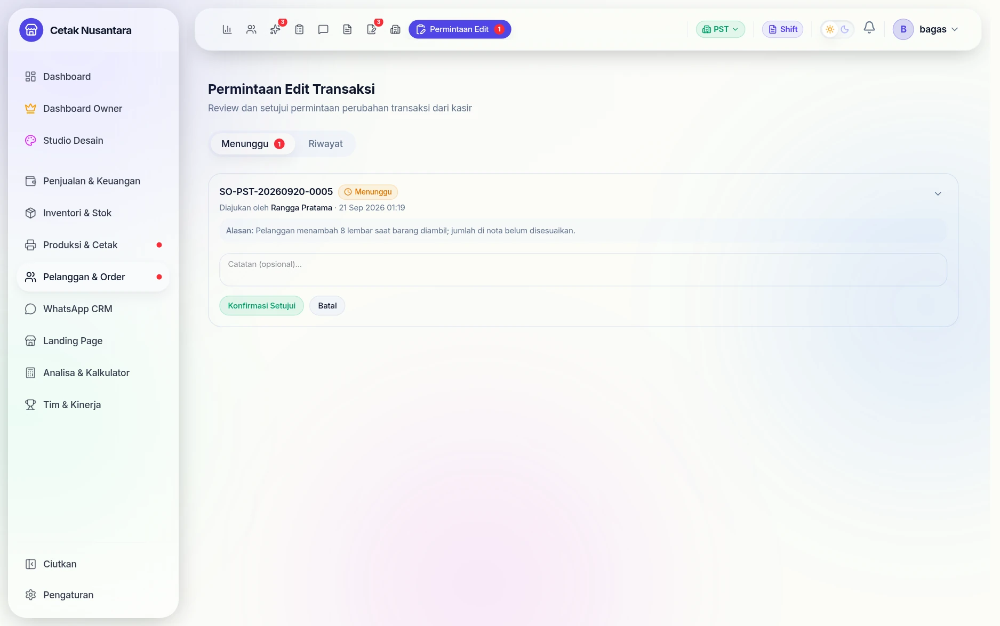

Menekan *Setujui* tidak langsung menerapkan perubahan; tombolnya berubah jadi
**Konfirmasi Setujui**. Pagar kecil ini mencegah klik tidak sengaja pada daftar
yang isinya mirip-mirip.

### 7. Selesai dan pindah ke riwayat

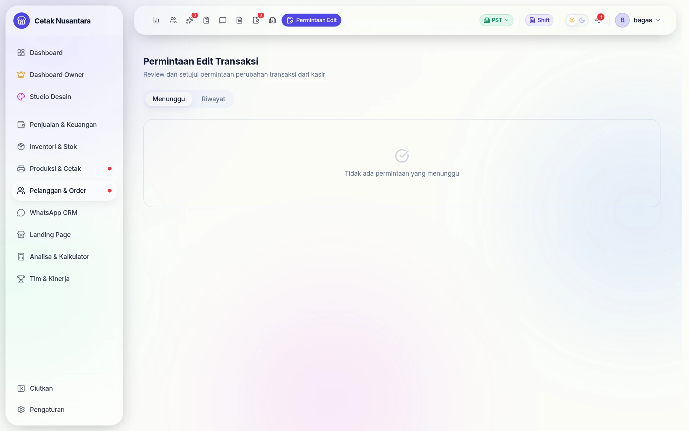

Setelah dikonfirmasi, permintaannya hilang dari tab *Menunggu* dan tersimpan di
*Riwayat* lengkap dengan siapa yang menyetujui. Nota barulah berubah pada titik
ini.

> **Sudah diperbaiki (21 September 2026):** dulu mengedit nota berisi item per-m²
> bisa membuat totalnya melonjak ×10.000 atau ditolak "stok tidak cukup", karena
> satuan item lama tersimpan "m" padahal isinya cm. Sekarang satuan item lama
> dibaca dari luas yang tersimpan, harganya tetap harga saat nota dibuat, dan
> edit yang tidak mengubah ukuran tidak mengubah total sama sekali. Rinciannya
> di [Laporan Penjualan → Edit transaksi](laporan-penjualan.md#edit-transaksi-aturan-ukuran-satuan).

## Batas & aturan yang berlaku

- Stok tidak cukup → nota ditolak dengan pesan yang menyebut nama bahannya.
  Produk yang tidak melacak stok tidak pernah diblokir.
- Ukuran yang jelas salah satuan ditolak: satu lembar lebih dari **1.000 m²**
  (mis. 300×100 dengan satuan **m** = 30.000 m²) → *"… tidak masuk akal. Periksa
  satuannya (cm atau m)."* Nota tanpa satuan dianggap **cm**.
- Marketplace: nota order marketplace boleh **tanpa nomor HP**, dan biaya
  platformnya dicatat per kategori (`marketplaceFeeItems`). Potongan marketplace
  tidak boleh melebihi nilai nota.
- **Angka yang tidak masuk akal ditolak** (sejak 22 Sep 2026), dengan pesan yang
  menyebut angkanya: diskon melebihi subtotal, jumlah 0 / minus / pecahan,
  ukuran 0, DP melebihi total. Nota tidak pernah bisa bernilai minus.
- **Rupiah tanpa sen.** Harga per m² × luas bisa menghasilkan pecahan (33×47 cm
  @ Rp 5.500/m² = Rp 853,05); total nota dibulatkan ke Rp 853, begitu juga
  ekspektasi kas di tutup shift. Sejak 22 September 2026 layar kasir dan struk
  ikut membulatkan subtotal, diskon, pajak, dan ongkir ke rupiah penuh seperti
  server (dulu layar bisa menampilkan sen yang tidak sama dengan nota tersimpan,
  sehingga kembalian selisih), dan label pajak di struk menyebut tarif sebenarnya,
  bukan selalu 10%.
- **Klik dua kali / jaringan putus tidak membuat nota kembar.** Setiap keranjang
  membawa kunci unik; kalau respons hilang lalu kasir menekan *Proses* lagi, server
  mengembalikan nota yang sama.
- **Dua kasir menjual stok terakhir bersamaan** → hanya satu yang berhasil; yang
  lain mendapat pesan stok tidak cukup (stok tidak pernah minus).
- **Harga manual tercatat.** Kalau harga item diubah dari harga normal, detail nota
  menampilkan *"Harga manual — normal Rp X · diubah (nama akun)"* supaya owner bisa
  meninjau potongan harga.
- **Harga manual gugur saat ukuran diubah** (sejak 22 Sep 2026). Mengganti
  lebar/tinggi/pcs item per m² membuang harga manualnya dan menghitung ulang harga
  — dulu layar memakai harga ukuran baru, tapi nota tersimpan dengan harga manual
  lama. Timpa lagi harganya bila memang perlu.
- **Produk paket (komposit) tidak bisa ditimpa harganya** — tombol pensilnya
  disembunyikan, karena server menghitung harganya dari pilihan komponen.
- **Harga grosir memakai tingkat dengan minimal jumlah terbesar yang cocok**, sama
  di layar dan di nota. Contoh tingkat "min 10" Rp 8.000 dan "min 50" Rp 7.000
  tanpa batas atas: 60 pcs = Rp 7.000 (dulu layar Rp 7.000, nota Rp 8.000).
- **Buat nota dari SO:** kalau jumlah di keranjang terpotong karena stok kurang,
  muncul notifikasi *"Qty SO dipotong stok"* yang menyebut produknya. Tambah stok
  atau pisahkan nota sebelum bayar — jangan sampai tertagih lebih sedikit dari SO.
- **Nama pelanggan satu baris.** Baris baru di nama diratakan, sehingga tidak bisa
  menyisipkan baris palsu (mis. "LUNAS") ke invoice WhatsApp.
- Mengubah nota yang sudah jadi butuh **permintaan edit** yang disetujui
  Manajer — riwayatnya ada di `/transactions/edit-requests`.

### Sejak 22 September 2026

- Bila nota **gagal tersimpan** (stok, validasi, server), jendela pembayaran
  terbuka lagi dengan keranjang utuh dan alasan kegagalannya. Dulu jendela
  tertutup seolah berhasil.
- Kiriman ulang karena koneksi putus di tengah checkout dikenali sebagai **nota
  yang sama**, termasuk bila akhirnya terkirim lewat antrean offline.
- Tombol tempat sampah saat memproses **SO** membatalkan mode SO sekaligus
  (keranjang dan tautan SO dilepas), sehingga nota berikutnya tidak ikut
  menutup SO tadi.
- **Mengganti cabang** saat keranjang berisi meminta konfirmasi lalu
  mengosongkan keranjang; pilihan rekening, rekening DP, dan cabang produksi
  ikut direset.
- Batas tanggal untuk nota mundur tanggal memakai tanggal lokal (dulu pukul
  00.00–06.59 dianggap masih kemarin).

### Total tersimpan vs layar (sejak 22 September 2026)

Server menghitung ulang harga dari katalog dan pajak dari pengaturan terbaru.
Bila total tersimpan berbeda dengan layar (mis. harga diubah owner saat halaman
kasir terbuka), kasir langsung diberi tahu jumlah yang benar, struk memakai
angka tersimpan, dan daftar produk dimuat ulang. Tarif per m² di struk untuk
item ukuran berharga custom kini tarif efektifnya (luas × tarif = total).

Di **edit nota**, kolom harga custom item satuan adalah **harga satuan** (dikali
qty), sedangkan item ukuran adalah **total baris** — pratinjau kini sama dengan
yang disimpan. Item satuan baru di edit nota memakai harga tier sesuai qty.

## Endpoint terkait

| Metode | Jalur | Untuk |
|---|---|---|
| POST | `/transactions` | membuat nota |
| GET | `/transactions` | daftar & pencarian nota |
| GET | `/transactions/:id` | detail nota |
| POST | `/transactions/:id/add-dp` | menambah pembayaran DP |
| POST | `/transactions/:id/pay-off` | melunasi |
| PATCH | `/transactions/:id/payment-method` | memperbaiki metode bayar (setingkat manajer) |
| GET | `/transactions/dashboard/metrics` | angka di dashboard |

Daftar lengkap parameter dan penjaga aksesnya ada di
[Referensi Endpoint](referensi-endpoint.md).
