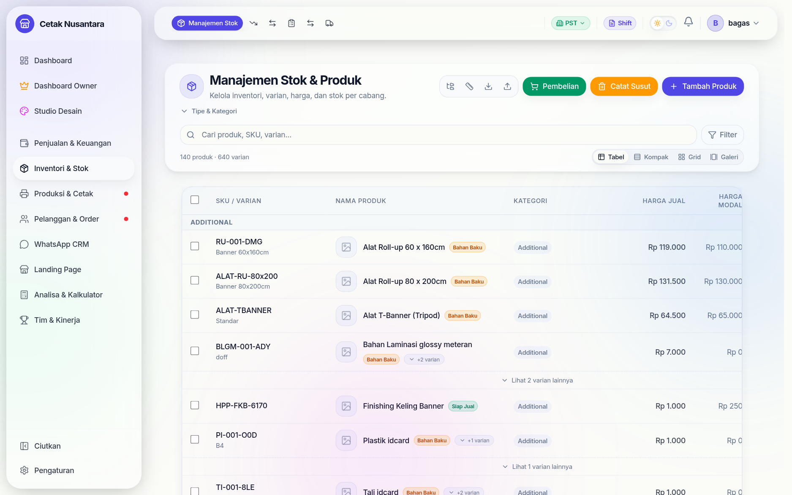

# 🏷️ Katalog Produk & Harga

Halaman **`/inventory`** (menu *Manajemen Stok*) adalah tempat seluruh perilaku
kasir ditentukan. Sebagian besar pertanyaan "kok tidak muncul di papan
produksi?" atau "kok harganya salah?" jawabannya ada di sini, bukan di halaman
kasir.



## Susunan datanya

```
Kategori ─┐
Satuan  ──┼─→ Produk ─→ Varian ─→ Harga bertingkat
          │      │         └────→ Tarif klik mesin
          │      ├──→ Bahan (resep HPP)
          │      └──→ Konfigurasi paket (komposit)
          └─→ Kategori produksi (untuk papan produksi)
```

## Saklar penting pada produk

Enam kolom ini menentukan apa yang terjadi saat produk terjual:

| Kolom | Artinya kalau aktif |
|---|---|
| `requiresProduction` | Setiap penjualan **membuat pekerjaan di [Antrian Produksi](produksi.md)** |
| `hasAssemblyStage` | Pekerjaannya punya tahap pasang/rakit terpisah setelah dicetak |
| `trackStock` | Stok bahan dipotong, dan nota **ditolak** bila stok kurang |
| `clickRateId` / `clicksPerUnit` | Penjualan **membuat pekerjaan di [Antrian Cetak](mesin-cetak.md)** dan mencatat klik mesin |
| `isActive` | Produk muncul di kasir; dimatikan = disembunyikan tanpa menghapus riwayat |
| `productType` | `SELLABLE` (dijual), `RAW_MATERIAL` (bahan, tidak dijual langsung), `SERVICE` (jasa) |

> Inilah pasangan saklar yang paling sering jadi sumber kebingungan:
> **produksi** digerakkan `requiresProduction`, **cetak** digerakkan tarif klik.
> Produk bisa punya salah satu, keduanya, atau tidak sama sama sekali.

## Tiga mode harga

- **`UNIT`** — harga per satuan, dikali jumlah.
- **`AREA_BASED`** — harga per m²; kasir mengisi lebar × tinggi dalam cm.
  Satuan areanya disimpan di `areaUnit`.
- **`COMPOSITE`** — produk paket. `compositeConfig` (JSON) mendefinisikan
  komponen dan pilihan yang muncul di kasir. Tarif klik paket **diturunkan dari
  komponennya**, bukan dari produk paketnya sendiri.

## Varian & harga bertingkat

Satu produk punya banyak **varian** (ukuran, bahan, jumlah sisi) dan tiap varian
punya harga sendiri. Di atasnya bisa ditumpuk **harga bertingkat**
(`variant_price_tiers`): rentang jumlah → harga. Contoh: 1–99 pcs Rp 1.500,
100–499 pcs Rp 1.200, 500+ Rp 1.000. Kasir tidak perlu menghitung apa pun —
harga mengikuti jumlah yang diketik.

Fitur ini dinyalakan lewat `enable_advanced_pricing` di
[Pengaturan](pengaturan.md).

## Tarif klik mesin

`click_rates` mendefinisikan biaya per klik berdasarkan **ukuran kertas**,
**mode warna**, dan **satu/dua sisi**. Satu tarif dipakai bersama oleh banyak
produk dan varian. Menetapkan tarif ke varian lebih tepat daripada ke produk,
karena satu produk sering punya varian 1 sisi dan 2 sisi dengan biaya berbeda.

## Bahan & HPP

`ingredients` adalah **resep** produk: bahan apa, berapa banyak, harga berapa.
Dari situ [Kalkulator HPP](hpp-calculator.md) menghitung modal per produk, dan
`hpp_worksheets` menyimpan perhitungan yang sudah disetujui.

## Metrik produk custom

Owner bisa membuat kolom pelacak sendiri (`custom_product_metrics`) untuk
produk atau varian tertentu — misalnya "berapa meter banner terjual per
operator" — yang kemudian muncul sebagai kolom di [Leaderboard](leaderboard.md).

## Halaman terkait

| Halaman | Untuk |
|---|---|
| `/inventory` | daftar produk & stok |
| `/inventory/products/new`, `/inventory/products/[id]/edit` | tambah/ubah produk & varian |
| `/inventory/categories` | kategori produk |
| `/inventory/units` | satuan (pcs, m², rim, lembar) |
| `/inventory/suppliers` | [Data supplier](suppliers.md) |
| `/click-counting` | tarif klik & rekap klik mesin |
