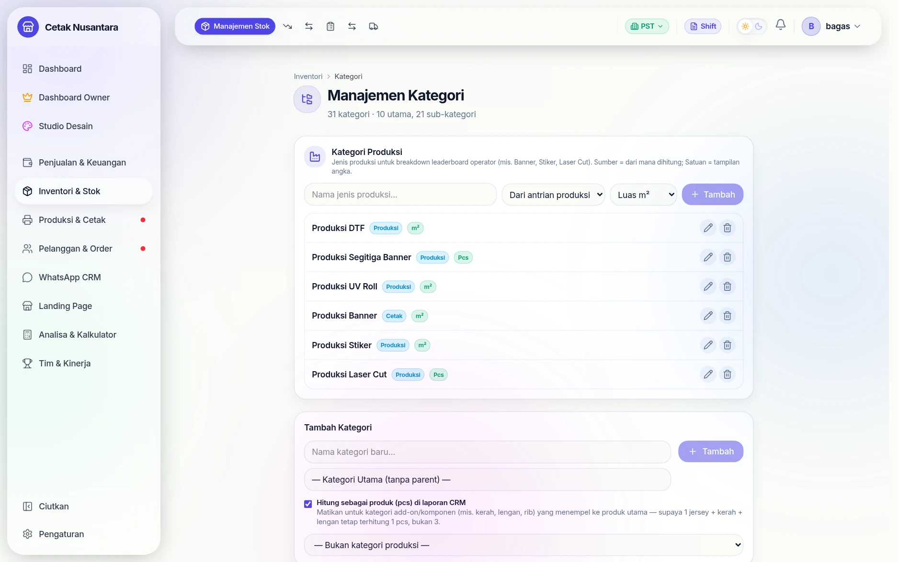
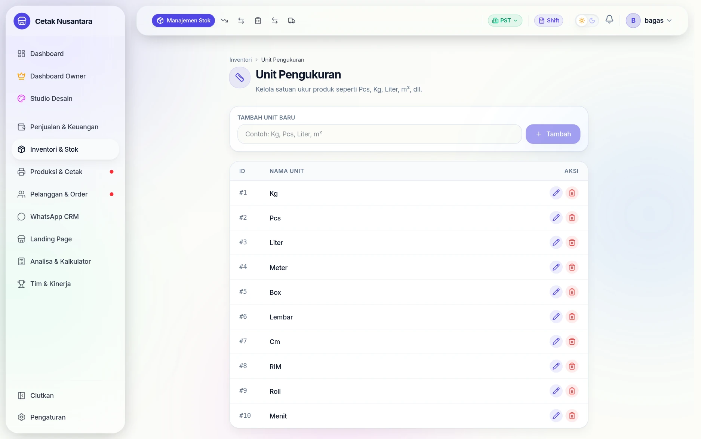
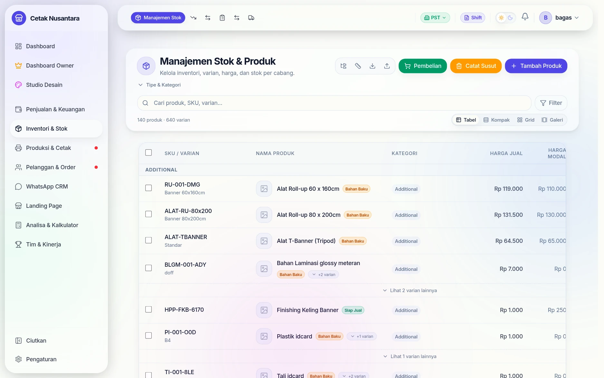
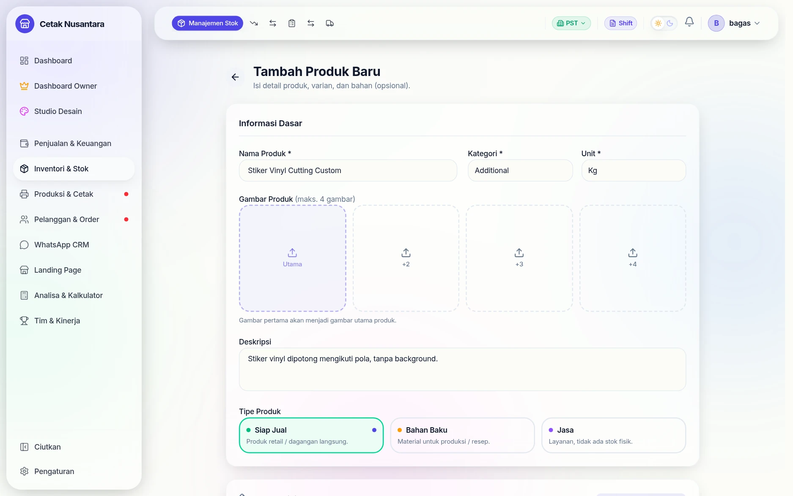
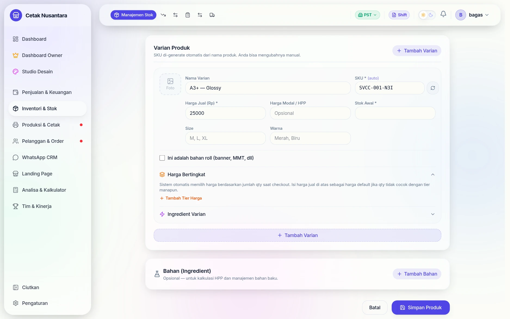
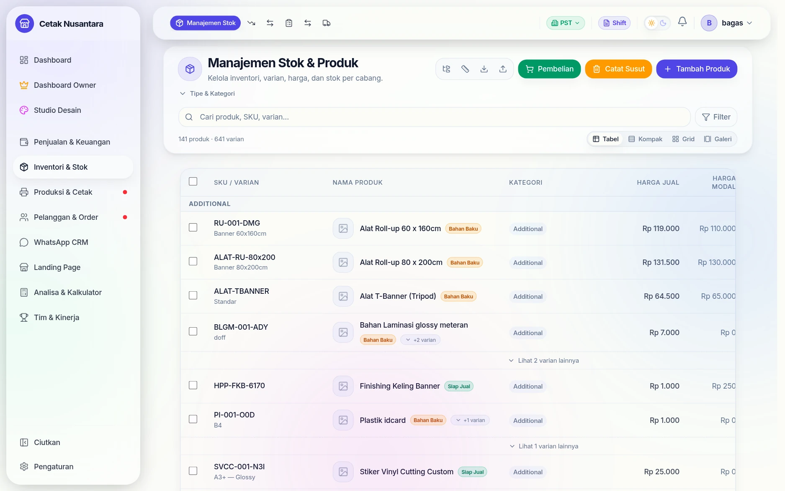

# 🏷️ Katalog Produk & Harga

Halaman **`/inventory`** (menu *Manajemen Stok*) adalah tempat seluruh perilaku
kasir ditentukan. Sebagian besar pertanyaan "kok tidak muncul di papan
produksi?" atau "kok harganya salah?" jawabannya ada di sini, bukan di halaman
kasir.


## Kategori & satuan



**`/inventory/categories`** mengatur dua hal sekaligus:

1. **Kategori produk** biasa (bisa punya sub-kategori) untuk mengelompokkan
   katalog di kasir.
2. **Kategori Produksi** — jenis pekerjaan seperti *Produksi Banner, Stiker,
   UV Roll, Laser Cut, DTF* — beserta **sumber hitungannya** (dari antrian
   produksi atau antrian cetak) dan **satuan tampilannya** (m² atau pcs).
   Inilah yang memecah angka operator di [Leaderboard](leaderboard.md).
   Sejak 22 September 2026 menambah, mengubah, atau menghapus kategori produksi
   khusus **setingkat manajer**, karena mengubahnya menggeser pengelompokan
   angka operator.

Satu centang yang mudah terlewat: **"Hitung sebagai produk (pcs) di laporan
CRM"**. Matikan untuk kategori add-on (kerah, lengan, rib) supaya satu jersey
dengan tiga komponen tetap terhitung **1 pcs**, bukan 3.



**`/inventory/units`** menyimpan daftar satuan yang boleh dipakai produk dan
bahan — dipakai saat membuat produk baru maupun saat mencatat stok masuk.

## Langkah demi langkah: menambah produk baru

### 1. Daftar produk & stok



Halaman inventori menampilkan seluruh produk beserta stok di cabang aktif.

### 2. Isi data produk



Yang wajib: nama, **kategori**, **satuan**, serta satu varian beserta harganya.
Di sinilah saklar-saklar penting itu disetel — *wajib produksi*, *lacak stok*,
tarif klik, dan mode harga.

### 3. Harga bertingkat



Tombol **Harga Bertingkat** menambahkan baris rentang jumlah → harga
(mis. 1–99 pcs, 100–499, 500+). Kasir tidak perlu menghitung apa pun; harga
mengikuti jumlah yang diketik.

### 4. Produk tersimpan



Setelah tersimpan, produk langsung muncul di [Kasir POS](kasir-pos.md).

> Form ini memakai validasi bawaan browser. Kalau ada kolom wajib yang
> terlewat, tombol simpan **tidak melakukan apa-apa** dan pesannya mudah
> terlewat — periksa kategori, satuan, dan harga varian lebih dulu.

> **Stok tidak diubah dari form produk** (sejak 22 September 2026). Saat mengedit
> produk, kolom **Stok** varian yang sudah ada terkunci (*"Ubah lewat Stok
> Cabang"*) dan menyimpan form tidak menyentuh stok. Dulu form menampilkan stok
> cabang aktif lalu menyimpannya sebagai stok total semua cabang. Ubah stok lewat
> **Inventori → Stok Cabang** atau [Stok Opname](stock-opname.md); varian baru
> tetap boleh diisi stok awalnya.

---

## Susunan datanya

```
Kategori ─┐
Satuan  ──┼─→ Produk ─→ Varian ─→ Harga bertingkat
          │      │         └────→ Tarif klik mesin
          │      ├──→ Bahan (resep HPP)
          │      └──→ Konfigurasi paket (komposit)
          └─→ Kategori produksi (untuk papan produksi)
```

## Saklar penting pada produk

Enam kolom ini menentukan apa yang terjadi saat produk terjual:

| Kolom | Artinya kalau aktif |
|---|---|
| `requiresProduction` | Setiap penjualan **membuat pekerjaan di [Antrian Produksi](produksi.md)** |
| `hasAssemblyStage` | Pekerjaannya punya tahap pasang/rakit terpisah setelah dicetak |
| `trackStock` | Stok bahan dipotong, dan nota **ditolak** bila stok kurang |
| `clickRateId` / `clicksPerUnit` | Penjualan **membuat pekerjaan di [Antrian Cetak](mesin-cetak.md)** dan mencatat klik mesin |
| `isActive` | Produk muncul di kasir; dimatikan = disembunyikan tanpa menghapus riwayat |
| `productType` | `SELLABLE` (dijual), `RAW_MATERIAL` (bahan, tidak dijual langsung), `SERVICE` (jasa) |

> Inilah pasangan saklar yang paling sering jadi sumber kebingungan:
> **produksi** digerakkan `requiresProduction`, **cetak** digerakkan tarif klik.
> Produk bisa punya salah satu, keduanya, atau tidak sama sama sekali.

## Tiga mode harga

- **`UNIT`** — harga per satuan, dikali jumlah.
- **`AREA_BASED`** — harga per m²; kasir mengisi lebar × tinggi dalam cm.
  Satuan areanya disimpan di `areaUnit`.
- **`COMPOSITE`** — produk paket. `compositeConfig` (JSON) mendefinisikan
  komponen dan pilihan yang muncul di kasir. Tarif klik paket **diturunkan dari
  komponennya**, bukan dari produk paketnya sendiri.

## Varian & harga bertingkat

Satu produk punya banyak **varian** (ukuran, bahan, jumlah sisi) dan tiap varian
punya harga sendiri. Di atasnya bisa ditumpuk **harga bertingkat**
(`variant_price_tiers`): rentang jumlah → harga. Contoh: 1–99 pcs Rp 1.500,
100–499 pcs Rp 1.200, 500+ Rp 1.000. Kasir tidak perlu menghitung apa pun —
harga mengikuti jumlah yang diketik.

Fitur ini dinyalakan lewat `enable_advanced_pricing` di
[Pengaturan](pengaturan.md).

## Tarif klik mesin

`click_rates` mendefinisikan biaya per klik berdasarkan **ukuran kertas**,
**mode warna**, dan **satu/dua sisi**. Satu tarif dipakai bersama oleh banyak
produk dan varian. Menetapkan tarif ke varian lebih tepat daripada ke produk,
karena satu produk sering punya varian 1 sisi dan 2 sisi dengan biaya berbeda.

## Bahan & HPP

`ingredients` adalah **resep** produk: bahan apa, berapa banyak, harga berapa.
Dari situ [Kalkulator HPP](hpp-calculator.md) menghitung modal per produk, dan
`hpp_worksheets` menyimpan perhitungan yang sudah disetujui.

## Metrik produk custom

Owner bisa membuat kolom pelacak sendiri (`custom_product_metrics`) untuk
produk atau varian tertentu — misalnya "berapa meter banner terjual per
operator" — yang kemudian muncul sebagai kolom di [Leaderboard](leaderboard.md).

## Menghapus produk atau varian

Sejak 22 September 2026:

- Produk yang variannya **sudah punya riwayat** (nota, SO, lead, pergerakan
  stok, pembelian, opname, transfer, atau dipakai sebagai bahan BOM produk lain)
  tidak dihapus melainkan **diarsipkan**: hilang dari daftar, riwayatnya utuh.
- **Varian yang sudah punya riwayat tidak bisa dihapus** — tombolnya menolak
  dengan pesan. Dulu menghapus varian ikut merusak baris nota lama.
- Menghapus varian dari halaman *Edit Produk* hanya untuk Owner/Manajer/Admin,
  ada konfirmasi sebelum varian yang sudah tersimpan dibuang dari form, dan bila
  server menolak, varian tadi muncul lagi di form (tidak hilang diam-diam).

## Stok awal produk baru

Sejak 22 September 2026 stok yang diisi saat membuat produk atau menambah varian
dicatat ke **cabang yang sedang aktif** (beserta jejak *Stok Awal*). Dalam mode
*Semua Cabang* stok awal ditolak — pilih cabang dulu atau kosongkan stoknya lalu
isi lewat Stok Cabang. Dulu stok awal hanya masuk total semua cabang: kasir
cabang melihat 0, dan setelah staf menambah stok cabangnya, total menjadi dobel.

## Halaman terkait

| Halaman | Untuk |
|---|---|
| `/inventory` | daftar produk & stok |
| `/inventory/products/new`, `/inventory/products/[id]/edit` | tambah/ubah produk & varian |
| `/inventory/categories` | kategori produk |
| `/inventory/units` | satuan (pcs, m², rim, lembar) |
| `/inventory/suppliers` | [Data supplier](suppliers.md) |
| `/click-counting` | tarif klik & rekap klik mesin |
