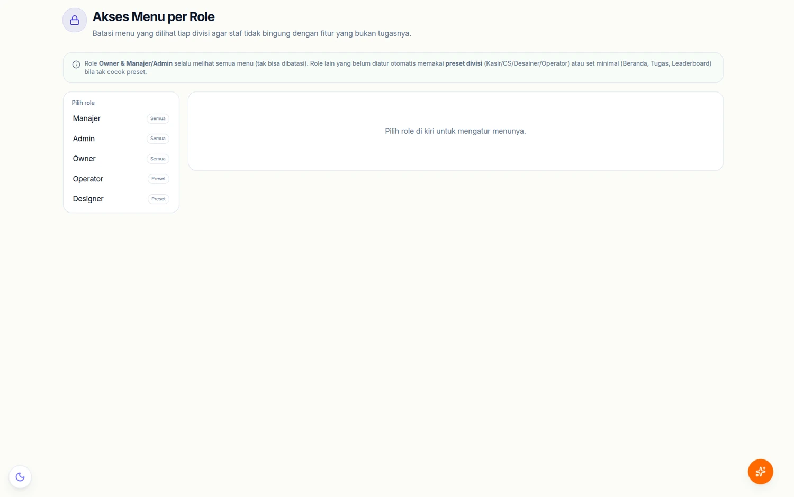
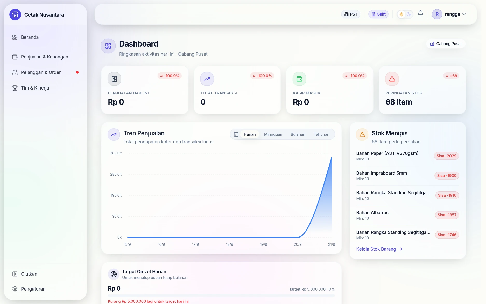
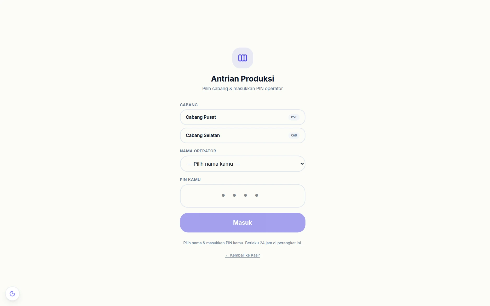
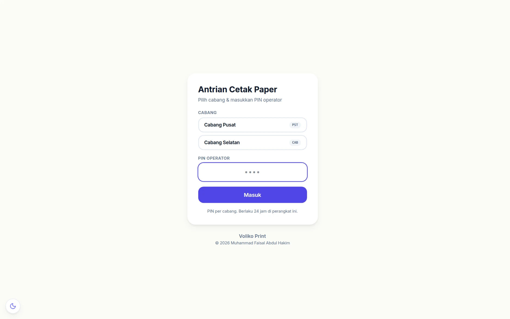
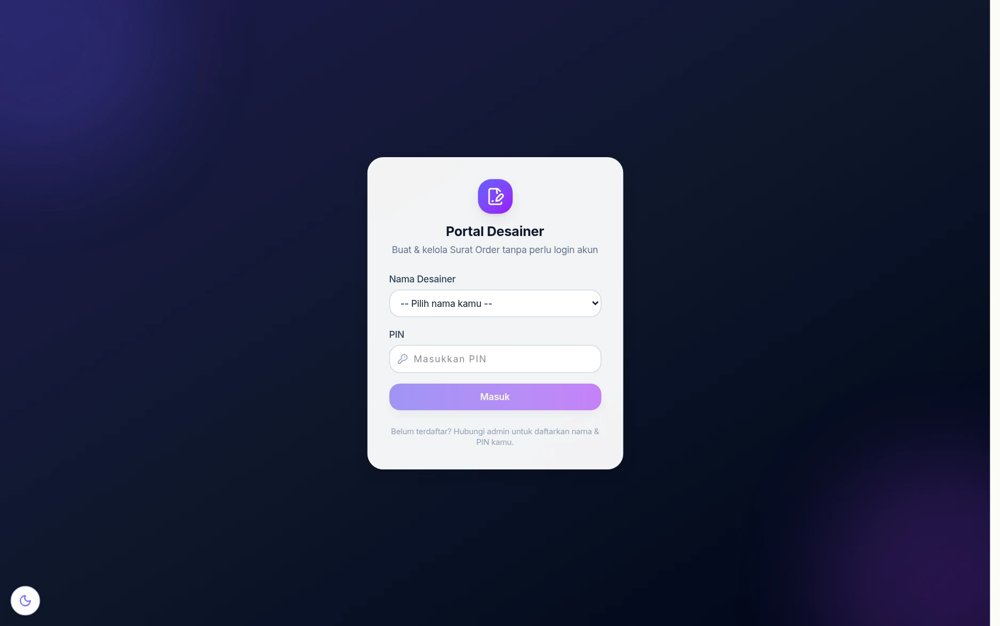

# 🔐 Model Akses & Keamanan

Empat cara berbeda seseorang bisa mengakses PosPro. Memahami keempatnya penting
sebelum menyimpulkan sesuatu "aman" atau "bocor".

## 1. Login email + sandi (JWT)

Cara utama. Sandi disimpan sebagai hash bcrypt, dan setelah login klien memegang
**token JWT** yang dikirim di setiap permintaan. Endpoint yang dijaga
`JwtAuthGuard` menolak permintaan tanpa token dengan HTTP 401.

Peran pengguna dibaca dari database pada **setiap permintaan**, bukan dari isi
token — jadi menurunkan peran seseorang langsung berlaku tanpa menunggu
tokennya kedaluwarsa. Sejak 22 September 2026 aliran langsung **notifikasi** dan
**inbox WhatsApp** (yang tokennya lewat alamat) juga menolak akun nonaktif sebelum
aliran dibuka — dulu karyawan yang dinonaktifkan tetap menerimanya sampai token
habis.

**Pembatas login salah** (sejak 22 September 2026) memakai IP asli pengunjung
dari Cloudflare, bukan header `X-Forwarded-For` yang bisa dipalsukan. Ada tiga
hitungan dalam 10 menit: **akun + IP 8×** (hanya akun itu dari IP itu yang
terkunci, jadi satu orang salah ketik tidak mengunci seisi toko), **per IP 30×**,
dan **per email 20×**. Yang terkunci ditolak 15 menit dengan pesan *"Terlalu banyak
percobaan login gagal"*. Login yang berhasil **tidak** mereset hitungan.

## 2. Pembatasan peran (RolesGuard)

### Wujudnya di layar

Pembatasan peran bukan sekadar tolakan di server — menunya memang tidak muncul.
Akun berperan **Kasir** pada contoh di atas hanya melihat lima kelompok menu
(Beranda, Penjualan & Keuangan, Pelanggan & Order, Tim & Kinerja, Pengaturan),
sementara akun Owner melihat dua belas termasuk Dashboard Owner, Inventori,
Produksi & Cetak, WhatsApp CRM, Landing Page, dan Analisa & Kalkulator.

Daftar menu tiap peran diatur di **`/owner/akses-menu`** — lihat
[Akun & PIN Karyawan](karyawan-akun-pin.md).

Sejak 21 September 2026 **server ikut menegakkan aturan menu**. Dulu menu
hanya disembunyikan di tampilan, sehingga siapa pun yang tahu alamat endpoint
tetap bisa memakainya (mis. akun kasir mengekspor seluruh database). Sekarang
ada tiga tingkat penjaga (berkas `backend/src/auth/role-groups.ts`):

| Penjaga | Siapa yang lolos | Dipakai untuk |
|---|---|---|
| `ManagerGuard` | **setingkat manajer**: Owner, Pemilik, Admin, dan peran yang namanya memuat *manajer/manager/supervisor/kepala* — sama persis dengan peran yang melihat semua menu | pengaturan toko & cabang, rekening bank, cadangan data, Discord, bot WhatsApp lama, identitas PIN, hapus data induk, ubah/hapus kas langsung, koreksi laporan shift |
| `OwnerGuard` | Owner, Pemilik, Superadmin | memulihkan cadangan (menimpa database), memindah dana antar cabang; sejak 22 Sep 2026 juga hapus cabang, mendaftarkan perangkat desktop, mengunduh & mempratinjau cadangan, dan menyimpan setelan rclone |
| `MenuGuard` + `@Menu('/alamat-menu')` | setingkat manajer, **atau** peran yang diberi menu itu di Akses Menu Role | laporan laba kotor, riwayat shift, Kalkulator HPP, klik mesin, landing page, artikel |

Nama peran dibuat bebas oleh owner, jadi dicocokkan per kata kunci (tidak peduli
huruf besar/kecil): "Manajer Toko" dan "Kepala Produksi" sama-sama setingkat
manajer. Peran lain (Kasir, CS, Desainer, Operator, atau nama baru) mengikuti
menu yang diizinkan owner; kalau owner belum mengatur, dipakai preset divisinya.

Endpoint lama dengan `@Roles(...)` (manajemen akun, kartu HR, broadcast WhatsApp
Cloud) tetap seperti semula. Sejak 22 September 2026 manajemen akun punya batas
tambahan: Admin yang bukan Owner hanya mengelola akun **di cabangnya sendiri**,
tidak bisa menyentuh akun Owner, dan tidak bisa memberi peran Owner — termasuk ke
dirinya sendiri. Membuat peran setingkat manajer, atau mengganti nama peran
sehingga levelnya berpindah (staf ↔ manajer), juga khusus Owner. Rinciannya di
[Akun & PIN Karyawan](karyawan-akun-pin.md).

### Contoh: memberi kasir akses Laporan Laba Kotor

1. Owner membuka **Akses Menu Role** (`/owner/akses-menu`), pilih peran *Kasir*.
2. Centang **Laporan Laba Kotor**, simpan.
3. Kasir langsung bisa membuka laporannya — tanpa logout, karena peran dibaca
   ulang di setiap permintaan. Menghapus centangnya menutup akses itu lagi,
   baik di menu maupun di server.

### Yang disembunyikan dari staf non-manajer

Beberapa data tetap dibaca semua staf tapi bagian rahasianya dikosongkan:

| Endpoint | Tetap dikirim | Dikosongkan untuk staf |
|---|---|---|
| `GET /settings` | nama toko, pajak, tema | PIN papan kerja, PIN marketing, URL webhook Discord, rahasia GitHub, tujuan cadangan rclone — sejak 22 Sep 2026 webhook, rahasia GitHub & rclone juga dikosongkan untuk Admin/Manajer (hanya Owner); PIN tetap terlihat oleh mereka |
| `GET /branch-settings/:id` | kop & kaki nota cabang | PIN papan kerja cabang |
| `GET /users` | id, nama, email, peran | nomor HP, pengaturan menu peran |
| `GET /designers` | nama, status | PIN diganti titik (untuk siapa pun, termasuk owner) |
| `GET /printer-relay/devices` | nama, mode, status online | token agen printer — sejak 22 Sep 2026 **hanya Owner** yang melihatnya |

Tombol yang pasti ditolak server juga disembunyikan untuk staf: *Hapus Produk*,
*Kalkulator HPP* di menu produk, hapus kategori/unit, hapus catatan klik dan
*Pengaturan Tarif Klik*, serta tombol *Koreksi* di Riwayat Tutup Shift.

## 3. PIN untuk papan kerja

`/produksi`, `/cetak`, dan `/so-designer` tidak memakai login email, karena satu
perangkat dipakai bergantian sepanjang hari di ruang produksi. Yang dipakai:

| PIN | Disimpan di | Membuktikan |
|---|---|---|
| PIN cabang | `branch_settings.operator_pin` | perangkat ini berada di cabang tersebut |
| PIN pribadi | `designers.pin` | siapa orang yang mengerjakan |

Papan kerja tidak memakai login akun — tapi sejak 21 September 2026 **PIN
diperiksa di server**, bukan hanya di peramban:

1. PIN benar (cabang atau pribadi) → server memberi **token papan kerja**
   berumur 24 jam, disimpan di perangkat itu.
2. Setiap permintaan ke `/production/*` dan `/print-queue/*` wajib membawa token
   itu (header `X-Board-Token`) **atau** token login akun biasa. Tanpa keduanya:
   HTTP 401.
3. Token papan kerja ditandatangani rahasia turunan, jadi tidak pernah bisa
   dipakai sebagai login akun — dan sebaliknya.
4. Papan kerja tidak menerima **nomor HP pelanggan**; halaman kantor (login akun)
   tetap menerimanya.

Kalau token habis masa berlakunya, papan kembali ke layar PIN dengan pesan
*"Sesi berakhir. Masukkan PIN lagi."* — tidak dilempar ke halaman login.

### Pembatas tebakan PIN

PIN 4 digit hanya punya 10.000 kemungkinan. Semua pintu PIN (papan produksi,
papan cetak, portal desainer, piket, absensi, dashboard marketing) kini berbagi
pembatas per alamat IP: **10 PIN salah dalam 10 menit → dikunci 10 menit**
(HTTP 429 *"Terlalu banyak PIN salah. Coba lagi dalam N menit."*). Selama
terkunci, PIN yang benar pun ditolak. PIN benar tidak mereset hitungan, supaya
pemegang satu PIN sah tidak bisa terus menebak PIN orang lain. Angkanya bisa
diubah lewat env `PIN_FAIL_MAX`, `PIN_FAIL_WINDOW_MS`, `PIN_LOCK_MS`.

::: warning Satu toko = satu IP
Semua perangkat di toko biasanya keluar lewat satu IP publik. Kalau ada yang
salah ketik PIN 10 kali berturut-turut, seluruh papan di toko ikut terkunci 10
menit. Tunggu saja — kunci terbuka sendiri.
:::

### Foto yang diunggah dari papan kerja

Ekstensi berkas kini ditentukan server dari **isi** gambarnya (JPG/PNG/WEBP/GIF/
HEIC), bukan dari nama berkas kiriman; SVG dan berkas yang bukan gambar ditolak.
Sebagai lapis kedua, berkas `.html`/`.svg`/`.xml`/`.js` apa pun di `/uploads`
selalu diunduh (bukan dibuka sebagai halaman) dan dijalankan tanpa skrip.

### Wujud gerbang PIN-nya

Tiga papan kerja memakai pola yang sama — dibuka tanpa akun, tapi tetap
meminta identitas sebelum apa pun terlihat.

**`/produksi`** — pilih cabang, pilih nama operator, lalu masukkan PIN. Daftar
pekerjaan baru muncul setelah PIN benar.

**`/cetak`** — pola yang sama. Sejak September 2026 halaman ini memakai **PIN
pribadi** tiap karyawan, bukan PIN cabang bersama, supaya nama yang tercatat
pada hitungan klik mesin benar-benar orang yang mengerjakan.

**`/so-designer`** — portal desainer, dipakai membuat Surat Order tanpa akun
login. Namanya dipilih dari daftar, lalu dikunci PIN masing-masing. Setiap
permintaan membawa PIN — termasuk membuka detail SO (dulu detail SO terbuka
tanpa PIN dan nomornya berurutan, sehingga data pelanggan bisa dipanen).
Sejak 22 September 2026 setiap aksi ber-PIN juga memeriksa **pemilik SO**, jadi
desainer tidak bisa mengubah atau membatalkan SO desainer lain. Pencarian
pelanggan di portal (dulu `GET /customers/public` terbuka tanpa login dan
mengirim semua pelanggan lengkap dengan HP & alamat) kini wajib PIN, minimal 3
huruf, maksimal 20 hasil, dan nomor HP disamarkan (`0812****789`).

Pola ini disengaja: komputer produksi dan meja desain sering dipakai
bergantian, dan memaksa login email di sana justru membuat orang berbagi satu
akun. PIN pendek per orang lebih jujur mencatat siapa mengerjakan apa.

## 4. Tautan publik & webhook

Halaman penilaian pelanggan, opname lapangan, landing page, artikel, dan webhook
Meta harus bisa diakses tanpa akun. Yang menjaganya adalah **token acak panjang
sekali pakai** (untuk tautan) dan **verifikasi tanda tangan/verify token** (untuk
webhook).

Sejak 22 September 2026 isi **artikel** disaring saat disimpan dan sekali lagi
saat ditampilkan: hanya tag format dari editor yang dipertahankan, sedangkan
skrip, `iframe`/sematan, dan atribut `on…` dibuang. Pembatas **order publik** juga
memakai IP asli pengunjung — dulu semua pemanggil terbaca satu alamat, sehingga
berbagi satu kuota.

---

## Audit endpoint tanpa penjaga login

Kondisi per **21 September 2026**. "Terbuka" = tanpa `JwtAuthGuard`; sejak
tanggal itu endpoint papan kerja yang terbuka pun wajib token papan kerja atau
PIN di setiap permintaan. Daftar terbaru selalu bisa dibangkitkan ulang —
lihat [Referensi Endpoint](referensi-endpoint.md).

| Kelompok | Terbuka | Alasannya |
|---|---:|---|
| `ProductionController` | 21/28 | papan produksi: 16 wajib token papan kerja, 5 lainnya PIN per permintaan / verifikasi PIN |
| `SalesOrdersPublicController` | 12/12 | portal desainer — PIN di setiap permintaan |
| `WhatsappController` (bot lama) | 0/10 | penjaga login (20 Sep) + hanya setingkat manajer (21 Sep) |
| `PrintQueueController` | 8/8 | papan cetak: 7 wajib token papan kerja, 1 verifikasi PIN |
| `TaskBoardPinController` | 6/6 | piket di papan kerja ber-PIN |
| `KpiPublicController` | 5/5 | papan TV & verifikasi PIN |
| `CsRatingPublicController` | 5/5 | tautan penilaian pelanggan |
| `StockOpnamePublicController` | 3/3 | tautan opname lapangan |
| `ProductsPublicController` | 3/3 | halaman produk publik `/p/[id]` |
| `DesignersPublicController` | 2/2 | daftar nama & verifikasi PIN |
| `WhatsappWebhookController` | 2/2 | webhook Meta (diverifikasi tanda tangan) |
| `SocialWebhookController` | 2/2 | webhook Instagram/Facebook |
| `ArticlesController` | 2/7 | artikel publik |
| `PrinterRelayController` | 2/9 | agen printer di PC kasir (memakai token sendiri) |
| `LandingController` | 1/5 | landing page publik |
| `SettingsController` | 1/7 | nama & tema toko untuk halaman login |
| `CompanyBranchesController` | 1/6 | daftar cabang untuk pemilih di halaman ber-PIN |
| `AuthController` | 1/2 | endpoint login itu sendiri |
| `HrPinController` | 1/1 | tukar PIN → tautan portal absensi |
| `CustomersPublicController` | 1/1 | pencarian pelanggan portal desainer — wajib PIN, HP disamarkan (sejak 22 Sep 2026) |
| `WebhookController` | 1/1 | webhook GitHub (diverifikasi `github_webhook_secret`) |
| `AppController` | 1/1 | health check |

### Catatan: bot WhatsApp lama

`WhatsappController` (modul `backend/src/whatsapp/`) adalah bot berbasis sesi QR
yang masih terpasang karena WhatsApp Cloud API resmi tidak bisa mengirim ke
**grup**, sementara rekap shift dikirim ke grup pemilik.

Modul ini sempat tidak memakai penjaga login — sisa dari versi awal aplikasi,
bukan keputusan yang disengaja. Sejak 20 September 2026 seluruh endpointnya
memakai `JwtAuthGuard` seperti modul lain.

## Hal lain yang patut diperhatikan

- **`/tv/leaderboard`** menampilkan omzet dan nama karyawan tanpa login,
  karena TV tidak bisa mengetik sandi. Sebaiknya hanya dapat diakses dari
  jaringan toko.
- **Kunci integrasi** (`HR_API_KEY`, `STAFF_KPI_API_KEY`) dipakai untuk
  panggilan antar-server dan tidak pernah dikirim ke browser.
- **Sinkron data (`/sync/pull`)** sejak 22 September 2026: akun login biasa hanya
  bisa menarik data referensi (produk, varian, harga bertingkat, kategori, satuan,
  pelanggan, stok cabang, supplier) — dulu setiap akun bisa menarik hash sandi &
  PIN semua orang. Akun, pengaturan, rekening, SO & lead khusus **perangkat
  terdaftar**, dan mendaftarkan perangkat kini **khusus Owner**. Perangkat menerima
  hash sandi & PIN hanya untuk cabangnya (login offline); webhook & rclone tidak
  pernah dikirim ke siapa pun.
- **Inbox WhatsApp & DM Instagram/Facebook** sejak 22 September 2026 memeriksa
  setiap percakapan yang dibuka: staf cabang hanya kanal cabangnya (atau kanal
  tanpa cabang); desainer & operator hanya chat miliknya, yang belum ditangani,
  atau pelanggan SO-nya. Dulu nomor percakapan cabang lain bisa dibuka langsung.
- **Papan kerja** (/produksi, /cetak) sejak 22 September 2026 hanya menampilkan dan
  menggerakkan job cabang token PIN-nya (staf: cabangnya). Owner tetap semua.
- **Celah SQL injection** di Laporan Bahan Titipan (filter tanggal) dan catatan
  pelunasan Buku Titipan ditutup 22 September 2026 — isian kini dikirim sebagai
  parameter, dan tanggal laporan wajib berformat `YYYY-MM-DD`.
- **Cabang** diambil dari header `X-Branch-Id` untuk akun Owner, sementara staf
  memakai cabang dari tokennya — header dari staf diabaikan, jadi tidak bisa
  dipakai untuk melihat cabang lain.
- **Halaman tidak ditemukan (404)** tidak lagi menyebut alamat berkas di server,
  dan galat karena kiriman yang salah (kolom tak dikenal, duplikat) dijawab 4xx
  dengan pesan yang bisa dibaca, bukan 500.
- **Ekspor Excel** menetralkan sel yang diawali `=`, `+`, `-`, atau `@` (dengan awalan
  `'`) supaya isian seperti `=HYPERLINK(...)` tidak dijalankan sebagai rumus. Nomor
  HP `+62…` dan angka tetap utuh.
- **Zona waktu** proses dikunci ke `Asia/Jakarta` (atau env `TZ`/`APP_TZ`), jadi batas
  hari laporan tetap benar walau server berzona UTC.
- **Repo ini publik.** Jangan pernah menaruh berkas `.env`, unggahan pelanggan,
  dokumen karyawan, atau daftar harga di dalamnya. Lihat
  [Setup Lokal](setup-lokal.md) untuk cara membuat data uji yang aman.
