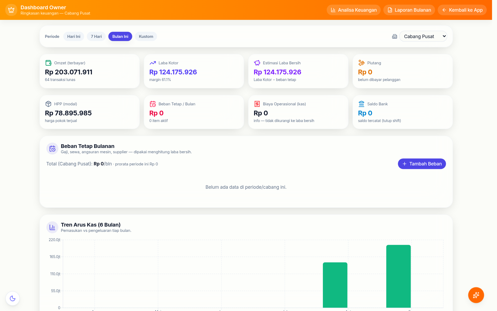
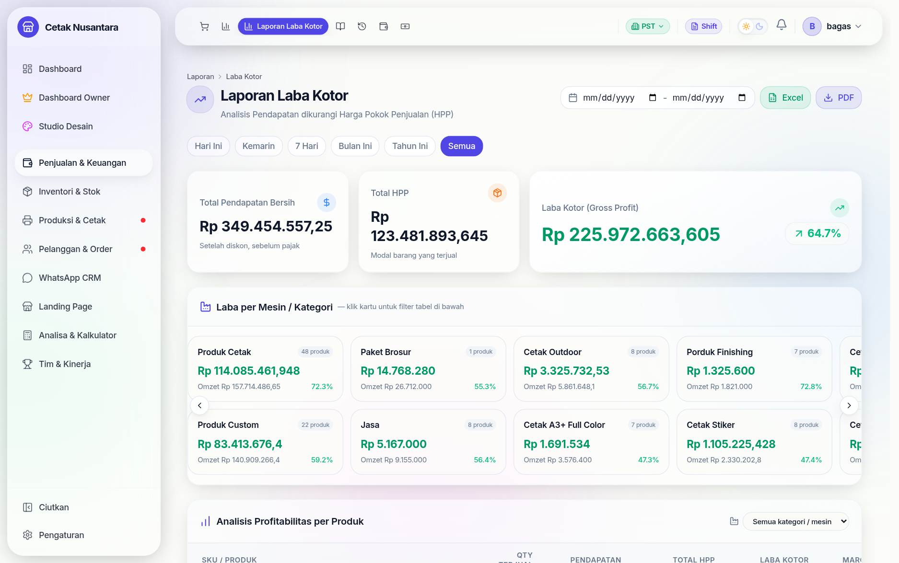

# 📈 Keuangan Owner

Kumpulan halaman yang hanya dilihat pemilik: bukan "berapa penjualan hari ini"
(itu ada di [Laporan Penjualan](laporan-penjualan.md)), tapi **apakah usahanya
sehat**.

Laporan laba kotor yang dipakai sehari-hari:

## Analisa Keuangan — `/owner/analisa-keuangan`

Satu halaman dengan banyak sudut pandang, masing-masing punya endpoint sendiri
di `/reports/finance/*`:

| Yang dijawab | Endpoint |
|---|---|
| Untung-rugi bulan ini, per cabang & gabungan | `/consolidation` |
| Perbandingan antar periode atau antar cabang | `/comparison` |
| Ke mana uang keluar (per kategori) | `/expense-breakdown` |
| Hari & jam paling ramai | `/heatmap`, `/orders-by-hour` |
| Pergerakan harian ala grafik lilin | `/candles` |
| Kejanggalan yang perlu diperiksa | `/anomalies` |
| Apakah target harian tercapai | `/daily-target-status` |
| Jurnal ringkas semua arus uang | `/journal` |
| Pencocokan kas sistem vs kas fisik | `/reconciliation` |

**Anomali** dan **rekonsiliasi** adalah yang paling berguna dalam praktik:
keduanya menunjuk selisih yang perlu ditelusuri, bukan sekadar menampilkan
angka besar.

## Kas pusat & pendanaan cabang

Untuk usaha bercabang, uang sering berpindah antar cabang dan pusat:

| Endpoint | Untuk |
|---|---|
| `/reports/finance/central-treasury` | saldo kas pusat (`central_treasury_entries`) |
| `/reports/finance/fund-branch` | mengirim modal ke cabang |
| `/reports/finance/central-expense` | pengeluaran yang ditanggung pusat |
| `/reports/finance/close-branch` | menutup buku satu cabang |

## Tutup Buku Bulanan — `/reports/tutup-buku`

Mengunci satu bulan agar angkanya tidak berubah lagi setelah dilaporkan.
Hasilnya tersimpan di `branch_monthly_closings`, dan laporan bulanannya
dibangkitkan di **`/owner/laporan-bulanan`** (`/reports/finance/monthly-report`).

Kunci ini penting saat ada koreksi nota belakangan: laporan bulan yang sudah
ditutup tetap seperti saat dilaporkan.

## Biaya tetap

Gaji, sewa, langganan, angsuran mesin — dicatat sekali di `fixed_expenses`
beserta tanggal jatuh temponya, lalu ikut masuk perhitungan laba supaya
"untung" yang muncul bukan hanya laba kotor.

> Isi tabel ini termasuk data paling sensitif di aplikasi (nominal gaji per
> orang). Perhatikan siapa yang boleh melihat menu ini — lihat
> [Akses Menu Role](karyawan-akun-pin.md#akses-menu-per-peran).

## Bonus & target

`bonus_targets` menetapkan target (per orang, per peran, atau per cabang) dan
`bonus_adjustments` mencatat penambahan/pengurangan manual. Angka pencapaiannya
diambil dari data yang sama dengan [Leaderboard](leaderboard.md), jadi tidak ada
rekap terpisah yang harus diisi tangan.

## Rekening bank & metode bayar

`bank_accounts` menyimpan rekening penerima transfer; saat kasir memilih
`BANK_TRANSFER` ia memilih rekening mana. Itulah yang memungkinkan
[Tutup Shift](tutup-shift.md) menghitung saldo yang seharusnya **per rekening**,
bukan hanya satu angka transfer.

## Permintaan perubahan kas

Staf tidak bisa mengubah catatan kas yang sudah masuk. Perubahannya diajukan
(`cashflow_change_requests`) dan disetujui Manajer — jejaknya tetap ada, jadi
koreksi tidak bisa dipakai untuk menutupi selisih.
