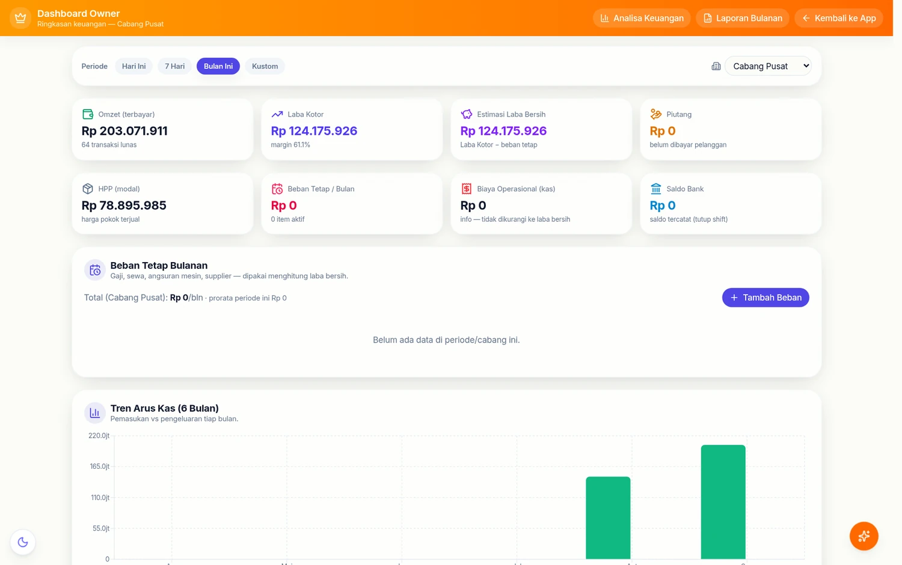
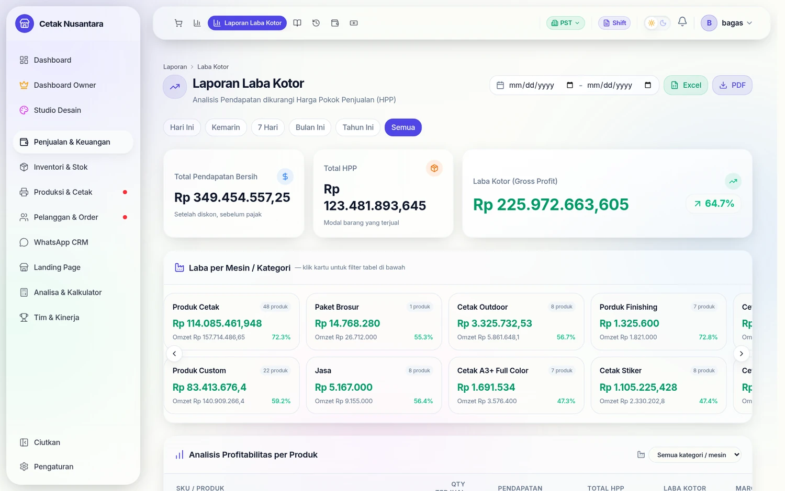
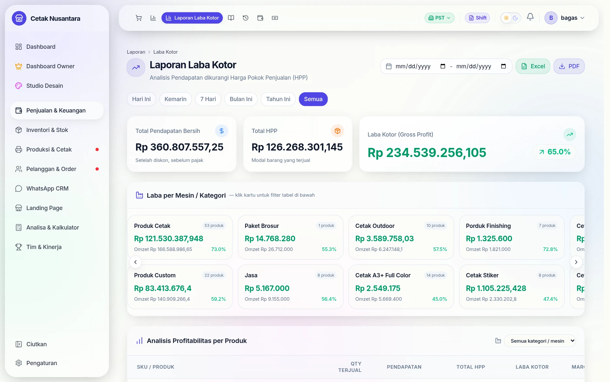
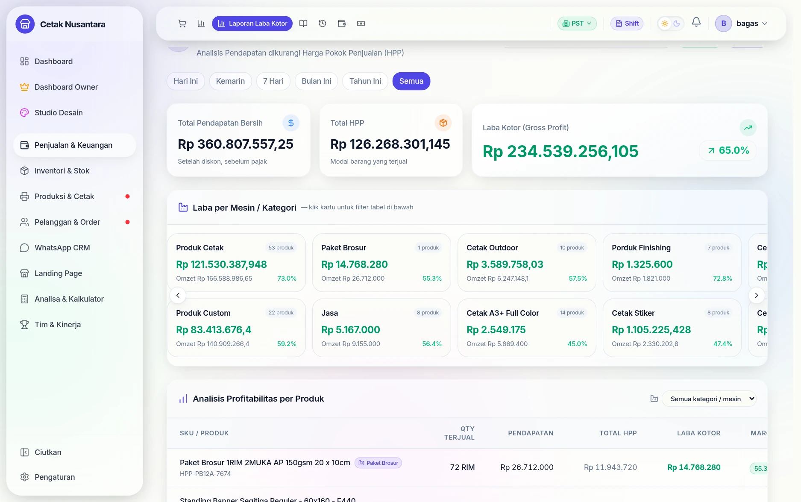
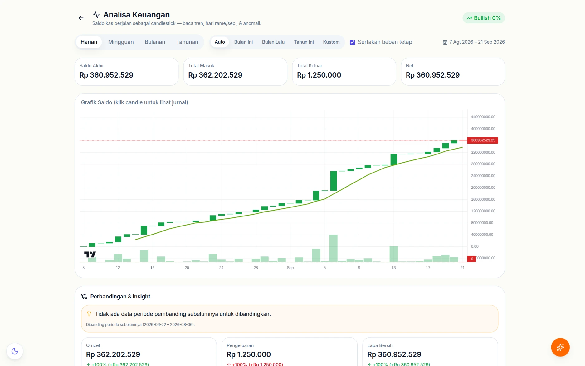
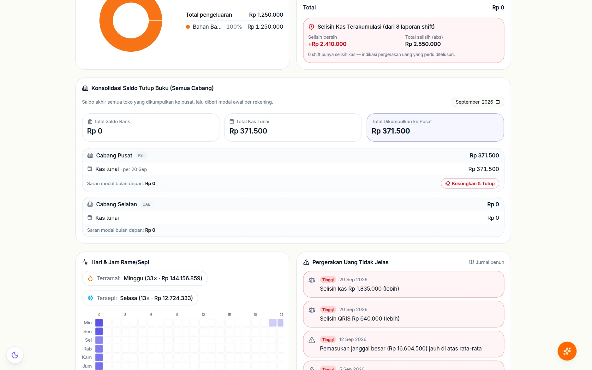
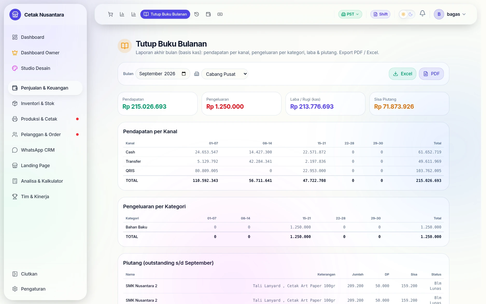
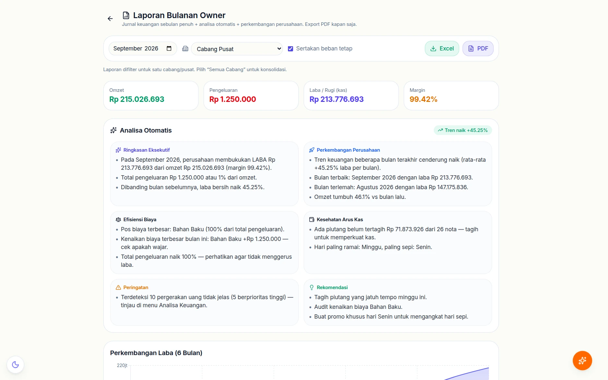

# 📈 Keuangan Owner

Kumpulan halaman yang hanya dilihat pemilik: bukan "berapa penjualan hari ini"
(itu ada di [Laporan Penjualan](laporan-penjualan.md)), tapi **apakah usahanya
sehat**.

Laporan laba kotor yang dipakai sehari-hari:

## Langkah demi langkah

### 1. Laba kotor: omzet dikurangi HPP

Halaman **`/reports/profit`** menjawab pertanyaan yang tidak dijawab laporan
penjualan: dari omzet sekian, berapa yang benar-benar jadi laba setelah
dikurangi modal bahan. Angkanya memakai HPP yang disusun di
[Kalkulator HPP](hpp-calculator.md).

### 2. Rincian per produk & margin

Di sinilah terlihat produk yang ramai tapi tipis marginnya — informasi yang
tidak muncul di leaderboard maupun rekap penjualan.

### 3. Analisa keuangan: saldo kas sebagai candlestick

**`/owner/analisa-keuangan`** menggambar saldo kas berjalan seperti grafik
saham: tiap batang mewakili satu periode (harian/mingguan/bulanan), sehingga
hari ramai dan hari sepi terbaca sebagai pola, bukan sebagai deretan angka.

### 4. Perbandingan periode & ke mana uang pergi

Bagian bawahnya membandingkan periode berjalan dengan periode sebelumnya —
omzet, pengeluaran, dan laba bersih beserta selisih persennya — lalu memecah
**"Pengeluaran ke Mana"** per kategori. Ini bahan rapat bulanan yang biasanya
harus disusun manual di spreadsheet.

## Analisa Keuangan — `/owner/analisa-keuangan`

Satu halaman dengan banyak sudut pandang, masing-masing punya endpoint sendiri
di `/reports/finance/*`:

| Yang dijawab | Endpoint |
|---|---|
| Untung-rugi bulan ini, per cabang & gabungan | `/consolidation` |
| Perbandingan antar periode atau antar cabang | `/comparison` |
| Ke mana uang keluar (per kategori) | `/expense-breakdown` |
| Hari & jam paling ramai | `/heatmap`, `/orders-by-hour` |
| Pergerakan harian ala grafik lilin | `/candles` |
| Kejanggalan yang perlu diperiksa | `/anomalies` |
| Apakah target harian tercapai | `/daily-target-status` |
| Jurnal ringkas semua arus uang | `/journal` |
| Pencocokan kas sistem vs kas fisik | `/reconciliation` |

**Anomali** dan **rekonsiliasi** adalah yang paling berguna dalam praktik:
keduanya menunjuk selisih yang perlu ditelusuri, bukan sekadar menampilkan
angka besar.

### Tutup buku bulanan

**`/reports/tutup-buku`** menyusun laporan akhir bulan **berbasis kas**: empat
kartu ringkas (Pendapatan, Pengeluaran, Laba/Rugi kas, Sisa Piutang), lalu
tabel *Pendapatan per Kanal* yang dipecah per pekan (01–07, 08–14, 15–21,
22–28, 29–30) untuk Cash, Transfer, dan QRIS.

Di bawahnya *Pengeluaran per Kategori* dengan pemecahan pekan yang sama, dan
daftar **piutang outstanding** beserta DP yang sudah masuk. Tombol **Excel**
dan **PDF** mengunduh versi yang siap dikirim.

### Laporan bulanan dengan analisa otomatis

**`/owner/laporan-bulanan`** melakukan hal yang biasanya dikerjakan manual:
membaca angka bulan itu lalu menuliskan kesimpulannya. Enam kotak analisanya:

| Kotak | Isi contohnya |
|---|---|
| **Ringkasan Eksekutif** | laba, margin, dan perbandingan dengan bulan lalu |
| **Perkembangan Perusahaan** | tren beberapa bulan, bulan terbaik & terlemah |
| **Efisiensi Biaya** | pos biaya terbesar dan kenaikan yang perlu dicek |
| **Kesehatan Arus Kas** | piutang belum tertagih, hari paling ramai & paling sepi |
| **Peringatan** | pergerakan uang tidak jelas yang perlu ditinjau |
| **Rekomendasi** | tindakan konkret, mis. menagih piutang jatuh tempo |

Centang **Sertakan beban tetap** menambahkan biaya tetap bulanan ke
perhitungan, dan seluruh laporan bisa diekspor PDF/Excel.

## Kas pusat & pendanaan cabang

Untuk usaha bercabang, uang sering berpindah antar cabang dan pusat:

| Endpoint | Untuk |
|---|---|
| `/reports/finance/central-treasury` | saldo kas pusat (`central_treasury_entries`) |
| `/reports/finance/fund-branch` | mengirim modal ke cabang |
| `/reports/finance/central-expense` | pengeluaran yang ditanggung pusat |
| `/reports/finance/close-branch` | menutup buku satu cabang |

## Tutup Buku Bulanan — `/reports/tutup-buku`

Mengunci satu bulan agar angkanya tidak berubah lagi setelah dilaporkan.
Hasilnya tersimpan di `branch_monthly_closings`, dan laporan bulanannya
dibangkitkan di **`/owner/laporan-bulanan`** (`/reports/finance/monthly-report`).

Kunci ini penting saat ada koreksi nota belakangan: laporan bulan yang sudah
ditutup tetap seperti saat dilaporkan.

## Biaya tetap

Gaji, sewa, langganan, angsuran mesin — dicatat sekali di `fixed_expenses`
beserta tanggal jatuh temponya, lalu ikut masuk perhitungan laba supaya
"untung" yang muncul bukan hanya laba kotor.

> Isi tabel ini termasuk data paling sensitif di aplikasi (nominal gaji per
> orang). Perhatikan siapa yang boleh melihat menu ini — lihat
> [Akses Menu Role](karyawan-akun-pin.md#akses-menu-per-peran).

## Bonus & target

`bonus_targets` menetapkan target (per orang, per peran, atau per cabang) dan
`bonus_adjustments` mencatat penambahan/pengurangan manual. Angka pencapaiannya
diambil dari data yang sama dengan [Leaderboard](leaderboard.md), jadi tidak ada
rekap terpisah yang harus diisi tangan.

## Rekening bank & metode bayar

`bank_accounts` menyimpan rekening penerima transfer; saat kasir memilih
`BANK_TRANSFER` ia memilih rekening mana. Itulah yang memungkinkan
[Tutup Shift](tutup-shift.md) menghitung saldo yang seharusnya **per rekening**,
bukan hanya satu angka transfer.

## Permintaan perubahan kas

Staf tidak bisa mengubah catatan kas yang sudah masuk. Perubahannya diajukan
(`cashflow_change_requests`) dan disetujui Manajer — jejaknya tetap ada, jadi
koreksi tidak bisa dipakai untuk menutupi selisih.
