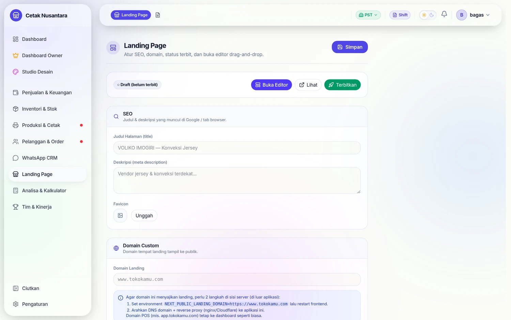
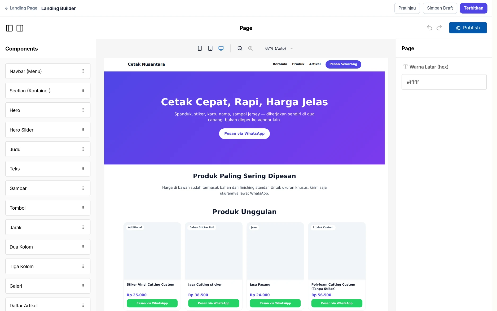
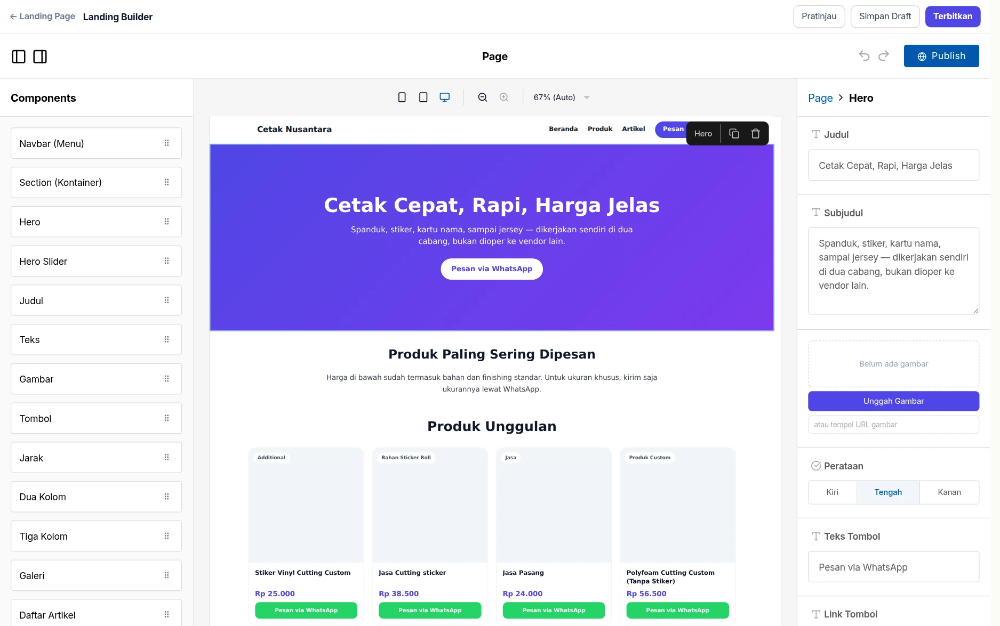
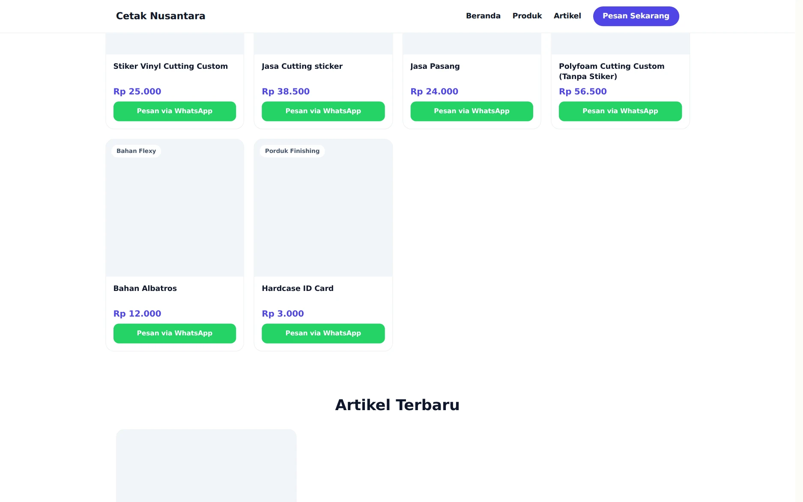

# Landing Page Builder

Bangun landing page toko dengan **drag-and-drop** (pakai library Puck), kelola dari dashboard, sajikan di **domain custom terpisah**.

## Langkah demi langkah

Contoh nyata: menyusun halaman depan toko lalu menayangkannya.

### 1. Editor: panel blok, kanvas, panel properti

Tiga area yang selalu sama: **kiri** daftar blok yang bisa ditarik, **tengah**
kanvas berisi halaman seperti aslinya, **kanan** properti blok yang sedang
dipilih. Tombol *Simpan Draft*, *Pratinjau*, dan *Terbitkan* ada di kanan atas.

Blok yang tersedia: Navbar, Section, Hero, Hero Slider, Judul, Teks, Gambar,
Tombol, Jarak, Dua/Tiga Kolom, Galeri, Daftar Artikel, Kontak & Peta, Slider
Unggulan, dan **Grid Produk**.

### 2. Mengubah isi blok tanpa menyentuh kode

Klik satu blok di kanvas, panel kanan langsung menampilkan isinya: judul,
subjudul, gambar, perataan, sampai teks & tautan tombol. Perubahan tampak
seketika di kanvas — tidak ada langkah "render ulang".

Yang membuat **Grid Produk** berbeda dari builder biasa: ia tidak meminta Anda
mengetik daftar produk. Ia menarik produk langsung dari katalog POS, sehingga
harga di landing tidak pernah beda dengan harga di kasir.

### 3. Hasil yang dilihat pengunjung

**Simpan Draft** menyimpan tanpa menayangkan; **Terbitkan** menyalin draft itu
menjadi versi publik. Artinya halaman yang sedang dilihat pengunjung tidak
pernah berubah saat Anda sedang menyusun ulang isinya.

### 4. Produk & artikel ikut tampil sendiri

Blok Grid Produk menampilkan nama, kategori, harga, dan tombol **Pesan via
WhatsApp** yang langsung membuka chat dengan nomor toko. Di bawahnya, blok
Daftar Artikel menarik tulisan terbaru dari [Artikel](artikel.md) — satu
halaman yang isinya ikut bergerak sendiri mengikuti katalog dan blog.

## Alur pakai
1. Dashboard → `Pengaturan › Landing Page` (membuka editor full-screen `/landing-builder`).
2. Tarik blok dari panel kiri ke kanvas, atur isinya di panel kanan, urutkan dengan drag.
3. **Simpan Draft** untuk menyimpan tanpa menayangkan; **Terbitkan** untuk menayangkan ke publik.
4. **Pratinjau** membuka `/landing`.

## Blok tersedia
Hero, Judul, Teks, Gambar, Tombol, Jarak (spacer), Galeri, Kontak & Peta (alamat + WhatsApp + embed Google Maps), dan **Grid Produk** (otomatis menarik produk dari katalog POS — gambar & harga ikut data produk).

## Domain custom
- Halaman publik: `/landing`.
- Untuk domain sendiri (mis. `www.tokokamu.com`):
  1. Set env `NEXT_PUBLIC_LANDING_DOMAIN=https://www.tokokamu.com`.
  2. Arahkan DNS domain itu + reverse proxy (nginx/Cloudflare) ke app Next.js yang sama.
  - Saat ada pengunjung di domain itu, app otomatis menyajikan landing (tanpa login). Domain POS (mis. `app.tokokamu.com`) tetap ke dashboard seperti biasa.

## Aktivasi (developer)
- Backend: `npx prisma generate` lalu restart (model `LandingConfig` / tabel `landing_config`).
- Frontend: dependency `@measured/puck` (sudah di `package.json`).

## Catatan
Pengaturan SEO (judul/deskripsi/favicon) tersimpan di config; form pengaturannya menyusul. Konten yang dirender publik hanya versi yang sudah **Terbitkan**.
