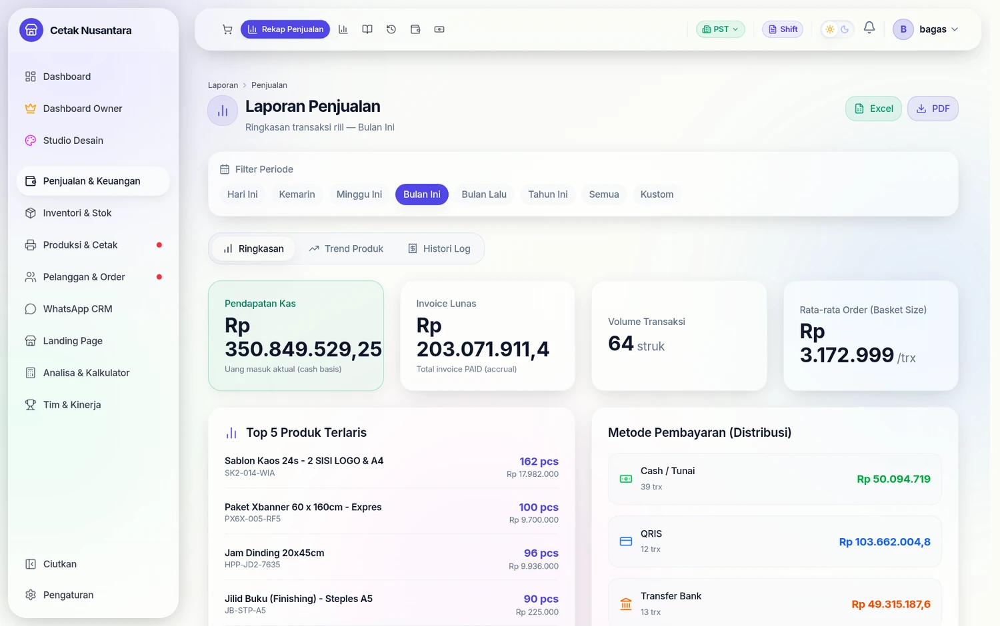
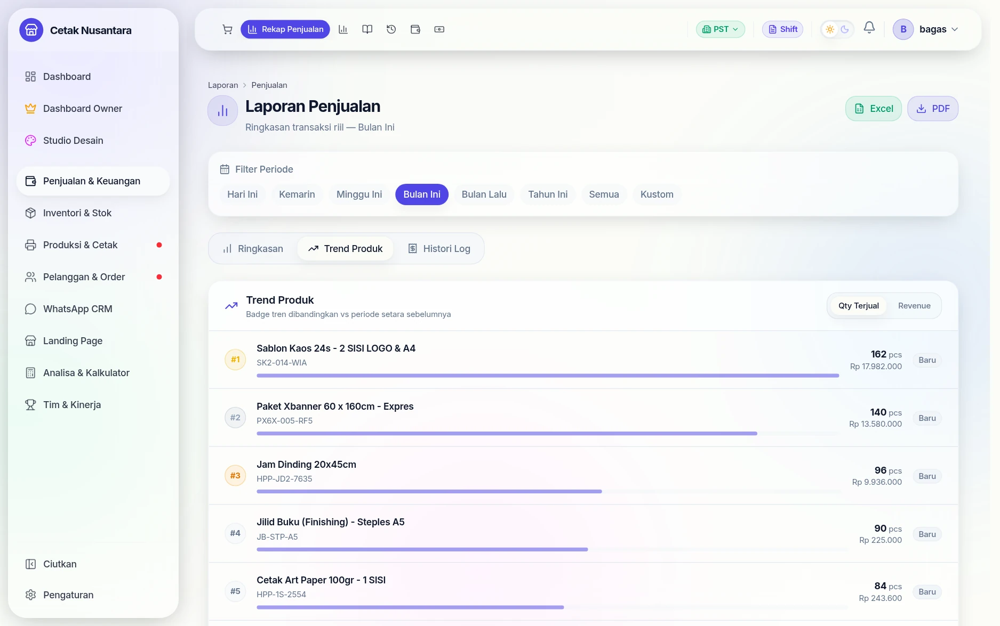
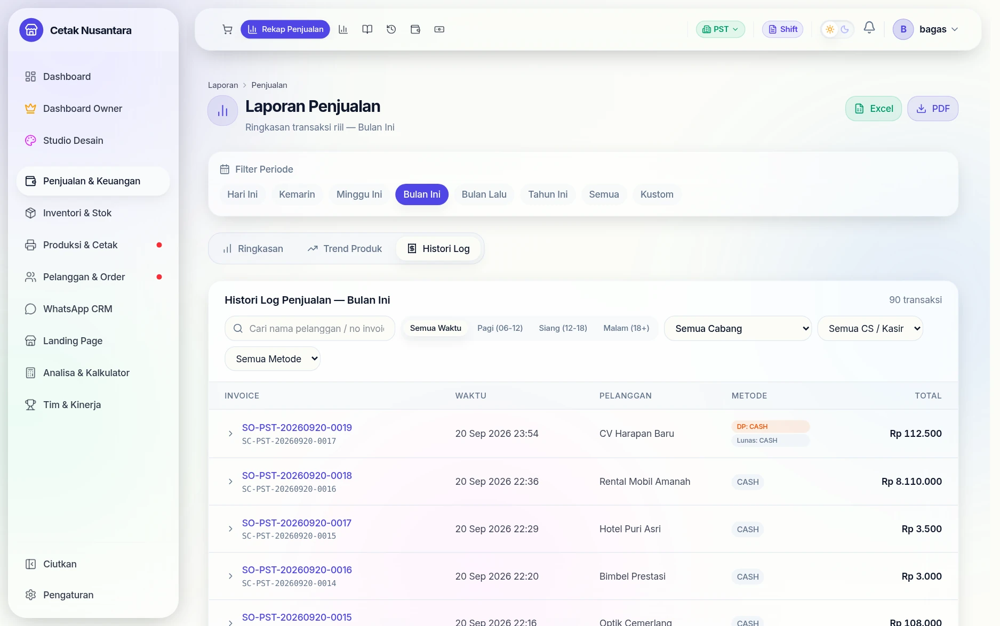
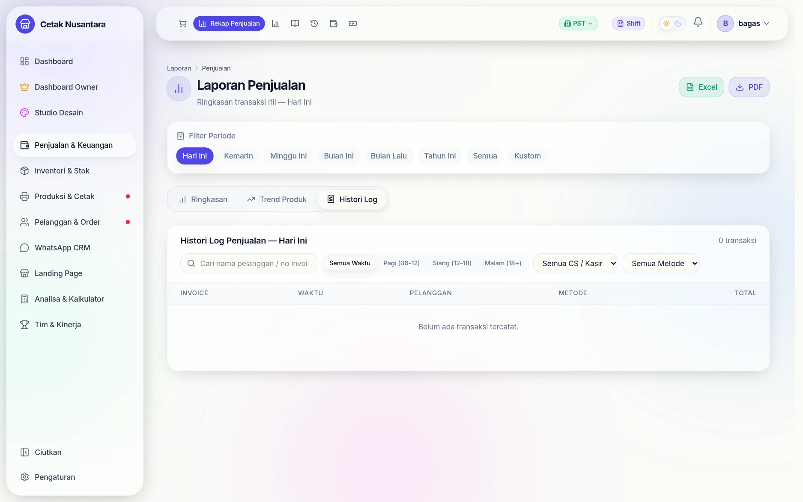

# 📊 Laporan Penjualan

> **Laporan Penjualan** adalah pusat analisis transaksi toko — tempat Anda memantau performa penjualan, melihat produk yang sedang tren, menelusuri histori order pelanggan, hingga mengekspor data untuk pembukuan atau laporan ke atasan.



---

## Langkah demi langkah

### 1. Empat angka pokok


Yang membedakan halaman ini dari "total penjualan" biasa adalah dua angka
pertamanya dipisah dengan sengaja:

| Kartu | Artinya |
|---|---|
| **Pendapatan Kas** | uang yang benar-benar masuk pada periode itu (*cash basis*) |
| **Invoice Lunas** | nilai nota berstatus PAID (*accrual*) |
| **Volume Transaksi** | jumlah struk |
| **Rata-rata Order** | nilai belanja per struk (*basket size*) |

Selisih dua angka pertama itulah yang biasanya berupa piutang dan DP — lihat
[DP & Piutang](dp-piutang.md).

Di bawahnya: **Top 5 Produk Terlaris** dan **distribusi metode pembayaran**
(tunai / QRIS / transfer) lengkap dengan jumlah transaksinya.

### 2. Tab Trend Produk



Ringkasan menjawab "berapa", tab ini menjawab "produk mana yang sedang naik
atau turun" — berguna sebelum memutuskan stok bahan atau promo.

### 3. Tab Histori Log



Daftar transaksi apa adanya, untuk menelusuri satu nota tertentu saat ada
selisih atau komplain.

### 4. Ganti periode, seluruh halaman ikut



Delapan pilihan periode — *Hari Ini, Kemarin, Minggu Ini, Bulan Ini, Bulan
Lalu, Tahun Ini, Semua, Kustom*. Tombol **Excel** dan **PDF** di kanan atas
mengunduh laporan periode yang sedang aktif.

## Cara Mengakses

Di sidebar kiri, klik menu **Laporan → Penjualan**, atau langsung buka `/reports/sales`.

---

## Tampilan Halaman

Halaman Laporan Penjualan terdiri dari **Filter Periode** di bagian atas, diikuti **3 tab** yang bisa dipindah-pindah tanpa kehilangan periode yang dipilih:

```
┌──────────────────────────────────────────────────────────────┐
│  Filter Periode                                              │
│  [Hari Ini] [Kemarin] [Minggu Ini] [Bulan Ini] ... [Kustom] │
├──────────────────────────────────────────────────────────────┤
│  [📊 Ringkasan]  [📈 Trend Produk]  [🧾 Histori Log]        │
├──────────────────────────────────────────────────────────────┤
│                                                              │
│  Konten tab yang dipilih                                     │
│                                                              │
└──────────────────────────────────────────────────────────────┘
```

---

## Filter Periode

Pilih rentang waktu data yang ingin ditampilkan. Filter ini berlaku untuk **semua tab** secara bersamaan.

| Pilihan | Data yang Ditampilkan |
|---|---|
| **Hari Ini** | Hanya transaksi hari ini |
| **Kemarin** | Hanya transaksi kemarin |
| **Minggu Ini** | Dari Senin sampai Minggu minggu berjalan |
| **Bulan Ini** | Dari tanggal 1 sampai akhir bulan berjalan |
| **Bulan Lalu** | Seluruh bulan sebelumnya |
| **Tahun Ini** | Dari 1 Januari tahun berjalan |
| **Semua** | Seluruh riwayat tanpa batasan waktu |
| **Kustom** | Pilih tanggal mulai dan tanggal selesai secara bebas |

> **Catatan:** Untuk tab **Trend Produk**, pilih periode spesifik (bukan "Semua") agar perbandingan tren bisa dihitung.

---

## Tab 1: Ringkasan

Gambaran umum performa penjualan pada periode yang dipilih.

### Kartu Metrik

Tiga kartu besar di bagian atas menampilkan angka-angka kunci:

| Kartu | Penjelasan |
|---|---|
| **Total Pendapatan** | Jumlah total `grandTotal` dari semua transaksi **LUNAS** di periode ini |
| **Volume Transaksi** | Jumlah struk/invoice yang dibuat |
| **Rata-rata Order (Basket Size)** | Total Pendapatan ÷ Volume Transaksi — menunjukkan rata-rata nilai belanja per pelanggan |

> **Cara baca:** Jika Volume Transaksi tinggi tapi Basket Size kecil, artinya banyak pelanggan yang belanja nominal kecil. Ini bisa jadi sinyal untuk strategi *upselling* atau paket bundling.

### Top 5 Produk Terlaris

Menampilkan 5 produk yang paling banyak terjual (berdasarkan jumlah unit) di periode tersebut, beserta total pendapatannya.

### Distribusi Metode Pembayaran

Breakdown total pendapatan berdasarkan cara bayar pelanggan:
- **Cash / Tunai**
- **QRIS**
- **Transfer Bank** — dipecah per nama rekening (BCA, Mandiri, dll.)
- **KREDIT** — nota kredit tanpa pembayaran di muka
- **BAYAR NANTI** — invoice disimpan tanpa pembayaran

---

## Tab 2: Trend Produk ⭐

Fitur analitik untuk melihat produk mana yang **sedang naik daun** atau justru **menurun penjualannya** dibanding periode sebelumnya.

### Cara Kerja Perbandingan Tren

Sistem secara otomatis menghitung periode sebelumnya yang setara:

| Periode Dipilih | Dibandingkan dengan |
|---|---|
| Minggu Ini | Minggu lalu |
| Bulan Ini | Bulan lalu |
| Hari Ini | Kemarin |
| Kustom 7 hari | 7 hari sebelumnya |
| Tahun Ini | Tahun lalu |

> **Jika memilih "Semua":** Perbandingan tren tidak tersedia karena tidak ada periode pembanding yang logis. Badge akan tampil sebagai "—".

### Tampilan Per Produk

Setiap baris produk menampilkan:

```
#1  ┌─ Nama Produk - Varian ─────────────────────────── bar ─── [qty] ─── [+12.5%↑] ─┐
    │  SKU: ABC-001                                                                    │
    └──────────────────────────────────────────────────────────────────────────────────┘
```

| Elemen | Penjelasan |
|---|---|
| **Badge Ranking** | #1 emas, #2 perak, #3 perunggu — sisanya abu |
| **Nama Produk** | Nama produk + nama varian (jika ada) |
| **SKU** | Kode produk untuk referensi cepat |
| **Bar Visual** | Panjang bar proporsional terhadap produk #1 — memudahkan perbandingan visual |
| **Nilai** | Qty terjual atau Revenue (sesuai toggle aktif) |
| **Badge Tren** | Lihat penjelasan di bawah |

### Membaca Badge Tren

| Badge | Arti |
|---|---|
| 🟢 `+X.X%` | Penjualan **naik** dibanding periode sebelumnya |
| 🔴 `-X.X%` | Penjualan **turun** dibanding periode sebelumnya |
| ⚪ `0%` | Penjualan sama persis |
| ⚫ `Baru` | Produk ini **tidak terjual** di periode sebelumnya — tidak bisa dihitung persentasenya |

> **Contoh nyata:** Badge `+33.3%` di produk "Banner Full Color" untuk periode "Minggu Ini" berarti produk tersebut terjual 33% lebih banyak dibanding minggu lalu.

### Toggle Qty vs Revenue

Di pojok kanan atas section Trend Produk, ada dua tombol:
- **Qty Terjual** — urutkan dan tampilkan berdasarkan jumlah unit/pcs terjual
- **Revenue** — urutkan dan tampilkan berdasarkan total pendapatan (Rp)

Gunakan **Revenue** jika ingin tahu produk mana yang paling menguntungkan secara nilai, bukan sekadar yang paling banyak terjual (karena produk murah bisa punya qty tinggi tapi revenue rendah).

---

## Tab 3: Histori Log ⭐

Daftar lengkap semua transaksi di periode yang dipilih, dengan fitur pencarian dan detail item yang bisa dibuka langsung.

### Pencarian Transaksi

Di atas tabel, tersedia kotak pencarian yang bisa digunakan untuk mencari berdasarkan:
- **Nama pelanggan** — ketik sebagian nama, sistem langsung filter
- **Nomor invoice** — cocok untuk melacak struk tertentu

Pencarian bekerja secara real-time dengan delay 300ms (debounce) agar tidak terlalu banyak permintaan saat mengetik.

### Kolom Tabel

| Kolom | Penjelasan |
|---|---|
| **Invoice** | Nomor invoice + badge **DP** untuk transaksi yang belum lunas; ikon ▶ untuk expand detail item |
| **Waktu** | Tanggal dan jam transaksi dibuat |
| **Pelanggan** | Nama pelanggan yang diisi saat checkout (kosong = `—`) |
| **Metode** | Metode pembayaran: CASH / QRIS / BANK_TRANSFER |
| **Total** | Grand total transaksi |

### Expand Item (Detail Pesanan Inline)

Klik ikon **▶ chevron** di kolom Invoice untuk membuka detail item **langsung di baris tabel** tanpa harus membuka modal:

```
▼ INV-20260410-0012
    Banner Full Color 3x1m  ...  1 × Rp 150.000 = Rp 150.000
    Sticker Vinyl A4        ...  5 × Rp 25.000  = Rp 125.000
```

Klik ▼ sekali lagi untuk menyembunyikan.

### Modal Detail Lengkap

Klik **baris transaksi** (bukan ikon chevron) untuk membuka modal detail yang berisi:
- Nomor invoice, tanggal, kasir, nama pelanggan, status pembayaran
- Daftar item pesanan lengkap
- Breakdown subtotal, diskon, pajak, ongkos kirim, grand total
- Info DP dan sisa tagihan (untuk transaksi PARTIAL)
- Tombol **Cetak Struk**, **Bagikan via WA**, dan **Edit Transaksi**

### Edit transaksi: aturan ukuran & satuan

Berlaku sejak 21 September 2026 untuk item yang harganya dihitung per luas:

| Yang diedit | Yang terjadi |
|---|---|
| Nama pelanggan, label, diskon, jumlah item lain | Total item area **tidak berubah sepeser pun**. |
| Lebar / tinggi / jumlah pcs | Dihitung ulang dengan **harga saat nota dibuat** (termasuk harga nego), bukan harga katalog hari ini. |
| Satuan item lama | **Terkunci.** Kalau satuannya memang salah, hapus item itu lalu tambah ulang dengan satuan yang benar. |
| Tambah produk baru | Satuan mengikuti produknya (cm, atau cm² untuk produk per cm²); boleh diganti sebelum disimpan. Nilainya dijumlah **sekali** (dulu terhitung dua kali). |
| Ongkos kirim & pajak | Ongkir tetap ikut di total (dulu hilang saat nota diedit). Pajak memakai tarif nota itu sendiri, bukan setelan toko hari ini. |
| Nota lama yang totalnya ≠ jumlah barisnya | Selisihnya **dipertahankan** dan ditampilkan di ringkasan ("Termasuk selisih nota lama …"). Selisih dibuang hanya bila semua item lama dihapus. |

**Contoh.** Nota banner 114×135 cm @ Rp 125.000/m² = Rp 192.375. Admin hanya
membetulkan nama pelanggan → total tetap Rp 192.375. Admin mengubah lebar jadi
228 cm → baris itu jadi Rp 384.750 (luas ×2, harga per m² tetap).

**Nota lama dengan selisih.** Per 21 September 2026 ada 53 nota (hampir semua
April–Juli 2026, versi aplikasi lama) yang subtotal tersimpannya tidak sama dengan
jumlah barisnya — sebagian karena pembulatan lama, sebagian karena bug "item tambahan
terhitung dua kali". Mengeditnya tidak lagi mengubah totalnya diam-diam; kalau
memang perlu dikoreksi, owner memutuskannya secara sadar (mis. mengubah diskon).

**Kenapa satuan dikunci.** Nota lama (Agustus–September 2026) ada yang tersimpan
berlabel "m" padahal ukurannya cm. Dulu, sekali nota seperti itu diedit, totalnya
melonjak ×10.000 — atau ditolak "stok tidak cukup". Sekarang satuan dibaca dari
luas yang benar-benar tersimpan, jadi label lama tidak bisa lagi merusak total.

### Uang & tanggal (sejak 22 September 2026)

- **Edit nota LUNAS** mengoreksi pemasukan hanya sebesar **selisih** total, pada
  pembayaran terakhir. Dulu setiap baris pemasukan (DP dan pelunasan) ditimpa
  total baru, sehingga nota ber-DP yang diedit — walau hanya ganti nama — tercatat
  masuk dua kali.
- **Ganti metode bayar** (ikon pensil di samping metode) khusus setingkat manajer
  dan tidak muncul untuk nota yang belum dibayar. Yang dipindah hanya pembayaran
  terakhir beserta biaya platformnya; DP lama tetap di metodenya. Pindah ke
  transfer wajib memilih rekening aktif milik cabang nota.
- **Filter tanggal memakai hari WIB** (00.00–23.59). Dulu rentangnya bergeser 7
  jam, sehingga nota mundur-tanggal pukul 00.00 jatuh ke hari sebelumnya.
- **Diskon tidak lagi dicatat sebagai pengeluaran terpisah.** Pemasukan nota sudah
  bersih setelah diskon; mencatatnya lagi membuat diskon terpotong dua kali (laba
  dan ekspektasi kas laci kurang sebesar diskon).
- **Pendapatan Kas** di halaman ini, serta kartu **Penjualan Hari Ini** dan grafik
  di Dashboard, hanya menjumlahkan pemasukan penjualan (*Penjualan Lunas,
  Pembayaran DP, Pelunasan DP*). Pemasukan otomatis lain — modal dari pusat,
  pelunasan titipan, pemasukan tambahan saat tutup shift — tidak lagi ikut.

---

## Export Data

### Export Excel

Klik tombol **📥 Export Excel** di pojok kanan atas (tersedia di semua tab).

File `.xlsx` berisi kolom:

| Kolom | Isi |
|---|---|
| No Invoice | Nomor invoice |
| Tanggal | Tanggal dan jam transaksi |
| Pelanggan | Nama pelanggan |
| Kasir | Nama kasir yang mencatat transaksi |
| Subtotal | Total sebelum diskon/pajak |
| Diskon | Nilai diskon yang diberikan |
| Pajak | Nominal PPN |
| Ongkos Kirim | Ongkir (0 jika tidak ada) |
| Total Bersih | Grand total yang dibayar pelanggan |
| Metode Pembayaran | CASH / QRIS / BANK_TRANSFER |
| Status | PAID / PARTIAL |

### Export PDF

Klik **📄 Export PDF** untuk laporan ringkas dalam format tabel, siap dicetak atau dilampirkan ke email.

---

## Pertanyaan Umum

**Q: Kenapa transaksi DP (PARTIAL) tidak muncul di tab Ringkasan?**
> Tab Ringkasan dan Trend Produk hanya menghitung transaksi berstatus **LUNAS (PAID)**. Ini agar angka pendapatan mencerminkan uang yang benar-benar sudah diterima penuh. Transaksi DP tetap muncul di **Histori Log**.

**Q: Produk saya muncul dengan badge "Baru" padahal sudah lama dijual. Kenapa?**
> Badge "Baru" muncul ketika produk tersebut **tidak terjual sama sekali** di periode sebelumnya yang dibandingkan — bukan berarti produknya baru. Misalnya, produk yang tidak laku minggu lalu tapi terjual minggu ini akan muncul sebagai "Baru".

**Q: Kolom Pelanggan kosong semua?**
> Data pelanggan di kolom ini berasal dari nama yang diisi kasir saat checkout. Jika kasir tidak mengisi nama pelanggan saat transaksi, kolom ini akan kosong (`—`). Untuk transaksi umum tanpa pelanggan terdaftar, ini normal.

**Q: Apakah Trend Produk menghitung dari semua transaksi atau hanya yang lunas?**
> Hanya transaksi **LUNAS (PAID)** yang dihitung di Trend Produk, konsisten dengan tab Ringkasan.

**Q: Bisa tidak export hanya transaksi hasil pencarian saja?**
> Saat ini export mengambil semua transaksi sesuai filter **periode** yang aktif, bukan filter pencarian. Untuk transaksi spesifik, gunakan pencarian untuk menemukan, lalu buka modal detailnya dan cetak struk individu.

---

*Dokumentasi PosPro — Laporan Penjualan | Terakhir diperbarui: September 2026*

**© 2026 Muhammad Faisal. All rights reserved.**
