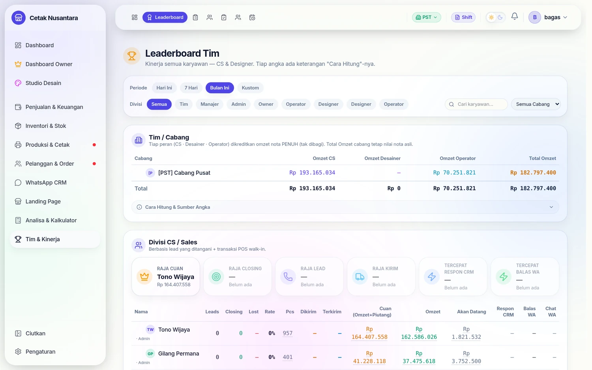
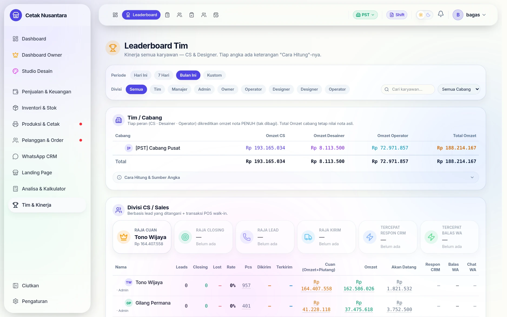
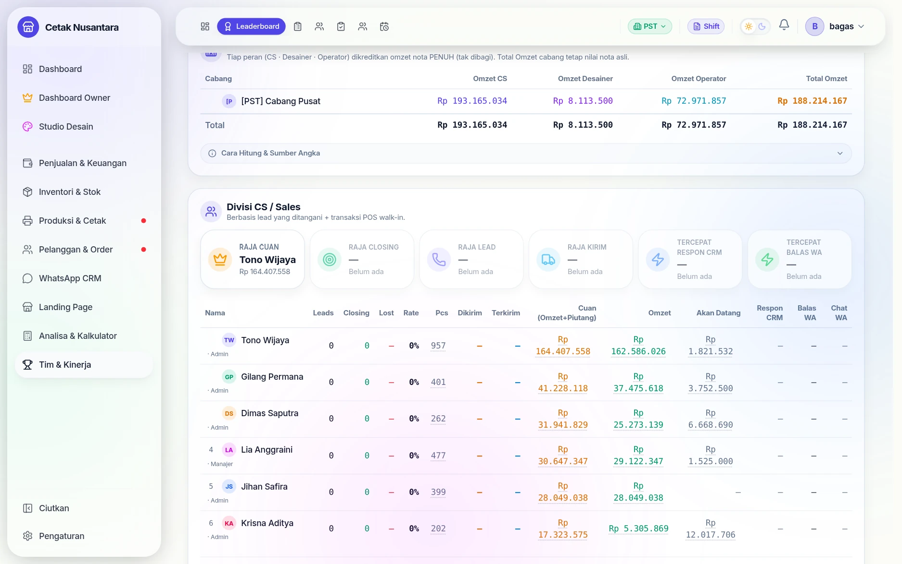

# 🏆 Leaderboard & Metrik Produk Custom

> **Leaderboard** adalah papan peringkat kinerja tim — CS, Designer, Operator, dan per Cabang. Semua angka dihitung otomatis dari data nota, lead, Sales Order, dan job produksi; tidak ada input manual. **Metrik Produk Custom** memungkinkan Owner menambah kolom sendiri untuk melacak produk/varian tertentu.

---

## Langkah demi langkah

### 1. Papan peringkat tim

Satu papan untuk seluruh karyawan, dipisah per divisi. Tiap kolom angka punya
keterangan **"Cara Hitung"** — jadi tidak ada peringkat yang tidak bisa
dijelaskan asal-usulnya saat ditanya karyawan.

### 2. Rincian angka per orang

Kolom **Cuan** menjumlahkan omzet *dan* piutang, supaya CS yang menutup order
besar berjangka tidak kalah dari CS yang melayani banyak order kecil tunai.
Nilai kualitas diambil dari [Rating CS](rating-cs.md), dan pencapaian ini yang
dipakai pada perhitungan bonus di [Dashboard Owner](keuangan-owner.md).

## Cara Mengakses

Buka menu **Leaderboard** di sidebar, atau langsung ke `/leaderboard`. Filter **periode** (Hari Ini / Minggu / Bulan / Kustom) dan **cabang** berlaku untuk semua divisi sekaligus.

Pengaturan **Metrik Produk Custom** ada di **Owner Dashboard** (`/owner`) — panel **"Metrik Produk Custom"** (khusus Owner/Admin).

---

## Divisi di Leaderboard

| Divisi | Isi utama |
|---|---|
| **Tim / Cabang** | Omzet nota dibagi rata per peran → diakumulasi ke cabang home masing-masing orang |
| **CS / Sales** | Leads, closing, rate, pcs, cuan (net), omzet (bagian), pengiriman, respon |
| **Designer** | Cek desain, produktivitas jasa desain, SO dibuat, nota, ACC, selesai, omzet |
| **Operator** | Job cetak, lembar, job produksi, selesai, total job, breakdown per kategori |

> Tiap section punya panel **"Cara Hitung & Sumber Angka"** yang bisa dibuka untuk melihat rumus tiap kolom.

---

## Metrik Produk Custom ⭐

Fitur untuk **Owner**: buat kolom sendiri di leaderboard yang menghitung **produk khusus** — misalnya "Roll Up Banner F340" atau "Jersey Kantor". Kolom ini **terpisah** dari metrik bawaan, jadi tidak mengubah atau menggandakan angka yang sudah ada. Anda bisa membuat **lebih dari satu** metrik (tiap metrik = satu kolom baru).

### Cara Membuat

1. Buka **`/owner`** → gulir ke panel **"Metrik Produk Custom"** → klik **Tambah**.
2. **Nama** (internal) & **Label** kolom — label adalah teks pendek yang muncul sebagai judul kolom di leaderboard (mis. `Roll Up`).
3. **Cara hitung** — pilih PCS (default), QTY, OMZET, atau NOTA.
4. **Tampil di leaderboard** — centang **CS**, **Designer**, dan/atau **Operator**. Kolom hanya muncul di divisi yang dipilih.
5. **Pilih Produk / Varian dari inventori** — cari dan centang varian yang ingin dilacak.
6. **Simpan** — kolom langsung muncul di `/leaderboard`.

Metrik yang sudah dibuat bisa **diedit**, **dinonaktifkan** (sementara disembunyikan), atau **dihapus** kapan saja dari daftar di panel.

### Cara Hitung (Mode)

| Mode | Yang dihitung | Tampil sebagai |
|---|---|---|
| **PCS** | Σ jumlah barang (qty × pcs) | `5 pcs` |
| **QTY** | Σ baris quantity | `5 qty` |
| **OMZET** | Σ harga × qty | `Rp …` |
| **NOTA** | Berapa nota mengandung produk itu | `5 nota` |

### Atribusi — Dihitung ke Siapa?

| Divisi | Sumber |
|---|---|
| **CS** | Nota lead closing yang ia pegang **+** transaksi walk-in yang ia layani |
| **Designer** | Nota dari **Sales Order** yang ia buat |
| **Operator** | Item dari **job cetak/produksi** yang ia kerjakan sampai selesai |

---

## Tiap Varian = Produk Berbeda

Satu produk bisa punya beberapa varian dengan **nama berbeda** (mis. Roll Up Banner varian **F340** dan **F300**). Karena namanya beda, tiap varian diperlakukan sebagai item tersendiri.

::: tip Pilih varian yang tepat
Hanya varian yang **dicentang** yang dihitung. Bila Anda hanya memilih varian **F340**, maka order dengan varian **F300** **tidak** ikut terhitung.
:::

::: warning Aturan lanjutan (opsional)
Selain memilih varian, Anda juga bisa mencocokkan berdasarkan **kategori** atau **kata kunci nama** (mis. `jersey`) lewat bagian **"Aturan lanjutan"** di form. Berguna bila produknya banyak dan ingin cakupan luas dalam satu metrik.
:::

---

## Contoh Kasus

**Owner ingin tahu berapa banyak "Roll Up Banner F340" yang dibawa tiap CS bulan ini.**

1. `/owner` → Metrik Produk Custom → Tambah.
2. Nama: `Roll Up Banner F340`, Label: `Roll Up`.
3. Cara hitung: **PCS**. Tampil di: **CS**.
4. Cari "roll up" → centang **Paket Roll Up Banner — F340**.
5. Simpan.

Di `/leaderboard` divisi CS kini ada kolom **Roll Up** yang menampilkan mis. `12 pcs` untuk CS teratas — hanya menghitung varian F340, bukan varian lain dari produk yang sama.
