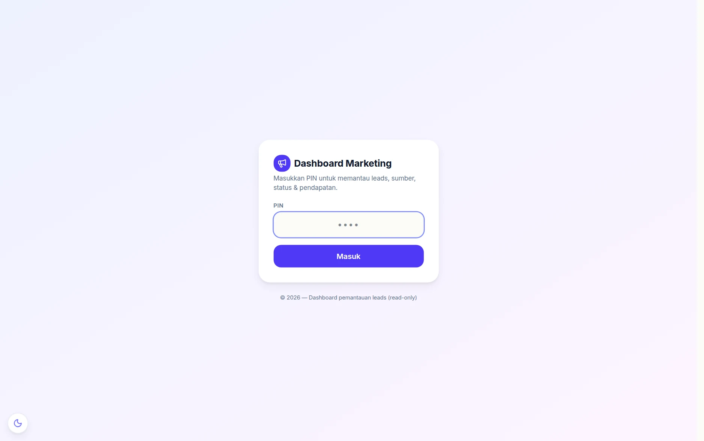
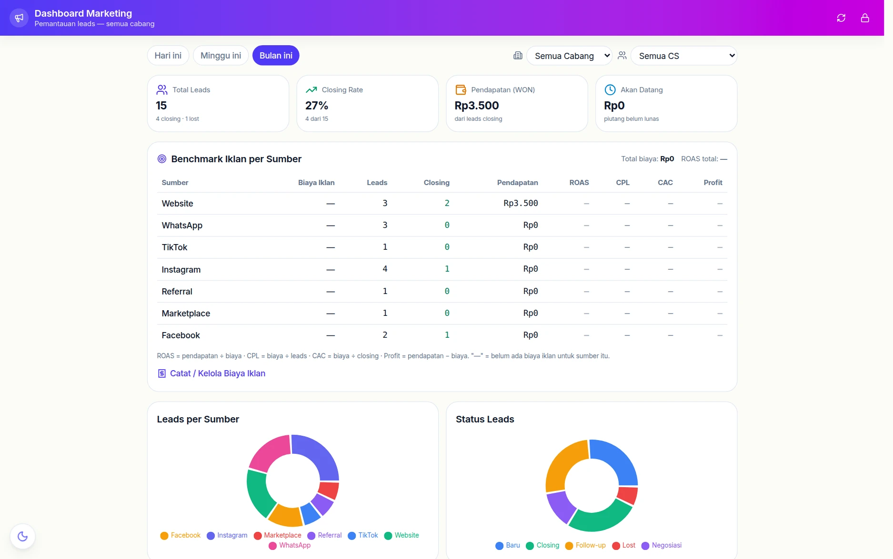

# 📣 Dashboard Marketing

Halaman **`/marketing`** adalah papan pantau *read-only* untuk orang yang
mengurus iklan: berapa lead masuk, dari sumber mana, berapa yang closing, dan
berapa biaya iklan per lead. Dibuka dengan PIN — tanpa akun login — supaya bisa
dipasang di layar tim marketing atau dibuka freelancer iklan tanpa memberi
akses ke seluruh aplikasi.

## 1. Gerbang PIN

Sama seperti [papan TV](halaman-publik.md) dan papan kerja operator, halaman
ini dijaga PIN. Keterangan di bawah kolom PIN menegaskan sifatnya: *dashboard
pemantauan leads (read-only)* — tidak ada tombol yang mengubah data.

## 2. Empat angka pokok

| Kartu | Artinya |
|---|---|
| **Total Leads** | jumlah lead pada periode, plus rincian closing & lost |
| **Closing Rate** | persentase lead yang jadi order |
| **Pendapatan (WON)** | uang dari lead yang closing |
| **Akan Datang** | piutang yang belum lunas dari lead itu |

Filter di atas: periode (*Hari ini / Minggu ini / Bulan ini*), cabang, dan CS —
termasuk pilihan **"Belum di-assign"** untuk melihat lead yang belum dipegang
siapa pun.

## 3. Benchmark iklan per sumber

Tabel **Benchmark Iklan per Sumber** menyandingkan biaya iklan dengan hasil
nyata per kanal (Website, WhatsApp, Instagram, Facebook, TikTok, Referral,
Marketplace):

| Kolom | Rumusnya |
|---|---|
| **ROAS** | pendapatan ÷ biaya |
| **CPL** | biaya ÷ leads (biaya per lead) |
| **CAC** | biaya ÷ closing (biaya per pelanggan) |
| **Profit** | pendapatan − biaya |

Rumusnya ditulis langsung di bawah tabel, dan tanda **"—"** berarti sumber itu
belum punya catatan biaya iklan. Biaya iklannya sendiri dicatat lewat tautan
*Catat / Kelola Biaya Iklan* — lihat [Sosial & Iklan](sosial-iklan.md).

Dua diagram di bawahnya memecah **Leads per Sumber** dan **Status Leads**
(Baru, Follow-up, Negosiasi, Closing, Lost), jadi terlihat bukan cuma jumlah
lead tapi juga di tahap mana mereka menumpuk.

## Kaitannya dengan halaman lain

- Lead dan tahapannya dikelola di [CRM & WhatsApp](crm.md).
- Biaya iklan per label pekerjaan ada di [Sosial & Iklan](sosial-iklan.md).
- Angka pendapatan yang sama muncul sebagai "Cuan" di
  [Leaderboard](leaderboard.md).
