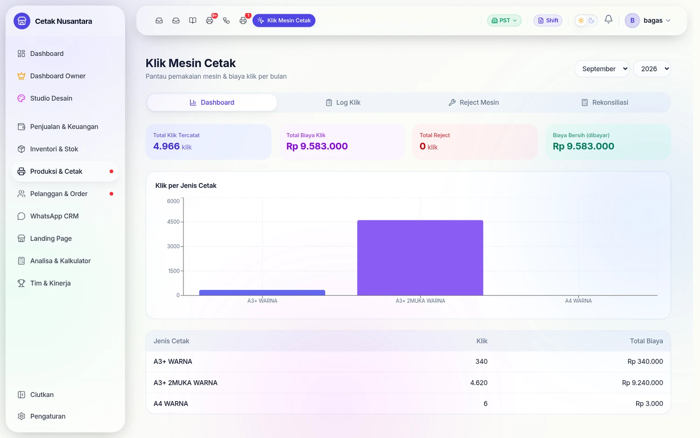
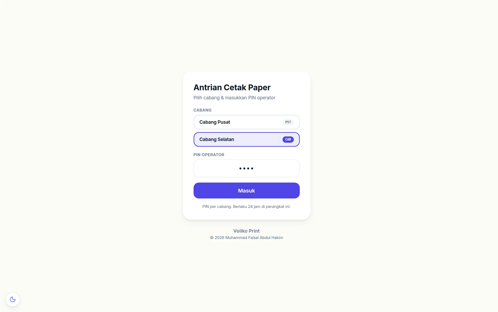
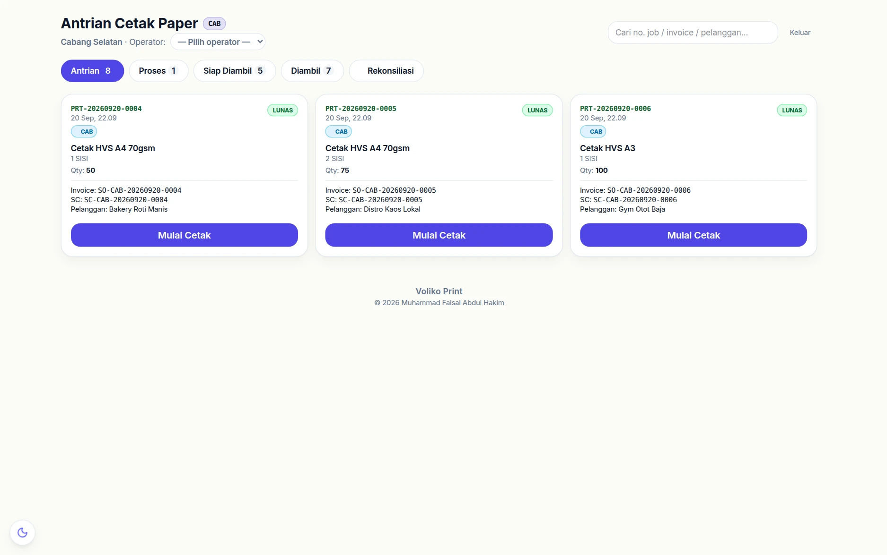
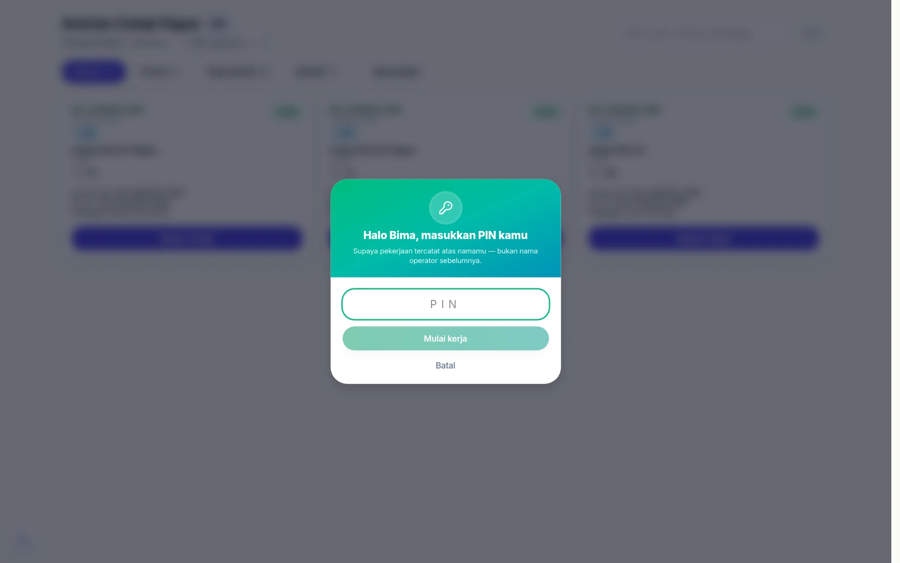
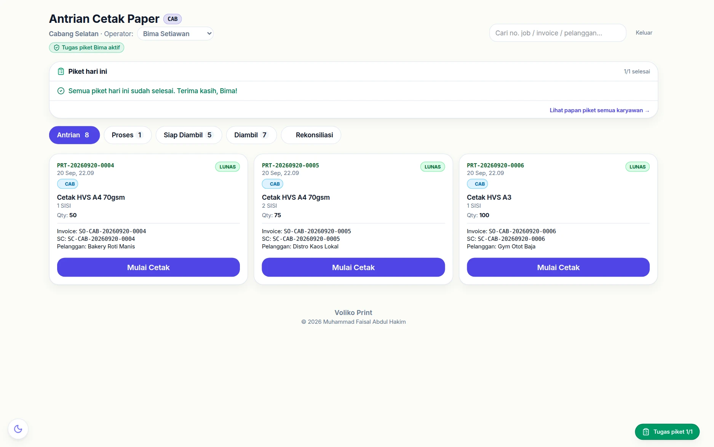
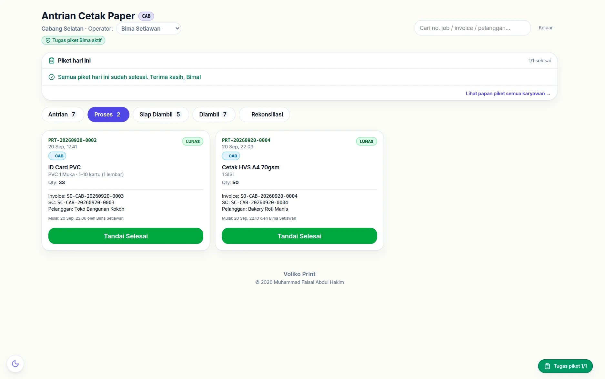
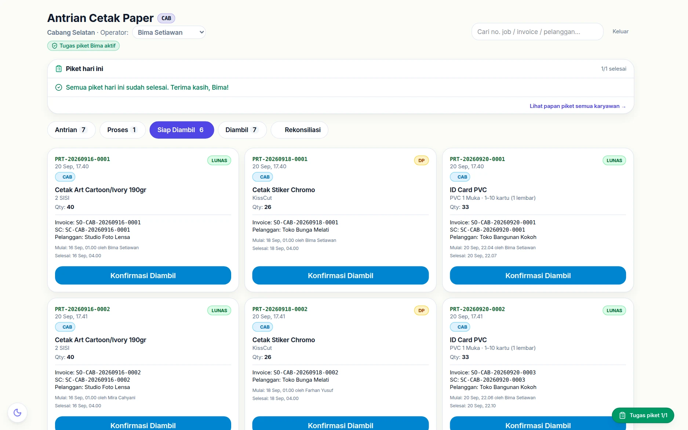
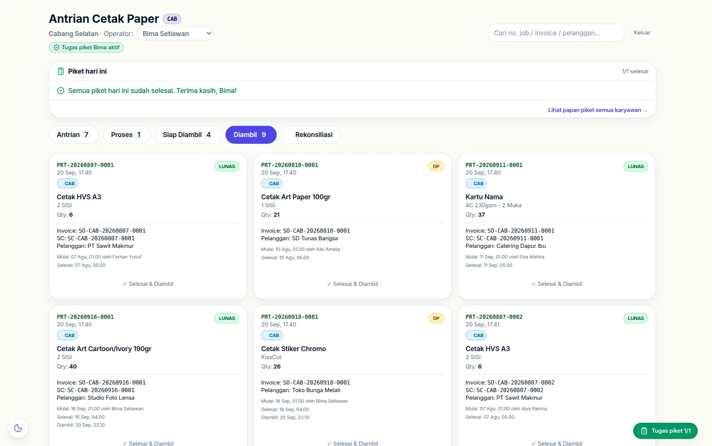
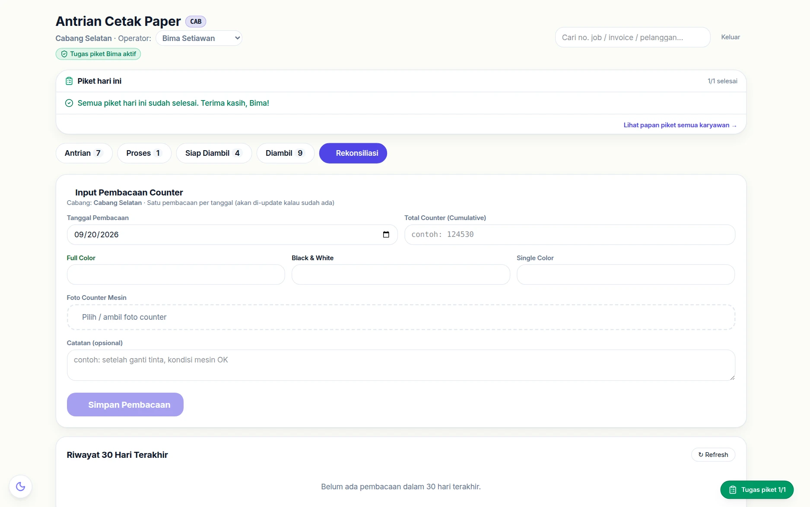
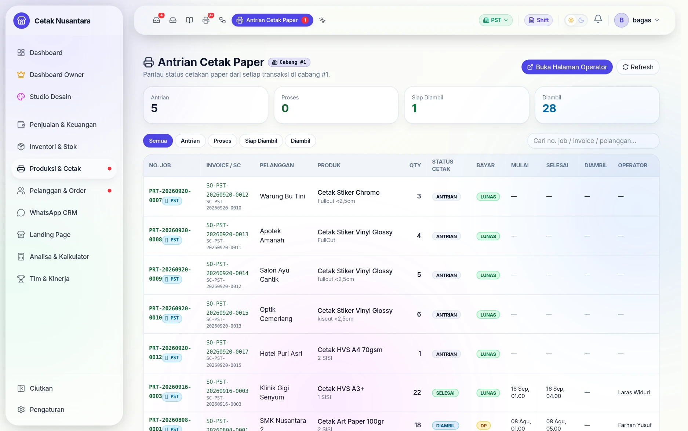

# Mesin Cetak & Antrian Paper

Modul ini digunakan untuk melacak jumlah klik meteran pada mesin cetak (Paper) serta antrian produksi khusus bahan lembaran (A3+/A4).

Papan yang dipakai operator cetak sehari-hari:

---

## 1. Konsep Click Counting (Meteran Mesin)

Berbeda dengan produk banner (meteran) yang melacak area (m²), cetakan paper (seperti Art Paper, HVS) dihitung berdasarkan jumlah **klik / lintasan**. 

PosPro memungkinkan Anda untuk merekonsiliasi (mencocokkan) antara data yang masuk ke mesin kasir dengan meteran fisik pada mesin cetak untuk meminimalisir kebocoran produksi.

### Cara Kerja Click Rates
Admin dapat mengatur tarif klik (HPP) berdasarkan:
- **Ukuran Kertas:** A3+ atau A4
- **Mode Warna:** Color atau Grayscale (BW)
- **Sisi Cetak:** Simplex (1 Sisi) atau Duplex (2 Sisi)

Harga HPP klik ini akan ditambahkan sebagai modal dari produk, secara bersamaan dengan pemotongan stok bahan baku (kertas).

---

## 2. Antrian Cetak Paper

Saat transaksi kasir menagihkan produk yang membutuhkan cetakan paper (mempunyai Click Rate aktif), sistem otomatis membuat job baru di **Antrian Cetak Paper**.

### Fitur Antrian Paper
1. **Terpisah dari Produksi Banner:** Memisahkan workflow antara ruang mesin outdoor/indoor (Banner) dengan ruang mesin plotter/laser (Paper).
2. **Keamanan PIN Operator:** Sama seperti produksi banner, operator mesin cetak paper harus login menggunakan PIN 4 digit untuk mencatat siapa yang memproses dan menyelesaikan cetakan.
3. **Status Job:** `ANTRIAN` → `PROSES` → `SELESAI` → `DIAMBIL`.

---

## Langkah demi langkah di papan operator

### 1. Masuk dengan PIN cabang

PIN ini milik **cabang**, bukan perorangan, dan berlaku 24 jam di perangkat itu.
Fungsinya membuktikan perangkatnya memang berada di cabang tersebut.

### 2. Papan antrian terbuka

Angka di tiap tab menunjukkan berapa pekerjaan yang ada di dalamnya, jadi
operator langsung tahu mana yang perlu dikerjakan.

### 3. Pilih nama, buktikan dengan PIN pribadi

Memilih nama saja tidak cukup — aplikasi meminta **PIN pribadi** orang itu.
Tanpa langkah ini, nama operator sebelumnya bisa tertinggal dan pekerjaan
tercatat atas nama yang salah, padahal nama inilah yang dibaca
[Leaderboard](leaderboard.md) dan poin HR.

### 4. Ambil pekerjaan dari antrian

Tombol **Mulai Cetak** memindahkannya ke tab *Proses* dengan nama operator yang
menempel.

### 5. Sedang dicetak

Nama tombolnya berganti mengikuti tahap: **Mulai Cetak** di Antrian,
**Tandai Selesai** di Proses, **Konfirmasi Diambil** di Siap Diambil.

### 6. Selesai — siap diambil

Saat menandai selesai, operator bisa mencentang rekan yang ikut mengerjakan,
sama seperti di [Antrian Produksi](produksi.md).

### 7. Diserahkan ke pelanggan

### 8. Rekonsiliasi klik mesin

Tab terakhir inilah pembeda papan cetak: jumlah klik yang tercatat aplikasi
dibandingkan dengan angka di meteran mesin. Selisihnya menunjukkan cetakan yang
tidak masuk nota — entah karena lupa dicatat, tes cetak, atau gagal cetak.

---

## Pantauan dari sisi kantor

Halaman **`/print-queue`** adalah versi kantor dari papan operator: empat kartu
penghitung (Antrian, Proses, Siap Diambil, Diambil) di atas tabel yang memuat
nomor job, nota asal, pelanggan, produk, qty, status cetak, status bayar, jam
mulai/selesai, dan **nama operatornya**.

Tombol *Buka Halaman Operator* menyeberang ke papan ber-PIN di
[`/cetak`](mesin-cetak.md), jadi manajer memantau dari kursinya tanpa harus
memakai PIN operator.

## 3. Rekonsiliasi Klik (Click Logs)

Di menu **Klik Mesin Cetak**, manajer dapat:
1. Memantau total klik yang tercatat lewat transaksi (Invoice).
2. Mencatat penggunaan material untuk **Tes Print**, **Kalibrasi**, atau **Reject** sehingga tercatat dalam kerugian (HPP tambahan).
3. Melakukan **Reconciliation**: Memasukkan foto meteran akhir fisik mesin, dan sistem akan mencocokkan apakah ada *gap* (selisih) antara jumlah klik yang dibayar customer + pemakaian internal, dengan fisik klik di mesin.

> [!TIP]
> Lakukan rekonsiliasi meteran setidaknya sekali setiap hari atau setiap pergantian shift untuk memastikan tidak ada cetakan ilegal atau order yang tidak tercatat di kasir.

---

## 4. Multi-Cabang & Titip Cetak

Halaman `/print-queue` (Antrian Cetak Paper) di mode multi-cabang scoped per cabang aktif:

| User | Yang Tampil |
|---|---|
| **Operator cabang Pusat** | PrintJob dari nota Pusat **+ titipan paper print dari cabang lain** |
| **Operator cabang Bantul** | Hanya PrintJob Bantul. Titipan keluar tidak muncul (dikerjakan di Pusat) |

### Badge Indikator di Job Card

| Badge | Arti |
|---|---|
| 🏢 **PST** (sky biru) | Job dari nota cabang Pusat sendiri |
| ⚑ **Titipan BTL** (amber) | Job dari nota cabang Bantul, dititipkan ke Pusat |

### PIN Operator Per Cabang

PIN operator paper print sekarang **per cabang** — di-set di `BranchSettings.operatorPin` lewat `/settings/branch-config`. Operator Pusat & Bantul punya PIN berbeda. Halaman `/cetak?branch=<code>` akan validate PIN sesuai cabang yang dipilih.

### Filter Titipan Pending

Sama dengan `/produksi`, job titipan paper print **disembunyikan** dari `/print-queue` selama `handover_status` masih `BARU` (belum di-acknowledge operator di `/titipan-masuk`).

### Click Counting Per Cabang

`ClickLog` & `MeterReading` juga scoped per cabang. Tiap cabang catat klik mesin sendiri, ada laporan terpisah. Owner mode "Semua Cabang" tampilkan agregat untuk overview.

### Stok Bahan Paper Titipan

Saat customer order paper print di Bantul tapi titip cetak ke Pusat:
- Stok bahan kertas dipotong dari `BranchStock(Pusat)` (cabang pelaksana)
- ClickLog tercatat di Pusat (mesin fisiknya di sana)
- Hutang Bantul → Pusat terbentuk di Buku Titipan

Detail flow lengkap → [🔁 Titip Cetak](titip-cetak.md) | Aspek keuangan → [📒 Buku Titipan](buku-titipan.md)

---

*Wiki PosPro — Terakhir diperbarui: 26 April 2026 | + Multi-cabang badge titipan + PIN per cabang*
