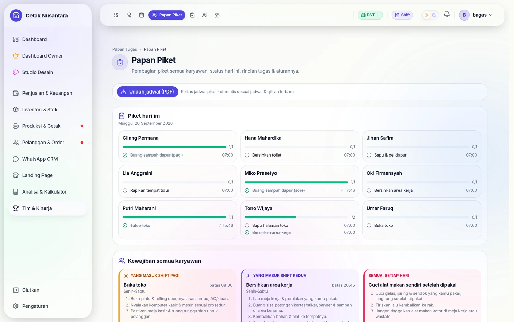
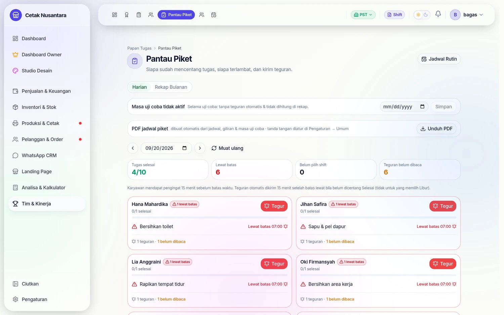

# 🧹 Papan Tugas & Piket

Bagian ini menjawab pertanyaan yang tidak bisa dijawab aplikasi kasir:
**siapa mengerjakan tugas non-penjualan hari ini, dan apakah sudah dikerjakan.**
Menyapu, buang sampah, bersihkan toilet, rapikan tempat tidur bagi yang tinggal
di toko — semuanya terjadwal, tercatat, dan kalau lewat tenggat, **sistem yang
menegur**, bukan atasan.

