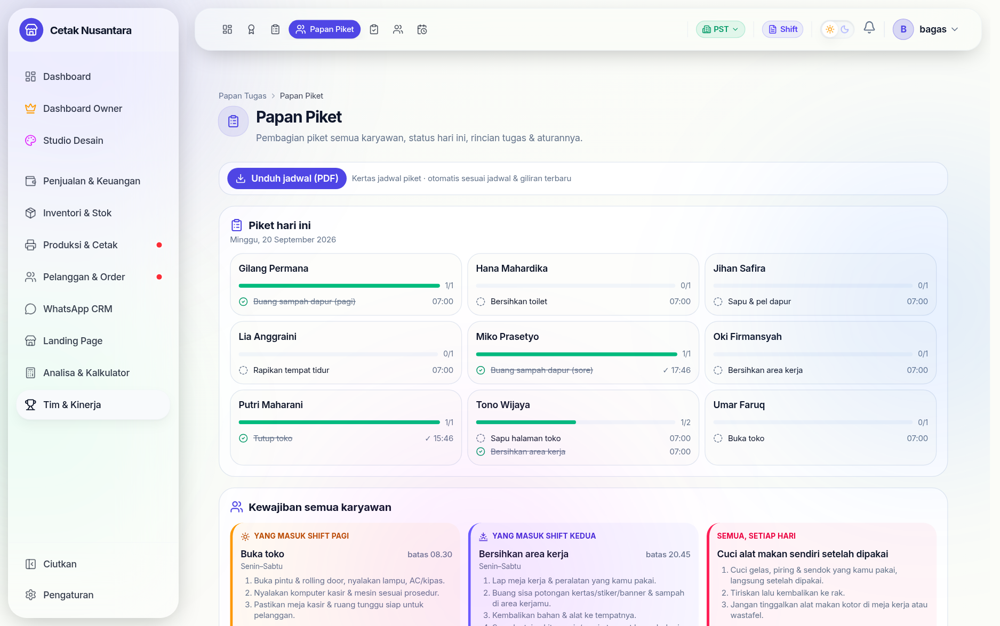

# 🧹 Papan Tugas & Piket

Bagian ini menjawab pertanyaan yang tidak bisa dijawab aplikasi kasir:
**siapa mengerjakan tugas non-penjualan hari ini, dan apakah sudah dikerjakan.**
Menyapu, buang sampah, bersihkan toilet, rapikan tempat tidur bagi yang tinggal
di toko — semuanya terjadwal, tercatat, dan kalau lewat tenggat, **sistem yang
menegur**, bukan atasan.

## Empat halaman

| Halaman | Untuk siapa | Isinya |
|---|---|---|
| `/tugas` | semua staf | papan tugas umum, bisa digeser antar kolom |
| `/tugas/papan-piket` | semua staf | piket hari ini: siapa, tugas apa, batas jam berapa |
| `/tugas/jadwal` | Manajer+ | membuat & mengatur jadwal berulang |
| `/tugas/grup` | Manajer+ | kelompok staf (mis. penghuni toko vs pulang) |
| `/tugas/pantau` | Manajer+ | rekap kepatuhan & teguran |

## Jadwal: sekali atur, jalan sendiri

`task_schedules` menyimpan aturannya, bukan tugasnya:

| Kolom | Gunanya |
|---|---|
| `frequency` | `DAILY`, `WEEKLY`, atau `MONTHLY` |
| `days_of_week` / `day_of_month` | hari mana saja yang berlaku |
| `skip_weekends` | lewati Sabtu–Minggu |
| `time_of_day` | batas jam tugas itu harus selesai |
| `shift_slot` | slot shift (mis. `PAGI`) supaya tugas menempel ke shift, bukan ke jam saja |
| `target_role` / `target_all` | ditujukan ke peran tertentu atau semua orang |
| `rotation_user_ids` | **rotasi**: giliran berpindah antar orang, jadi tidak selalu orang yang sama |
| `group_id` | dibatasi ke satu [grup tim](#grup-tim) |

Tugas hariannya dibuat otomatis oleh pekerjaan terjadwal **`05 0 * * *`**
(00.05 tiap hari) ke tabel `task_items`. Kalau perlu segera, Manajer bisa
memicunya manual lewat `POST /task-board/schedules/generate-now`.

## Teguran otomatis

Pekerjaan terjadwal **tiap 5 menit** memeriksa tugas yang lewat batas waktu dan
menuliskan teguran ke `task_warnings`. Teguran muncul sebagai pop-up di halaman
yang sedang dibuka orangnya — termasuk di papan kerja ber-PIN — dan harus
diakui (`POST /task-board/pin/warnings/ack`) supaya tidak menumpuk.

Masa uji coba bisa disetel (`piket_trial_until` di pengaturan toko): selama
masa itu tugas tetap tampil dan bisa dicentang, tapi **teguran tidak
diterbitkan**. Berguna saat aturan piket baru diperkenalkan ke tim.

## Absen shift (check-in)

`task_shift_checkins` mencatat konfirmasi "saya yang bertugas di shift ini".
Di portal desainer, konfirmasi ulang diminta sekitar pukul 13.00 supaya tugas
tidak tercatat atas nama orang shift sebelumnya.

## Grup tim

Tidak semua tugas berlaku untuk semua orang. `task_groups` +
`task_group_members` memisahkan, misalnya, staf yang menginap di toko (dapat
tugas pagi) dari yang pulang. Jadwal yang terikat grup hanya menyasar
anggotanya.

## Papan piket di halaman kerja

Staf produksi dan cetak jarang membuka menu; mereka seharian di papan
kerjanya. Karena itu piket, pengingat, dan teguran **ikut muncul di
`/produksi`, `/cetak`, dan `/so-designer`**, dibuktikan dengan PIN pribadi
masing-masing — tanpa perlu login email. Lihat
[Akun & PIN Karyawan](karyawan-akun-pin.md).

## Cetak jadwal jadi PDF

`GET /task-board/board/pdf` membuat lembar jadwal piket siap tempel, dibangun
dari data — bukan diketik ulang tiap bulan. Tanda tangan penanggung jawab
disimpan di pengaturan (`piket_signatures`) dan ikut tercetak.

## Endpoint terkait

Versi login ada di `/task-board/*`, versi PIN di `/task-board/pin/*`
(sengaja tanpa penjaga login — lihat [Model Akses & Keamanan](keamanan-akses.md)).
Daftar lengkapnya di [Referensi Endpoint](referensi-endpoint.md).
