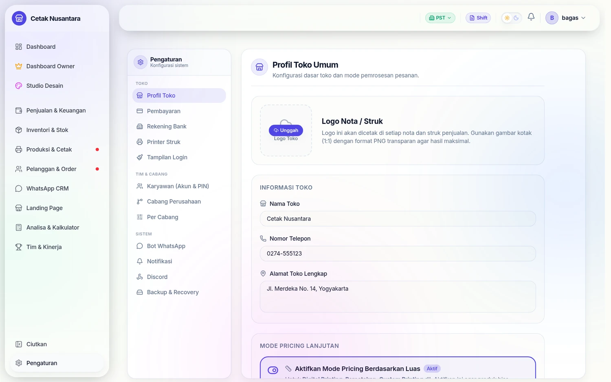
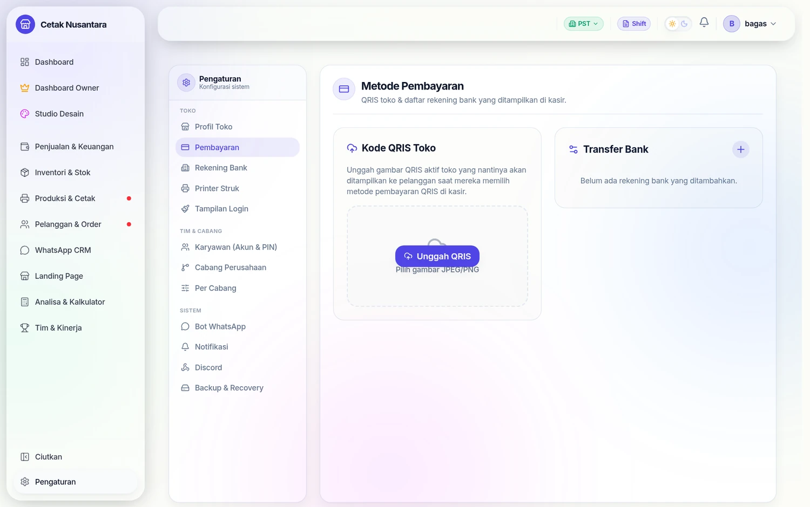
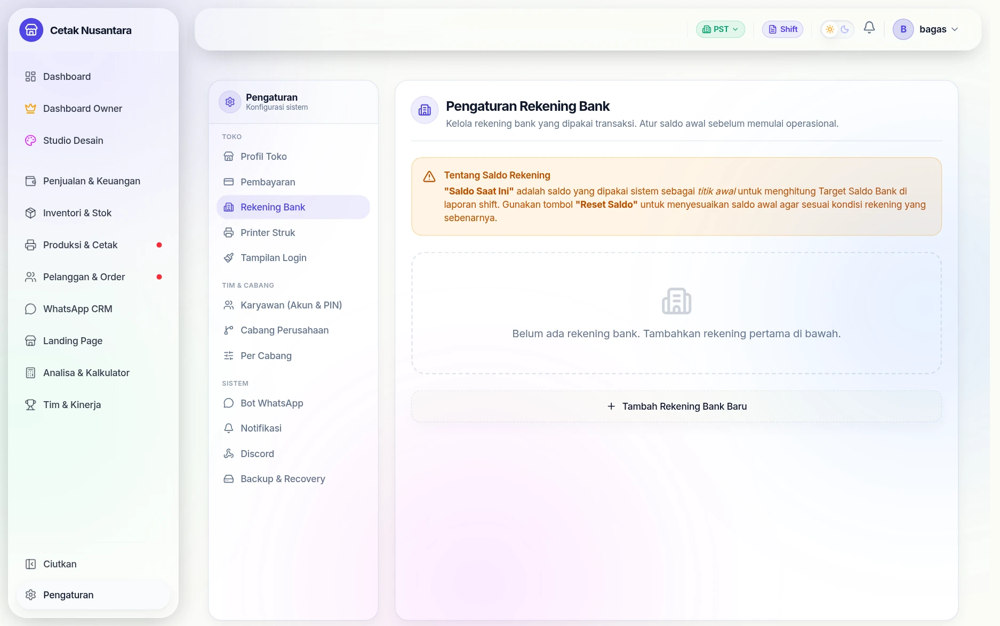
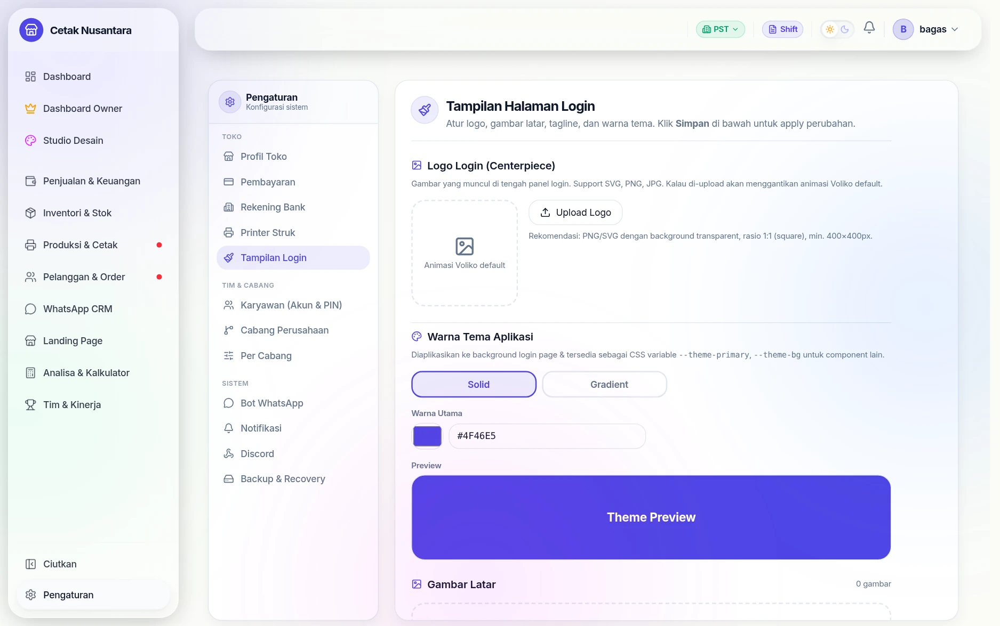

# ⚙️ Pengaturan

Semua di bawah menu **Pengaturan** (`/settings/*`). Satu halaman = satu urusan,
dan sebagian hanya untuk Owner/Manajer.

| Halaman | Isinya | Tabel |
|---|---|---|
| `/settings/general` | nama toko, alamat, telepon, logo, tema warna, mode gelap/terang, gambar & tagline halaman login, format nota bawaan, ambang stok menipis | `store_settings` |
| `/settings/users` | [Akun & PIN karyawan](karyawan-akun-pin.md) | `users`, `designers` |
| `/settings/branches`, `/settings/branch-config` | daftar cabang & setelan per cabang: nama di nota, kop & kaki nota, PIN operator, persen jasa titipan | `company_branches`, `branch_settings` |
| `/settings/payments` | metode pembayaran, pajak, harga bertingkat | `store_settings` |
| `/settings/bank-accounts` | rekening penerima transfer | `bank_accounts` |
| `/settings/printer` | printer thermal & [Printer Relay](printer-relay-agent.md) | `printer_devices` |
| `/settings/whatsapp` | kanal & kredensial [WhatsApp CRM](whatsapp-cloud.md) | `wa_channels`, `wa_config` |
| `/settings/discord` | [Notifikasi Discord](discord.md) per kejadian & per cabang | `discord_config` |
| `/settings/notifications` | kejadian mana yang memicu notifikasi, jam pengingat shift | `store_settings` |
| `/settings/backup` | [Backup & Restore](backup.md), jadwal, jumlah arsip yang disimpan | `store_settings` |
| `/settings/login` | tampilan halaman login | `store_settings` |
| `/settings/designers` | PIN kerja (kini digabung ke `/settings/users`) | `designers` |
| `/owner/akses-menu` | menu apa yang boleh dilihat tiap peran | `roles.menu_access` |
| `/owner/hpp-produk` | rumus HPP per produk | `hpp_worksheets` |

## Peta halaman pengaturan

Semua konfigurasi berada di satu tempat, dikelompokkan jadi tiga:

| Kelompok | Isinya |
|---|---|
| **TOKO** | Profil Toko, Pembayaran, Rekening Bank, Printer Struk, Tampilan Login |
| **TIM & CABANG** | [Karyawan (Akun & PIN)](karyawan-akun-pin.md), Cabang Perusahaan, [Per Cabang](mode-cabang.md) |
| **SISTEM** | [Bot WhatsApp](whatsapp-cloud.md), [Notifikasi](notifications.md), [Discord](discord.md), [Backup & Recovery](backup.md) |

Profil Toko memegang hal-hal yang muncul di mana-mana: logo nota, nama toko,
telepon, alamat, dan saklar **Mode Pricing Berdasarkan Luas** — yang menentukan
apakah produk boleh dihitung per m² seperti di percetakan.

Metode pembayaran yang dinyalakan di sini yang nanti muncul sebagai pilihan di
[Kasir POS](kasir-pos.md) dan saat pelunasan piutang.

## Dua pengaturan yang mudah terlewat

**Rekening Bank** menyimpan rekening tujuan transfer. Daftar inilah yang muncul
saat kasir memilih pembayaran transfer dan saat pelunasan piutang, sekaligus
yang ikut tercetak pada struk tagihan yang dikirim ke pelanggan.

**Tampilan Login** mengatur wajah aplikasi sebelum orang masuk: logo di tengah
panel login, warna tema (solid atau gradient, tersedia juga sebagai CSS
variable untuk komponen lain), dan gambar latar. Berguna saat aplikasi dipakai
toko lain dengan identitas sendiri.

## Yang perlu diperhatikan

- **PIN operator ada dua tingkat**: PIN cabang (`branch_settings.operator_pin`)
  untuk masuk halaman cetak, dan **PIN pribadi** tiap orang (`designers.pin`)
  untuk membuktikan siapa yang mengerjakan. Jangan ditukar.
- **Nomor & alamat toko** dipakai di nota, PDF, dan halaman publik. Mengubahnya
  di sini mengubah semuanya sekaligus.
- **Ambang stok menipis** memicu notifikasi; kalau kebanyakan pemberitahuan,
  yang perlu disetel adalah angka ini, bukan mematikan notifikasinya.
- Beberapa nilai di `store_settings` bersifat rahasia (PIN, webhook Discord,
  kunci webhook GitHub). Semuanya tersimpan di server dan tidak dikirim ke
  browser.
