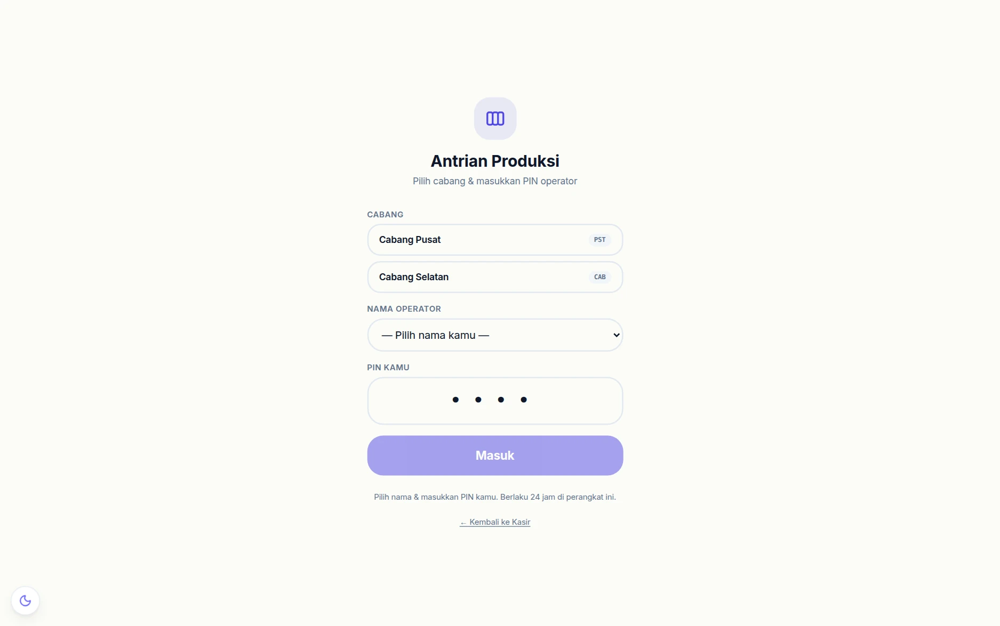
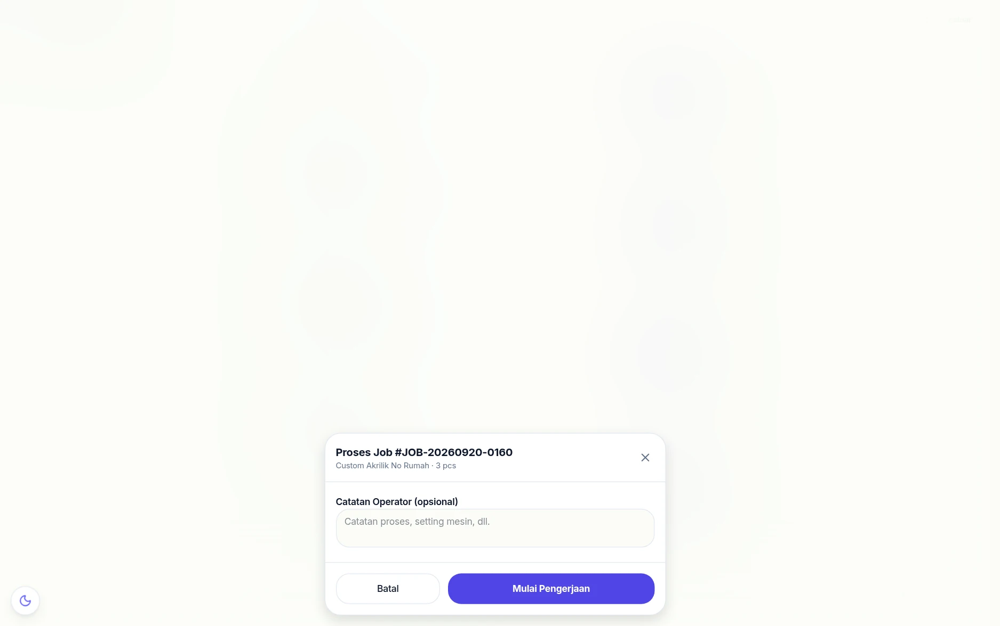
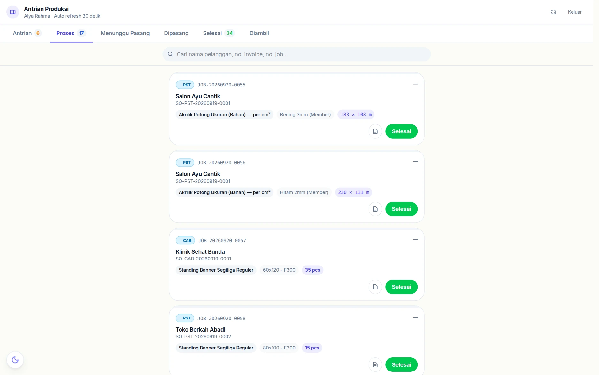
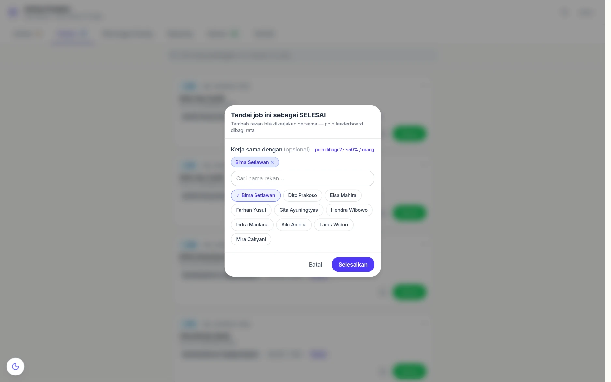
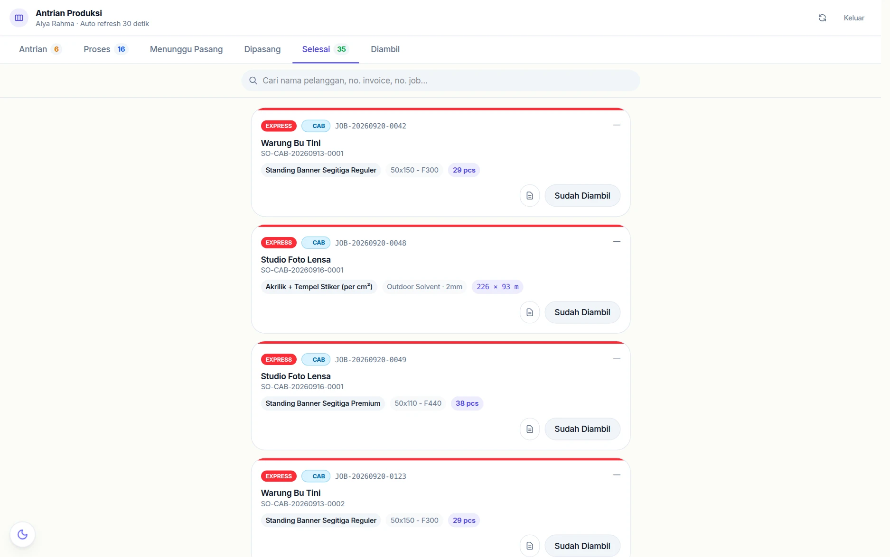
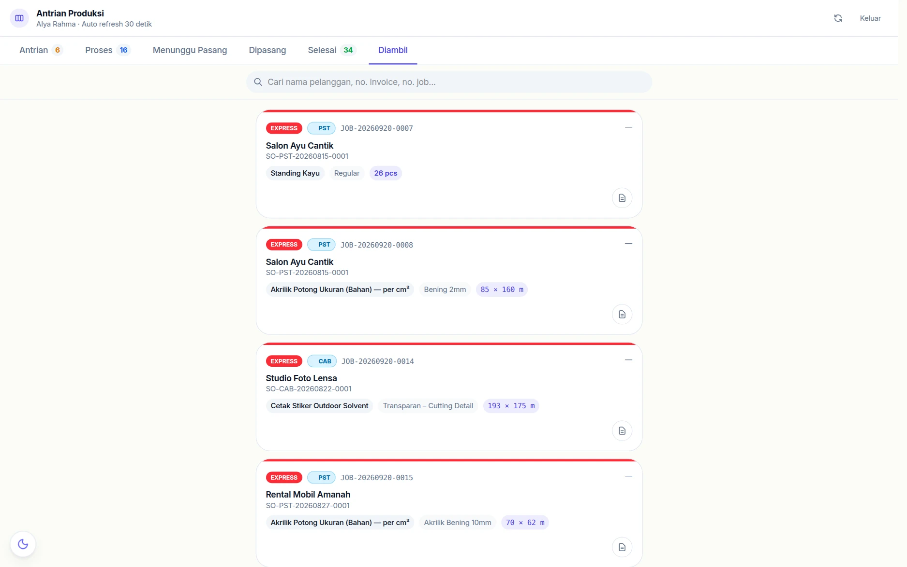
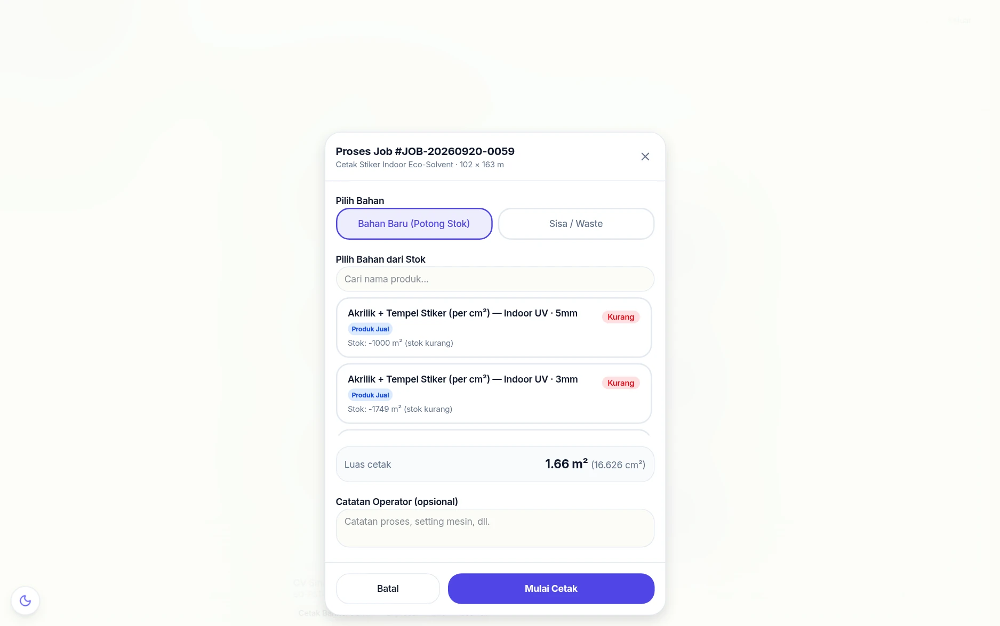

# 🖨️ Antrian Produksi

> Modul **Antrian Produksi** dirancang khusus untuk toko percetakan digital. Setiap order cetak yang masuk dari kasir otomatis tercatat sebagai *job* yang bisa dikelola oleh operator mesin secara real-time — tanpa perlu login ke akun utama.


---

## Konsep Dasar

### Produk Cetak Biasa

```
[Kasir checkout item cetak]
         ↓
[ProductionJob ANTRIAN dibuat otomatis]
         ↓
[Operator buka /produksi (PIN)]
         ↓
[Pilih job → Mulai → pilih bahan roll → potong stok]
         ↓
  ANTRIAN → PROSES → SELESAI → DIAMBIL
```

### Produk Rakitan (contoh: Standing Banner, Neon Box)

```
[Kasir checkout item cetak + rakitan]
         ↓
[ProductionJob ANTRIAN dibuat otomatis]
         ↓
[Operator Mulai Cetak → potong stok bahan roll]
         ↓
  PROSES → MENUNGGU PASANG
         ↓
[Operator Mulai Pasang → potong stok BOM (rangka, frame, dll)]
         ↓
  DIPASANG → SELESAI → DIAMBIL
```

Poin penting:
- **Produk dengan flag "Perlu Produksi"**: stok bahan roll **tidak dipotong** saat kasir checkout — pemotongan terjadi saat operator klik **Mulai Cetak**
- **Produk Rakitan**: stok bahan rakitan (BOM) dipotong saat operator klik **Mulai Pasang** — bukan saat checkout
- **Produk tanpa flag** (AREA_BASED biasa): stok langsung terpotong saat transaksi, tidak membuat job produksi
- Halaman `/produksi` bersifat **publik** — tidak perlu login JWT, cukup PIN operator

---


## Langkah demi langkah

### 1. Masuk dengan PIN pribadi



Operator memilih namanya dari daftar lalu memasukkan **PIN pribadi**. PIN inilah
yang menentukan pekerjaan tercatat atas nama siapa — dan yang memunculkan tugas
piket serta [kartu absensi](absensi-hr.md) miliknya di halaman ini.

### 2. Lihat antrian


Tiap kartu memuat nomor job, nomor SO, nama pelanggan, produk, dan jumlahnya.
Order **EXPRESS** dan yang punya tenggat naik ke atas.

### 3. Ambil pekerjaan



Tombolnya **Kerjakan** untuk produk satuan. Setelah dikonfirmasi, job pindah ke
tab *Proses* dengan nama operator yang menempel — jadi selalu jelas siapa yang
sedang mengerjakan apa.

### 4. Sedang dikerjakan



Selama di tab ini, pekerjaan terlihat oleh semua orang, termasuk kasir yang
ditanya pelanggan "sudah jadi belum?".

### 5. Tandai selesai — termasuk rekan kerjanya



Kalau pekerjaan dikerjakan berdua, operator mencentang rekannya di sini.
Keduanya diakui di [Leaderboard](leaderboard.md) — ini yang mencegah orang
enggan membantu pekerjaan orang lain karena takut tidak terhitung.

### 6. Siap diambil



Begitu masuk tab *Selesai*, pelanggan bisa dikabari. Kasir juga melihat status
yang sama tanpa perlu bertanya ke ruang produksi.

### 7. Diserahkan ke pelanggan



Tombol **Sudah Diambil** memindahkannya menjadi riwayat, beserta jam
penyerahannya.

---

## Pekerjaan per meter: pilih bahannya dulu



Untuk produk yang dihitung per meter, tombolnya **Proses** dan dialognya menuntut
operator memilih bahan lebih dulu:

- **Bahan Baru (Potong Stok)** — memotong stok bahan seperti biasa.
- **Sisa / Waste** — memakai sisa potongan yang masih layak, sehingga stok bahan
  baru tidak berkurang dan sisa tidak terbuang.

Kalau stok bahannya kurang, dialog ini menolak melanjutkan dan menampilkan
kekurangannya — bukan membiarkan pekerjaan berjalan dengan stok minus.

## Setup Awal

### 1. Atur PIN Operator

Sebelum operator bisa mengakses halaman produksi, admin perlu mengatur PIN:

1. Buka **Pengaturan → Umum (General)**
2. Isi kolom **PIN Operator**
3. Klik **Simpan**

PIN ini digunakan di halaman `/produksi` sebagai ganti login. Session PIN bertahan **24 jam** di perangkat yang sama.

---

### 2. Tandai Produk Sebagai "Perlu Produksi"

Saat menambah atau mengedit produk:

1. Pastikan **Mode Harga** = **Area Based (per m²)**
2. Centang opsi **"Perlu Proses Produksi"**
3. Simpan produk

Produk yang dicentang akan membuat **antrian job** setiap kali terjadi penjualan di kasir.

---

### 3. Setup Produk Rakitan (Opsional)

Untuk produk yang memerlukan tahap pemasangan setelah cetak (contoh: Standing Banner Segitiga, Neon Box):

1. Centang **"Perlu Proses Produksi"** terlebih dahulu
2. Centang **"Produk Rakitan — Ada Tahap Pemasangan"** (opsi ini muncul setelah flag produksi aktif)
3. Di bagian **Ingredient / Bahan Baku**, tambahkan komponen rakitan (contoh: rangka aluminium, frame) beserta jumlahnya
4. Simpan produk

> Stok komponen rakitan akan dipotong otomatis saat operator memulai tahap pemasangan — bukan saat cetak selesai.

---

### 4. Daftarkan Bahan Roll (Opsional)

Bahan roll adalah stok kain/vinyl/laminasi yang dipakai saat mencetak. Daftarkan sebagai produk varian biasa:

1. Buat produk baru (contoh: "Vinyl Glossy"), tipe **RAW_MATERIAL**, mode harga **UNIT** (stok dalam m²)
2. Di varian: aktifkan **"Bahan Roll"**, isi lebar fisik dan lebar efektif cetak
3. Stok bahan ini akan terpotong otomatis saat operator memulai job

---

## Cara Menggunakan — Operator

### Buka Halaman Produksi

1. Buka browser, akses `[URL_APLIKASI]/produksi`
2. Masukkan **PIN Operator**
3. Klik **Masuk** — session aktif selama 24 jam

### Tampilan Utama

Di bagian atas terdapat **stats ringkasan**:

| Badge | Artinya |
|---|---|
| 🟡 Antrian | Job yang belum dikerjakan |
| 🔵 Proses | Job sedang dikerjakan |
| 🟠 Menunggu Pasang | Cetak selesai, menunggu tahap pemasangan |
| 🟤 Dipasang | Sedang dalam proses pemasangan |
| 🟢 Selesai | Job selesai, menunggu diambil pelanggan |

Di bawahnya terdapat **tab filter**: ANTRIAN · PROSES · MENUNGGU PASANG · DIPASANG · SELESAI · DIAMBIL

### Mencari Job

Gunakan **search bar** di bawah tab untuk mencari job secara cepat. Bisa cari berdasarkan:
- Nama pelanggan
- Nomor invoice (contoh: `TRX-20260309-001`)
- Nomor job (contoh: `JOB-20260309-0042`)

---

### Mode 1: Cetak Satuan (per Job)

Untuk mengerjakan satu job cetak secara terpisah.

**Mulai Job:**
1. Klik tombol **▶ Mulai** pada job yang ingin dikerjakan
2. Dialog muncul, isi:
   - **Bahan Roll**: pilih bahan yang dipakai (opsional jika pakai waste)
   - **Pakai Waste/Sisa**: centang jika memakai sisa bahan (stok tidak dipotong)
   - **Luas Bahan (m²)**: otomatis terhitung dari ukuran job, bisa diubah manual
   - **Catatan Operator**: keterangan finishing, warna, dll
3. Klik **Mulai Cetak** → status berubah ke **PROSES** + stok roll terpotong

**Selesaikan Job:**
1. Di tab PROSES, klik **✓ Selesai**
2. Jika produk biasa → status langsung **SELESAI**
3. Jika produk rakitan → status berubah ke **MENUNGGU PASANG**

**Tahap Pemasangan (Produk Rakitan):**
1. Di tab MENUNGGU PASANG, klik **Mulai Pasang**
2. Dialog menampilkan daftar komponen BOM yang akan dipotong stoknya
3. Tambahkan catatan pemasangan jika perlu
4. Klik **Konfirmasi Mulai Pasang** → status berubah ke **DIPASANG** + stok komponen terpotong
5. Setelah selesai pasang, klik **Selesai Pasang** → status **SELESAI**

**Tandai Diambil:**
1. Di tab SELESAI, klik **📦 Diambil** saat pelanggan mengambil pesanan
2. Status berubah ke **DIAMBIL**

---

### Mode 2: Gabung Cetak (Batch)

Untuk mencetak beberapa job sekaligus dalam satu lembaran bahan (lebih hemat bahan).

1. Klik tombol **Gabung Cetak** di pojok kanan atas
2. Centang job-job yang ingin digabung (hanya job berstatus ANTRIAN)
3. Total luas gabungan (m²) tampil otomatis
4. Pilih bahan roll atau centang **Pakai Waste**
5. Klik **Buat Batch** → semua job yang dipilih masuk ke **PROSES** bersamaan dengan nomor batch (contoh: `BATCH-0001`)
6. Setelah selesai, klik **✓ Selesai Batch** → semua job dalam batch berubah ke **SELESAI**

---

## Informasi pada Kartu Job

Setiap kartu job di antrian menampilkan:

| Informasi | Keterangan |
|---|---|
| **Nomor Job** | Format `JOB-YYYYMMDD-XXXX` |
| **Nomor Invoice** | Referensi ke transaksi kasir |
| **Nama Pelanggan** | Dari data transaksi |
| **Produk & Ukuran** | Nama produk + dimensi cetak (lebar × tinggi cm) |
| **Prioritas** | Badge **EXPRESS** (merah) atau Normal |
| **Deadline** | Waktu tersisa — merah jika < 2 jam, **"TERLAMBAT"** jika sudah lewat |
| **Catatan Kasir** | Instruksi finishing dari kasir/pelanggan |

### Tombol Detail Invoice

Setiap kartu job memiliki tombol **ikon dokumen** (📄) di pojok kanan bawah. Klik untuk melihat detail lengkap transaksi dari kasir, meliputi:

- Nama pelanggan & tanggal transaksi
- Detail produk: nama, ukuran cetak, catatan
- Metode pembayaran & total invoice
- Info Express/Deadline (jika ada)

Tombol ini bisa diakses dari semua tab tanpa perlu login ke sistem kasir.

---

## Memilih Bahan dari Stok

Saat dialog proses muncul, daftar bahan roll tersedia menampilkan:

- **Nama produk & varian**
- **Badge tipe**: `Bahan Baku` (oranye) atau `Produk Jual` (biru) — untuk memudahkan operator membedakan jenis stok
- **Badge kategori**: nama kategori produk (abu-abu), contoh: "Vinyl", "Kain", "Laminasi"
- **Status stok**: sisa stok setelah dipotong — badge **Cukup** (hijau) atau **Kurang** (merah)

---

## Prioritas Job

Saat kasir membuat transaksi dengan item cetak, kasir bisa memilih:

- **Normal**: masuk antrian biasa (urut waktu masuk)
- **EXPRESS**: muncul di urutan paling atas antrian, ditandai badge merah

Order EXPRESS juga bisa diatur dengan **Deadline** (tanggal & jam selesai). Job yang sudah melewati deadline tampil badge **"TERLAMBAT"** berwarna merah.

---

## Pemotongan Stok Bahan

| Kondisi | Stok yang dipotong | Waktu |
|---|---|---|
| Pakai bahan roll baru | Stok varian roll berkurang sebesar `luas m²` (dibulatkan ke atas) | Saat klik **Mulai Cetak** |
| Pakai sisa/waste | Tidak ada pemotongan stok | — |
| Batch dengan bahan roll | Stok dipotong total luas gabungan semua job dalam batch | Saat klik **Buat Batch** |
| Produk rakitan (BOM) | Stok komponen rakitan (rangka, frame, dll) dipotong — hanya untuk produk per m²; resep produk satuan sudah dipotong saat checkout | Saat klik **Mulai Pasang** |

Setiap pemotongan tercatat di **Riwayat Stok** (`StockMovement`) dengan keterangan nomor job/batch.

Sejak 22 September 2026 luas roll = **luas per lembar × pcs**, dihitung server
dari item nota (dialog proses & gabung cetak menampilkan pcs-nya). Dulu pcs
terlewat, sehingga banner 3 pcs hanya memotong satu lembar. Luas yang benar-benar
dipotong disimpan di job, dan itulah yang dikembalikan utuh bila notanya dihapus.

---

## Hapus job & token papan (sejak 22 September 2026)

- Job hanya bisa **dihapus** selagi masih *Antrian*, belum memakai bahan roll,
  dan belum ada aktivitas. Selebihnya pakai *Batalkan* supaya jejaknya tetap ada.
- Token papan kerja dari PIN pribadi berlaku untuk **cabang yang dipilih di
  layar** (dulu untuk semua cabang). Menghapus foto bukti dari papan hanya bisa
  untuk job cabang itu.

Bahan pasang (rangka dan sejenisnya) dipotong **per pcs** saat *Mulai Pasang*
(job 5 pcs = 5 set), dan dikembalikan bila itemnya dihapus lewat edit nota.
Gabung cetak (batch) yang memotong roll harus berisi job **satu cabang**.

## Perbaikan papan produksi & cetak (22 September 2026, putaran 9)

- **Edit nota tidak lagi membuat ulang job produksi.** Dulu setiap edit — bahkan
  hanya ganti nama pelanggan — menghapus lalu membuat ulang job yang masih
  *Antrian*: bukti desain, tahap pipeline, desainer, status batal dan kredit
  KPI ikut hilang.
- **"Selesai Semua" pada gabung cetak** mengirim produk berperakitan ke *Menunggu
  Pasang* (dulu langsung Selesai dan bahan rangka tak pernah dipotong). Gabung
  cetak wajib berisi job (bukan sub order).
- Detail kartu menampilkan **status bayar** nota (Lunas / BELUM LUNAS + sisa) dan
  total yang benar; "Konfirmasi Semua Diambil" meminta konfirmasi dulu.
- **PIN papan wajib memilih cabang**; tanpa cabang dulu terbit akses semua cabang.
- **Kredit operator** memakai nama dari PIN pribadi (bukan nama yang dikirim
  perangkat).
- Papan pipeline yang PIN cabangnya sudah diganti otomatis kembali ke layar PIN
  (dulu terus mencoba dan mengunci IP toko untuk semua layar PIN).
- Daftar papan produksi memuat riwayat *Diambil* 14 hari terakhir saja (dulu
  seluruh riwayat ±2.200 job terkirim tiap 30 detik ke setiap tablet).
- Qty item cetak kertas yang diedit kini ikut mengubah antrian /cetak dan catatan
  kliknya; aksi di /cetak yang gagal menampilkan alasannya.

## FAQ Produksi

**Q: Mengapa job tidak muncul di antrian padahal sudah ada transaksi?**
> Pastikan produk sudah dicentang "Perlu Proses Produksi" di halaman edit produk. Produk tanpa flag ini tidak membuat job.

**Q: Apakah operator bisa mengakses dari HP?**
> Ya. Halaman `/produksi` didesain responsif untuk layar HP dan tablet.

**Q: Bagaimana jika PIN lupa?**
> Admin perlu mengubah PIN di Pengaturan → Umum, lalu beritahu operator PIN baru.

**Q: Apakah bisa ada beberapa operator yang buka halaman produksi bersamaan?**
> Ya — halaman ini real-time dan bisa dibuka di banyak perangkat sekaligus. Sejak 22 September 2026, kalau dua perangkat menekan tombol yang sama untuk job yang sama (Mulai, Selesai, Mulai Pasang, Diambil, Gabung Cetak), hanya satu yang tercatat; yang lain mendapat pesan *"Job sudah diproses oleh perangkat lain"* — bahan tidak terpotong dua kali dan kredit operator tidak ganda.

**Q: Job yang sudah dibatalkan masih bisa dikerjakan?**
> Tidak, sejak 22 September 2026. Job batal disembunyikan dari antrian dan hitungan, dan tombol Mulai/Selesai/Pasang menolaknya (*"Job sudah dibatalkan"*). Menandai batal dan menghapus job di Pipeline Produksi kini khusus setingkat manajer, untuk job cabangnya sendiri — tombolnya disembunyikan untuk staf. PIN cabang di papan juga hanya bisa memindah tahap job cabang itu.

**Q: Stok komponen rakitan tidak terpotong saat cetak — apakah itu normal?**
> Ya, itu disengaja. Stok bahan cetak (roll) dipotong saat Mulai Cetak. Stok komponen rakitan (rangka, dll) baru dipotong saat Mulai Pasang. Ini memastikan stok hanya berkurang ketika bahan benar-benar dipakai di tahapannya masing-masing.

**Q: Bisa cari job berdasarkan nama pelanggan?**
> Ya. Gunakan search bar di bawah tab untuk cari berdasarkan nama pelanggan, nomor invoice, atau nomor job.

**Q: Bagaimana cara lihat detail order dari kasir tanpa harus masuk ke sistem?**
> Klik ikon dokumen (📄) di pojok kanan bawah kartu job. Modal detail invoice akan muncul dengan semua info transaksi lengkap.

---

## 🔁 Multi-Cabang & Titip Cetak

Halaman `/produksi` di mode multi-cabang scoped per cabang aktif:
- **Operator cabang Pusat** lihat job Pusat **+ titipan dari cabang lain** (mis. dari Bantul)
- **Operator cabang Bantul** lihat job Bantul saja (titipan keluar tidak muncul karena dikerjakan di tempat lain)

### Badge Indikator di Job Card

| Badge | Arti |
|---|---|
| 🏢 **PST** (sky biru) | Job dari nota cabang Pusat sendiri |
| ⚑ **Titipan BTL** (amber) | Job dari nota cabang Bantul yang dititipkan ke Pusat untuk dikerjakan |

### Filter Job Titipan Pending

Job titipan **DISEMBUNYIKAN** dari `/produksi` selama operator belum klik **"Terima & Kerjakan"** di halaman `/titipan-masuk`. Kriteria:

```
HIDE if (transaction.productionBranchId != transaction.branchId)
   AND (handover_status IS NULL OR handover_status = 'BARU')
```

Tujuan: operator harus tahu ada titipan baru dulu (via popup notif kuning + halaman `/titipan-masuk`), baru job-nya muncul di antrian biasa. Setelah klik "Terima", status berubah ke `DIPROSES` → job muncul di `/produksi`.

### Stok Bahan Titipan

Saat operator klik **"Mulai Cetak"** untuk job titipan: stok roll dipotong dari `BranchStock(productionBranchId)` — yaitu cabang pelaksana (Pusat), **bukan** cabang pemesan (Bantul). Konsisten dengan logic POS.

Detail flow lengkap → [🔁 Titip Cetak](titip-cetak.md) | Aspek keuangan → [📒 Buku Titipan](buku-titipan.md)

---

*Wiki PosPro — Terakhir diperbarui: 26 April 2026 | + Multi-cabang badge titipan + filter pending titipan*

**© 2026 Muhammad Faisal. All rights reserved.**
