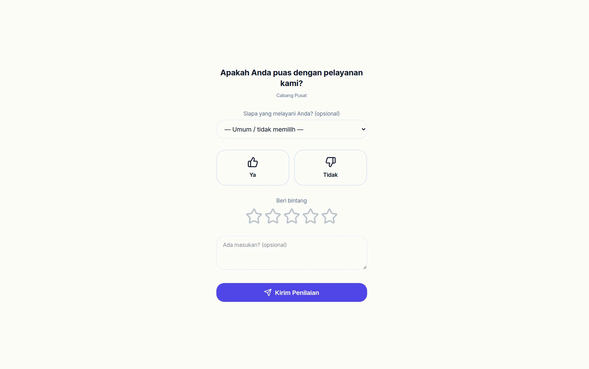
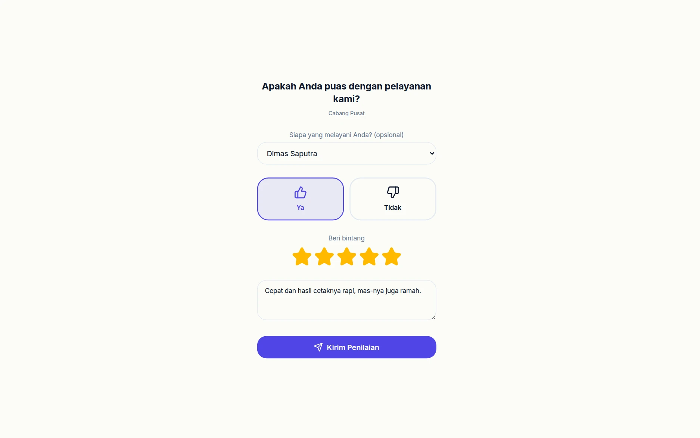
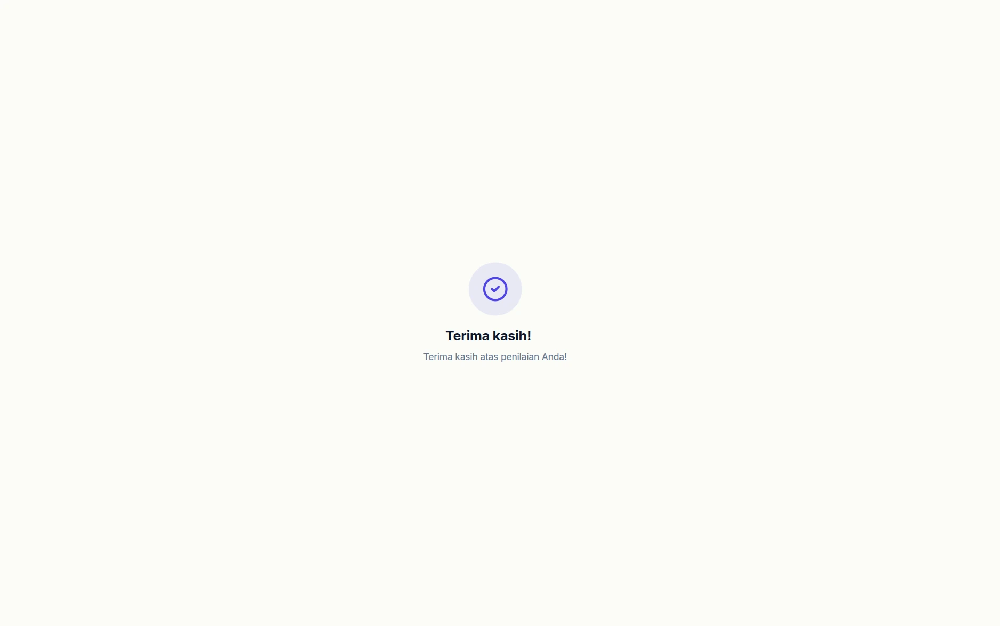
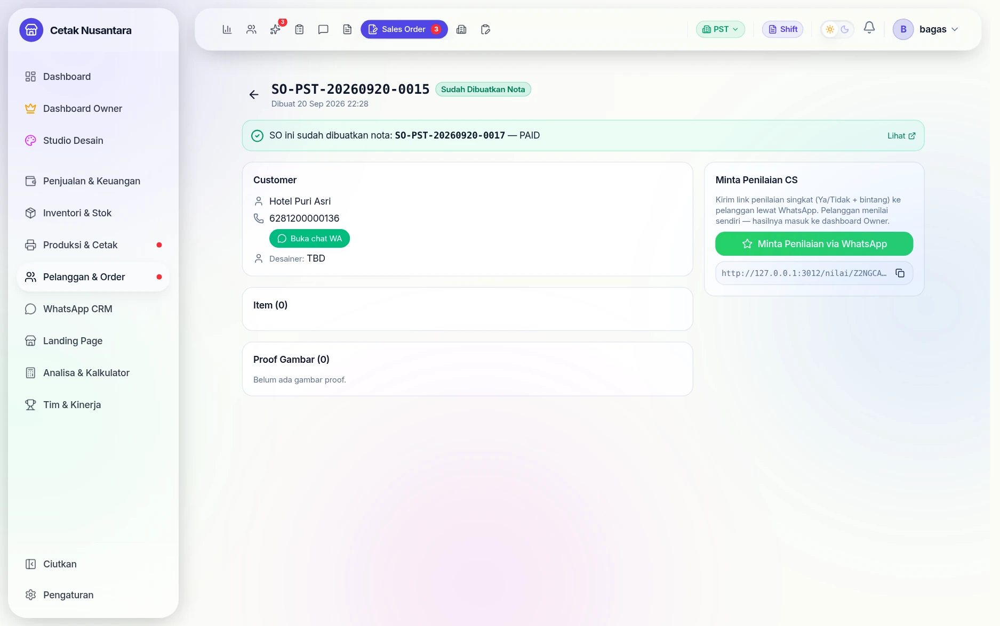
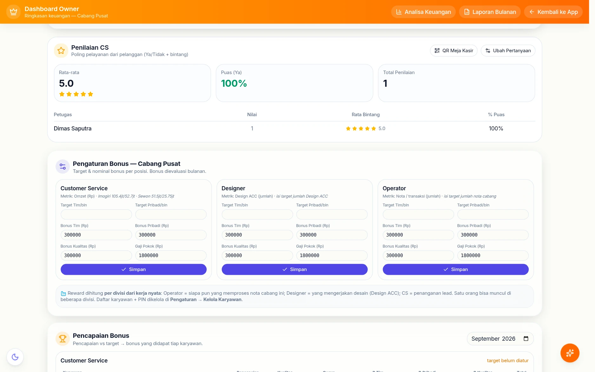
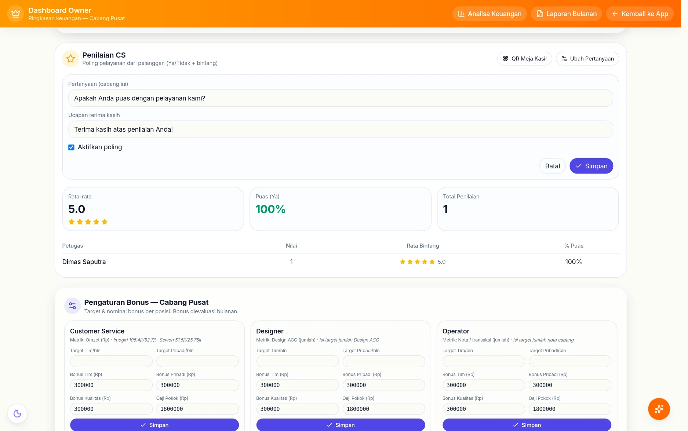

# ⭐ Penilaian Pelayanan (Rating CS)

Fitur kecil dengan pengaruh besar: pelanggan menilai pelayanan lewat tautan,
tanpa memasang aplikasi dan tanpa login.

## Langkah demi langkah

Dua jalur yang berakhir di satu rekap: pelanggan walk-in yang memindai QR di
meja kasir, dan pelanggan yang diundang lewat WhatsApp setelah pesanannya
selesai.

### 1. Yang dilihat pelanggan (tanpa login, tanpa aplikasi)

Tautan **`/nilai/cabang/[branchId]`** inilah yang dicetak jadi QR di meja
kasir. Halamannya sengaja sependek mungkin: satu pertanyaan, Ya/Tidak,
bintang, dan satu kolom masukan opsional.

Kolom *"Siapa yang melayani Anda?"* juga opsional — kalau pelanggan sungkan
menyebut nama, penilaiannya tetap terkirim sebagai penilaian cabang.

### 2. Mengisi penilaian

Semua dalam satu layar, tanpa pindah halaman. Bintang dan Ya/Tidak dua hal
berbeda dan keduanya disimpan: ada pelanggan yang menjawab "Ya" tapi memberi
tiga bintang, dan selisih itu yang justru berguna dibaca.

### 3. Selesai — satu kali kirim

Ucapan terima kasihnya bisa diganti sendiri oleh Owner (lihat langkah 6).
Tautan undangan bersifat sekali pakai; setelah terkirim, membukanya lagi tidak
bisa dipakai menilai dua kali.

QR cabang (untuk pelanggan walk-in) dibatasi supaya nilai CS tidak bisa dikerek
atau dijatuhkan berulang-ulang: dari satu koneksi, **satu penilaian per CS per 10
menit** dan paling banyak 5 penilaian per 10 menit (Wi-Fi toko dipakai banyak
pelanggan). Batas ini memakai IP asli pelanggan, bukan alamat server perantara.

### 4. Mengundang lewat pesanan yang sudah selesai

Di detail [Sales Order](sales-orders.md) berstatus **INVOICED** muncul bagian
*Minta Penilaian CS*. Sekali klik, sistem membuat tautan bertoken untuk
pelanggan itu dan menyiapkan pesan WhatsApp-nya.

Bedanya dengan QR meja: penilaian dari tautan ini otomatis tertaut ke nota,
pelanggan, dan CS yang menangani — tidak perlu menebak siapa yang dinilai.

### 5. Rekapnya per petugas

Di **Dashboard Owner** hasilnya diringkas jadi tiga angka — rata-rata bintang,
persen "Ya", dan jumlah penilaian — lalu dipecah per petugas. Angka % Puas
inilah yang ikut dipakai sebagai nilai kualitas di [Leaderboard](leaderboard.md)
dan pada perhitungan bonus kualitas.

### 6. Mengubah pertanyaan & ucapan terima kasih

Pertanyaannya bukan bawaan yang terkunci. Owner bisa menggantinya — global
untuk semua cabang atau khusus satu cabang — sekaligus mengubah ucapan terima
kasih dan mematikan sementara poling lewat centang aktif.

## Alurnya

1. Owner/Manajer menyiapkan pertanyaan dan tampilannya di
   `GET/POST /cs-rating/config`.
2. CS mengirim undangan menilai (`POST /cs-rating/invite`) — biasanya lewat
   WhatsApp setelah pesanan diambil.
3. Pelanggan membuka **`/nilai/[token]`**. Tokennya sekali pakai dan tidak bisa
   ditebak, jadi tidak perlu login.
4. Jawaban masuk ke `cs_rating_responses` lewat
   `POST /cs-rating/public/:token/submit`.
5. Rekapnya dibaca di `GET /cs-rating/summary`.

Ada juga tautan **per cabang** (`/nilai/cabang/[branchId]`) untuk dipasang
sebagai QR di meja kasir — siapa pun boleh menilai tanpa diundang.

## Kenapa memakai tautan publik

Meminta pelanggan membuat akun hanya untuk memberi nilai akan membuat tidak ada
yang mengisi. Tokennya panjang dan acak; yang bisa dilakukan pemegang tautan
hanyalah mengisi penilaian satu kali.

Konfigurasinya disimpan di `cs_rating_configs` (bisa berbeda per cabang), dan
hasilnya ikut menjadi salah satu kolom di [Leaderboard](leaderboard.md).
