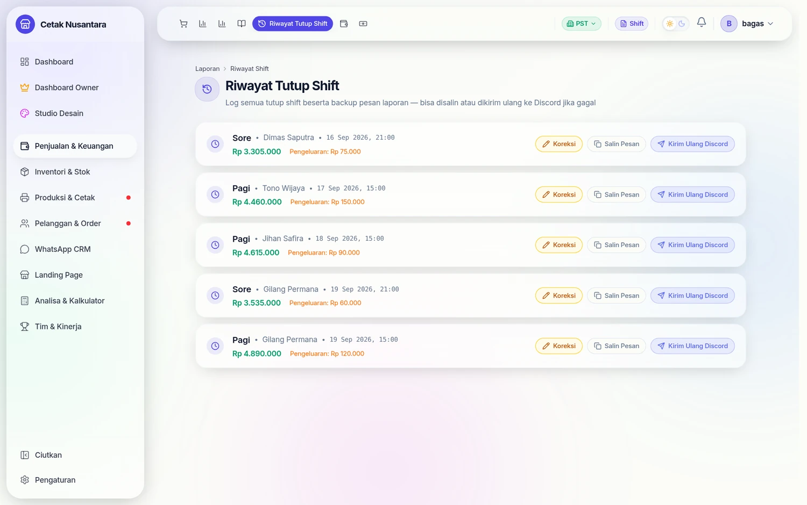
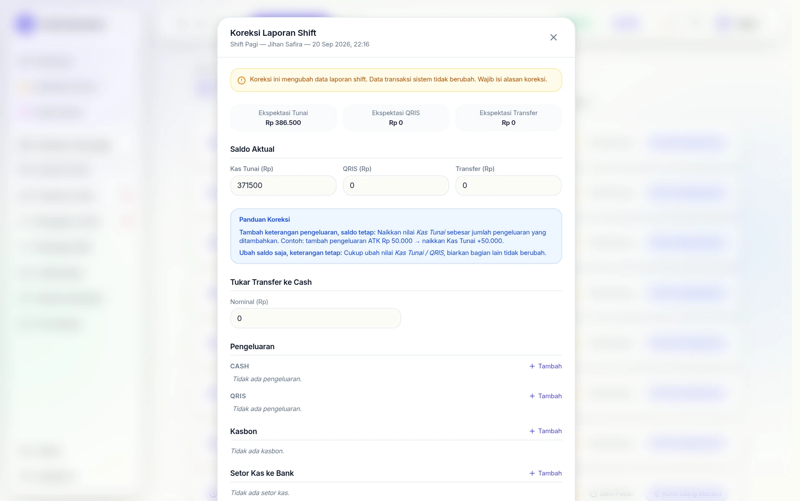

# 📜 Riwayat Tutup Shift

> Panduan halaman **Riwayat Tutup Shift** — log historis semua laporan tutup shift beserta backup pesan laporan.

---

## Langkah demi langkah

### 1. Log semua tutup shift

Tiap baris = satu penutupan shift: nama shift, kasirnya, waktu tutup, total
uang, dan pengeluaran bila ada. Tiga tombol di kanan tiap baris:

| Tombol | Gunanya |
|---|---|
| **Koreksi** | memperbaiki laporan shift yang salah input |
| **Salin Pesan** | menyalin teks laporan untuk dikirim manual |
| **Kirim Ulang Discord** | mengirim ulang laporan bila pengiriman otomatis gagal |

### 2. Koreksi yang jujur — data transaksi tidak ikut berubah

> Sejak 22 September 2026 tombol **Koreksi** hanya untuk owner/admin/manajer, dan
> setiap koreksi tercatat di **riwayat koreksi** kartu shift: kapan, oleh siapa,
> alasannya, dan kas fisik lama → baru. Koreksi berikutnya tidak lagi menimpa
> jejak koreksi sebelumnya.

Dialog koreksi menampilkan **Ekspektasi** (versi sistem) di atas **Saldo
Aktual** (versi yang dihitung manual), lalu memberi *Panduan Koreksi* untuk dua
kasus yang paling sering terjadi: menambah keterangan pengeluaran tanpa
mengubah saldo, atau mengubah saldo saja.

Peringatan di atasnya tegas: koreksi hanya mengubah **laporan shift**, bukan
data transaksi — dan **alasan koreksi wajib diisi**. Dengan begitu selisih kas
tetap punya jejak, bukan hilang diam-diam.

## Apa itu Riwayat Tutup Shift?

Halaman ini menyimpan **semua laporan tutup shift** yang pernah dikirim. Berbeda dengan halaman Tutup Shift (yang digunakan kasir untuk menutup shift aktif), halaman ini berfungsi sebagai **arsip** — berguna untuk:

- Memeriksa ulang laporan shift yang sudah lama
- Menyalin ulang pesan laporan jika pemilik butuh referensi
- Mengirim ulang laporan ke Discord jika pengiriman pertama gagal
- Audit keuangan berkala

---

## Cara Mengakses

Buka menu sidebar → klik **Riwayat Tutup Shift** → halaman `/reports/shift-history`.

---

## Tampilan Utama

Setiap entri shift menampilkan informasi ringkas:

| Kolom | Keterangan |
|---|---|
| Admin / Kasir | Nama kasir yang menutup shift |
| Shift | Jenis shift (Pagi / Siang / Long Shift) |
| Tanggal | Tanggal dan jam buka → tutup shift |
| Total Pengeluaran | Total pengeluaran yang dicatat selama shift |

---

## Fitur yang Tersedia

### 1. Expand Detail

Klik baris shift untuk melihat rincian lengkap:

| Bagian | Isi |
|---|---|
| **Tunai** | Expected vs Aktual + selisih (badge LEBIH/KURANG/BALANCE) |
| **QRIS** | Expected vs Aktual + selisih |
| **Transfer** | Expected vs Aktual + selisih |
| **Saldo Rekening** | Saldo per rekening bank (expected vs aktual) |
| **Pengeluaran** | Daftar pengeluaran per shift + metode pembayaran |
| **Catatan** | Catatan kasir saat menutup shift |

### 2. Salin Pesan Laporan

Setiap shift menyimpan **backup pesan laporan** yang dikirim saat tutup shift. Klik tombol **Salin Pesan** untuk menyalin teks lengkap ke clipboard.

Berguna untuk:
- Mengirim ulang secara manual ke chat lain
- Menyimpan sebagai catatan di tempat lain
- Referensi saat ada pertanyaan tentang shift tertentu

### 3. Kirim Ulang ke Discord

Klik tombol **Kirim Ulang Discord** untuk mengirim laporan shift (teks lengkap + foto bukti) ke channel Discord `#keuangan`. Fitur ini berguna jika:
- Webhook Discord belum dikonfigurasi saat pertama kali tutup shift
- Pesan pertama gagal terkirim

> Pastikan **notifikasi Discord** aktif dan webhook channel **Keuangan** sudah diisi di Pengaturan → Discord. Lihat [Notifikasi Discord](discord.md).

---

## Pagination

Daftar shift ditampilkan dengan **pagination** — 20 entri per halaman. Gunakan navigasi halaman di bagian bawah untuk menelusuri shift yang lebih lama.

---

## Catatan Teknis

- Data shift disimpan di tabel `shift_reports` di database
- Pesan laporan yang di-backup tersimpan di kolom `whatsapp_message` (nama kolom legacy dari era WhatsApp)
- Semua pengeluaran shift juga terhubung ke entri **Cashflow** (dengan tag `shiftReportId`)
- Riwayat shift tidak bisa dihapus atau diedit — ini bersifat **audit log** yang immutable

---

## API Endpoint (Untuk Developer)

| Method | Endpoint | Fungsi |
|---|---|---|
| `GET` | `/reports/shift-history?page=1&limit=20` | Ambil daftar shift historis (paginated) |
| `POST` | `/reports/shift/:id/resend` | Kirim ulang laporan shift ke Discord |

---

## Lihat Juga

| Wiki | Relevansi |
|---|---|
| [Laporan Tutup Shift](README.md#-7-laporan-tutup-shift-) | Cara menutup shift aktif |
| [Notifikasi Discord](discord.md) | Setup webhook untuk laporan otomatis |
| [Cashflow Bisnis](cashflow.md) | Pengeluaran shift tercatat di Cashflow |
| [🔄 Alur Bisnis](alur-bisnis.md) | Alur lengkap operasional harian |

---

*Wiki PosPro — Riwayat Tutup Shift | April 2026*

**© 2026 Muhammad Faisal. All rights reserved.**
