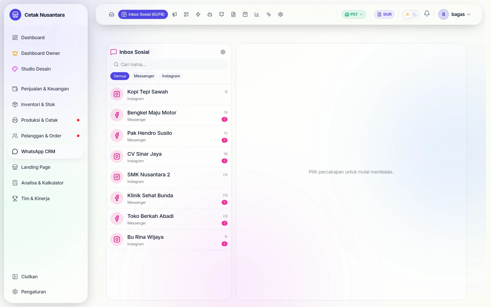

# 📣 Inbox Sosial & Iklan Meta

Dua fitur yang membuat biaya pemasaran bisa dihubungkan dengan pemasukan nyata,
bukan hanya dengan "jangkauan" dan "tayangan".

## Tampilannya

### Inbox sosial

Pesan Instagram dan Facebook Messenger masuk ke satu daftar yang sama, dengan
penanda asal tiap percakapan dan jumlah pesan belum dibaca. Tab di atas
menyaring **Semua / Messenger / Instagram**, sehingga CS tidak perlu berpindah
aplikasi untuk membalas.

### Iklan Meta

Halaman iklan menampilkan standar KPI yang dipakai toko — CTR ≥2%, ROAS ≥4×,
CPR ≤ 5% dari profit — lalu membandingkannya dengan angka nyata per akun iklan
dan per label. Karena labelnya sama dengan label pekerjaan di nota, biaya iklan
bisa disandingkan dengan **omzet dari closing yang benar-benar terjadi**, bukan
sekadar jumlah klik.

## Inbox Instagram & Facebook

Halaman **`/crm/social`**. DM Instagram dan pesan Facebook masuk ke inbox yang
sama polanya dengan WhatsApp: kanal (`social_channels`), kontak
(`social_contacts`), percakapan (`social_conversations`), pesan
(`social_messages`), dengan webhook `POST /social/webhook`.

Alat bantu saat menyambungkan akun:

| Endpoint | Untuk |
|---|---|
| `POST /social/pages-from-token` | menampilkan halaman Facebook yang bisa dipakai token itu |
| `POST /social/detect-ig` | mencari akun Instagram bisnis yang menempel di halaman itu |
| `POST /social/test-connection` | memastikan sambungan sebelum disimpan |
| `GET /social/webhook-debug` | melihat kejadian webhook terakhir saat menelusuri masalah |

Membalas dari PosPro lewat `POST /social/conversations/:id/reply`, jadi CS tidak
perlu berpindah aplikasi dan riwayatnya tetap satu tempat.

## Iklan Meta — biaya per lead yang sebenarnya

Halaman **`/owner/iklan`** (khusus Owner). Ini bukan salinan Ads Manager. Yang
dilakukan: mengambil data campaign dan biayanya dari Marketing API, lalu
**menggabungkannya dengan lead nyata di CRM**.

Sambungannya dari iklan *Click-to-WhatsApp*: saat pelanggan mengetuk iklan dan
membuka chat, Meta menyertakan `adId` di data rujukan, yang disimpan pada lead.
Pemetaan iklan → label disimpan di `meta_ad_maps` dan `ad_labels`.

Hasilnya bisa dijawab dengan angka:

| Pertanyaan | Endpoint |
|---|---|
| Berapa belanja iklan & hasilnya bulan ini? | `GET /meta-ads/overview` |
| Campaign mana yang menghasilkan untung? | `GET /meta-ads/campaign-profit` |
| Iklan mana yang mendatangkan lead paling murah? | `GET /meta-ads/ads` |

Token yang dipakai **sama dengan token WhatsApp Cloud** (izin `ads_read` sudah
termasuk), jadi tidak ada kredensial tambahan yang perlu disimpan.

> Karena perhitungan untungnya memakai nota nyata, angka di sini hanya benar
> kalau CS mengaitkan lead ke transaksi. Lihat [CRM](crm.md).
