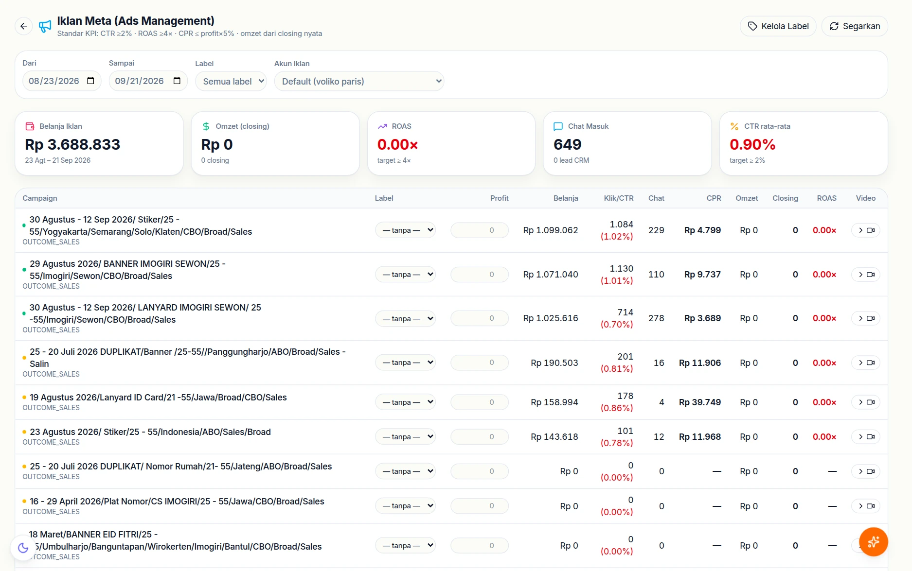
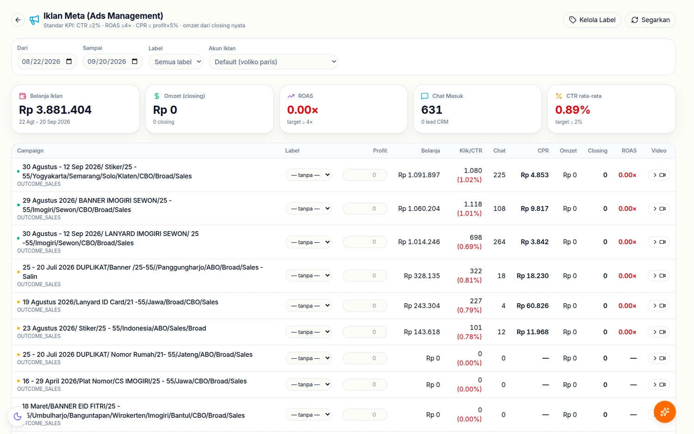

# 📣 Inbox Sosial & Iklan Meta

Dua fitur yang membuat biaya pemasaran bisa dihubungkan dengan pemasukan nyata,
bukan hanya dengan "jangkauan" dan "tayangan".

## Tampilannya

### Inbox sosial

DM Instagram dan Messenger **serta komentar** di postingan Instagram dan Halaman
Facebook masuk ke satu halaman, dengan penanda asal dan angka belum dibaca per tab.
Panduan lengkapnya — membalas publik atau lewat DM, menyembunyikan spam, menjadikan
prospek, jendela balas 24 jam — ada di **[📥 Inbox Sosial](inbox-sosial.md)**.

### Iklan Meta

Halaman iklan menampilkan standar KPI yang dipakai toko — CTR ≥2%, ROAS ≥4×,
CPR ≤ 5% dari profit — lalu membandingkannya dengan angka nyata per akun iklan
dan per label. Karena labelnya sama dengan label pekerjaan di nota, biaya iklan
bisa disandingkan dengan **omzet dari closing yang benar-benar terjadi**, bukan
sekadar jumlah klik.

## Inbox Instagram & Facebook

Halaman **`/crm/social`** — enam tab: Semua pesan, Messenger, Instagram, WhatsApp,
Komentar Facebook, Komentar Instagram. Data masuk lewat webhook
`POST /social/webhook` (field `messages`, `comments`, `feed`) dan sinkron otomatis
tiap 5 menit. Tabelnya: `social_channels`, `social_contacts`,
`social_conversations`, `social_messages`, `social_posts`, `social_comments`.

| Untuk | Halaman |
|---|---|
| Memakai inbox sehari-hari (CS/admin) | [📥 Inbox Sosial](inbox-sosial.md) |
| Menghubungkan akun Instagram, Halaman Facebook, dan aplikasi Meta | [🔌 Menghubungkan Meta](hubungkan-meta.md) |
| Daftar endpoint `/social/*` | [Endpoint API](referensi-endpoint.md) |

## Iklan Meta — biaya per lead yang sebenarnya

Halaman **`/owner/iklan`** (khusus Owner). Ini bukan salinan Ads Manager. Yang
dilakukan: mengambil data campaign dan biayanya dari Marketing API, lalu
**menggabungkannya dengan lead nyata di CRM**.

Sambungannya dari iklan *Click-to-WhatsApp*: saat pelanggan mengetuk iklan dan
membuka chat, Meta menyertakan `adId` di data rujukan, yang disimpan pada lead.
Pemetaan iklan → label disimpan di `meta_ad_maps` dan `ad_labels`.

Hasilnya bisa dijawab dengan angka:

| Pertanyaan | Endpoint |
|---|---|
| Berapa belanja iklan & hasilnya bulan ini? | `GET /meta-ads/overview` |
| Campaign mana yang menghasilkan untung? | `GET /meta-ads/campaign-profit` |
| Iklan mana yang mendatangkan lead paling murah? | `GET /meta-ads/ads` |

Token yang dipakai **sama dengan token WhatsApp Cloud** (izin `ads_read` sudah
termasuk), jadi tidak ada kredensial tambahan yang perlu disimpan.

> Karena perhitungan untungnya memakai nota nyata, angka di sini hanya benar
> kalau CS mengaitkan lead ke transaksi. Lihat [CRM](crm.md).
