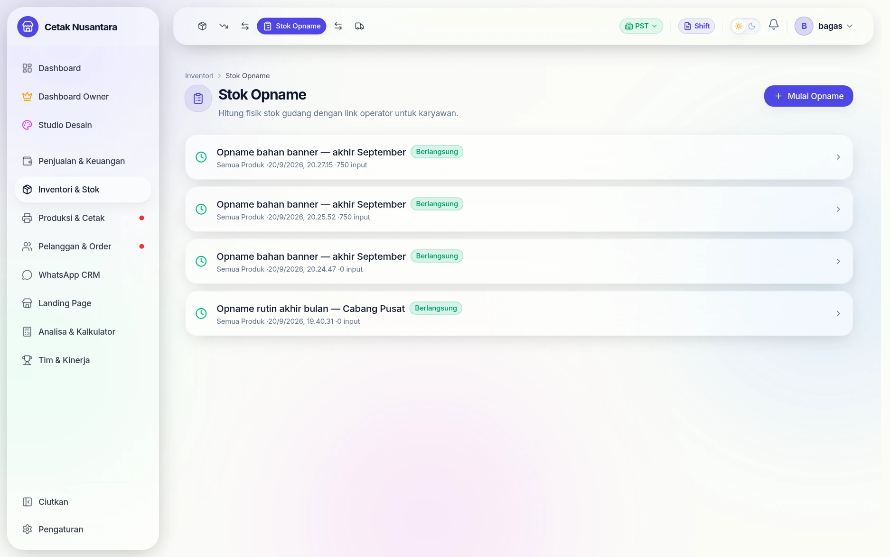
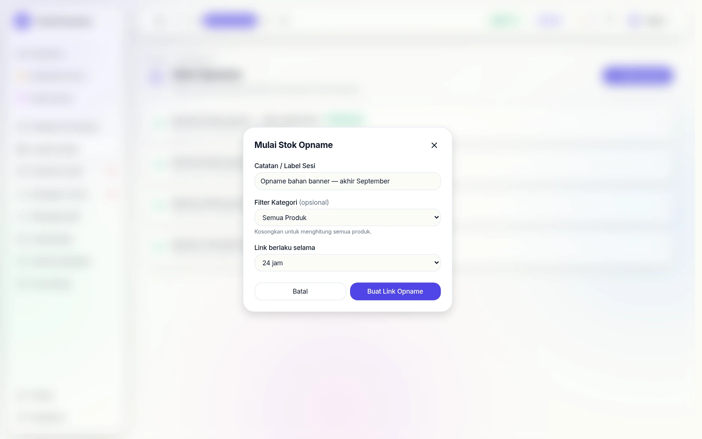
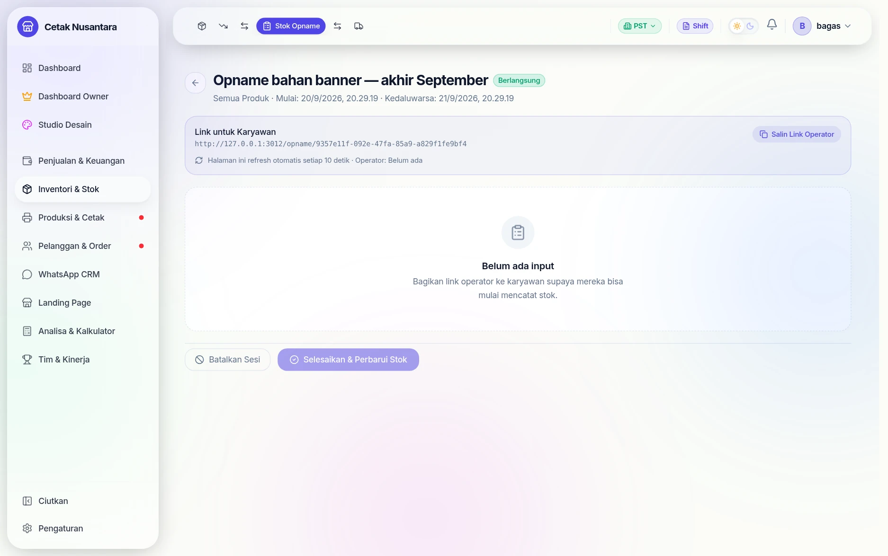
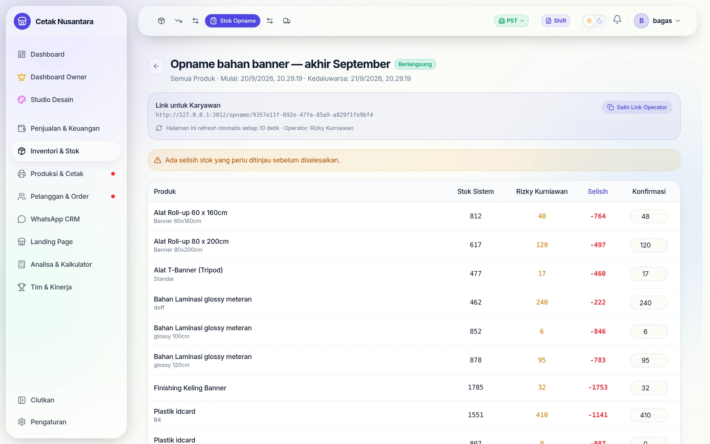
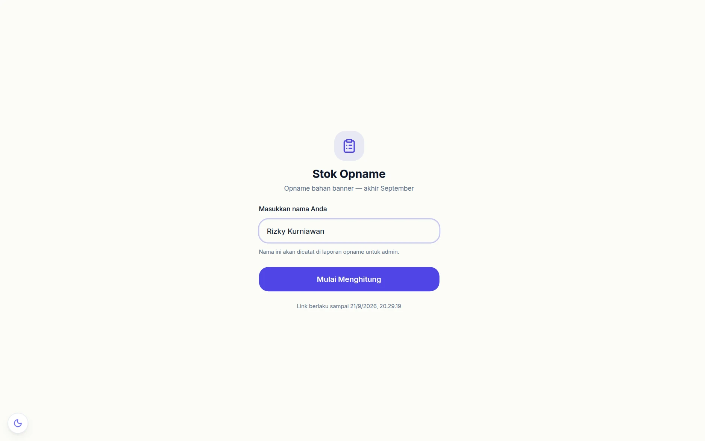
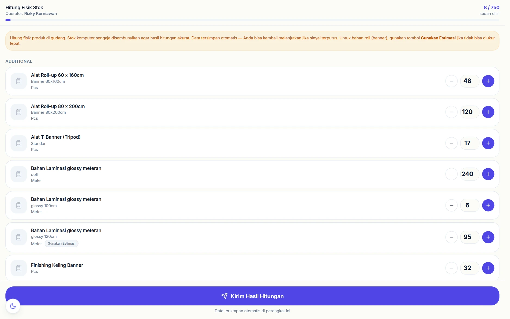
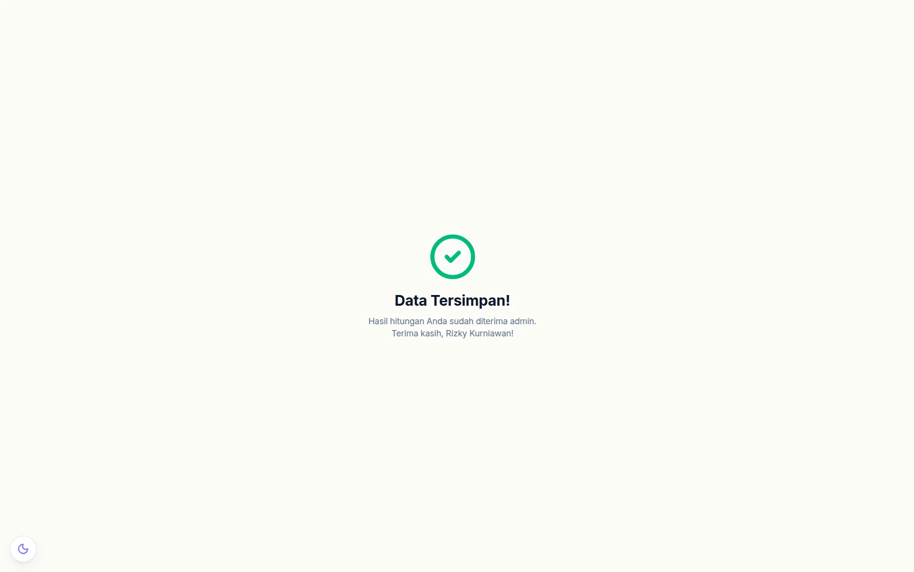

# 📋 Stok Opname


> **Stok Opname** adalah proses hitung fisik stok yang ada di gudang untuk dicocokkan dengan data di sistem. PosPro menyediakan sistem opname berbasis **link unik** yang bisa dibagikan ke karyawan — karyawan hitung langsung dari HP tanpa perlu login ke akun utama.

---

## Konsep Dasar

```
[Admin buat sesi → generate link]
           ↓
[Link dibagikan ke karyawan via WA/dll]
           ↓
[Karyawan buka link di HP → input nama → hitung fisik]
           ↓
[Admin pantau real-time → review selisih]
           ↓
[Admin konfirmasi → stok di sistem diperbarui otomatis]
```

**Prinsip Blind Count**: Stok sistem **sengaja disembunyikan** dari karyawan yang menghitung. Ini memastikan hasil hitungan jujur dan tidak dipengaruhi angka yang sudah ada di sistem.

---

## Untuk Admin — Mengelola Sesi Opname

### Buka Halaman Opname



Buka menu **Manajemen Stok → Stok Opname** (atau langsung ke `/inventory/opname`).

---

### Membuat Sesi Baru



1. Klik **+ Mulai Opname**
2. Isi form:
   - **Catatan / Label Sesi** — contoh: *"Opname Gudang Januari 2026"* (opsional tapi direkomendasikan)
   - **Filter Kategori** — pilih kategori tertentu jika hanya ingin menghitung sebagian produk. Kosongkan untuk hitung semua produk.
   - **Link berlaku selama** — pilih 8, 12, 24, 48, atau 72 jam. Setelah waktu ini link otomatis tidak bisa diakses.
3. Klik **Buat Link Opname**
4. Sesi baru dibuat dengan status **Berlangsung** dan link operator tersedia

---

### Membagikan Link ke Karyawan



Dari halaman detail sesi yang baru dibuat:

1. Salin link dengan klik **Salin Link Operator**
2. Bagikan ke karyawan via WhatsApp, pesan, atau tempelkan di device yang akan dipakai
3. Format link: `[URL_APLIKASI]/opname/[TOKEN]`

> Karyawan tidak perlu punya akun — cukup buka link dan masukkan nama mereka.

---

### Memantau Hasil Real-Time



Halaman detail sesi **auto-refresh setiap 10 detik** selama status masih Berlangsung.

Tabel review menampilkan:

| Kolom | Keterangan |
|---|---|
| **Produk** | Nama produk + varian |
| **Stok Sistem** | Stok yang tercatat di database |
| **[Nama Operator]** | Hasil hitungan fisik dari operator tersebut |
| **Selisih** | Angka konfirmasi − Stok Sistem (hijau = lebih, merah = kurang, ✓ = sama) |
| **Konfirmasi** | Input angka final yang akan diterapkan ke sistem |

Jika ada lebih dari satu operator yang submit untuk sesi yang sama, setiap kolom operator muncul secara terpisah sehingga admin bisa membandingkan.

---

### Menyelesaikan Sesi


Setelah semua operator selesai menghitung:

1. Tinjau tabel — pastikan tidak ada selisih yang mencurigakan
2. Ubah nilai di kolom **Konfirmasi** jika perlu menyesuaikan angka
3. Klik **Selesaikan & Perbarui Stok**
4. Sistem akan:
   - Memperbarui stok semua varian sesuai angka konfirmasi
   - Mencatat `StockMovement ADJUST` untuk setiap varian yang berbeda dari stok lama
   - Mengubah status sesi ke **Selesai**

> **Catatan**: Jika kolom Konfirmasi tidak diubah, sistem menggunakan angka dari input operator terakhir.

Sejak 22 September 2026 langkah ini berjalan dalam **satu transaksi**: klik ganda
atau dua admin yang menekan bersamaan hanya menerapkan stok sekali — yang kedua
mendapat pesan *"Sesi sudah ditutup atau dibatalkan"*. Stok cabang dikunci selama
proses, dan stok total dikoreksi sebesar selisihnya saja, sehingga penjualan di
cabang lain pada saat yang sama tidak tertimpa.

---

### Membatalkan Sesi

Jika opname perlu dibatalkan (misalnya salah tanggal atau ada kendala):

1. Dari detail sesi, klik **Batalkan Sesi**
2. Status berubah ke **Dibatalkan** dan link tidak bisa diakses lagi
3. Stok di sistem **tidak berubah**

---

### Status Sesi

| Status | Keterangan |
|---|---|
| 🟢 **Berlangsung** | Sesi aktif, link masih bisa diakses operator |
| 🔵 **Selesai** | Stok sudah diperbarui |
| 🔴 **Dibatalkan** | Sesi dibatalkan atau link kedaluwarsa otomatis |

---

## Untuk Karyawan — Cara Hitung Fisik

### Langkah 1 — Buka Link



Buka link yang dibagikan admin di browser HP. Pastikan link belum kedaluwarsa.

### Langkah 2 — Masukkan Nama

Ketik nama Anda di kolom yang tersedia (contoh: *"Budi Gudang"*). Nama ini akan dicatat di laporan opname untuk admin.

Tekan **Mulai Menghitung**.

### Langkah 3 — Hitung Fisik



Produk ditampilkan dikelompokkan per kategori. Untuk setiap varian produk:

- Hitung fisik stok di gudang
- Masukkan angka menggunakan tombol **+** / **−** atau ketik langsung di kotak
- **Stok sistem sengaja tidak ditampilkan** agar hitungan Anda tidak terpengaruh

> **Data tersimpan otomatis** di perangkat ini setiap kali ada perubahan. Jika sinyal terputus atau browser ditutup, data tidak hilang — cukup buka link yang sama lagi.

### Langkah 4 — Kirim Hasil



Setelah selesai menghitung semua produk:

1. Klik **Kirim Hasil Hitungan**
2. Tunggu konfirmasi **"Data Tersimpan!"**
3. Selesai — admin akan menerima data Anda

> Jika perlu menghitung ulang (misalnya ada kesalahan), cukup buka link yang sama dan submit ulang. Sejak 22 September 2026 yang terkirim **hanya barang yang Anda isi** — barang yang tidak disentuh tidak ikut (dulu terkirim sebagai 0 dan menimpa hitungan rekan untuk rak lain). Kiriman ulang hanya mengganti barang yang dikirim kali itu; hitungan Anda untuk barang lain tetap tersimpan. Barang yang memang habis: ketik **0** atau tekan **−**.

> **Satu angka per barang.** Kalau dua orang menghitung barang yang sama, kiriman
> **terakhir** yang dipakai, dan hitungan orang sebelumnya dicatat di kolom catatan
> (*"Menimpa hitungan Budi: 470"*) supaya admin tetap bisa membandingkan.
> Hasil hitung minus atau lebih dari 1.000.000 ditolak; angka yang jauh di atas stok
> sistem diterima tapi ditandai *"⚠ Jauh di atas stok sistem — periksa lagi"*.

---

## FAQ Stok Opname

**Q: Apakah bisa beberapa karyawan hitung produk yang sama?**
> Ya. Semua input masuk ke tabel review admin dengan kolom terpisah per operator. Admin yang menentukan angka mana yang dipakai di kolom Konfirmasi.

**Q: Bagaimana jika karyawan tidak selesai dalam satu sesi?**
> Data tersimpan otomatis di localStorage HP mereka. Selama link belum kedaluwarsa dan mereka membuka link yang sama, mereka bisa melanjutkan.

**Q: Apakah stok langsung berubah saat karyawan submit?**
> Tidak. Stok hanya berubah setelah admin mengklik **"Selesaikan & Perbarui Stok"** di halaman admin. Karyawan hanya mengirim data hitungan — semua keputusan ada di tangan admin.

**Q: Apakah bisa opname sebagian produk saja?**
> Ya. Saat membuat sesi, pilih kategori tertentu di kolom **Filter Kategori**. Hanya produk dalam kategori itu yang akan muncul di form karyawan.

**Q: Apa yang terjadi jika link kedaluwarsa?**
> Link otomatis tidak bisa diakses dan status sesi berubah ke **Dibatalkan**. Admin perlu membuat sesi baru.

**Q: Apakah ada rekam jejak perubahan stok dari opname?**
> Ya. Setiap penyesuaian stok tercatat di **Riwayat Stok** (`StockMovement` tipe `ADJUST`) dengan keterangan nomor sesi opname.

---

*Wiki PosPro — Terakhir diperbarui: April 2026*

**© 2026 Muhammad Faisal. All rights reserved.**
