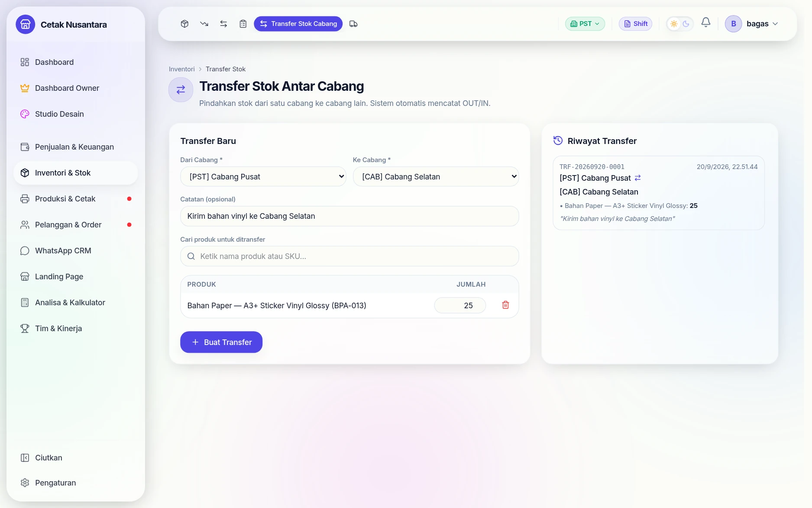
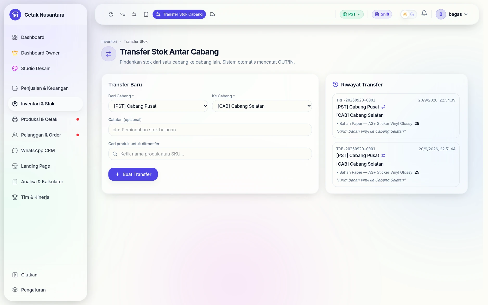
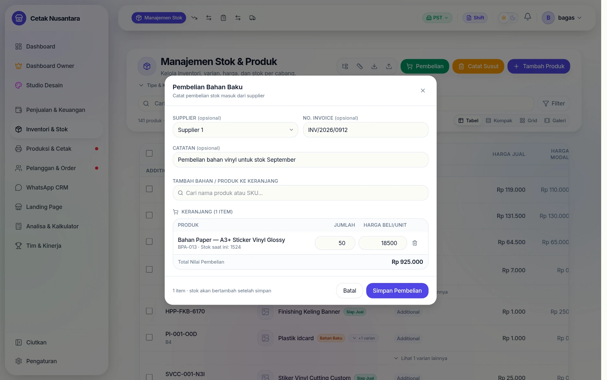
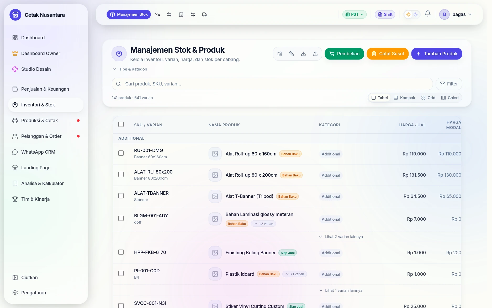
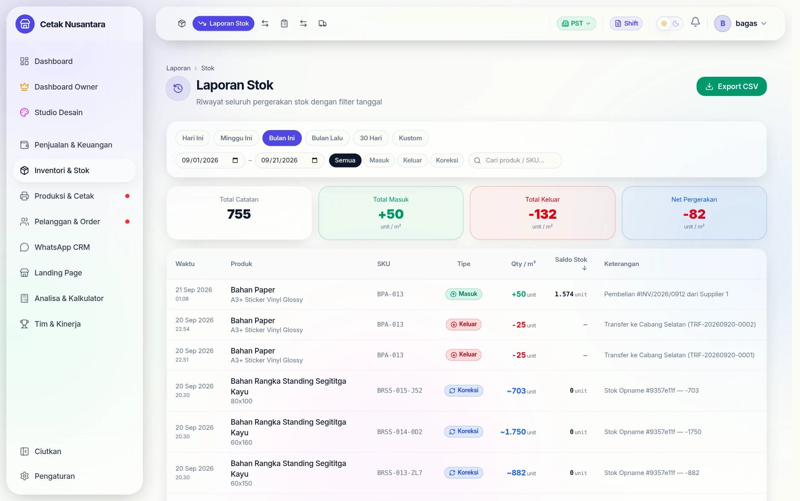

# 📦 Stok Masuk, Transfer & Mutasi

Tiga jalan stok berubah di PosPro: **dibeli**, **dipindah antar cabang**, dan
**terpakai oleh penjualan**. Semuanya meninggalkan jejak di `stock_movements`,
jadi pertanyaan "stok ini hilang ke mana?" selalu bisa dijawab.

## Langkah demi langkah: transfer stok antar cabang

### 1. Pilih cabang asal & tujuan, lalu barangnya

Cabang asal dan tujuan dipilih lebih dulu, baru barangnya dicari dan diisi
jumlahnya. Catatan membantu mengingat alasan pemindahan.

### 2. Transfer dibuat

Begitu dibuat, stok cabang pengirim berkurang dan cabang penerima bertambah
dalam satu langkah — total stok perusahaan tidak berubah.

### 3. Jejaknya di laporan stok

Semua pergerakan — pembelian, penjualan, transfer, opname — meninggalkan jejak
di [Laporan Stok](laporan-stok.md), jadi pertanyaan "stok ini hilang ke mana?"
selalu bisa dijawab.

---

## Langkah demi langkah: mencatat pembelian (stok masuk)

Contoh nyata: membeli 50 lembar A3+ Sticker Vinyl Glossy seharga Rp 18.500 per
lembar.

### 1. Buka Manajemen Stok

Tiga tombol aksi di kanan atas memisahkan tiga hal yang sering tertukar:
**Pembelian** (stok bertambah), **Catat Susut** (stok berkurang karena rusak /
hilang), dan **Tambah Produk** (menambah jenis barang, bukan jumlahnya).

### 2. Isi nota pembelian

Supplier dan nomor invoice bersifat opsional, tapi mengisinya membuat
pembelian bisa ditelusuri balik ke [Data Supplier](suppliers.md). Saat bahan
dipilih, sistem menampilkan **stok saat ini** (di contoh: 1.524) agar terlihat
posisi sebelum penambahan, lalu menghitung **Total Nilai Pembelian**
Rp 925.000 sendiri.

Keterangan kecil di kaki dialog menegaskan akibatnya: *"1 item · stok akan
bertambah setelah simpan"*.

### 3. Stok bertambah

Sekali simpan, stok cabang itu naik dari **1.524 → 1.574** — penambahan 50
lembar persis, tanpa perlu mengedit angka stok secara manual.

### 4. Tercatat sebagai mutasi "Masuk"

Di [Laporan Stok](laporan-stok.md), pembelian tadi muncul sebagai mutasi
bertipe **Masuk** dan ikut menaikkan *Total Masuk* periode itu (+50). Jadi tiap
lembar bahan yang masuk gudang punya jejak: siapa suppliernya, nomor notanya,
dan kapan dicatat.

## 1. Pembelian dari supplier

Halaman pembelian mencatat nota dari supplier: bahan apa, berapa banyak, harga
beli berapa. Selain menambah stok, harga belinya menjadi acuan
[HPP](hpp-calculator.md) — jadi mencatat pembelian bukan pekerjaan administratif
belaka, tapi yang menjaga perhitungan modal tetap benar.

Data tersimpan di `stock_purchases` + `stock_purchase_items`, dan daftar barang
yang biasa dibeli dari tiap supplier ada di `supplier_items`.

## 2. Transfer antar cabang

Halaman **`/inventory/transfer`** memindahkan bahan dari satu cabang ke cabang
lain. Yang penting dipahami: transfer **mengurangi stok pengirim dan menambah
stok penerima** dalam satu langkah, sehingga total stok perusahaan tidak berubah
— berbeda dari pembelian (menambah) atau penjualan (mengurangi).

Tabelnya `stock_transfers` + `stock_transfer_items`, dan stok per cabang
disimpan di `branch_stocks`.

> Jangan bingung dengan **[Titip Cetak](titip-cetak.md)** dan
> **[Buku Titipan](buku-titipan.md)**. Transfer stok memindahkan *bahan*;
> titip cetak memindahkan *pekerjaan*; buku titipan mencatat *utang jasa*
> antar cabang.

## 3. Terpakai oleh penjualan

Setiap nota untuk produk bertanda `trackStock` memotong stok lewat resep
bahannya. Kalau stok tidak cukup, nota **ditolak** dengan menyebut nama
bahannya — ini disengaja, supaya tidak ada penjualan yang stoknya minus.

## Menyelaraskan dengan kenyataan

Angka di sistem pasti bergeser dari kenyataan (susut, sisa potongan, salah
catat). Yang menyelaraskannya adalah **[Stok Opname](stock-opname.md)**, dan
hasil laporannya dibaca di **[Laporan Stok](laporan-stok.md)**.

Untuk bahan yang dipakai cabang lain tapi miliknya cabang tertentu, rekapnya di
**`/reports/inter-branch-usage`** — lihat [Buku Titipan](buku-titipan.md).

## Halaman & tabel terkait

| Halaman | Tabel utama |
|---|---|
| `/inventory` | `products`, `product_variants`, `branch_stocks` |
| `/inventory/transfer` | `stock_transfers`, `stock_transfer_items` |
| `/inventory/opname` | `stock_opname_sessions`, `stock_opname_items` |
| `/inventory/suppliers` | `suppliers`, `supplier_items` |
| `/reports/stock` | `stock_movements` |
