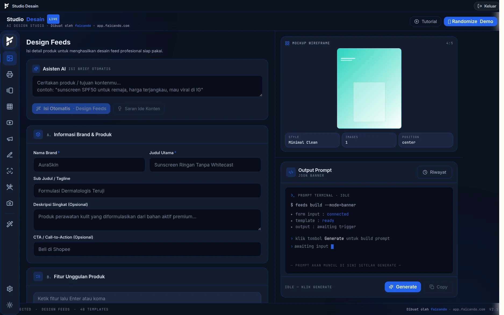
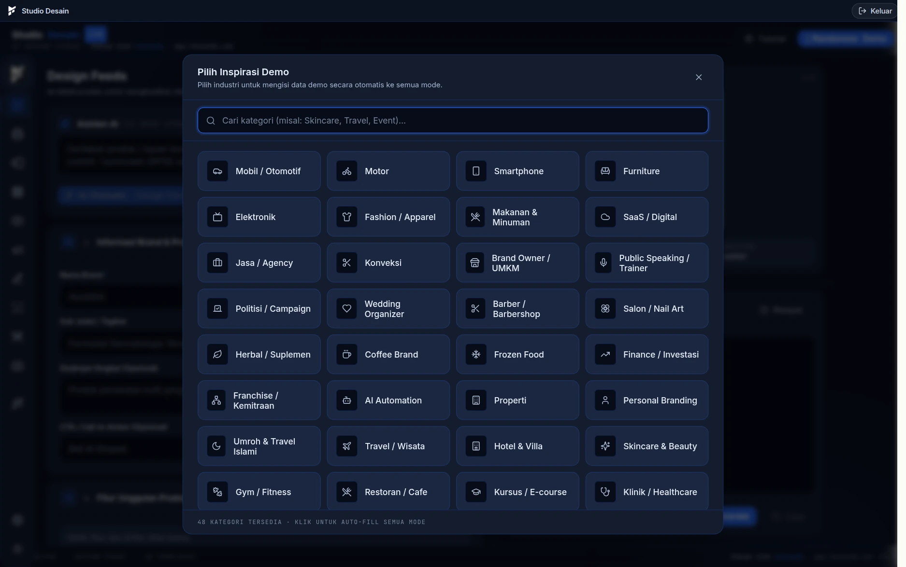

# 🎨 Studio Desain AI

Halaman **`/desainer`** (menu *Studio Desain*). Membantu desainer dan CS
menyusun ide, teks promosi, dan mengisi rincian order — bukan membuat gambar.

> Antarmukanya dibuka dari menu **Studio Desain** di sidebar. Halaman ini tidak
> disertai tangkapan layar karena tampilannya bergantung pada konfigurasi AI
> tiap instalasi.

## Tampilannya

Layarnya terbagi dua: **kiri** formulir brief (nama brand, judul, tagline,
deskripsi, CTA, fitur unggulan), **kanan** pratinjau wireframe beserta terminal
*Output Prompt* yang menampilkan hasil dalam format JSON siap pakai.

Tombol **Asisten AI — Isi Brief Otomatis** mengisi formulir itu dari satu
kalimat bebas, misalnya *"sunscreen SPF50 untuk remaja, harga terjangkau, mau
viral di IG"*. Jadi desainer tidak memulai dari halaman kosong.

## Cara kerja

PosPro **tidak memuat model AI sendiri**. Backend hanya menjadi perantara ke
layanan yang memakai antarmuka ala OpenAI (`/v1/chat/completions`) — misalnya
OpenRouter. Kunci API-nya disimpan di sisi server dan **tidak pernah sampai ke
browser**.

| Endpoint | Untuk |
|---|---|
| `POST /studio-ai/chat` | tanya-jawab biasa |
| `POST /studio-ai/chat/stream` | jawaban mengalir kata demi kata |
| `POST /studio-ai/ideas` | usulan ide desain/promosi |
| `POST /studio-ai/fill` | membantu mengisi rincian order dari catatan bebas |
| `GET /studio-ai/status` | apakah modulnya siap dipakai |
| `POST /studio-ai/test` | uji sambungan & kunci |
| `GET/POST /studio-ai/config` | pengaturan model & kunci (Owner) |

## Mulai dari contoh, bukan halaman kosong

Tombol **Demo** membuka daftar 48 kategori industri — dari Konveksi, Coffee
Brand, Klinik, sampai Wedding Organizer. Memilih satu kategori langsung
mengisi seluruh brief dengan contoh yang masuk akal untuk industri itu, lalu
tinggal disesuaikan.

Gunanya praktis: desainer yang baru belajar memakai studio ini bisa melihat
dulu bentuk brief yang benar sebelum menulis sendiri.

## Panduan aplikasi di dalam AI

Berkas `backend/src/studio-ai/app-guide.ts` berisi penjelasan cara kerja PosPro
yang disertakan ke AI sebagai konteks. Karena itu asisten bisa menjawab
pertanyaan seperti "bagaimana cara menitipkan cetak ke cabang lain?" dengan
langkah yang sesuai aplikasi ini, bukan jawaban umum.

Kalau ada fitur baru dan asisten menjawabnya keliru, yang perlu diperbarui
adalah berkas panduan itu.

## Biaya

Setiap panggilan dibayar ke penyedia AI. Karena itu modul ini cocok dijual
sebagai **tambahan berbasis kredit**, bukan disertakan tanpa batas di paket —
lihat rencana pemaketan. Bila kunci belum diisi, seluruh menu ini diam dan tidak
memunculkan error.
