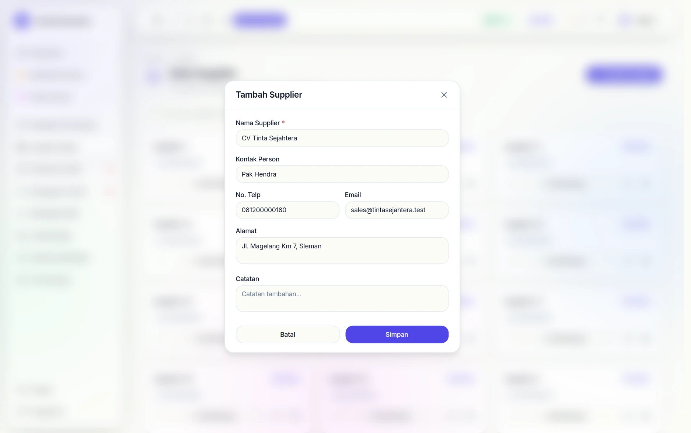
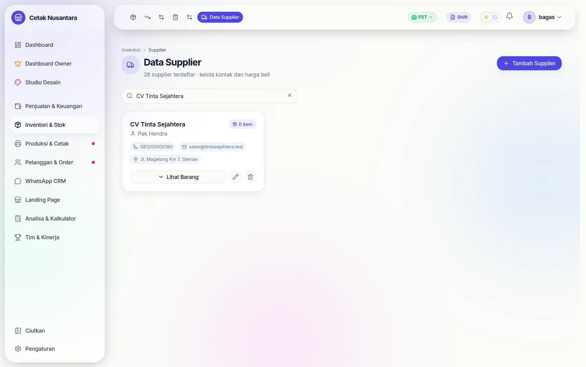
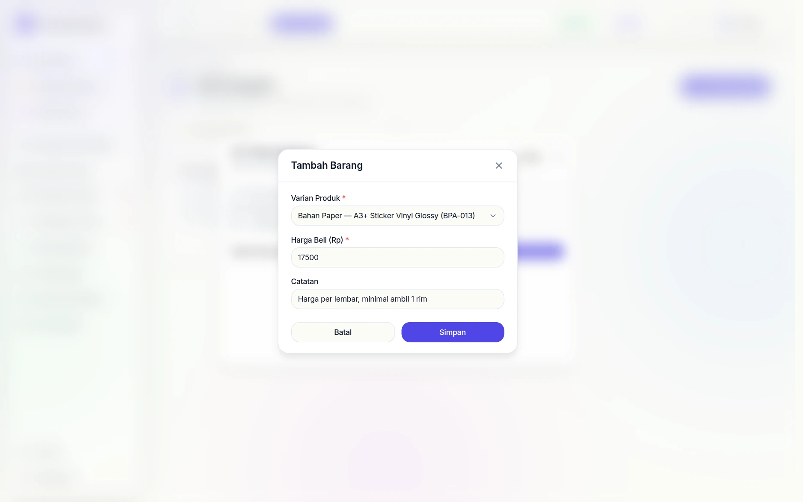
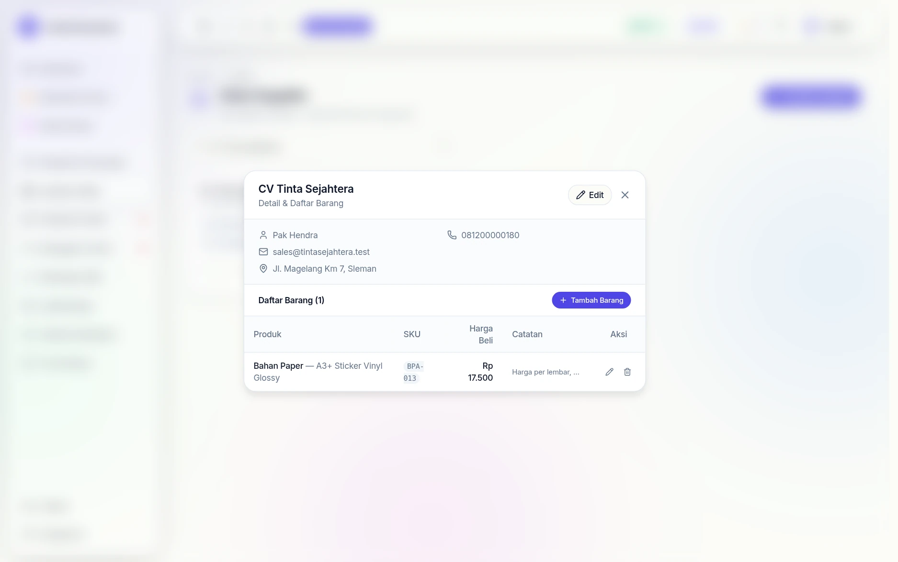
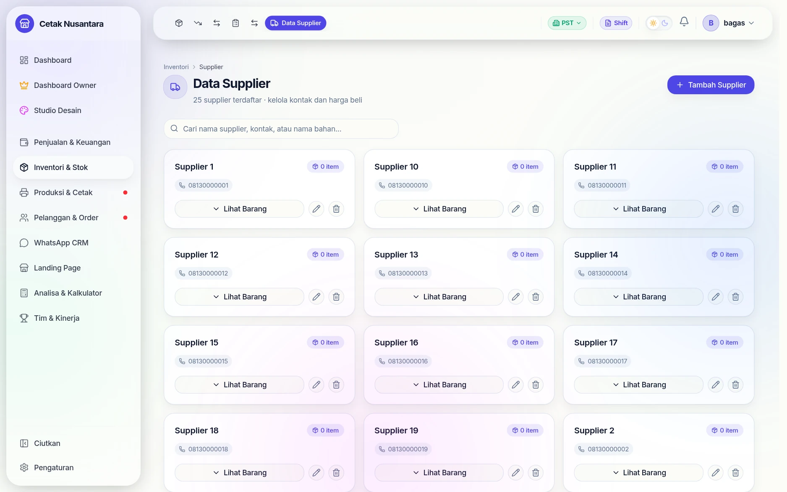

# 🏭 Manajemen Data Supplier


> Panduan lengkap untuk mengelola data pemasok dan menghubungkan harga beli ke varian produk.

---

## Langkah demi langkah: supplier baru & harga belinya

### 1. Isi data supplier



Hanya **nama** yang wajib; sisanya (PIC, telepon, email, alamat) opsional tapi
berguna saat harus menghubungi cepat karena bahan habis.

### 2. Kartunya langsung muncul



Supplier baru langsung tampil sebagai kartu dengan penanda **0 item** — artinya
belum ada daftar harga beli yang dicatat untuknya.

### 3. Catat harga beli per bahan



Lewat **Lihat Barang → Tambah Barang**, pilih varian produknya lalu isi
**harga beli** dan catatan bebas (mis. *"harga per lembar, minimal ambil 1
rim"*). Satu bahan bisa dicatat di beberapa supplier dengan harga berbeda —
itulah gunanya membandingkan.

### 4. Daftar harga per supplier



Penanda di kartu berubah jadi **1 item** dan rinciannya menampilkan bahan
beserta harga belinya. Harga inilah yang dipakai sebagai acuan modal di
[Kalkulator HPP](hpp-calculator.md) dan yang muncul otomatis saat mencatat
[pembelian stok masuk](stok-masuk-transfer.md).

## Halamannya



Tiap supplier tampil sebagai kartu berisi nomor kontak, jumlah barang yang
dipasok, dan tombol **Lihat Barang** untuk membuka daftar bahan beserta harga
belinya. Pencarian di atas mencari sekaligus pada nama supplier, kontak, dan
nama bahan — berguna saat yang diingat hanya "siapa yang jual vinyl".

Harga beli yang tersimpan di sini menjadi dasar perhitungan modal di
[Kalkulator HPP](hpp-calculator.md) dan laporan laba kotor.

## Apa itu Supplier Management?

Fitur **Supplier Management** memungkinkan Anda menyimpan database pemasok (supplier/vendor) dan menghubungkan setiap varian produk ke supplier-nya lengkap dengan **harga beli** masing-masing.

Manfaat utama:
- **Lacak harga beli per bahan baku/produk** — pantau perubahan harga dari waktu ke waktu
- **Identifikasi supplier utama** setiap varian untuk keperluan reorder
- **Dasar perhitungan margin** — harga jual dikurangi harga beli dari supplier

---

## Halaman Supplier

Buka **Inventori → Data Supplier** (`/inventory/suppliers`).

Halaman menampilkan daftar semua supplier dalam bentuk tabel dengan kolom:
- **Nama Supplier** — nama toko/perusahaan pemasok
- **Kontak** — nomor telepon atau nama kontak person
- **Alamat** — lokasi supplier
- **Catatan** — informasi tambahan (kode rekening, jadwal kirim, dll)
- **Jumlah Item** — berapa varian produk yang terhubung ke supplier ini

---

## Cara Mengelola Supplier

### Tambah Supplier Baru

1. Klik tombol **+ Tambah Supplier**
2. Isi form:
   - **Nama Supplier** *(wajib)* — contoh: "CV Maju Jaya", "Toko Tinta Surabaya"
   - **Kontak** — nomor HP / nama PIC
   - **Alamat** — kota atau alamat lengkap
   - **Catatan** — informasi bebas (nomor rekening, syarat pembayaran, dll)
3. Klik **Simpan**

### Edit Supplier

1. Klik ikon pensil di baris supplier yang ingin diubah
2. Ubah data yang diperlukan
3. Klik **Simpan**

### Hapus Supplier

1. Klik ikon tempat sampah di baris supplier
2. Konfirmasi penghapusan

> **Catatan**: Menghapus supplier akan menghapus juga semua tautan `SupplierItem` yang terhubung ke supplier tersebut. Varian produknya sendiri tidak terpengaruh.

---

Sejak 22 September 2026 supplier yang **sudah punya catatan pembelian** tidak
bisa dihapus, supaya riwayat pembelian dan HPP tetap utuh.

## Menghubungkan Varian Produk ke Supplier

Setiap supplier bisa memiliki banyak **item** — yaitu daftar varian produk yang dipasok beserta harga belinya.

### Cara Menambah Item Supplier

1. Di daftar supplier, klik nama supplier untuk membuka detail
2. Klik **+ Tambah Item**
3. Pilih **Varian Produk** dari dropdown (bisa cari berdasarkan nama produk)
4. Isi **Harga Beli** (harga per satuan dari supplier ini)
5. Isi **Satuan** jika berbeda dari satuan produk (opsional)
6. Klik **Simpan**

### Edit Harga Beli

Saat harga dari supplier berubah:
1. Buka detail supplier
2. Klik ikon pensil di baris item yang bersangkutan
3. Update harga beli
4. Klik **Simpan**

### Hapus Item Supplier

Klik ikon tempat sampah di baris item untuk melepas tautan varian dari supplier tersebut.

---

## Catatan Teknis

### Model Data

```
Supplier
  id, name, contact, address, notes
  items: SupplierItem[]

SupplierItem
  id, supplierId, productVariantId (opsional), purchasePrice, unit, notes
```

> `productVariantId` bersifat **opsional** — Anda bisa menambahkan entri supplier item tanpa menghubungkannya ke varian produk yang ada di sistem. Berguna untuk bahan baku yang belum dimasukkan ke inventori.

### Endpoint API

| Method | Endpoint | Fungsi |
|---|---|---|
| `GET` | `/suppliers` | Ambil semua supplier |
| `POST` | `/suppliers` | Tambah supplier baru |
| `PATCH` | `/suppliers/:id` | Edit supplier |
| `DELETE` | `/suppliers/:id` | Hapus supplier |
| `POST` | `/suppliers/:id/items` | Tambah item ke supplier |
| `PATCH` | `/suppliers/:id/items/:itemId` | Edit item supplier |
| `DELETE` | `/suppliers/:id/items/:itemId` | Hapus item supplier |

---

## Tips Penggunaan

- **Satu varian bisa punya banyak supplier** — berguna jika Anda punya beberapa pemasok alternatif dengan harga berbeda
- **Gunakan kolom Catatan** untuk menyimpan info penting seperti minimum order, lead time pengiriman, atau syarat pembayaran
- **Update harga beli secara rutin** agar kalkulasi margin di laporan HPP tetap akurat

---

*Wiki PosPro — Supplier Management | April 2026*

**© 2026 Muhammad Faisal. All rights reserved.**
