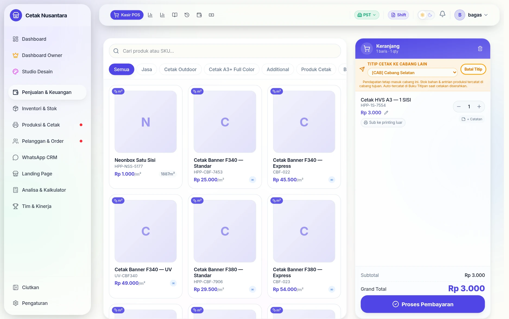
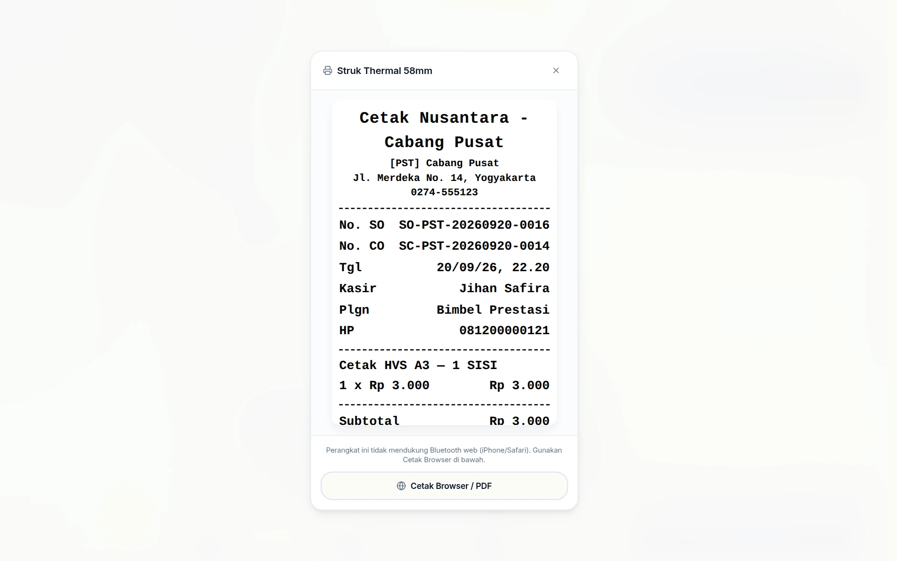
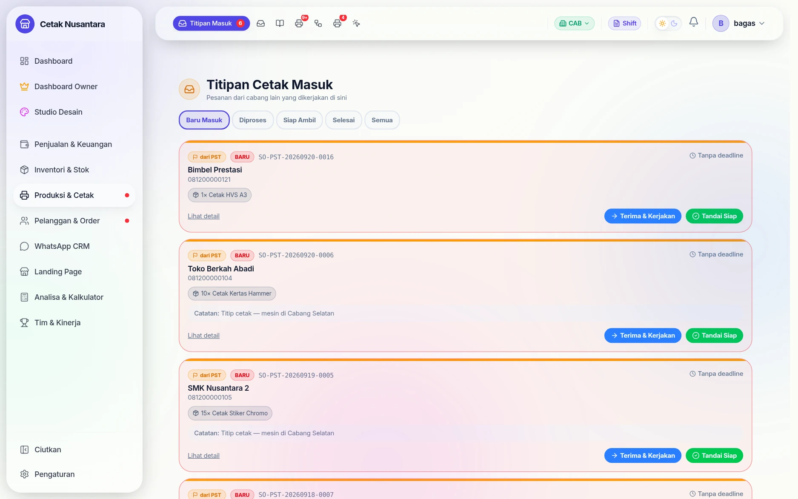
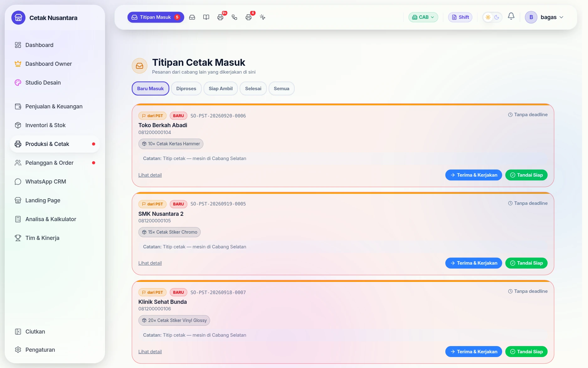
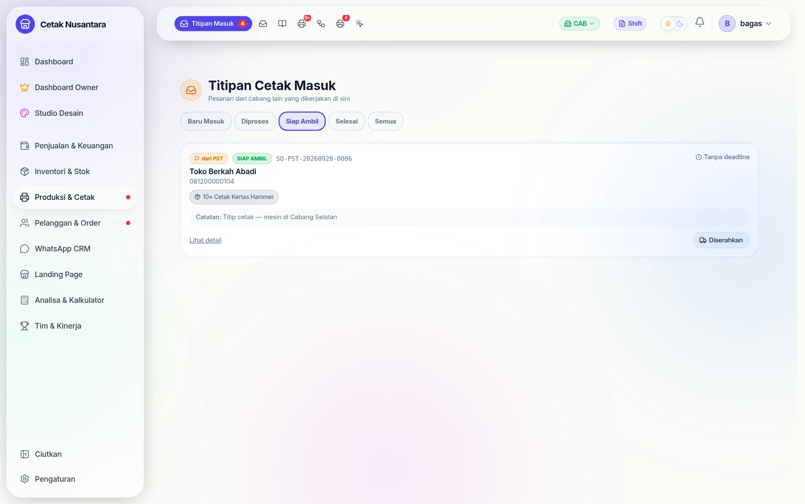
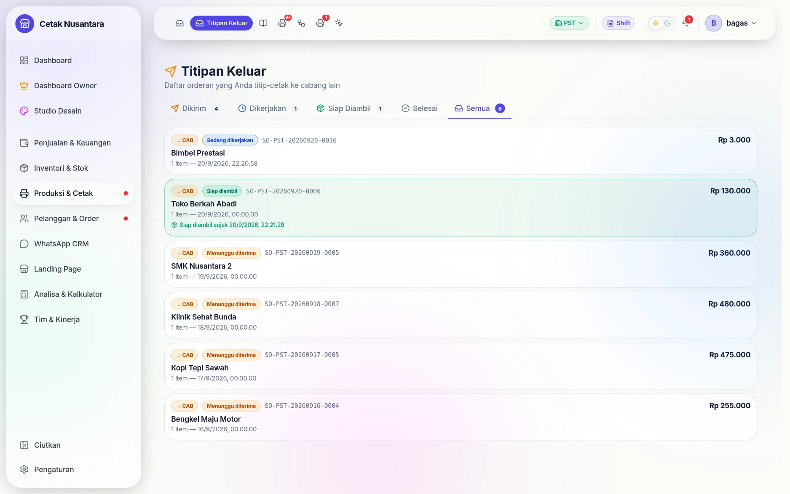

# 🔁 Titip Cetak Antar Cabang

Satu cabang menerima order, cabang lain yang mengerjakan. Ini kejadian
sehari-hari di percetakan bercabang: mesin tertentu hanya ada di satu tempat,
atau cabang yang menerima order sedang penuh.

Tanpa aplikasi, ini biasanya diurus lewat chat dan catatan pribadi — lalu di
akhir bulan tidak ada yang ingat siapa berhutang jasa berapa ke siapa. Di
PosPro, titipan tercatat sejak nota dibuat, dan **hutang jasanya terbentuk
sendiri**.

## Siapa mengerjakan apa

| Peran | Yang dilakukan |
|---|---|
| **Cabang pengirim** | membuat nota seperti biasa, lalu menandai "titip cetak" ke cabang tujuan |
| **Cabang penerima** | menerima pekerjaan di Titipan Masuk, mengerjakan, menandai siap |
| **Sistem** | mencatat hutang jasa di [Buku Titipan](buku-titipan.md) tanpa diminta |

---

## Langkah demi langkah

### 1. Tandai titip cetak saat membuat nota

Di panel keranjang, tombol **Titip Cetak** mengubah tujuan pengerjaan dari
"cabang ini" menjadi cabang lain. Pelanggan tetap dilayani dan membayar di
cabang pengirim — yang berpindah hanya pekerjaannya.

### 2. Nota dibuat seperti biasa

Dari sisi kasir dan pelanggan tidak ada yang berbeda: nota, pembayaran, dan
struknya sama saja.

### 3. Pekerjaan muncul di cabang penerima

Di cabang tujuan, pekerjaan berdiri di **Titipan Masuk** dengan tanda asal
cabangnya. Operator di sana tidak perlu dikabari lewat chat — pekerjaannya
sudah ada di layar mereka.

### 4. Diterima & dikerjakan

Tombol **Terima & Kerjakan** memindahkannya ke tab *Diproses*. Sejak titik ini
cabang pengirim bisa melihat bahwa titipannya sudah dipegang.

### 5. Ditandai siap

Setelah selesai, **Tandai Siap** membuatnya masuk tab *Siap Ambil* —
penanda bahwa barang bisa dijemput atau dikirim ke cabang pengirim.

### 6. Cabang pengirim memantau dari Titipan Keluar

Kasir di cabang pengirim melihat status yang sama tanpa bertanya: dikirim,
dikerjakan, siap diambil, atau selesai. Ini yang membuat pertanyaan pelanggan
"sudah jadi belum?" bisa dijawab tanpa menelepon cabang lain.

### 7. Hutang jasanya tercatat sendiri

Begitu pekerjaan diserahkan, sistem menulis entri di
**[Buku Titipan](buku-titipan.md)**: cabang pengirim berhutang jasa kepada
cabang yang mengerjakan, sebesar porsi yang disepakati. Tidak ada yang perlu
mencatat manual, dan tidak ada yang perlu diingat sampai akhir bulan.

---

## Yang perlu diperhatikan

- **Stok bahan dipotong di cabang yang mengerjakan**, bukan di cabang pengirim —
  karena bahannya memang milik mereka.
- **Persen jasa titipan** diatur per cabang di
  [Pengaturan](pengaturan.md) (`titipan_fee_percent`).
- Pekerjaan titipan **tidak muncul di tab Antrian biasa** papan cetak; ia punya
  halaman sendiri. Kalau papan terasa kosong padahal ada order, periksa
  Titipan Masuk.
- Pembayaran tetap di cabang pengirim, jadi omzetnya milik cabang pengirim.
  Yang berpindah hanyalah jasa pengerjaan — dan itulah yang dicatat di buku
  titipan.

## Halaman terkait

| Halaman | Untuk |
|---|---|
| `/titipan-masuk` | pekerjaan titipan yang masuk ke cabang ini |
| `/titipan-keluar` | titipan yang dikirim ke cabang lain |
| `/branch-ledger` | [Buku Titipan](buku-titipan.md) — posisi hutang-piutang jasa |
| `/reports/inter-branch-usage` | rekap pemakaian bahan antar cabang |
