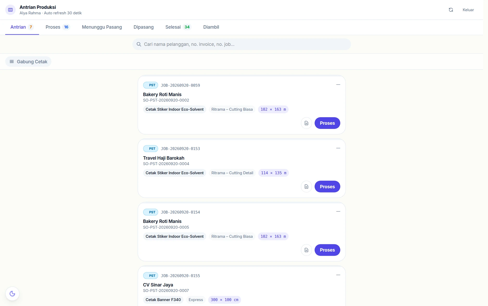
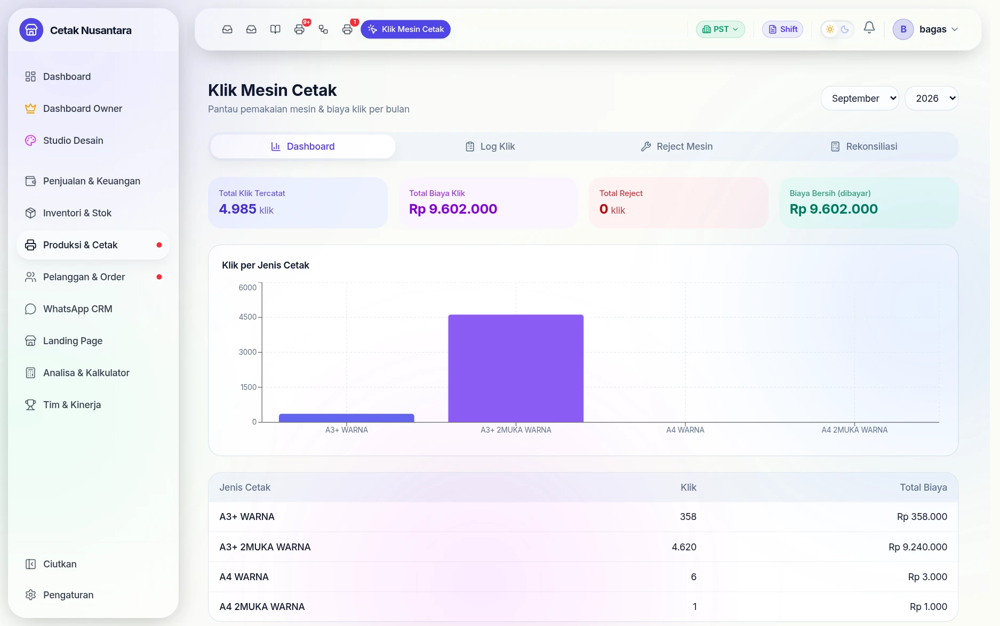
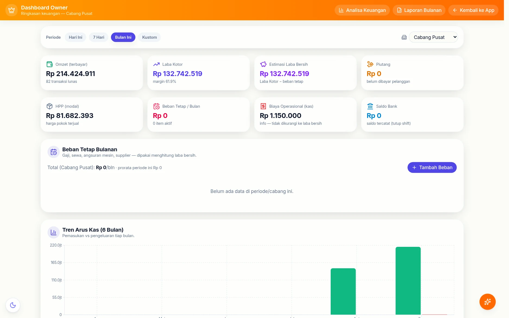
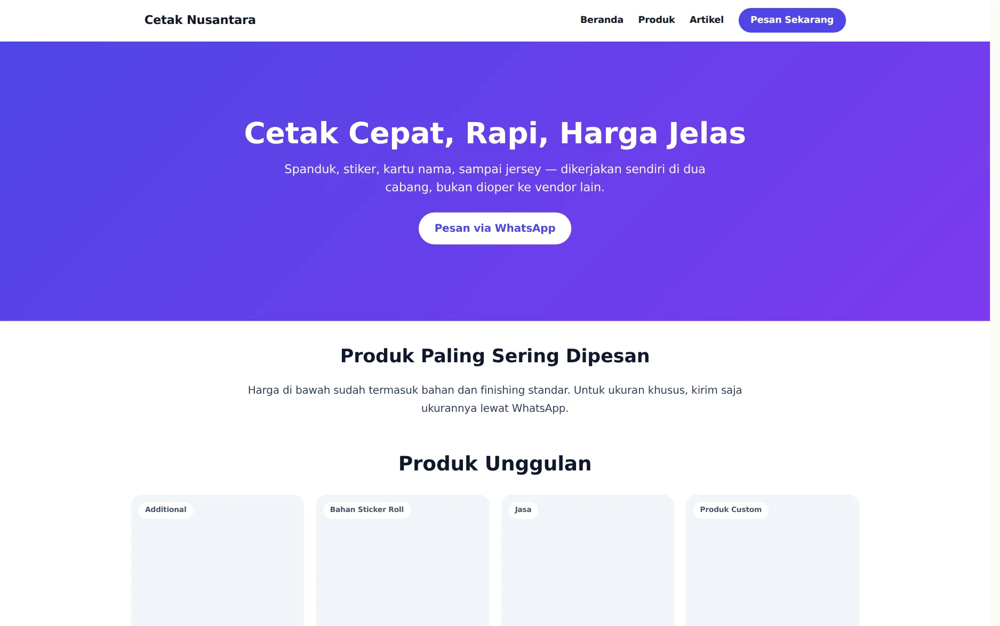

# 🚀 Tur Singkat: PosPro dalam 12 Layar

Halaman ini untuk yang baru pertama melihat PosPro dan ingin tahu bentuknya
sebelum membaca panduan per fitur. Semua tangkapan layar di bawah diambil dari
aplikasi yang benar-benar berjalan, dengan data contoh yang disamarkan.

> Ingin langsung mencoba alurnya? Setiap bagian menaut ke halaman lengkapnya
> yang berisi langkah demi langkah bergambar.

## 1. Kasir yang mengerti percetakan

Produk bisa dihitung per pcs **atau per m²** — tinggal isi ukuran, harga
mengikuti luasnya. Inilah yang membedakannya dari kasir toko biasa.
→ [Kasir POS](kasir-pos.md)

## 2. DP, kredit, dan bayar nanti sejak awal

Begitu uang muka diisi di bawah total, tombolnya sendiri berubah jadi
*Konfirmasi Pembayaran DP*. Sisanya otomatis jadi piutang yang bisa ditagih.
→ [DP & Piutang](dp-piutang.md)

## 3. Pekerjaan langsung muncul di papan produksi

Tidak ada pencatatan ulang: begitu nota disimpan, pekerjaannya muncul di papan
yang dibuka operator dengan PIN.
→ [Antrian Produksi](produksi.md)

## 4. Biaya mesin dihitung per klik

Tiap cetakan mencatat jumlah klik mesin, lalu direkap jadi biaya bulanan dan
direkonsiliasi dengan tagihan vendor.
→ [Mesin Cetak & Klik](mesin-cetak.md)

## 5. Stok yang tahu asal-usulnya

Pembelian, transfer antar cabang, susut, dan opname semuanya meninggalkan
mutasi bernomor dokumen — selisih stok tidak pernah jadi misteri.
→ [Stok Masuk & Transfer](stok-masuk-transfer.md) · [Stok Opname](stock-opname.md)

## 6. WhatsApp jadi bagian aplikasi, bukan aplikasi terpisah

Chat pelanggan, lead, dan notanya berada di sistem yang sama — CS tidak
berpindah aplikasi untuk menutup order.
→ [CRM & WhatsApp](crm.md)

## 7. Broadcast yang menghitung dulu sebelum mengirim

Segmen penerima dihitung lebih dulu, template Meta dipakai apa adanya, dan
hasil per nomor terlihat setelah terkirim.
→ [WhatsApp Cloud API](whatsapp-cloud.md)

## 8. Uang masuk & keluar dalam satu arus

Pembayaran dari kasir masuk otomatis (bertanda *Otomatis*), pengeluaran
diketik manual — dan perubahannya butuh persetujuan.
→ [Cashflow](cashflow.md)

## 9. Dashboard pemilik: delapan angka yang menentukan

Omzet, laba kotor, estimasi laba bersih, piutang, HPP, beban tetap, biaya
operasional, saldo bank — dalam satu layar, bisa disaring per cabang.
→ [Keuangan Owner](keuangan-owner.md)

## 10. Laporan bulanan yang menulis kesimpulannya sendiri

Ringkasan eksekutif, tren perusahaan, efisiensi biaya, kesehatan arus kas,
peringatan, dan rekomendasi — siap dibaca saat rapat bulanan.
→ [Keuangan Owner](keuangan-owner.md)

## 11. Papan juara di layar toko

Dipasang di TV toko, dijaga PIN, menyegarkan dirinya sendiri: target harian,
peringkat cabang, CS, desainer, dan operator.
→ [Halaman Publik](halaman-publik.md) · [Leaderboard](leaderboard.md)

## 12. Halaman depan toko ikut di dalamnya

Landing page disusun drag-and-drop, dan blok produknya menarik harga langsung
dari katalog kasir — jadi harga di web tidak pernah beda dengan harga di toko.
→ [Landing Page](landing.md) · [Artikel / Blog](artikel.md)

---

## Sesudah tur ini

- Ingin paham bagaimana semuanya terhubung? → [Alur Bisnis](alur-bisnis.md)
- Ingin memasang sendiri? → [Setup Lokal](setup-lokal.md) ·
  [Deployment](deployment.md)
- Ingin tahu batas akses tiap peran? → [Keamanan & Akses](keamanan-akses.md)
