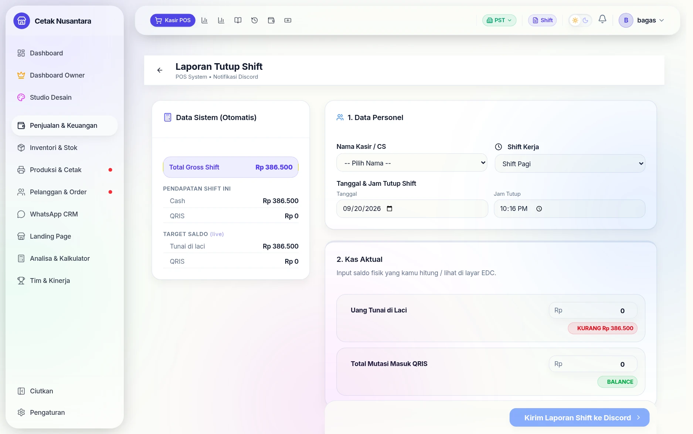
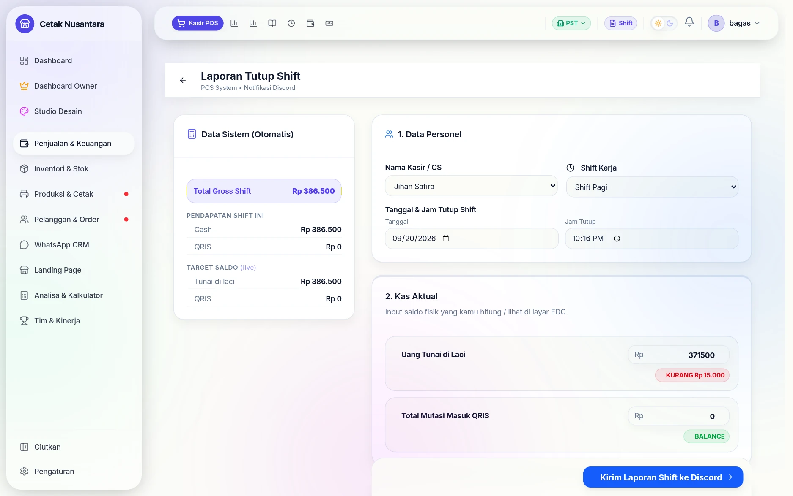
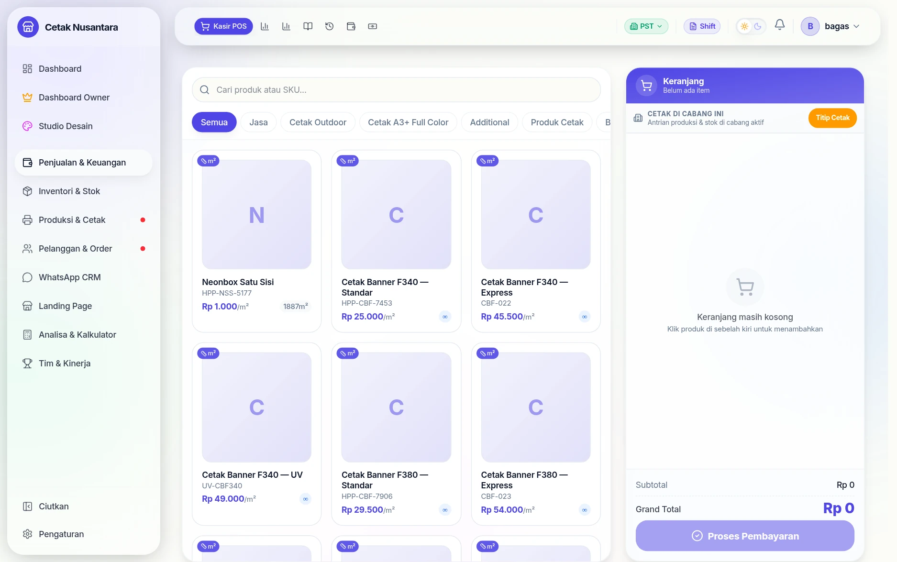
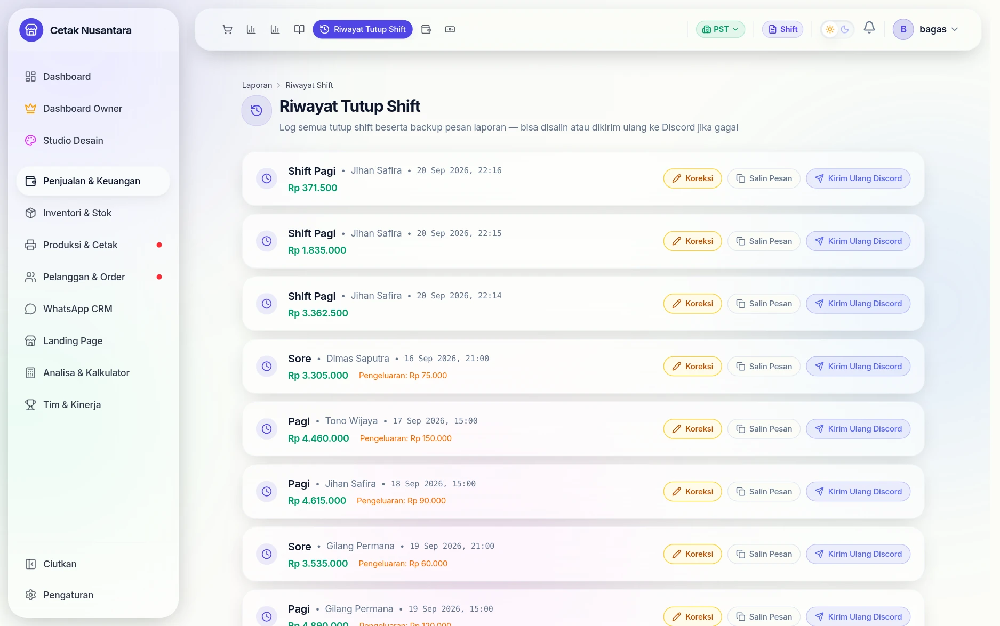

# 🔒 Tutup Shift

Halaman **`/pos/close-shift`** dipakai kasir di akhir jam kerjanya: menghitung
uang fisik, membandingkannya dengan catatan sistem, lalu mengirim rekap.
Tujuannya bukan mencari-cari kesalahan, tapi membuat selisih **ketahuan pada
hari yang sama** — bukan sebulan kemudian saat sudah tidak bisa ditelusuri.

## Langkah demi langkah

### 1. Buka halaman tutup shift

Kolom kiri — **Data Sistem (Otomatis)** — diisi aplikasi: total penjualan shift
ini, dan berapa uang tunai yang *seharusnya* ada di laci. Kasir tidak perlu
menghitung apa pun di sini.

### 2. Isi hasil hitungan fisik

Kolom kanan diisi kasir: namanya, shift yang dijalani, jam tutup, lalu **uang
yang benar-benar ada** — tunai di laci, mutasi masuk QRIS, dan saldo rekening.

### 3. Selisihnya dihitung otomatis

Begitu angka diketik, selisihnya langsung muncul sebagai penanda:
**KURANG** (merah) bila uang fisik lebih sedikit daripada catatan, **LEBIH**
(hijau) bila sebaliknya. Karena muncul seketika, kasir masih sempat menghitung
ulang sebelum laporan dikirim — bukan besok saat sudah tidak bisa ditelusuri.

### 4. Kirim rekap

Rekap dikirim ke grup WhatsApp pemilik dan kanal Discord bila dikonfigurasi,
lalu tersimpan sebagai riwayat.

### 5. Tersimpan sebagai riwayat

Semua shift yang pernah ditutup tersimpan di
[Riwayat Tutup Shift](riwayat-shift.md), lengkap dengan selisih dan catatannya.

---

## Cara kerjanya

1. Aplikasi menghitung **yang seharusnya ada** dari nota shift ini:
   `expectedCash`, `expectedQris`, `expectedTransfer`, dan saldo per rekening
   bank (`expectedBankBalances`).
2. Kasir mengisi **yang benar-benar ada**: `actualCash`, `actualQris`,
   `actualTransfer`, ditambah total pengeluaran shift dan catatan bila perlu.
3. Selisihnya dihitung otomatis per metode pembayaran.
4. Rekapnya tersimpan di tabel `shift_reports` dan dikirim ke grup WhatsApp
   pemilik serta Discord bila kanalnya dikonfigurasi.

Sejak 22 September 2026 angka *seharusnya ada* yang tersimpan **dihitung ulang
server saat laporan dikirim**, lalu ditambah penyesuaian yang diisi di halaman
(setor, tarik, pengeluaran, kasbon). Penjualan yang masuk selama halaman tutup
shift terbuka jadi ikut diharapkan — dulu ikut tertandai ke shift ini tapi tidak
ada di angka harapan, sehingga kas tampak LEBIH. Kas yang tercatat **setelah**
laporan terkirim masuk ke shift berikutnya. Diskon nota juga tidak lagi
mengurangi harapan kas laci, karena tidak dicatat lagi sebagai pengeluaran.

Tanggal pada halaman ini **diambil dari perangkat kasir saat halaman dibuka**,
bukan dari waktu build aplikasi — pernah terjadi tanggal "hari ini" terkunci di
tanggal build sehingga shift tidak bisa ditutup.

## Pengeluaran yang ikut terlihat

Selain pengeluaran yang diketik di form, halaman ini menampilkan
**pengeluaran shift dari menu Cashflow** (misalnya bayar supplier lewat
transfer) dalam mode hanya-baca. Tanpa itu, pemasukan terlihat berdiri sendiri
tanpa pengeluaran tandingannya, dan angka kasnya seolah tidak cocok.

## Aturan baru sejak 22 September 2026

- **Kirim dua kali tidak membuat dua laporan.** Bila layar lambat lalu tombol
  kirim ditekan lagi (atau dua perangkat mengirim bersamaan), kiriman dengan jam
  tutup, kas fisik, dan kasir yang sama dalam 30 menit dianggap laporan yang
  sama. Dulu terbentuk dua laporan dan semua pengeluaran/kasbon tercatat dobel
  (terjadi 1 Juli 2026).
- **Kolom saldo rekening mulai kosong.** Hanya rekening yang diisi yang
  diperbarui. Bila ada rekening yang dilewati, muncul konfirmasi; saldo rekening
  itu di sistem tidak diubah (dulu menjadi Rp 0).
- **Selisih transfer tidak dicatat** karena halaman ini tidak menanyakan transfer
  fisik (transfer dicocokkan lewat saldo per rekening). Dulu hampir semua shift
  tercatat "kurang transfer" sebesar seluruh penjualan transfer.
- **Nota mundur tanggal** tanpa centang *masuk shift hari ini* tidak ikut
  ekspektasi kas shift yang sedang berjalan, sesuai keterangan di layar kasir.
- Kas yang ditandai milik shift ini hanya yang **benar-benar dihitung** di
  ekspektasi. Penjualan yang baru tersimpan saat laporan dikirim masuk ke shift
  berikutnya.

## Setelah shift ditutup

- Riwayatnya di **`/reports/shift-history`** — lihat [Riwayat Tutup Shift](riwayat-shift.md).
- Manajer bisa **memperbaiki** rekap yang salah (`POST /reports/shift/:id/amend`)
  dan **mengirim ulang** rekapnya (`POST /reports/shift/:id/resend`) tanpa
  membuat shift baru.
- Angkanya masuk ke [Cashflow Bisnis](cashflow.md) dan laporan bulanan.

## Endpoint terkait

| Metode | Jalur | Untuk |
|---|---|---|
| GET | `/reports/current-shift` | angka "seharusnya ada" untuk shift berjalan |
| POST | `/reports/close-shift` | menutup shift & mengirim rekap |
| GET | `/reports/shift-history` | daftar shift yang sudah ditutup |
| POST | `/reports/shift/:id/amend` | memperbaiki rekap (Manajer) |
| POST | `/reports/shift/:id/resend` | mengirim ulang rekap |
