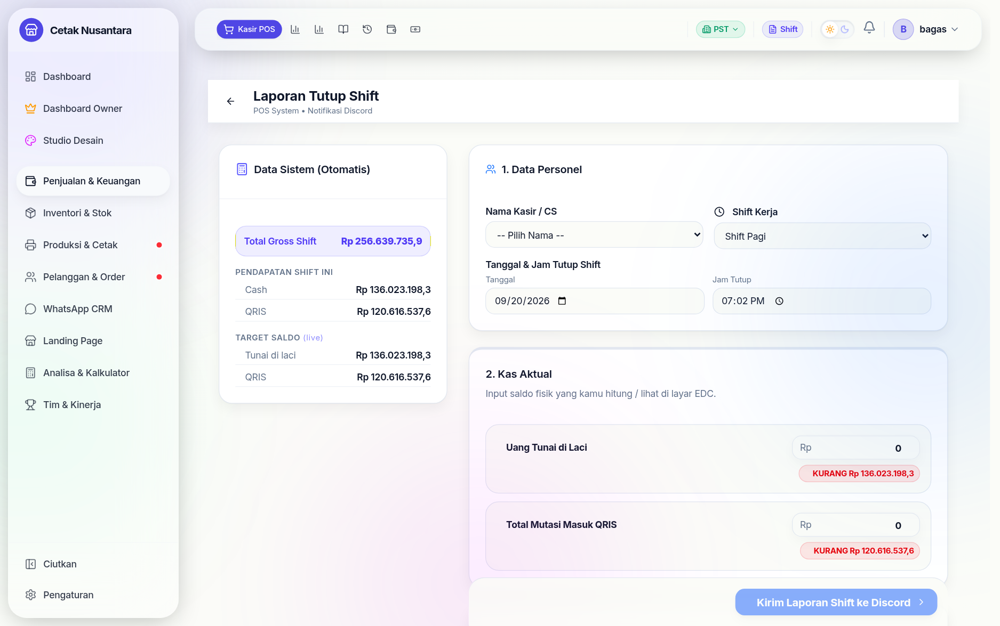

# 🔒 Tutup Shift

Halaman **`/pos/close-shift`** dipakai kasir di akhir jam kerjanya: menghitung
uang fisik, membandingkannya dengan catatan sistem, lalu mengirim rekap.
Tujuannya bukan mencari-cari kesalahan, tapi membuat selisih **ketahuan pada
hari yang sama** — bukan sebulan kemudian saat sudah tidak bisa ditelusuri.

## Cara kerjanya

1. Aplikasi menghitung **yang seharusnya ada** dari nota shift ini:
   `expectedCash`, `expectedQris`, `expectedTransfer`, dan saldo per rekening
   bank (`expectedBankBalances`).
2. Kasir mengisi **yang benar-benar ada**: `actualCash`, `actualQris`,
   `actualTransfer`, ditambah total pengeluaran shift dan catatan bila perlu.
3. Selisihnya dihitung otomatis per metode pembayaran.
4. Rekapnya tersimpan di tabel `shift_reports` dan dikirim ke grup WhatsApp
   pemilik serta Discord bila kanalnya dikonfigurasi.

Tanggal pada halaman ini **diambil dari perangkat kasir saat halaman dibuka**,
bukan dari waktu build aplikasi — pernah terjadi tanggal "hari ini" terkunci di
tanggal build sehingga shift tidak bisa ditutup.

## Pengeluaran yang ikut terlihat

Selain pengeluaran yang diketik di form, halaman ini menampilkan
**pengeluaran shift dari menu Cashflow** (misalnya bayar supplier lewat
transfer) dalam mode hanya-baca. Tanpa itu, pemasukan terlihat berdiri sendiri
tanpa pengeluaran tandingannya, dan angka kasnya seolah tidak cocok.

## Setelah shift ditutup

- Riwayatnya di **`/reports/shift-history`** — lihat [Riwayat Tutup Shift](riwayat-shift.md).
- Manajer bisa **memperbaiki** rekap yang salah (`POST /reports/shift/:id/amend`)
  dan **mengirim ulang** rekapnya (`POST /reports/shift/:id/resend`) tanpa
  membuat shift baru.
- Angkanya masuk ke [Cashflow Bisnis](cashflow.md) dan laporan bulanan.

## Endpoint terkait

| Metode | Jalur | Untuk |
|---|---|---|
| GET | `/reports/current-shift` | angka "seharusnya ada" untuk shift berjalan |
| POST | `/reports/close-shift` | menutup shift & mengirim rekap |
| GET | `/reports/shift-history` | daftar shift yang sudah ditutup |
| POST | `/reports/shift/:id/amend` | memperbaiki rekap (Manajer) |
| POST | `/reports/shift/:id/resend` | mengirim ulang rekap |
