# 💬 WhatsApp CRM (Cloud API)

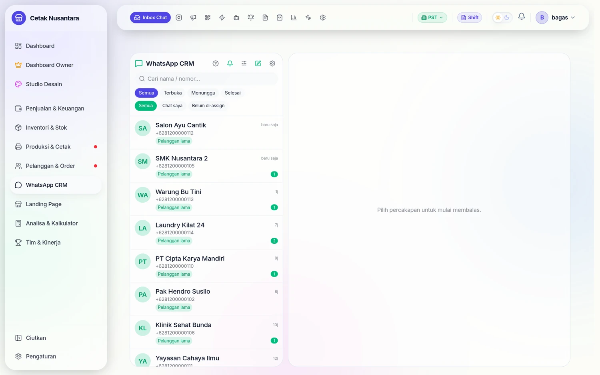

Ini modul terbesar di PosPro setelah kasir: **83 endpoint** untuk mengubah chat
WhatsApp menjadi pekerjaan yang tercatat. Bukan sekadar kirim pesan — chat masuk
menjadi lead, lead menjadi order, dan ongkos iklan bisa dihitung per lead nyata.

## Bedanya dengan bot WA lama

Ada dua modul WhatsApp di kode:

| Modul | Jalur | Status |
|---|---|---|
| **WhatsApp Cloud API** (resmi Meta) | `/whatsapp/conversations`, `/whatsapp/broadcasts`, … | yang dipakai sekarang |
| Bot lama berbasis sesi QR | `/whatsapp/status`, `/whatsapp/send`, `/whatsapp/groups` | peninggalan, untuk kirim ke **grup** |

Bot lama masih terpasang karena Cloud API resmi **tidak bisa mengirim ke grup**,
sementara rekap shift dan laporan harian dikirim ke grup pemilik. Catatan
keamanannya ada di [Model Akses & Keamanan](keamanan-akses.md).

## Inbox chat

Halaman **`/crm/whatsapp`**. Percakapan (`wa_conversations`), kontak
(`wa_contacts`), dan pesan (`wa_messages`) tersimpan di database sendiri, jadi
riwayat tetap ada walau aplikasi WhatsApp di HP dibuka-tutup.

- Pesan masuk lewat **webhook** `POST /whatsapp/webhook` (wajib lewat domain
  `api.*` yang publik).
- Webhook untuk satu nomor **diproses berurutan**. Meta kadang mengirim
  beberapa kejadian paralel untuk kontak yang sama; tanpa pengurutan, dua
  proses saling rebut baris yang sama dan pesannya hilang.
- Lampiran gambar/dokumen diunduh ke `WA_MEDIA_DIR` dan dibersihkan otomatis
  setelah `WA_MEDIA_RETENTION_DAYS` hari.
- `WA_AUTO_CREATE_LEAD` menentukan apakah chat dari nomor baru langsung menjadi
  lead di [CRM](crm.md).

## Broadcast

Halaman **`/crm/whatsapp/broadcast`**. Alurnya sengaja bertahap supaya tidak
ada blast yang tidak sengaja:

1. Pilih penerima — per segmen atau daftar nomor.
2. **Pratinjau** (`POST /whatsapp/broadcasts/preview`): berapa penerima,
   siapa saja, template apa.
3. Jalankan (`/run`), bisa **dijeda** (`/pause`) di tengah jalan.
4. Status per penerima tercatat di `wa_broadcast_recipients` — terkirim,
   gagal, atau dilewati.

Kecepatan kirim dibatasi `WA_BROADCAST_RATE_PER_SEC` supaya tidak dianggap spam
oleh Meta.

### Langkah demi langkah

#### 1. Daftar broadcast

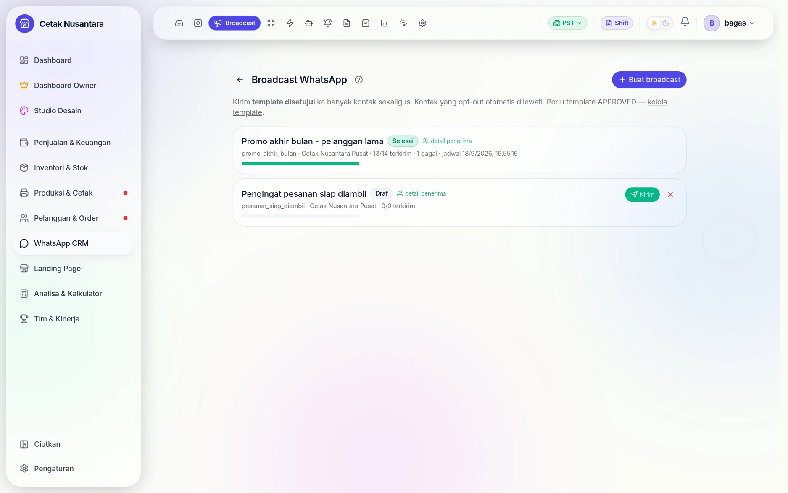

Semua kampanye terkumpul di sini beserta statusnya. Yang sudah jalan tidak bisa
diubah lagi — hanya dilihat hasilnya.

#### 2. Susun kampanye

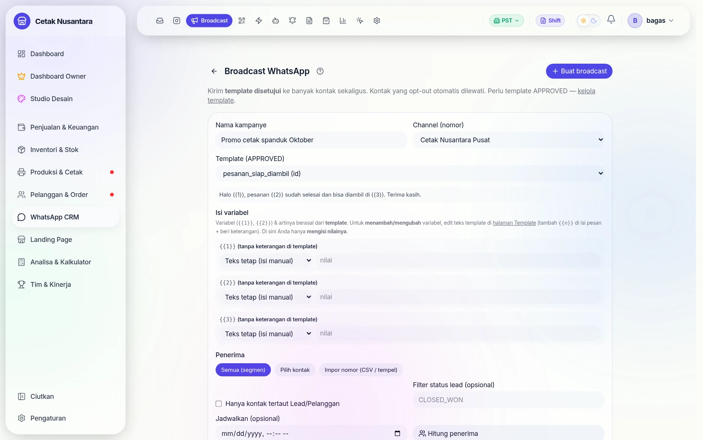

Yang dipilih: nomor pengirim, **template yang sudah disetujui Meta**, lalu nilai
untuk tiap variabel template (`{{1}}`, `{{2}}`, …). Variabel bisa diisi teks
tetap atau diambil dari data kontak. Penerima ditentukan dengan tiga cara:
**semua (segmen)**, **pilih kontak** satu per satu, atau **impor nomor** dari
CSV/tempelan.

#### 3. Hitung penerima dulu

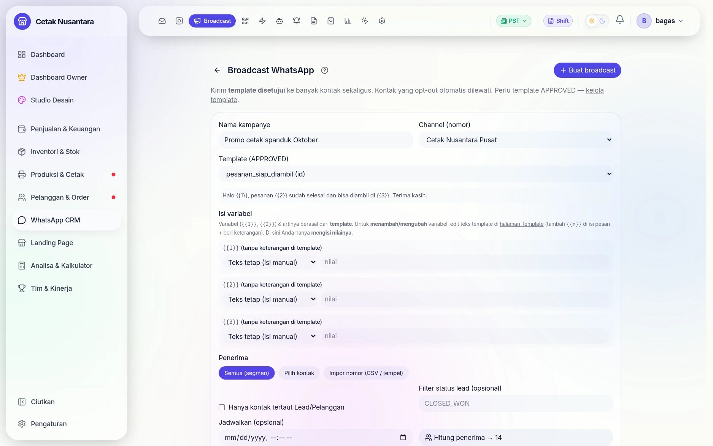

Tombol **Hitung penerima** memperlihatkan berapa kontak yang akan menerima
(di contoh ini 14), termasuk memotong kontak yang sudah *opt-out*. Langkah ini
disengaja: broadcast yang terlanjur terkirim tidak bisa ditarik kembali.

#### 4. Simpan draf dulu, kirim belakangan

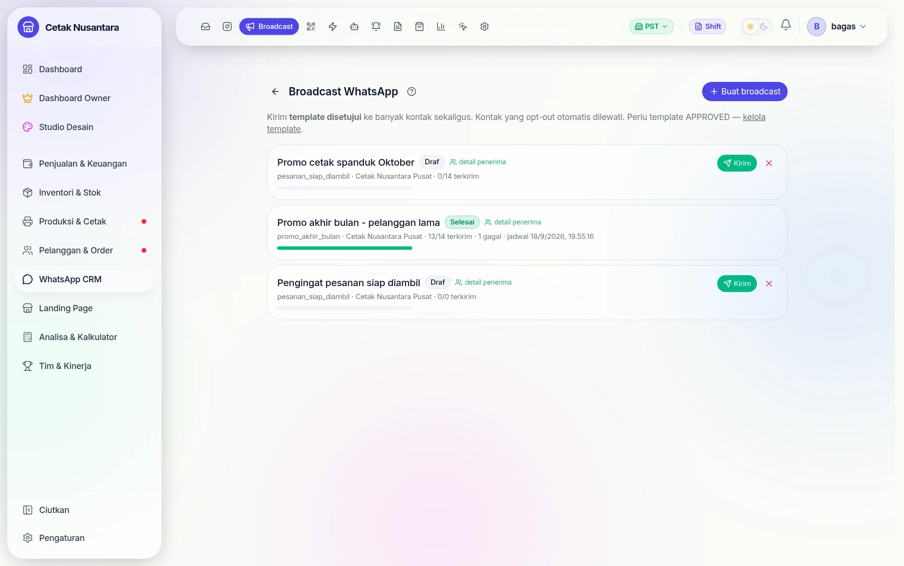

Kampanye bisa disimpan sebagai **draf** atau dijadwalkan.

#### 5. Hasil per penerima

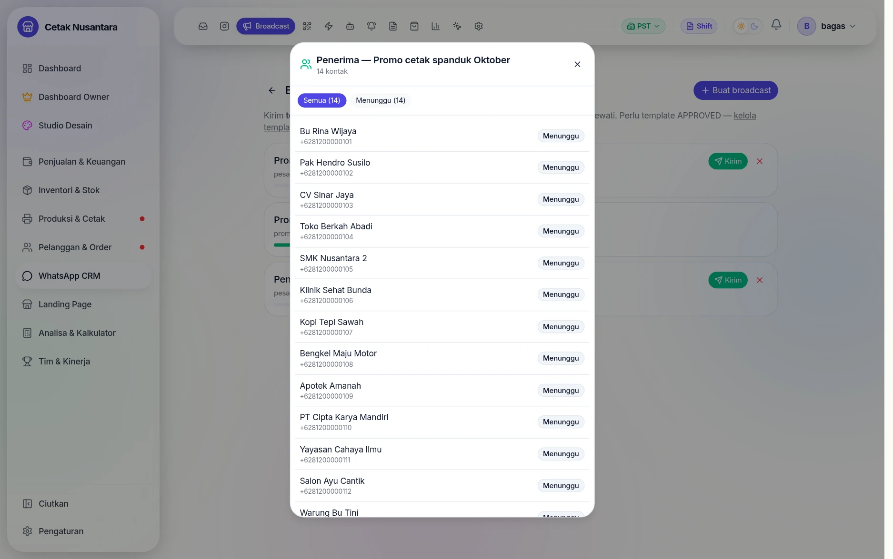

Setelah dijalankan, status tiap penerima tercatat satu per satu — terkirim,
gagal, atau dilewati karena opt-out.

#### 6. Template yang dipakai

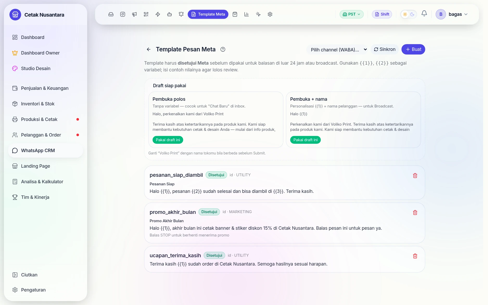

Template harus lolos persetujuan Meta sebelum bisa dipakai. Di luar jendela
24 jam sejak pesan terakhir pelanggan, hanya template yang boleh dikirim —
itulah sebabnya broadcast selalu berbasis template.

## Balasan otomatis & pesan cepat

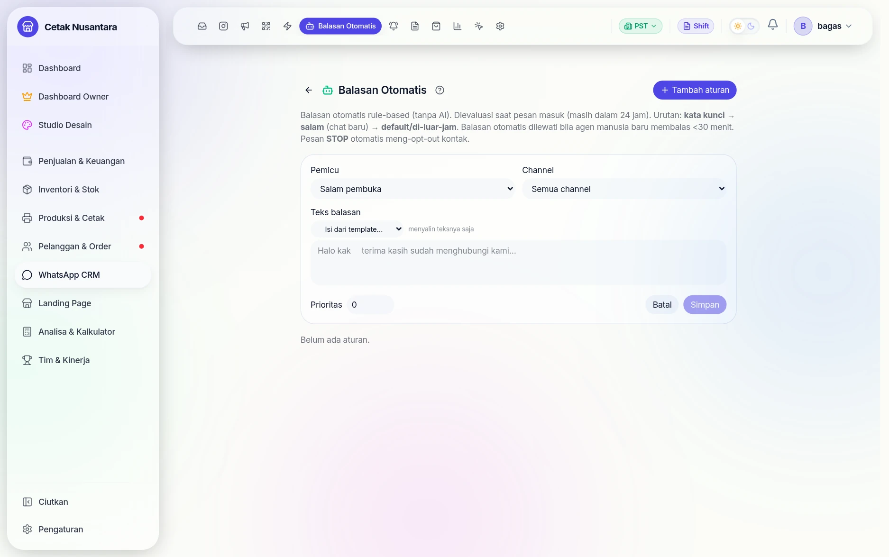

Aturannya **rule-based, tanpa AI**, dan dievaluasi saat pesan masuk selama
percakapan masih dalam jendela 24 jam. Urutan pemeriksaannya:

**kata kunci → salam (chat baru) → default / di luar jam**

Dua pagar penting tertulis langsung di halamannya: balasan otomatis
**dilewati** bila agen manusia baru saja membalas (<30 menit) — supaya bot
tidak menimpa percakapan yang sedang berjalan — dan pesan **STOP** dari
pelanggan otomatis meng-opt-out kontak itu.

Tiap aturan memilih pemicu (mis. *Salam pembuka*), channel mana yang dipakai,
teks balasannya (boleh disalin dari template), dan **prioritas** bila ada
beberapa aturan yang cocok sekaligus.

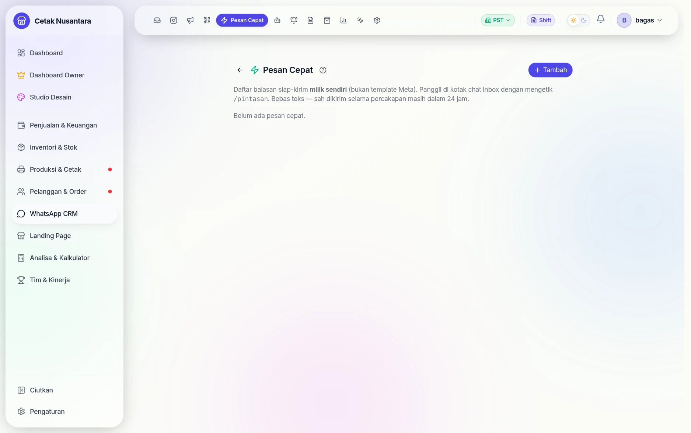

**Pesan Cepat** berbeda dari template Meta: ini daftar balasan milik sendiri
yang dipanggil CS di kotak chat dengan mengetik `/pintasan`. Karena berupa
teks bebas, hanya sah dikirim selama percakapan masih dalam 24 jam.

| Fitur | Halaman | Tabel |
|---|---|---|
| Balasan otomatis (kata kunci → jawaban) | `/crm/whatsapp/auto-reply` | `wa_auto_reply_rules` |
| Pesan cepat (jawaban siap pakai untuk CS) | `/crm/whatsapp/quick-replies` | `wa_quick_replies` |
| Template resmi Meta | `/crm/whatsapp/templates` | `wa_templates` |
| Katalog produk di WhatsApp | `/crm/whatsapp/catalog` | dari katalog produk |

**Template Meta** perlu dipahami: di luar jendela 24 jam sejak pesan terakhir
pelanggan, WhatsApp hanya mengizinkan template yang sudah disetujui Meta. Karena
itu broadcast memakai template, sementara balasan di dalam percakapan aktif
bisa berupa teks bebas.

## Reminder POS

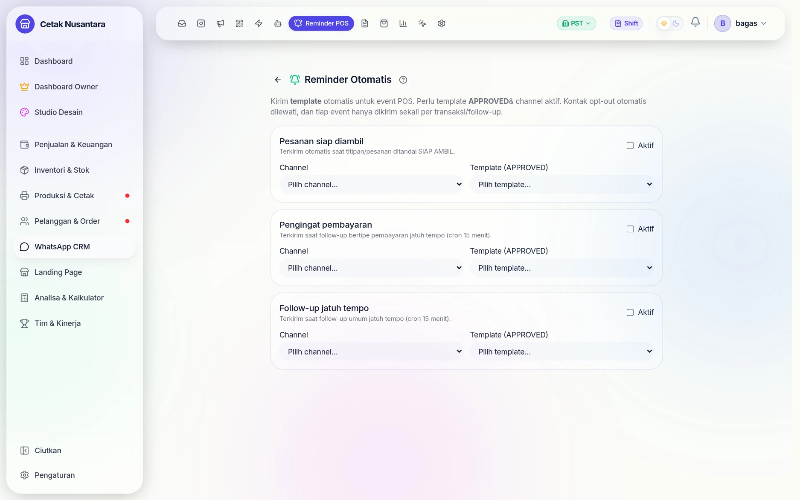

Reminder mengirim template otomatis saat sebuah **event POS** terjadi —
misalnya pesanan siap diambil. Tiga syaratnya disebut di halaman itu juga:
template harus berstatus **APPROVED**, channel harus aktif, dan kontak yang
sudah opt-out otomatis dilewati. Tiap event hanya dikirim **sekali per
transaksi/follow-up**, jadi pelanggan tidak menerima pesan berulang.

Halaman **`/crm/whatsapp/reminders`** (Manajer+). Menghubungkan kejadian di
kasir dengan pesan otomatis: pesanan siap diambil, DP jatuh tempo, ucapan
terima kasih. Konfigurasinya di `wa_reminder_configs`, dan setiap pengiriman
dicatat di `wa_reminder_logs` supaya tidak terkirim dua kali.

## QR Chat

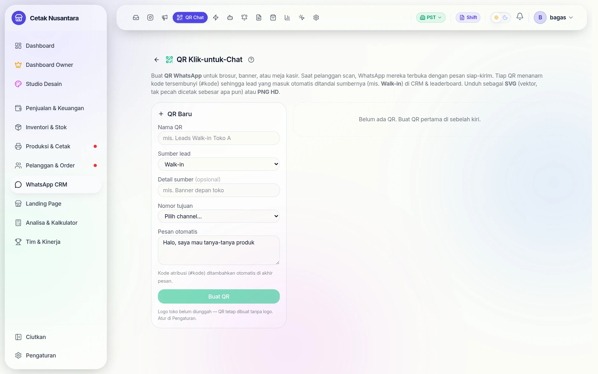

QR Chat membuat kode yang begitu dipindai langsung membuka WhatsApp dengan
pesan pembuka yang sudah terisi. Berguna ditempel di meja kasir, spanduk, atau
kemasan — dan karena tiap QR bisa dibedakan, ketahuan pesan datang dari media
yang mana.

Halaman **`/crm/whatsapp/qr`**. Membuat tautan/QR yang begitu dipindai langsung
membuka chat dengan pesan pembuka terisi. Tiap QR punya kode sendiri
(`wa_qr_links`), jadi bisa diketahui QR mana yang benar-benar mendatangkan chat
— berguna untuk membandingkan spanduk, brosur, atau kemasan.

## Analitik

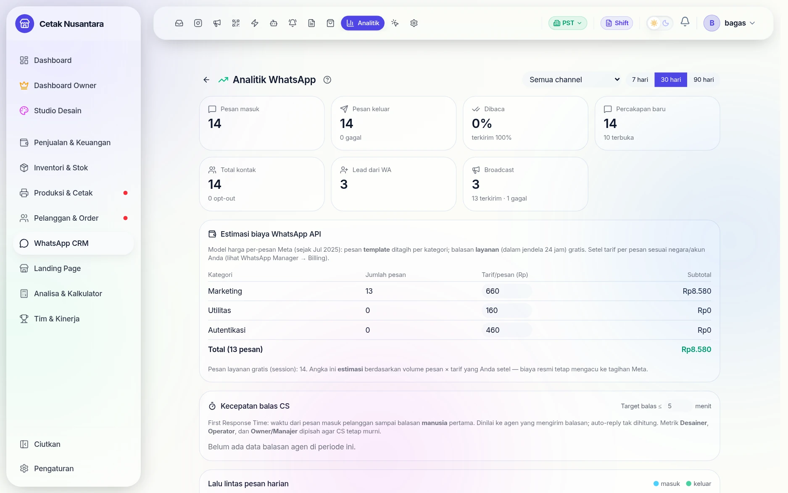

Tiga lapis angka dalam satu halaman:

1. **Volume** — pesan masuk & keluar (berikut yang gagal), percakapan baru,
   total kontak beserta jumlah opt-out, lead dari WA, dan broadcast.
2. **Estimasi biaya WhatsApp API** — mengikuti model harga per-pesan Meta:
   pesan *template* ditagih per kategori (Marketing / Utilitas / Autentikasi)
   sementara balasan *layanan* dalam jendela 24 jam gratis. Tarif per pesan
   diisi sendiri sesuai akun, lalu sistem mengalikannya dengan volume nyata.
3. **Kecepatan balas CS** — *First Response Time* dihitung sampai balasan
   **manusia** pertama; auto-reply tidak dihitung, dan metrik Desainer,
   Operator, serta Owner/Manajer dipisah agar angka CS tetap murni.

Halaman **`/crm/whatsapp/analytics`** (Manajer+): jumlah percakapan, kecepatan
balas CS, dan sebaran jam sibuk. Angka kecepatan balas inilah yang dipakai di
[Leaderboard](leaderboard.md) kolom "Balas WA".

## Konfigurasi

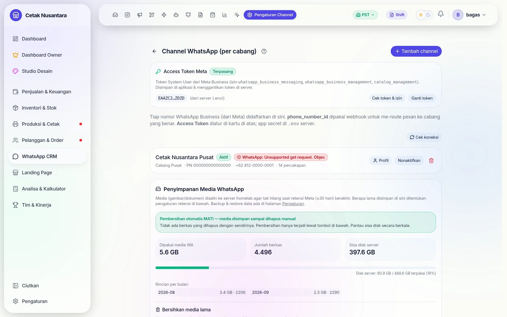

Selain kredensial channel, halaman pengaturan mengurus **penyimpanan media**:
foto dan berkas yang masuk lewat WhatsApp menumpuk di server. Pembersihan
otomatis bisa dimatikan (media disimpan sampai dihapus manual) atau dijalankan
lewat tombol di halaman itu — dengan pengingat untuk memantau sisa disk.

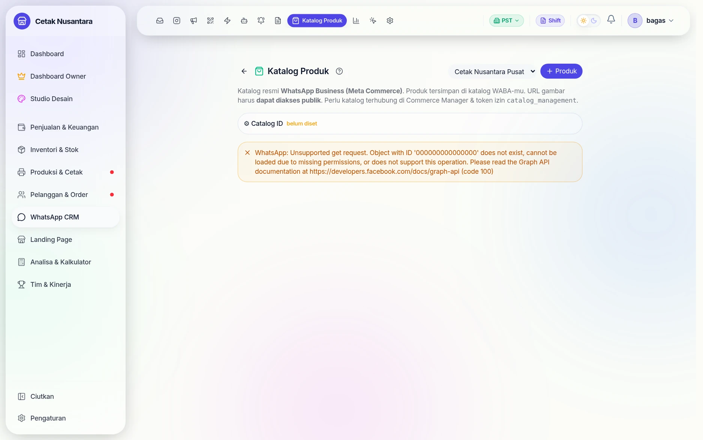

**Katalog** menghubungkan produk ke katalog resmi WhatsApp Business (Meta
Commerce). Produk tersimpan di katalog WABA, dan URL gambarnya harus bisa
diakses publik. Halaman ini hanya berfungsi bila katalog sudah terhubung di
Commerce Manager — di lingkungan demo dokumentasi ini sengaja belum
dihubungkan.

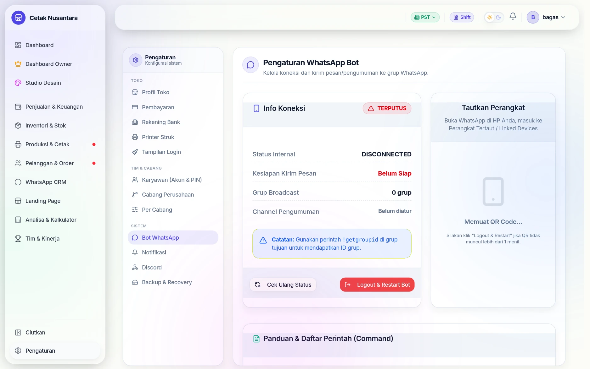

Menu **Pengaturan → Bot WhatsApp** adalah konfigurasi bot generasi lama
(berbasis nomor pribadi & grup). Keduanya bisa hidup berdampingan; lihat
bagian *Bedanya dengan bot WA lama* di awal halaman ini.

| Variabel | Untuk |
|---|---|
| `WA_CLOUD_ENABLED` | saklar utama modul |
| `WA_ACCESS_TOKEN`, `WA_APP_ID`, `WA_APP_SECRET` | kredensial aplikasi Meta |
| `WA_VERIFY_TOKEN` | kata sandi verifikasi webhook |
| `WA_GRAPH_VERSION` | versi Graph API |
| `WA_BROADCAST_RATE_PER_SEC` | batas kecepatan broadcast |
| `WA_AUTO_CREATE_LEAD` | chat baru otomatis jadi lead |
| `WA_MEDIA_DIR`, `WA_MEDIA_RETENTION_DAYS` | tempat & umur simpan lampiran |

Nomor dan kanal yang aktif disimpan di `wa_channels` dan diatur di
**`/crm/whatsapp/settings`**.
