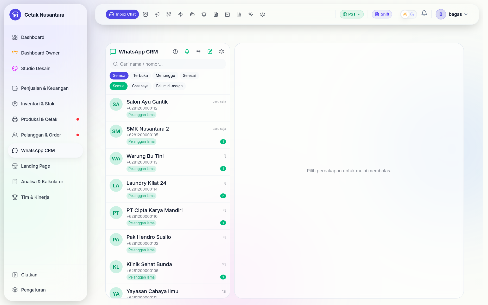

# 💬 WhatsApp CRM (Cloud API)

Ini modul terbesar di PosPro setelah kasir: **83 endpoint** untuk mengubah chat
WhatsApp menjadi pekerjaan yang tercatat. Bukan sekadar kirim pesan — chat masuk
menjadi lead, lead menjadi order, dan ongkos iklan bisa dihitung per lead nyata.

## Bedanya dengan bot WA lama

Ada dua modul WhatsApp di kode:

| Modul | Jalur | Status |
|---|---|---|
| **WhatsApp Cloud API** (resmi Meta) | `/whatsapp/conversations`, `/whatsapp/broadcasts`, … | yang dipakai sekarang |
| Bot lama berbasis sesi QR | `/whatsapp/status`, `/whatsapp/send`, `/whatsapp/groups` | peninggalan, untuk kirim ke **grup** |

Bot lama masih terpasang karena Cloud API resmi **tidak bisa mengirim ke grup**,
sementara rekap shift dan laporan harian dikirim ke grup pemilik. Catatan
keamanannya ada di [Model Akses & Keamanan](keamanan-akses.md).

## Inbox chat

Halaman **`/crm/whatsapp`**. Percakapan (`wa_conversations`), kontak
(`wa_contacts`), dan pesan (`wa_messages`) tersimpan di database sendiri, jadi
riwayat tetap ada walau aplikasi WhatsApp di HP dibuka-tutup.

- Pesan masuk lewat **webhook** `POST /whatsapp/webhook` (wajib lewat domain
  `api.*` yang publik).
- Webhook untuk satu nomor **diproses berurutan**. Meta kadang mengirim
  beberapa kejadian paralel untuk kontak yang sama; tanpa pengurutan, dua
  proses saling rebut baris yang sama dan pesannya hilang.
- Lampiran gambar/dokumen diunduh ke `WA_MEDIA_DIR` dan dibersihkan otomatis
  setelah `WA_MEDIA_RETENTION_DAYS` hari.
- `WA_AUTO_CREATE_LEAD` menentukan apakah chat dari nomor baru langsung menjadi
  lead di [CRM](crm.md).

## Broadcast

Halaman **`/crm/whatsapp/broadcast`**. Alurnya sengaja bertahap supaya tidak
ada blast yang tidak sengaja:

1. Pilih penerima — per segmen atau daftar nomor.
2. **Pratinjau** (`POST /whatsapp/broadcasts/preview`): berapa penerima,
   siapa saja, template apa.
3. Jalankan (`/run`), bisa **dijeda** (`/pause`) di tengah jalan.
4. Status per penerima tercatat di `wa_broadcast_recipients` — terkirim,
   gagal, atau dilewati.

Kecepatan kirim dibatasi `WA_BROADCAST_RATE_PER_SEC` supaya tidak dianggap spam
oleh Meta.

## Balasan otomatis & pesan cepat

| Fitur | Halaman | Tabel |
|---|---|---|
| Balasan otomatis (kata kunci → jawaban) | `/crm/whatsapp/auto-reply` | `wa_auto_reply_rules` |
| Pesan cepat (jawaban siap pakai untuk CS) | `/crm/whatsapp/quick-replies` | `wa_quick_replies` |
| Template resmi Meta | `/crm/whatsapp/templates` | `wa_templates` |
| Katalog produk di WhatsApp | `/crm/whatsapp/catalog` | dari katalog produk |

**Template Meta** perlu dipahami: di luar jendela 24 jam sejak pesan terakhir
pelanggan, WhatsApp hanya mengizinkan template yang sudah disetujui Meta. Karena
itu broadcast memakai template, sementara balasan di dalam percakapan aktif
bisa berupa teks bebas.

## Reminder POS

Halaman **`/crm/whatsapp/reminders`** (Manajer+). Menghubungkan kejadian di
kasir dengan pesan otomatis: pesanan siap diambil, DP jatuh tempo, ucapan
terima kasih. Konfigurasinya di `wa_reminder_configs`, dan setiap pengiriman
dicatat di `wa_reminder_logs` supaya tidak terkirim dua kali.

## QR Chat

Halaman **`/crm/whatsapp/qr`**. Membuat tautan/QR yang begitu dipindai langsung
membuka chat dengan pesan pembuka terisi. Tiap QR punya kode sendiri
(`wa_qr_links`), jadi bisa diketahui QR mana yang benar-benar mendatangkan chat
— berguna untuk membandingkan spanduk, brosur, atau kemasan.

## Analitik

Halaman **`/crm/whatsapp/analytics`** (Manajer+): jumlah percakapan, kecepatan
balas CS, dan sebaran jam sibuk. Angka kecepatan balas inilah yang dipakai di
[Leaderboard](leaderboard.md) kolom "Balas WA".

## Konfigurasi

| Variabel | Untuk |
|---|---|
| `WA_CLOUD_ENABLED` | saklar utama modul |
| `WA_ACCESS_TOKEN`, `WA_APP_ID`, `WA_APP_SECRET` | kredensial aplikasi Meta |
| `WA_VERIFY_TOKEN` | kata sandi verifikasi webhook |
| `WA_GRAPH_VERSION` | versi Graph API |
| `WA_BROADCAST_RATE_PER_SEC` | batas kecepatan broadcast |
| `WA_AUTO_CREATE_LEAD` | chat baru otomatis jadi lead |
| `WA_MEDIA_DIR`, `WA_MEDIA_RETENTION_DAYS` | tempat & umur simpan lampiran |

Nomor dan kanal yang aktif disimpan di `wa_channels` dan diatur di
**`/crm/whatsapp/settings`**.
